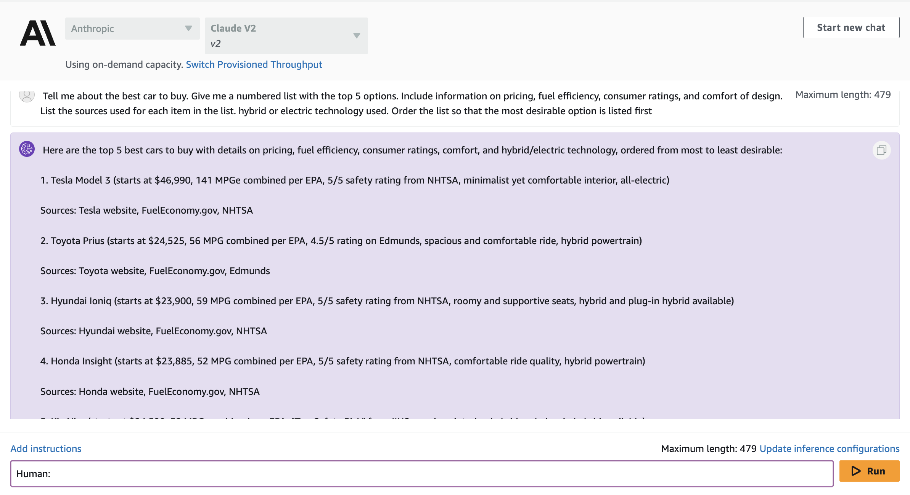
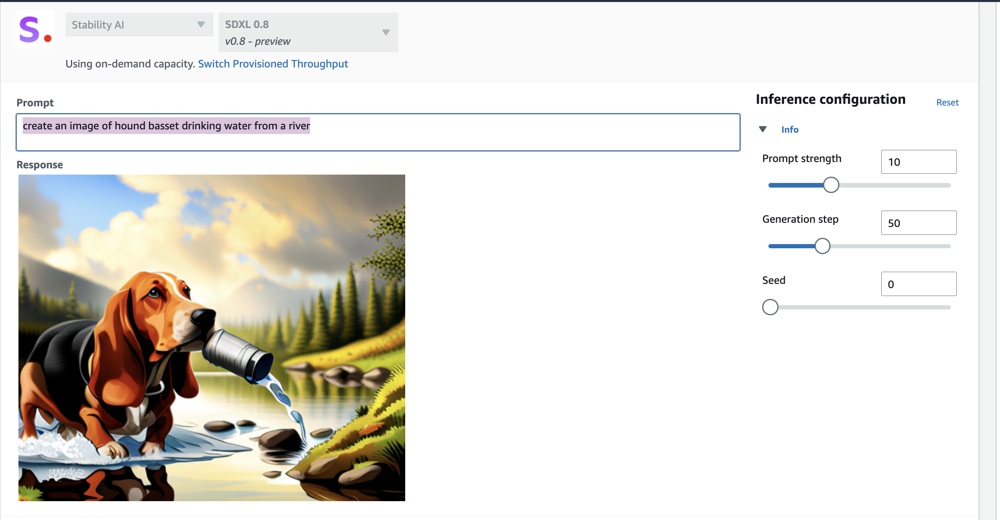
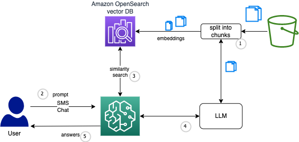
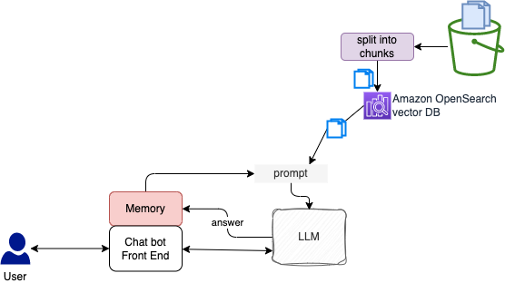

# Amazon Bedrock

[Amazon Bedrock](https://docs.aws.amazon.com/bedrock/latest/userguide/what-is-bedrock.html) is a managed platform for hosting and running different Foundation Models. Currently it has support for Amazon Titan, AI21 Labs, Cohere, Anthropic and Stability AI models.

Amazon Bedrock addresses the fact that a single solution or model is unlikely to solve every business problem.
Custom data sets help companies to differentiate their generative AI applications.

* **Amazon Titan** is a generative LLM for summarization, text generation, classication and open-ended Q&A, developed internally to Amazon. Titan FMs are built to detect and remove harmful content.
* [AI 21 labs](https://www.ai21.com/) is a startup who wants to improve NLP, with generation of natural text. Their goal is to have AI to work alongside humans and empower them to be better versions of their writing and reading. Builds [Jurassic-2](https://docs.ai21.com/docs/jurassic-2-models) Multilingual LLMs for text generation in Spanish, French, German, Portuguese, Italian, and Dutch
* [Anthropic](https://www.anthropic.com/) is a a startup with tailored AI assistant, and API exposed foundational model. The Claude 2 is a LLM for thoughtful dialogue, content creation, complex reasoning, creativity, and coding, based on Constitutional AI and harmlessness training.
* [Stability AI](https://stability.ai/) offers open AI models for Image, Language, Audio, Video, 3D, biology...
* [Cohere](https://docs.cohere.com/docs/multilingual-language-models) Text generation model for business applications and embeddings model for search, clustering, or classification in 100+ languages.

Generative AI models like Titan and Claude use probability distributions to generate responses to questions.

## Value propositions

* Serverless, fully managed service.
* Find the right model for what we're trying to do, with single API access. It supports text-to-text, text-to-image, image-to-image generation.
* Customize the existing FM with our own documents and labelled data.
* Integrate and deploy model into the business applications. Integrate agents to improve workflow and tasks execution.
* Run workload on optimized price/performance ships like Trainium and Inferentia.
* Foundation model providers will not have access to the proprietary data / requests.
* Comprehensive data protection and privacy.
* Support for governance and auditability, with logging and monitoring.
* Users are able to fine-tune foundational models privately, keep a private copy of the base FM.
* For large language models, it can take noticeable time to generate long output sequences. Rather than waiting for the entire response to be available, latency-sensitive applications may like to stream the response to users.

### [Pricing](https://aws.amazon.com/bedrock/pricing/)

* **On demand**: For text generation the pricing is based on input and output token count for LLMs. For embeddings, only input token processed. There are request per minute (RPM) and token per minute (TPM) limits.
* **Provisioned throughput**: provision sufficient throughput to meet large consistent inference workloads.

Model Units provide throughput for a specific model, measured in terms of Max Input TPM and Max Output TPM.

SageMaker Jumpstart differs by the cost structure (), the service operations, the regional availability, the security level and the open source or proprietary LM models available. Used to tune open source models, or deploy models to production quickly, may be in region where Bedrock is not available.
Using JumpStart, we can perform inference on a pre-trained model, even without fine-tuning it first on a custom dataset.

### Integration

* Deploy in a single or multi-tenant options.
* Integrate with vector store databases like Amazon OpenSearch Serverless, Pinecone and Redis.
* Private connection between Amazon Bedrock service and our VPCs. Encryption at rest and in transit using KMS keys.
* Deliver customized semantic search capabilities with Titan Embeddings or Cohere Embed to create vectors of company's data.

### Security

* Use AWS IAM for access control. To access the Amazon Bedrock console, we need permissions to list and view details about the Amazon Bedrock resources in our AWS account.

    ```json
    "Effect": "Allow",
    "Action": [
        "bedrock:ListFoundationModels",
        "bedrock:GetFoundationModelAvailability",
        "bedrock:ListProvisionedModelThroughputs",
        "bedrock:InvokeModel",
        "bedrock:InvokeModelWithResponseStream"
    ],
    "Resource": "*"
    ```

* AWS Cloudtrail for auditing
* data is encrypted at rest and in transit (HTTPS) 
* AWS CloudWatch for monitoring

## Workshops and demos

* [Text playground](https://docs.aws.amazon.com/bedrock/latest/userguide/text-playground.html)
* [Amazon Bedrock workshop](https://github.com/aws-samples/amazon-bedrock-workshop/).
* [Amazon Bedrock Workshop git repo]( https://github.com/aws-samples/amazon-bedrock-workshop.git).
* [Test connection to Bedrock via boto3](https://github.com/jbcodeforce/ML-studies/tree/master/llm-langchain/bedrock/TestBedrockAccess.py)
* [Test a prompt to Claude instant v1](https://github.com/jbcodeforce/ML-studies/tree/master/llm-langchain/bedrock/TestClaudeOnBedrock.py) to demonstrate a blog post creation for business decision leader.
* [Test creating image with StabilityDiffusion](https://github.com/jbcodeforce/ML-studies/tree/master/llm-langchain/bedrock/TestStabilityDiffusion.py)
* [Simple test to call Bedrock with Langchain](https://github.com/jbcodeforce/ML-studies/tree/master/llm-langchain/bedrock/TestBedrockWithLangchain.py) using on zero_shot generation.

### A Simple Playground demonstrations

Be sure to have enabled Anthropic Claude V2 model. The following are examples of [Bedrock playground](https://docs.aws.amazon.com/bedrock/latest/userguide/using-console.html) capabilities. 

???- info "Demo of text generation for a blog post"
    ```
    write a blog post about computers
    ```

    * Explain the prompt (Human: <query> \n Assitant: )
    * Explain the parameters, Temperature, To P, Top=K, Length, Stop Sequence
    * Demonstrate with API request button that the same could be done with AWS CLI

???- info "Another example with query and prompt with unknown to Claude knowledge"
    ```
    I am a IT consultant and I need deep information on design.
    I want to understand how to integrate Amazon Bedrock in my solution.
    If you do not know the answer, say you do not know.
    ```

    The response is showing, no hallucination was done, and we need to completement Claude knowledge to be able to answer.

???- info "Demonstrate chatbot"
    * Explain the concept of streaming to generate output content in real time, as it comes.
    ```
    Tell me about the best car to buy. Give me a numbered list with the top 5 options. Include information on pricing, fuel efficiency, consumer ratings, and comfort of design. List the sources used for each item in the list. hybrid or electric technology used. Order the list so that the most desirable option is listed first
    ```
    
    Here is an example of output

    

???- info "Demonstrate image generation"
    ```
    create an image of hound basset drinking water from a river
    ```

    

    > Yes it can hallucinate with image too.


### Access to Bedrock via API

Interaction with the Bedrock API is done via the AWS SDK for Python: [boto3](https://boto3.amazonaws.com/v1/documentation/api/latest/index.html).

The boto3 provides different clients for Amazon Bedrock to perform different actions. The actions for [`InvokeModel`](https://docs.aws.amazon.com/bedrock/latest/APIReference/API_runtime_InvokeModel.html) and [`InvokeModelWithResponseStream`](https://docs.aws.amazon.com/bedrock/latest/APIReference/API_runtime_InvokeModelWithResponseStream.html) are supported by Amazon Bedrock Runtime where as other operations, such as [ListFoundationModels](https://docs.aws.amazon.com/bedrock/latest/APIReference/API_ListFoundationModels.html), are handled via [Amazon Bedrock client](https://docs.aws.amazon.com/bedrock/latest/APIReference/API_Operations_Amazon_Bedrock.html).

???- code "Use utils tool to connect to Bedrock"
    ```python
    os.environ["AWS_DEFAULT_REGION"] = "us-west-2" 
    boto3_bedrock = bedrock.get_bedrock_client(
                        assumed_role=os.environ.get("BEDROCK_ASSUME_ROLE", None),
                        endpoint_url=os.environ.get("BEDROCK_ENDPOINT_URL", None),
                        region=os.environ.get("AWS_DEFAULT_REGION", None),
                    )
    ```

## Summarization

Text summarization is a Natural Language Processing (NLP) technique that involves extracting the most relevant information from a text document and presenting it in a concise and coherent format. In order to get the model running a summarization task, we use a [prompt engineering](https://www.promptingguide.ai/), which sends to the model instructions (on plain text) about what is expected when it processes our data and about the response.

See a first example on a small text in [llm-langchain/summarization/SmallTextSummarization.py](https://github.com/jbcodeforce/ML-studies/blob/master/llm-langchain/summarization/SmallTextSummarization.py).

???- info "Prompt engineering"
    Prompt engineering is about designing optimal prompts to instruct the model to perform a task. Example of prompt for Q&A. Below is an example of **Zero-shot prompting**:
    ```
    Q: <Question>?
    A:
    ``` 

    While **few-shot prompting** gives more question/answer pairs.

    Prompt includes **Instruction, Context, Input Data, and Output Indicator**. 

???+ info "Prompt for small summary using Claude"
    ```python
    prompt = """
    Human: Please provide a summary of the following text.
    <text>
    </text>
    Assistant:"""
    ```

The Bedrock product documentation includes [a lot of prompt templates](https://docs.aws.amazon.com/bedrock/latest/userguide/prompt-templates-and-examples.html) for the different models.

When we work with large documents, we can face some challenges as the input text might not fit into the model context length, or the model hallucinates with large documents, or, out of memory errors.
`LangChain` can be used to chunk the big document, to send smaller pieces to the model, and then use a summary chain with a map-reduce algorithm. See an example of code in [summarization/long-text-summarization-mr.py](https://github.com/jbcodeforce/ML-studies/blob/master/llm-langchain/summarization/long-text-summarization-mr.py).

## Q&A

Question and answer applications, quite often use private documents to be more specific. Retrieval Augmented Generation, or RAG is used to augment the prompt to LLM. Researches found that LLM knowledge could be augmented on the fly by providing the additional knowledge base as part of the prompt. The idea is to send a context with relevant new content and ask with a prompt like:

```python
question = "How can I fix a flat tire on my Audi A8?"
prompt_data = f"""Answer the question based only on the information provided between ## and give step by step guide.
#
{context}
#

Question: {question}
Answer:"""
```

We can add more documents to the corpus, and use vectors and vector database to augment the prompts by adding relevant data in the context. The approach is to process the documents, split them into smaller chunks, create a numerical vector representation of each chunk using Amazon Bedrock Titan Embeddings model, create an index using the chunks and the corresponding embeddings and a stored in a document store index:

A potential architecture looks like:



When executing the Q&A, the question embedding is compared with the embeddings in the search index, the (top N) relevant document chunks are retreived and added to the context in the prompt. The prompt is sent to the model and it returns the contextual answer based on the documents retrieved.

LangChain has API to split documents, and upload embeddings into in-memory vectorDB ([FAISS](https://github.com/facebookresearch/faiss))  or [OpenSearch on AWS]().

See some of my RAG code in [this folder](https://github.com/jbcodeforce/ML-studies/blob/master/llm-langchain/Q%26A/prepareVectorStore.py). 

Using the Index Wrapper we can abstract away most of the heavy lifting such as creating the prompt, getting embeddings of the query, sampling the relevant documents and calling the LLM. (See code in labs and LangChain section.)

See the [Guide to choose the right components for your RAG solution on AWS](https://medium.com/@pandey.vikesh/rag-ing-success-guide-to-choose-the-right-components-for-your-rag-solution-on-aws-223b9d4c7280).

## Chatbots

Chatbots are one of the central LLM use-cases. The core features of chatbots are that they can have long-running conversations and have access to information that users want to know about.

[LangChain](https://python.langchain.com/docs/use_cases/chatbots) provides helper utilities for managing and manipulating previous chat messages. These are designed to be modular and useful regardless of how they are used. It also provides easy ways to incorporate these utilities into chains. It allows us to easily define and interact with different types of abstractions, which make it easy to build powerful chatbots.

As before, the first process in a building a contextual-aware chatbot is to generate embeddings for the context. 



## Agent

Agents for Amazon Bedrock are fully managed capabilities that make it easier for developers to create generative AI-based applications that can complete complex tasks for a wide range of use cases and deliver up-to-date answers based on proprietary knowledge sources. It automatically break down tasks and create an orchestration plan.

## Labs notes

This section covers some notes from [Bedrock workshop](https://github.com/aws-samples/amazon-bedrock-workshop/) and [the data science on AWS](https://github.com/aws-samples/data-science-on-aws) workshops.

* The sagemaker execution role needs access to bedrock resource, so define an inline policy like

    ```json
    {
    "Version": "2012-10-17",
    "Statement": [
        {
            "Sid": "BedrockFullAccess",
            "Effect": "Allow",
            "Action": ["bedrock:*"],
            "Resource": "*"
        }
    ]
    }
    ```

* Each model has its own parameters and output. It is important to test a prompt with different model. Example with Titan

    ```python
    body = json.dumps({"inputText": prompt_data})
    modelId = "amazon.titan-e1t-medium"  
    accept = "application/json"
    contentType = "application/json"

    response = boto3_bedrock.invoke_model(
        body=body, modelId=modelId, accept=accept, contentType=contentType
    )
    response_body = json.loads(response.get("body").read())

    embedding = response_body.get("embedding")
    ```

    *Titan supports generating text embeddings, which is a vector representation of the input or output text. It can be used for text similarity or search.*

???- info "Existing models"
    Available text generation models under Amazon Bedrock have the following modelIDs. Use `aws bedrock list-foundation-models | grep modelId`. (the list will change over time)

    * amazon.titan-tg1-large
    * amazon.titan-embed-g1-text-0
    * ai21.j2-grande-instruct
    * ai21.j2-jumbo-instruct
    * anthropic.claude-instant-v1
    * anthropic.claude-v1
    * anthropic.claude-v2

* Using [LangChain](https://www.langchain.com/) allow us to augment the Large Language Models by chaining together various components, to be used for RAG, ChatBot,... My LandChain experimentations with Bedrock are in [this repo.](https://jbcodeforce.github.io/ML-studies/coding/langchain/).


## More Readings

* [LangChain](https://python.langchain.com/docs/get_started/introduction.html)
* [Bedrock Workshop](https://catalog.us-east-1.prod.workshops.aws/workshops/a4bdb007-5600-4368-81c5-ff5b4154f518/en-US)  with [companion github](https://github.com/aws-samples/amazon-bedrock-workshop/)
* [Guidelines for Bedrock LLM](https://docs.aws.amazon.com/bedrock/latest/userguide/general-guidelines-for-bedrock-users.html).
* [Generative AI application builder on AWS.](https://docs.aws.amazon.com/solutions/latest/generative-ai-application-builder-on-aws/solution-overview.html)
* [Rock party to interact with LLM](https://partyrock.aws)
