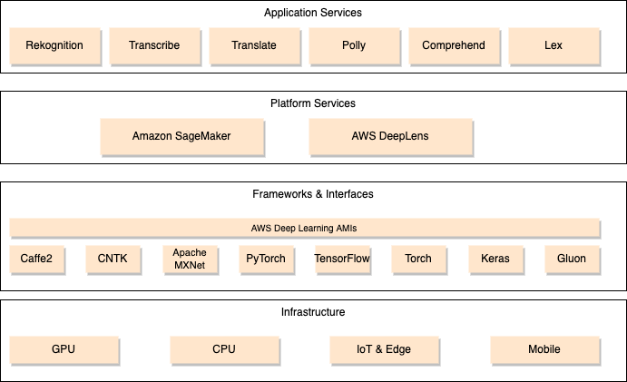

# AI and ML services introduction

!!! Info
    Created 12/2022 - Updated 1/30/24

Amazon started to use AI in product/book recommendations in the 90s. Now it is used everywhere: fulfillment automation, inventory management, voice driven interactions, drones... 

The following diagram illustrates the Amazon ML stack:

{ width=800 }

## ML Amazon Services

### [Rekognition](https://docs.aws.amazon.com/rekognition/latest/dg/what-is.html)

For detection inside of image or video. Used for face detection, labeling, celebrity recognition...

[AWS CDK code samples](https://github.com/awsdocs/aws-doc-sdk-examples/tree/main/python/example_code/rekognition#code-examples)

### [Transcribe](https://docs.aws.amazon.com/transcribe/latest/dg/what-is.html)

Speech to Text service, always self trained. It supports both synch and asynch requests. Words can be customized to meet specific business needs, and special vocabulary. Can be enhanced with custom training sets. 

### [Polly](https://docs.aws.amazon.com/polly/latest/dg/what-is.html)

Text to speech. It uses speech synthesis markup language (SSML) to help us put emphasize on words, includes breathing sounds, whispering.... Also it is possible to customize the pronunciation of words and do substitution using Pronunciations lexicons. 

Support 31 languages, 20+ NTTS.

It also supports asynchronous synthesis to process up to 200k characters. Texts are sent over TLS and Poly does not retain texts processed. 

It supports SSML, Speech Markup Language to control speech delivery: pause, paragraphs, rate of speech, phonetic pronunciations, acronyms and abbreviations.

### [Translate](https://docs.aws.amazon.com/translate/latest/dg/what-is.html)

Text translation service that uses advanced machine learning (neural network) technologies to provide high-quality translation on demand. Low latency <150ms and < 80ms for conversation.

5000 characters in synch requests, and support batch processing.

It is trained on 11 domains. Pay per use.

### [Lex](https://docs.aws.amazon.com/lex/latest/dg/what-is.html)

Build conversational bots or chatbots and virtual assistant. Lex includes speech to text, and NLU.

It also includes ML to do automated designer of the conversation by analysing existing conversation transcripts.

### [Amazon Textract](https://aws.amazon.com/textract/)

Amazon Textract is a machine learning (ML) service that automatically extracts text, handwriting, and data from scanned documents. It uses Optical Character Recognition.

### [Amazon Connect](https://docs.aws.amazon.com/connect/latest/adminguide/what-is-amazon-connect.html)

Cloud contact center.

### [Comprehend](https://docs.aws.amazon.com/comprehend/latest/dg/what-is.html)

Uses natural language processing (NLP) to extract insights about the content of documents. Entity extraction, detect language, sentiment analysis...

No need to provide training data, it is always trained.

### [SageMaker](./sagemaker.md)

See [dedicated note.](./sagemaker.md)

### [Forecast](https://docs.aws.amazon.com/forecast/latest/dg/what-is-forecast.html)

Fully managed service that uses statistical and machine learning algorithms to deliver highly accurate time-series forecasts.

### [Kendra](https://docs.aws.amazon.com/kendra/latest/dg/what-is.html)

Highly accurate and intelligent search service that enables users to search unstructured and structured data using natural language processing and advanced search algorithms. 

User can define ingestion process for documents and repositories.

### [Personalize](https://docs.aws.amazon.com/personalize/latest/dg/what-is.html)

Fully managed machine learning service that uses our data to generate item recommendations for the end users. Recommenders are services to be integrated in application to get real-time recommendation. Optimized for Retail, media and entertainment. It is usind on amazon.com.

Includes recipes to define recommenders.

[Amazon Personalize samples Git Repo.](https://github.com/aws-samples/amazon-personalize-samples/tree/master)

## ML domain of knowledge

### Data Engineering

#### Data repositories

#### Data ingestion solution

#### Data transformation solution

### Data analysis

#### Sanitize and prepare data for modeling

#### Feature engineering

#### Data analysis for ML

### Modeling

#### Frame business problems as ML problems

#### Model selection

#### Train model

#### Perform hyperparameter optimization

#### Evaluate model

### ML implementation and operations

#### Build model for enterprise needs

#### Technology fit for purpose

#### Security specific for ML

#### Deploy and operationalize

* Expose endpoints and interact with them.
* Understand ML models.
* Perform A/B testing.
* Retrain pipelines.
* Debug and troubleshoot ML models.