# [Amazon SageMaker](https://docs.aws.amazon.com/sagemaker/latest/dg/what-is.html)

## Introduction

Fully managed machine learning service, for developers and data scientists, to develop machine learning models then directly deploy them into a production-ready hosted environment. It includes a Feature store. It also provides an integrated Jupyter authoring notebook instance.

The figure below explains how SageMaker works for model training, by using S3 bucket as source of data (Ground Truth), ECR Container registry to get predefined image, models are persisted in S3 bucket output folder:

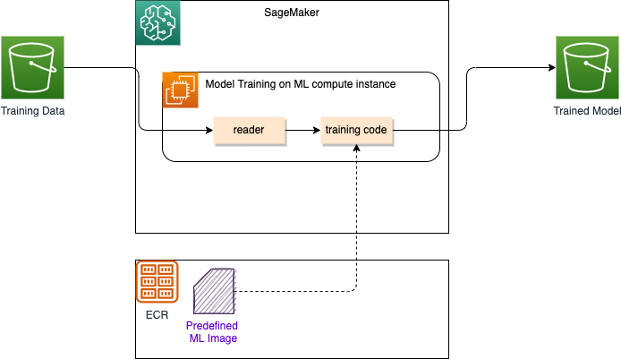{ width=700 }

Amazon SageMaker always uses Docker containers when running scripts, training algorithms, and deploying models. We can create a training job with the SageMaker console, AWS CLI, Python notebook,  or using the SageMaker Python SDK.

After we trained our machine learning model, we can deploy it using Amazon SageMaker deployment, using one of the following scenarios:

* One prediction at a time, use real-time inference hosting service: limit to 6MB and t<60s 

    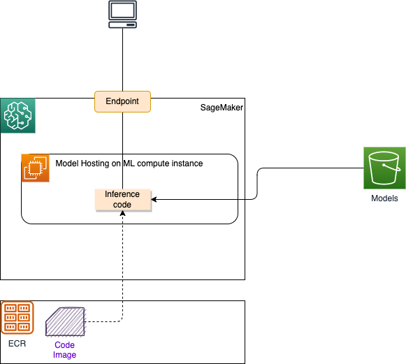{ width=700 }

* Workloads that tolerate cold start can use [serverless inference](https://docs.aws.amazon.com/sagemaker/latest/dg/serverless-endpoints.html). Pay for only when used.
* For large payload > 1GB, long processing, use batch processing. 
* When the request is queued, use [Asynchronous inference](https://docs.aws.amazon.com/sagemaker/latest/dg/async-inference.html).

See [inference deployment options](https://docs.aws.amazon.com/sagemaker/latest/dg/deploy-model.html/#deploy-model-options) for details.

### Benefits

* Labelling raw data and active learning
* Fully managed notebook
* Models are in OCI images
* **Amazon SageMaker Clarify** helps improve the machine learning (ML) models by detecting potential bias and by explaining the predictions that models make.
* [SageMaker JumpStart](#jumpstart)  provides pretrained, open-source models for a wide range of problem types to help you get started with machine learning. For LLMs, it includes **LLaMa-2-7b, BLOOM 176B, FLAN-T5 XL, or GPT-J 6B**...
* Isolate team in a security domain which includes EBS, collaborative editing capabilities, computes, sharing spaces.
* Canvas is used to integrate with data source connectors, includes ready to use models and do ETL.
* Model endpoint can be called asynchronously with data from S3.
* Can use Sagemaker docker [image for deep learning](https://docs.aws.amazon.com/sagemaker/latest/dg/pre-built-containers-frameworks-deep-learning.html) with different framework like TensorFlow, PyTorch, ...

### Key Term Definitions

| Term | Definition |
| --- | --- |
| **Inferentia** | AWS custom chip which is designed for ultra-fast low cost ML inference. New library releases in Q2 2023 have made LLM compilation easier |
| **SageMaker Distributed Training** | SageMaker provides distributed training libraries and supports various distributed training options for deep learning tasks such as computer vision (CV) and natural language processing (NLP). With SageMaker’s distributed training libraries, you can run highly scalable and cost-effective custom data parallel and model parallel deep learning training jobs. |
| **SageMaker Jumpstart Foundation Models** | SageMaker JumpStart provides pretrained, open-source models for a wide range of problem types to help you get started with machine learning. You can incrementally train and tune these models before deployment. JumpStart also provides solution templates that set up infrastructure for common use cases, and executable example notebooks for machine learning with SageMaker. |
| **Titan** | A textual foundation model developed internally to Amazon. First renditions is text to text and text to vector models. These models are zero-shot instructor models and can solve tasks like summarization, question answer, language generation, and advanced search. |
| **Trainium** | AWS custom chip which is designed for ultra-fast low cost ML training and inference.|


### Components

* [Canvas](https://docs.aws.amazon.com/sagemaker/latest/dg/canvas.html): generate prediction with a no-code approach. With Canvas, we can chat with popular large language models (LLMs), access Ready-to-use models, or build a custom model trained on new data. See [getting started](https://docs.aws.amazon.com/sagemaker/latest/dg/canvas-getting-started.html).
* [Autopilot]()
* [Governance]()
* [Hpyerpod Clusters]()
* [Ground Truth]()
* [Notebook]()
* [Training](https://docs.aws.amazon.com/sagemaker/latest/dg/train-model.html)
* [Inference]()
* [Augmented AI]()


### Pricing

[Pricing information](https://aws.amazon.com/sagemaker/pricing/).

## SageMaker Studio

A single, web-based IDE to do all the ML development tasks. It supports the classical ML development steps of:

* Prepare Data.
* Build Model using Notebook.
* Train and tune model.
* Deploy and manage.

To use SageMaker Studio, an administrator needs to get a Domain sets up (see steps in [SM immersion day](https://catalog.us-east-1.prod.workshops.aws/workshops/63069e26-921c-4ce1-9cc7-dd882ff62575/en-US/prerequisites/option2)).

### Domain

A  [**Domain**](https://docs.aws.amazon.com/sagemaker/latest/dg/studio-entity-status.html) consists of an associated Amazon Elastic File System (Amazon EFS) volume; a list of authorized users; and a variety of security, application, security policies, S3 bucket, and Amazon Virtual Private Cloud configurations.  Each user in a domain receives a personal and private home directory within the EFS for their own notebooks, Git repositories, and data files. Within a domain data scientists and developers can co-work on the same data and models.

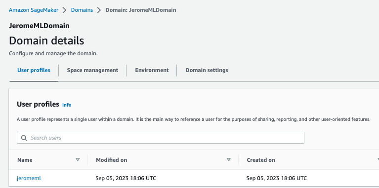{ width=800 }

After creating a Domain, we got a User Portal to access the environment. Members given access to Studio have a unique sign-in URL that directly opens Studio, and they sign in with their IAM Identity Center credentials (SSO).

Once a user from Identity Service is assigned to a Domain, she/he can start Studio:

{ width=800 }

* A user needs to create an executable environment, for example a Data Science one, with all the needed libraries to use Jupyter notebook with AWS SDK boto3. The environment is a EC2 machine (t3.medium).

* We can use [CDK to create a Studio with scripts to perform automated tasks at setup time](https://aws.amazon.com/blogs/machine-learning/use-the-aws-cdk-to-deploy-amazon-sagemaker-studio-lifecycle-configurations/) and [code repo.](https://github.com/aws-samples/aws-cdk-sagemaker-studio-lifecycle-config)

???- info "A [Simple tutorial](https://aws.amazon.com/getting-started/hands-on/build-train-deploy-machine-learning-model-sagemaker/?ref=gsrchandson)"

    The classical model development and deployment steps are:

    1. Be sure to have an IAM Role created so SageMaker Studio running in a EC2 instance can access remote AWS services, like S3...
    1. Inside Studio, create a SageMaker notebook instance - Use Jupyter notebook with Conda and Python3
    1. Prepare the data: create S3 bucket, load csv source as training data set, build train and test data sets by splitting the source data.
    1. Train the model to learn from the data, using session to cluster hosts:

        ```python
        import sagemaker
        # Use SageMaker estimator 
        sess = sagemaker.Session()
        xgb = sagemaker.estimator.Estimator(xgboost_container, role, instance_count=1, 
                        instance_type='ml.m4.xlarge',
                        output_path='s3://{}/{}/output'.format(bucket_name, prefix),
                        sagemaker_session=sess)
        xgb.set_hyperparameters(max_depth=5, eta=0.2, gamma=4, min_child_weight=6, subsample=0.8, silent=0,
                    objective='binary:logistic', num_round=100)
        # fit on the training set
        xgb.fit({'train': s3_input_train})
        ```

    1. Deploy the model:

        ```python
        xgb_predictor = xgb.deploy(initial_instance_count=1,instance_type='ml.m4.xlarge')
        ```

    1. Evaluate a ML model's performance

        ```python
        from sagemaker.serializers import CSVSerializer

        test_data_array = test_data.drop(['y_no', 'y_yes'], axis=1).values #load the data into an array
        xgb_predictor.serializer = CSVSerializer() # set the serializer type
        predictions = xgb_predictor.predict(test_data_array).decode('utf-8') # predict!
        predictions_array = np.fromstring(predictions[1:], sep=',') # and turn the prediction into an array
        print(predictions_array.shape)
        ```

        It generates a confusion matrix like:

        ```sh
        Overall Classification Rate: 89.5%

        Predicted      No Purchase    Purchase
        Observed
        No Purchase    90% (10769)    37% (167)
        Purchase        10% (1133)     63% (288) 

        ```

## The ML process

The following figure illustrates the classical Machine Learning process:

{ width=800 }

### Data Wrangler

Data Wrangler (File > New > Data Wrangler Flow) is a tool to help do feature engineering, and build data workflow.

* From defining connection to data source, and import dataset:

    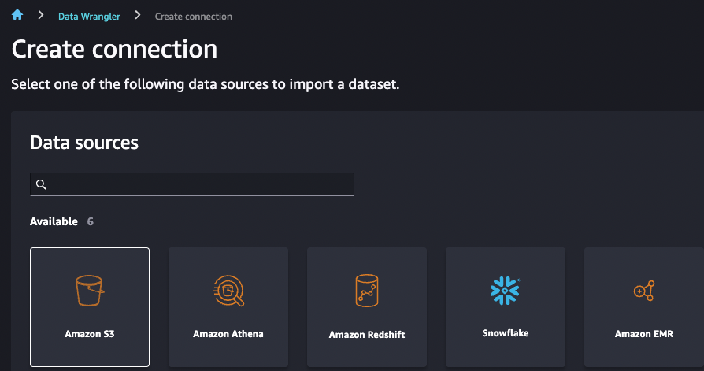{ width=900 }

* Add a Data Analysis to the data flow, using Data Quality and Insights Report:  

    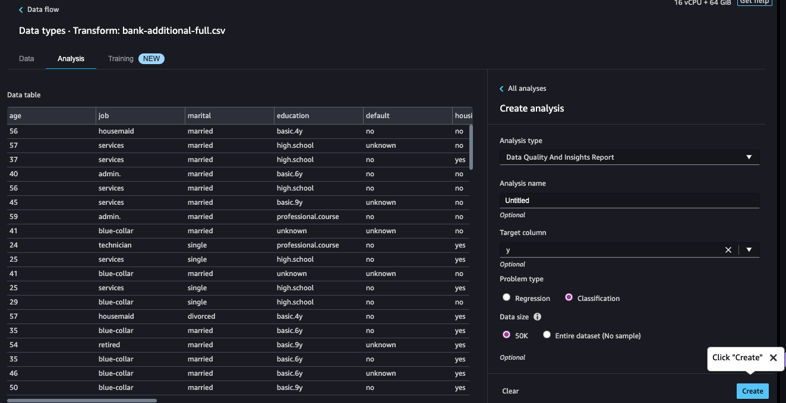{ width=900 }

* Or add one to assess the correlation between one variable and the output, using a data analysis based on Histogram:

    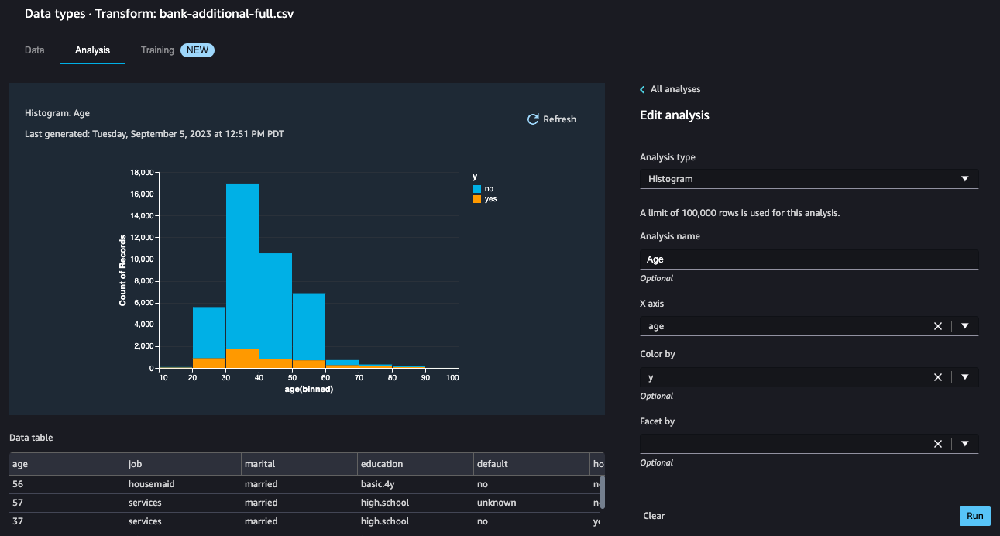{ width=900 }

* Adding table summary to the flow to get means, min, max... per column.

* We can also add Bias for the marital status to y:

    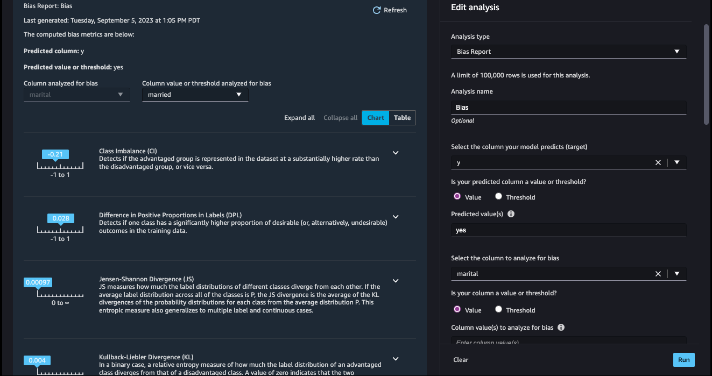{ width=900 }

    We observe a class imbalance where the married class is 21% more represented than other classes. We also observe that the married class is 2.8% less likely to subscribe to a bank term deposit

* We can find out Target Leakage which occurs when there is data in a machine learning training dataset that is strongly correlated with the target label, but is not available in real-world data.

    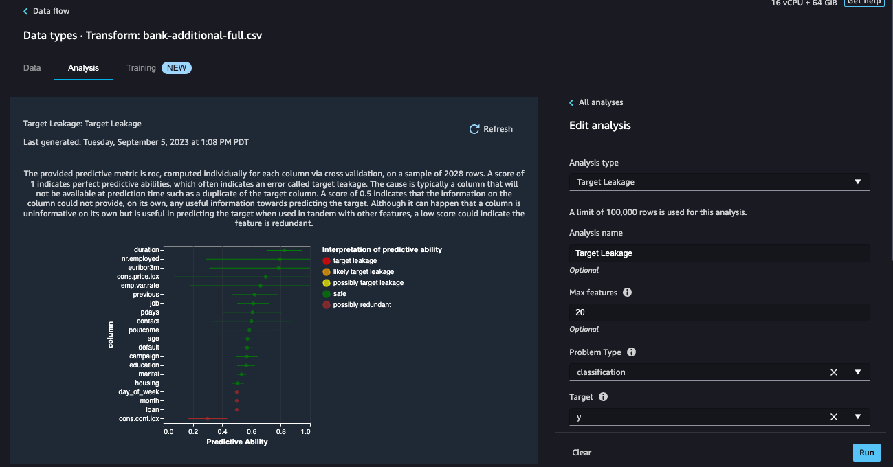{ width=900 }

* We can add more analysis like histograms, or add a predifined transformation, like Synthetic Minority Over-sampling Technique ([SMOTE](https://en.wikipedia.org/wiki/Oversampling_and_undersampling_in_data_analysis)):

    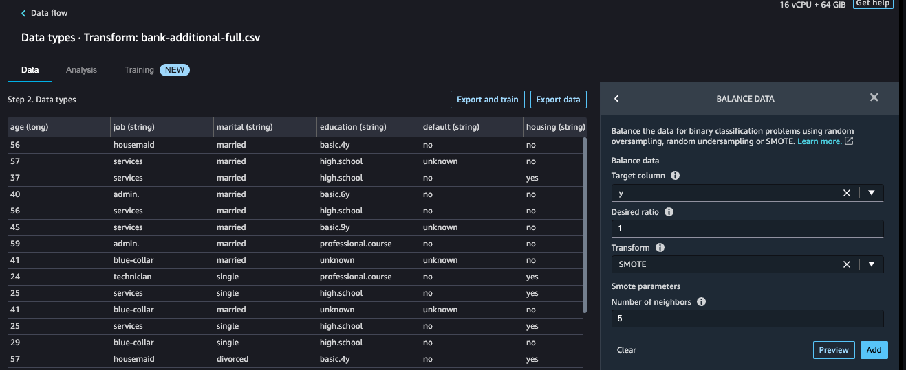{ width=900 }

* Remove any outliers using Standard deviation at 3 sigma.

    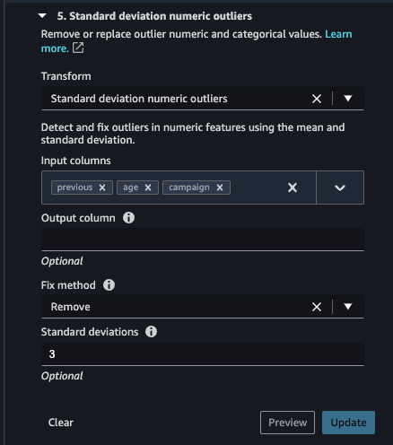{ width=900 }

* Scale the numerical features, using min-max scaler from 0 to 1.
* Replace feature characters to replace '.' to '_' for categorical features.

    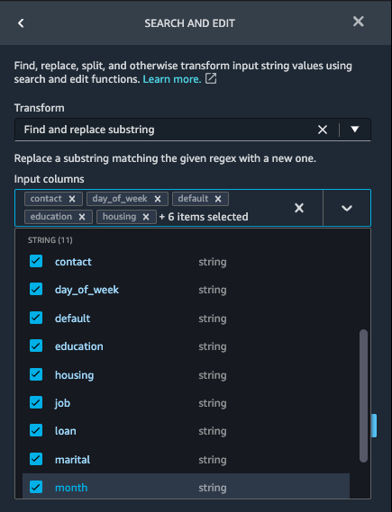{ width=900 }

* Finally we can add custom transform in Python (user-defined function), Python Pandas, PySpark, like compute variance_inflation_factor for numerical features and drop columns with vif > 1.2

* Do one_hot_encoding transformation for categorical data, choose all string type columns as Input columns and select Columns as Output style.

    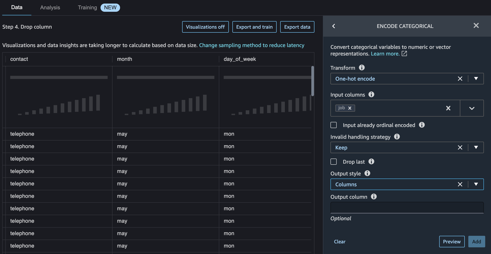{ width=900 }

### Persist to Feature Store

We can also use the SageMaker Feature Store as a centralized storage for all the features potentially created by multiple teams and that can then also be retrieved consumed by multiple teams. The access is not obvious (Use + on last tranformation and menu > Add destination > Feature Store), start by defining a feature group:

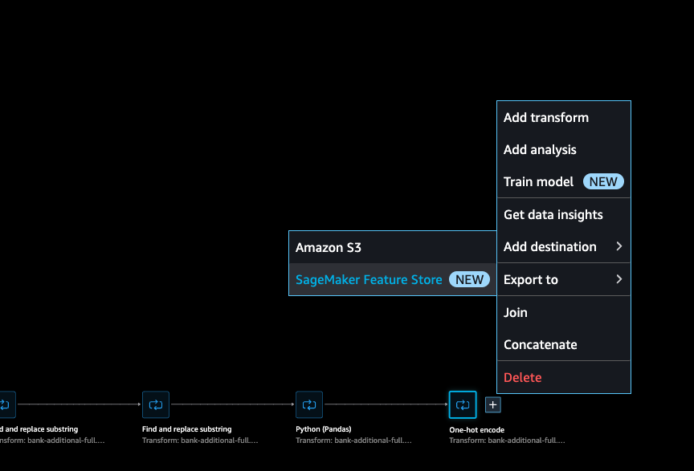{ width=900 }

The feature store can be online (used for real time inference) or offline (for batch training). Offline is a S3 bucket. The JSON schema helps to validate the data set.

### Processing job

To do the data wrangler, SageMaker can start batch processing job using Apache Sparks.

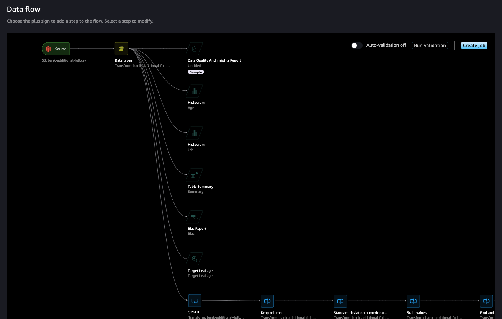{ width=900 }

The trained parameters have been fitted on the available data in Data Wrangler with certain transforms including One-hot encode, Scale values and Standard deviation numeric outliers. These transforms depend on the available data and must be re-fitted when new data is available.

We can schedule the job to run at certain time of the day, from different input file.

The outcome of the batch processing job will be a set of parquet files with the processed data saved in the 'off-line store', a flow definition, and spark configuration files.

## Develop with sklearn library and deploy with SageMaker

A typical training script loads data from the input channels, configures training with hyperparameters, trains a model, and saves a model to model_dir so that it can be hosted later

* [See the tutorial: Using SKLearn with SageMaker](https://sagemaker.readthedocs.io/en/stable/frameworks/sklearn/using_sklearn.html#deploy-a-scikit-learn-model) and a code to compute a RandomForest for a SaaS company assessing the risk of their customers to churn [big-data-tenant-analytics > CompanyRisk](https://github.com/jbcodeforce/big-data-tenant-analytics/tree/main/CompanyRisk).
* [See also: Using the SageMaker Python SDK](https://sagemaker.readthedocs.io/en/stable/overview.html#using-the-sagemaker-python-sdk): SageMaker Python SDK provides several high-level abstractions for working with Amazon SageMaker.

Scripts, training and test data sets are in s3. The SDK helps to access SageMaker constructs and deploy the model as a service with reachable endpoint. The endpoint runs a SageMaker-provided Scikit-learn model server and hosts the model produced by our training script.

As SageMaker Pythin SDK uses a Docker image to create sklearn environment we can define our own image with our custom libraries via a `requirements.txt`.

We run Scikit-learn training scripts on SageMaker by creating SKLearn Estimators.

## Jumpstart

[Amazon SageMaker JumpStart](https://docs.aws.amazon.com/sagemaker/latest/dg/studio-jumpstart.html) provides a set of foundation models, build-in algorithms and prebuilt ML solutions for common use cases that can be deployed readily in just a few steps. JumpStart is a ML hub with 400+ built-in algorithms with pre-trained models including foundation models. The price is based on the resources used.

Consider Jumpstart when:

* The best LLM for the task is not in Bedrock
* The size of requests and/or request frequency of the use case makes Jumpstart more cost effective — Paying by the hour instead of the token.
* The terms and conditions of Bedrock models don’t meet the use case.
* Using JumpStart, we can perform inference on a pre-trained model, even without fine-tuning it first on a custom dataset. We can also fine tune a model on specific dataset.
* Deploying a model, differs by model and instance availability of the required instance type.

???- example "Generate text with Prompt only approach"
    The following code can be integrated into a Jupyter Notebook: it uses Google Flan T5 LLM, with dialog data sets from Hugging Face, transformers tokenizer, and a prompt to expect a summarization of the conversation between two humans:

    ```python
    from transformers import AutoTokenizer
    from transformers import AutoModelForSeq2SeqLM
    from datasets import load_dataset
    # Load a dialog data sets from Hugging Face
    huggingface_dataset_name = "knkarthick/dialogsum"
    dataset = load_dataset(huggingface_dataset_name)

    model_checkpoint='google/flan-t5-base'

    tokenizer = AutoTokenizer.from_pretrained(model_checkpoint, use_fast=True)
    # Instantiate one of the model classes of the library (with a sequence-to-sequence language modeling head) from a pretrained model.
    # Sequence-to-sequence models are best suited for tasks revolving around generating new sentences depending on a given input, such as summarization, translation, or generative question answering
    model = AutoModelForSeq2SeqLM.from_pretrained(model_checkpoint)

    start_prompt = 'Summarize the following conversation.\n'
    end_prompt = '\n\nSummary: '
    dialogue = dataset['test'][example_indices[0]]['dialogue']
    summary = dataset['test'][example_indices[0]]['summary']
    prompt = f'{start_prompt}{dialogue}{end_prompt}'

    inputs = tokenizer(prompt, return_tensors='pt')
    output = tokenizer.decode(
        model.generate(
            inputs["input_ids"], 
            max_new_tokens=50,
        )[0], 
        skip_special_tokens=True
    )
    print(f'INPUT PROMPT:\n{prompt}\n')
    print(f'MODEL GENERATION:\n{output}\n')
    print(f'BASELINE SUMMARY:\n{summary}')
    ```


## Deeper dive

* [x] [Onboard to Amazon SageMaker Domain Using IAM Identity Center](https://docs.aws.amazon.com/sagemaker/latest/dg/onboard-sso-users.html) to define user in IAM-IC and then use Domain in SageMaker to authorize users to login via SSO.
* [x] [Labs: Creating a scikit-learn Random Forest Classifier in AWS SageMaker](https://learn.acloud.guru/handson/1a4b7e56-0177-40a3-b03b-d6fb4457b092). Applied to company risk to churn demo in [this folder](https://github.com/jbcodeforce/big-data-tenant-analytics/tree/main/CompanyRisk).
* [ ] [Using the SageMaker Python SDK](https://sagemaker.readthedocs.io/en/stable/overview.html#using-the-sagemaker-python-sdk).
* [ ] [Examples of using SageMaker Python SDK](https://github.com/aws/amazon-sagemaker-examples/blob/main/sagemaker-python-sdk/).
* [ ] [Amazon SageMaker Workshops](https://github.com/awslabs/amazon-sagemaker-workshop)
* [ ] [SageMaker Immersion Day](https://catalog.us-east-1.prod.workshops.aws/workshops/63069e26-921c-4ce1-9cc7-dd882ff62575/en-US)
* [gitHub Amazon SageMaker Examples](https://github.com/aws/amazon-sagemaker-examples) including Inference Recommender.
* [scikit_learn_data_processing_and_model_evaluation](https://github.com/aws/amazon-sagemaker-examples/blob/main/sagemaker_processing/scikit_learn_data_processing_and_model_evaluation/scikit_learn_data_processing_and_model_evaluation.ipynb)
* [x] [Add permissions to a Amazon SageMaker Studio account](https://aws.amazon.com/getting-started/hands-on/machine-learning-tutorial-set-up-sagemaker-studio-account-permissions/) when we need to enable access from Studio to SageMakerAPI using the IAM policies `AmazonSageMakerFullAccess` and `AWSCloudFormationFullAccess`. The lab is little bit old, so now in SageMaker we need to access users via Domain.
* [MLOps deployment best practices for real-time inference model serving endpoints with Amazon SageMaker](https://aws.amazon.com/blogs/machine-learning/mlops-deployment-best-practices-for-real-time-inference-model-serving-endpoints-with-amazon-sagemaker/).
* [ ] [Generative AI and Data Science on AWS](https://catalog.us-east-1.prod.workshops.aws/workshops/f772b430-37d0-4adc-ba65-2f3e229caa5c/en-US).
* [ ] [Generative AI on Amazon SageMaker - Workshop](https://catalog.us-east-1.prod.workshops.aws/workshops/972fd252-36e5-4eed-8608-743e84957f8e/en-US): addresses SageMaker Quickstart solutions for text-text and text-image models, prompt engineering, fine-tuning Llama2, genAI use cases, coding Llama2.
* [Personalized Movie Tag-Line Recommendations using Amazon Bedrock and Amazon Personalize](https://gitlab.aws.dev/ai-ml-specialist-sa/amer-aiml-sa/us-west/bedrock-samples/-/tree/main/samples/personalize-plus-bedrock).

Please ensure that the role "arn:aws:iam::4...:role/service-role/AmazonSageMaker-ExecutionRole-20221207T113525" exists and that its trust relationship policy allows the action "sts:AssumeRole" for the service principal "sagemaker.amazonaws.com". Also ensure that the role has "s3:GetObject" permissions and that the object is located in us-west-2.