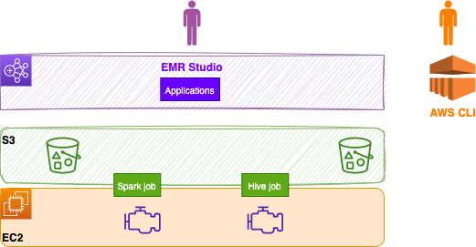
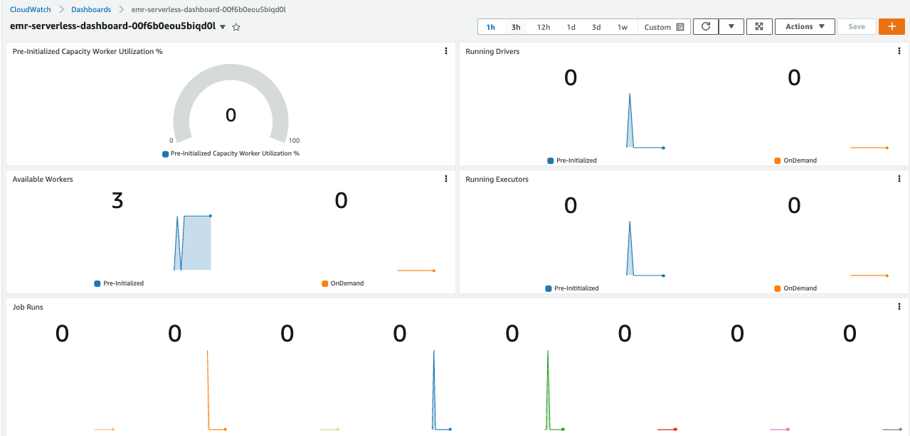
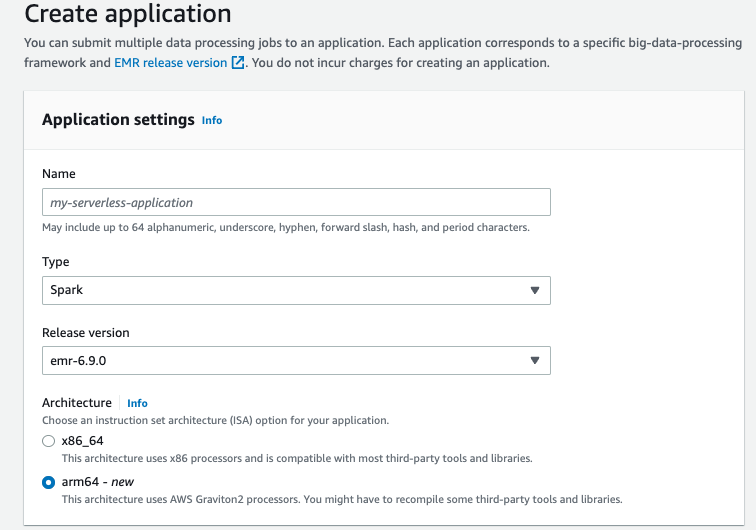
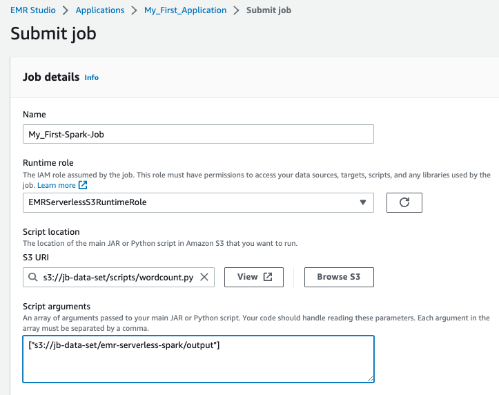
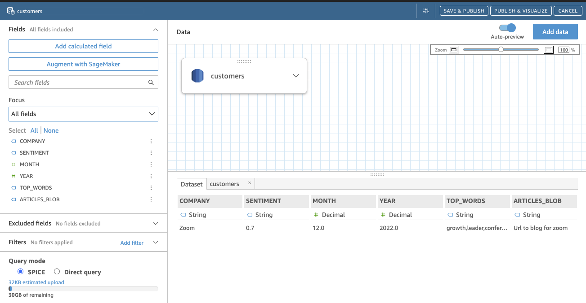
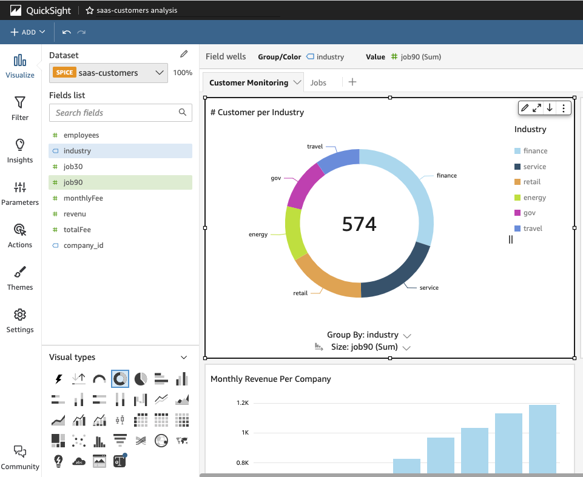
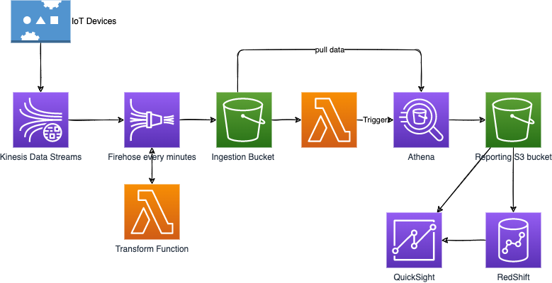

# Analytics Services

The AWS portfolio of fully managed analytics services includes a cloud-native big data platform, a log analytics and search engine for operational data and a distributed streaming platform for real-time data movement.

!!! Update
    06/05/2023

## AWS Athena

[AWS Athena](https://aws.amazon.com/athena) runs analytics directly on S3 files or federated storage, using SQL language to query the files (CSV, JSON, Avro, Parquet...). `S3 Access Logs` log all the requests made to buckets, and Athena can then be used to run serverless analytics on top of the logs files. 

* No need to load the data to Athena, the query is executed on top of S3.
* Based on [Presto](https://prestodb.io/) for DML queries and [Apache Hive](https://hive.apache.org/) for datawarehouse and SQL queries.
* Queries are done on high availability capability so will succeed, and scale based on the data size.
* No need for complex ETL jobs to prepare our data for analytics.
* Athena integrates with Amazon QuickSight for easy data visualization.
* Integrated with AWS **Glue Data Catalog**, allowing us to create a unified metadata repository across various services, crawl data sources to discover schemas and populate our Catalog with new and modified table and partition definitions, and maintain schema versioning.
* Pricing pet TB of data scanned.
* It also includes `Federated Query` to run SQL queries across data stored in relational and non-relational , object, and custom data sources. It uses the Data Source Connectors which executes a Lambda to run the Federated Query.

* Prefer using [Apache Parquet](https://parquet.apache.org/) data format for better performance and optimized cost. It is a columnar file format that provides optimizations to speed up queries and is a far more efficient file format than CSV or JSON
* Partition our data in S3 folder.

???- "CSV to Parquet"
    For Python, Pandas support it by reading the csv file into dataframe using read_csv and writing that dataframe to parquet file using `to_parquet`. [Apache Drill](https://drill.apache.org/) has also such tool. In Spark the data frame has write.parquet API. Finaly AWS Glue can also do such transformation.

### Simple demo script

* Create a S3 bucket to keep results of Athena queries.
* Create a second S3 bucket to keep source data, and upload a csv file as data source.
* Create a database in Athena:

    ```sql
    CREATE DATABASE mydatabase
    ```

* Define SQL query to create table to match the source (external table) and run it in the Editor.

    ```sql
    CREATE EXTERNAL TABLE IF NOT EXISTS tablename-datasource (
        `Date` DATE,
        Time STRING,
        Location STRING, ... 
    )
    ROW FORMAT DELIMITED
    FIELDS TERMINATED BY ','
    LINES TERMINATED BY '\n'
    LOCATION 's3://url-to-bucket'
    ```

* Use the SQL query Editor to select columns, do any type of query.

### Lambda example

It is possible to run Athena query from Lambda function and get the result pushed in an output S3 bucket or in another place.

See the lambda code in the [labs/lambdas/s3-aurora folder](https://github.com/jbcodeforce/aws-studies/tree/main/labs/lambdas/s3-aurora).

Also see the [boto3 Athena API.](https://boto3.amazonaws.com/v1/documentation/api/latest/reference/services/athena.html)

### Deeper dive

* [Product documentation](https://docs.aws.amazon.com/athena/latest/ug/what-is.html)
* [Getting started with Athena](https://docs.aws.amazon.com/athena/latest/ug/getting-started.html)
* [How do I analyze my Amazon S3 server access logs using Athena?](https://aws.amazon.com/premiumsupport/knowledge-center/analyze-logs-athena/)
* [See also code sample](https://docs.aws.amazon.com/athena/latest/ug/code-samples.html).
* [Calling SageMaker function from an Athena Query to do ML](https://docs.aws.amazon.com/athena/latest/ug/querying-mlmodel.html).

## [Elastic MapReduce - EMR](https://aws.amazon.com/emr)

This is the managed service for big data solution implementation using petabyte-scale datasets.  It is used for data processing, interactive analytics, and ML using open-source frameworks such as [Apache Spark](https://spark.apache.org/), [Apache Hive](https://hive.apache.org/), [Apache Flink](https://flink.apache.org/), or [Presto](https://prestodb.io/).

It offers four different ways to deploy applications:

* Serverless
* On EC2: closest deployment environment to a YARN-based Hadoop platform
* On EKS: when EKS is the deployment standard
* On Outposts

EMR supports virtually unlimited storage capacity through the EMRFS backed by Amazon S3, which can be shared across multiple EMR clusters or Amazon EMR Serverless. It also supports HDFS backed by EBS volumes and instance stores.

### Value propositions

* No cluster to operate (with the Serverless deployment)
* Avoid over or under-provisioning resources
* Supports Apache Iceberg to create tables and query, merge, and insert data  
* Auto determination of resources, compute and memory, needed to run analytics jobs
* Automatically scales workers up or down based on the workload and parallelism required at every stage of the job graph
* Track usage cost by applications
* Easy integration with AWS Redshift, Athena, S3 and data ingestion platform like Kinesis, MSK
* Integrate with AWS Service Catalog for managing EMR applications, and AWS Lake Formation for fine grained access control to the data.

### EMR EC2 cluster

[EMR is a cluster](https://docs.aws.amazon.com/emr/latest/ManagementGuide/emr-overview.html) of EC2 instances which are nodes in Hadoop (HDFS). We can use Reserved Instances and Spot instances to reduce costs. There are three node types:

* **Master nodes**: coordinate cluster, and distribution of data and tasks among other nodes. 
* **Core nodes**: run tasks and store data in the Hadoop Distributed File System (HDFS) 
* **Task nodes**: (optional)  run tasks and do not store data in HDFS

EMR comes bundled with Spark, HBase, Presto, Hive, Flink... 
When launching a cluster, it performs bootstrap actions to install custom software and applications. When the cluster is in running state, we can submit work to it. Work includes a set of steps. The cluster can auto terminate at the end of the last step.

We can submit one or more ordered steps to an Amazon EMR cluster. Each step is a unit of work that contains instructions to manipulate data for processing by software installed on the cluster.

For auto scaling of the task nodes, it uses Spot instances. Master nodes should be on Reserved Instances.

#### EMR cluster Use cases

* Big data analytics: what-if analysis using statistical algorithms and predictive models to uncover hidden patterns, correlations, market trends...
* Scalable data pipelines: process it at petabyte scale.
* Real-time data streams: to create long-running, highly available, and fault-tolerant streaming data pipelines.
* Analyze data and ML adoption.

AWS Lake Formation integrates with Amazon EMR to set up, secure, and manage data lakes. You can use Lake Formation permissions together with the AWS Glue Data Catalog to provide fine-grain, column-level access to the data lake. Jobs that we submit with Amazon EMR steps can use job-centric runtime roles to access AWS resources, such as objects in Amazon S3.

#### Getting Started EMR/EC2

See the [getting started tutorial](https://docs.aws.amazon.com/emr/latest/ManagementGuide/emr-gs.html) with Spark, Pyspark scripts stored in S3 (details below). 

???- info "Tutorial"
    The Python code and data sets are in the folder: [labs/analytics/emr-starting](https://github.com/jbcodeforce/aws-studies/tree/main/labs/analytics/emr-starting). The goal is to process food establishment inspection data.

    * Create a cluster using the script `create-cluster.sh` (it uses `aws emr create-cluster` command).
    * Unzip data sources in a S3 bucket (e.g. `s3://jb-data-set/restaurants/`)
    * In the console, once the cluster is in waiting mode, add a **Step** with Spark Application, in cluster deployment mode, 

        

        Or run `deploy-app.sh` (it uses `aws emr add-steps` command).

    * The results looks like

        ```csv
        name,total_red_violations
        SUBWAY,322
        T-MOBILE PARK,315
        WHOLE FOODS MARKET,299
        ...
        ```

For other EMR examples see [the playground](../playground/spark-emr.md) and [Spark Studies](https://jbcodeforce.github.io/spark-studies/).

See [Pricing](https://docs.aws.amazon.com/emr/latest/ManagementGuide/emr-gs.html) based on EC2 type and region.

### [EMR Serverless](https://us-west-2.console.aws.amazon.com/emr/home?region=us-west-2#/serverless)

The newest and easiest way for data analysts and engineers to run open-source big data analytics frameworks without configuring, managing, and scaling clusters and servers.

End users work from EMR Studio using notebooks, but we can also submit jobs via APIs and CLI. 

It uses the concept of applications to keep configurations and metadata. A job is a request submitted to an Amazon EMR Serverless application that runs asynchronously and is tracked through completion. Jobs are run in a single Availability Zone to avoid cross-AZ network communication. In the figure below the green layer is owned by the user, with data in S3, while the orange layer is managed by AWS. Spark or Hive engines run jobs on the data coming from S3 (in fact data can come from a lot of different data sources). 

{ width=900 }

No need to right-size clusters for varying jobs and data sizes. It automatically adds and removes workers at different stages of the job. EMR is charged for aggregated vCPU, memory, and storage resources used from the time a worker starts running until it stops.

* We can submit jobs using workflow orchestration services like AWS Step Functions, Apache Airflow, or AWS Managed Workflows for Apache Airflow.
* Logging: By default, EMR Serverless stores application logs securely in Amazon EMR managed storage for a maximum of 30 days. Before our jobs can send log data to Amazon S3, we must allow `s3:PutObject` on the `arn:aws:s3:::.../*` s3 bucket, in the permissions policy for the job runtime role. 
* Monitoring with CloudWatch custom dashboard: See the CloudFormation definition under [lab/analytics/emr-serverless folder](https://github.com/jbcodeforce/aws-studies/tree/main/labs/analytics/emr-serverless) and using the command `./defineCWdashboard.sh`, we can get a dashboard for the Serverless EMR application:

    

    So we need to define one dashboard per application.

    Every minute EMR Serverless emits (CPUAllocated, IdleWorkerCount,MaxCPUAllowed) metrics at the application level and at the worker-type and capacity-allocation-type levels.


#### EMR Serverless Use cases

* Spark ETL.
* Large scale SQL queries using Hive.
* Interactive analysis using Jupyter notebooks with EMR Studio.
* Analysis using Presto
* Real-time streaming data pipelines: perform fault-tolerant stream processing of live data streams using Apache Spark or Apache Flink data frameworks.
* AI/ML: pre-process data and train models and perform prediction and validation to build accurate ML models. It may use Spark MLlib, TensorFlow, and Apache MXNet. 

#### EMR Serverless - Getting Started

Source is the [tutorial - getting started](https://docs.aws.amazon.com/emr/latest/EMR-Serverless-UserGuide/getting-started.html). 

???- "Details"
    * We need an IAM role with a custom trust policy to enable others to perform actions in this account (see role `EMRServerlessS3RuntimeRole` and security policy `EMRServerlessS3AndGlueAccessPolicy`). 
    * Use EMR Studio and create an application. We can now use Graviton as CPU:

        

    * Define the PySpark script to be used and put it in a S3 bucket. For example WordCount.py

        ```sh
        aws s3 cp s3://us-east-1.elasticmapreduce/emr-containers/samples/wordcount/scripts/wordcount.py s3://jb-data-set/scripts/
        ```

    * Define a job using the script, using the **Spark properties** of: `--conf spark.executor.cores=1 --conf spark.executor.memory=4g --conf spark.driver.cores=1 --conf spark.driver.memory=4g --conf spark.executor.instances=1`

        

    * Once the job runs the status shows as `Success`, we  can view the output of the job in the S3 bucket.
    * Log should be in logs folder.
    * Delete output from s3 bucket: `aws s3 rm s3://jb-data-set/emr-serverless-spark/ --recursive`

    * **WordCount.py app with CLI:** Scripts are under [labs/analytics/emr-serverless](https://github.com/jbcodeforce/aws-studies/tree/main/labs/analytics/emr-serverless)

    * If the application was not created before like in manual step above, use the following command: (which is in the script `createApplication.sh`) 

        ```sh
        aws emr-serverless create-application --release-label emr-6.8.0 --type "SPARK"  --name My_First_Application
        ```

    * Get the application ID: `./getApplicationId.sh My_First_Application`
    * Be sure to have the wordcount.py in the scripts folder in s3 bucket

        ```sh
        aws s3 cp s3://us-east-1.elasticmapreduce/emr-containers/samples/wordcount/scripts/wordcount.py s3://DOC-EXAMPLE-BUCKET/scripts/
        ```

    * Get the role ARN 

        ```sh
        aws iam list-roles | jq -r '.Roles[] | select(.RoleName=="EMRServerlessS3RuntimeRole") | .Arn '
        ```

    * Submit the job:  `./submitJob.sh`. The submission output looks like:

        ```json
        {
        "applicationId": "00f6b0eou5biqd0l",
        "jobRunId": "00f6b25bek7v3f0l",
        "arn": "arn:aws:emr-serverless:us-west-2:....:/applications/00f6b0eou5biqd0l/jobruns/00f6b25bek7v3f0l"
        }
        ```

### [EMR on EKS](https://docs.aws.amazon.com/emr/latest/EMR-on-EKS-DevelopmentGuide/emr-eks.html)

Advantages:

* Run with other workload deployed on EKS. Fully managed lifecycle of the EMR jobs.
* 3x faster performance.
* Improves resource utilization and simplifies infrastructure management across multiple Availability Zones.
* Deploy in seconds instead of minutes.
* Centrally manage a common computing platform to consolidate EMR workloads with other apps. Access to built-in monitoring and logging functionality.
* Reduce operational overhead with automated Kubernetes cluster management and OS patching


* Amazon EMR uses virtual clusters to run jobs and host endpoints. A virtual cluster is a Kubernetes namespace that Amazon EMR is registered with. 

#### Deployment and setup

* [Prepare a EKS cluster](../serverless/eks.md)
* Amazon EMR on EKS needs CoreDNS for running jobs on EKS cluster. So update CoreDNS if needed.
* [Enable cluster access for Amazon EMR on EKS](https://docs.aws.amazon.com/emr/latest/EMR-on-EKS-DevelopmentGuide/setting-up-cluster-access.html) to a specific namespace by creating a k8s role, role binding to a k8s user, and map this user to the service linked role `AWSServiceRoleForAmazonEMRContainers`.
* [Enable IAM Roles for Service Accounts (IRSA) on the EKS cluster](https://docs.aws.amazon.com/emr/latest/EMR-on-EKS-DevelopmentGuide/setting-up-enable-IAM.html) by creating an OIDC identity provider
* Create a job execution role

#### Deeper dive

* [EKS workshop with EMR](https://www.eksworkshop.com/advanced/430_emr_on_eks/)
* [Blog Run Big Data Applications without Managing Servers ](https://aws.amazon.com/blogs/big-data/announcing-amazon-emr-serverless-preview-run-big-data-applications-without-managing-servers/)
* [Using AWS Glue Data Catalog as the Metastore for Hive](https://docs.aws.amazon.com/emr/latest/ReleaseGuide/emr-hive-metastore-glue.html)
* [Using an External MySQL Database or Amazon Aurora as Hive metastore](https://docs.aws.amazon.com/emr/latest/ReleaseGuide/emr-hive-metastore-external.html)


## [AWS Batch](https://docs.aws.amazon.com/batch/latest/userguide/what-is-batch.html)

As a fully managed service, AWS Batch helps to run batch computing workloads of any scale across multiple AZs within a region. 

Job definition specifies how jobs are to be run, and it can use container image. 

A compute environment is a set of managed or unmanaged compute resources (Fargate or EC2) that are used to run jobs. For EC2 it uses a dynamic provisioning with option to use Spot instances.

A job queue stores the submitted jobs until the AWS Batch Scheduler runs the job on a resource in the compute environment.

It used EBS for temporary storage.

Can be scheduled with EventBridge schedule, can also being orchestrated with Step function.

## [QuickSight](https://docs.aws.amazon.com/quicksight/latest/user/welcome.html)

Dashboard tool, serverless, machine learning powered BI service.

Two type of persona: dashboard developers and end-users (read-only on the dashboard).

Integrated with RDS, Aurora, Athena, S3, RedShift, OpenSearch, Timestream, with Saleforce, Jira... It can integrate to any JDBC compliant database. It can import CSV, XLSX, JSON, TSV files and log files.

If data is imported inside QuickSight, it uses in memory computation using SPICE (Super-fast, Parallel, In-memory Calculation Engine) engine.

The development process is described in the figure below (link to AWS doc)


* Defining a dataset and then working in removing column, applying filters, changing field names or data types, adding calculated fields, or use SQL to joins between tables.

Here is an example of integration with a table in Aurora



* Add Visual. A Visual can include multiple dataset and then multiple sheets. An Interactive Sheet is a collection of data expressed in visuals that users can interact with when the sheet is published to a dashboard. A Paginated Report is a collection of tables, charts, and visuals that are used to convey business critical information. 



* Create Dashboard from an Analysis.
* Share dashboard so it can be seen by end users.

With enterprise edition we can define groups of users, and share dataset, visual and dashboard with group or individual user.

The dataset can be shared between developers so they can develop their own analysis. Visualizations can also be shared during development, then the readonly dashboard is shared to end users.

To get input data for a dashboard we can define parameters. Parameters can also be used for exchanging context between sheets.

QuickSight can generate smart queries that uses only required tables rather than joining in all tables defined in the dataset.

### Some how to

* Invite user using the right top menu (human icon), and Manage QuickSight, then invite people by email. Create Group, and then add users. The 3 letters to search really need to be the first 3 letters.
* Once data are in SPICE, they need to be refreshed from the data source to get the last records updates. A refresh can be scheduled.
* Add trend and add X axis variable coming from the dataset and Value for Y.
* To add a widget to filter the data, use filter, select the column and add it to the current sheet (contextual menu)
* To add a transition from a sheet to another by passing the value of the selected elements.

### Deeper Dive

* [youtube channel for QuickSight.](https://www.youtube.com/c/AmazonQuickSight)
* [Demo Central - learning](https://democentral.learnquicksight.online/#)
* [Very good workshop. 5 stars](https://catalog.us-east-1.prod.workshops.aws/workshops/cd8ebba2-2ef8-431a-8f72-ca7f6761713d/en-US)
* [Build your first quicksight dashboard - video](https://www.youtube.com/watch?v=9pEhI2kwq7Y)
* [Embedding Amazon QuickSight dashboards in your applications.](https://www.youtube.com/watch?v=8ZzS48whR78) 
* [Embedding Analytics dashboard in application.](https://www.developer.quicksight.aws/home)


## Example of a big data ingestion pipeline

The requirements are:

* Use serverless ingestion pipeline.
* Collect and transform data in real-time.
* Support SQL query on transformed data.
* Persist SQL results into S3.
* Keep into warehouse and create dashboard.
* Data could come from IoT devices

A potential architecture will be:

