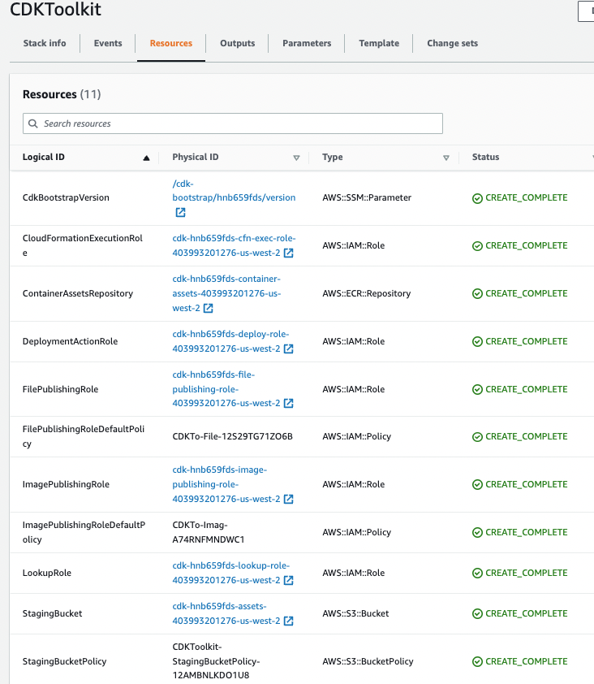

# [Cloud Development Kit - CDK](https://docs.aws.amazon.com/cdk/v2/guide/home.html)

The AWS CDK lets us build reliable, scalable, cost-effective applications in AWS cloud with the different programming languages such as Go, Java, Python, C#, JavaScript, Typescript. 

Build with high-level constructs to define any AWS resources with less code. The output of an AWS CDK program is an AWS CloudFormation template which can be deployed with the cdk CLI.

### Advantages

* Developers write IaC code in their programming language, with the power of the language to do more complex things than in templates. 
* More flexible than SAM and less complex than CloudFormation templates.
* Custom CDK constructs let developers encode and share security best practices and compliance measures across the enterprise.
* Easier way to create lots of similar resources.
* Ability to abstract truly boilerplate stuff like a VPC.

### Some caveats

* Multiple programming language means different developer groups will use different CDK implementation, leading to governance issues. In most enterprise it is not that relevant, and teams are still quite isolated and applying agile manifesto, use the tools they are more confortable to be efficient.
* CDK abstraction level is may be too high and we have to learn by increment to clearly understand what each construct is really building as AWS resources. 
* It's easy to create a mess of resources without understanding the underlying purpose or intent.
* With groups with clear separation between Ops and Dev teams, then SREs may not be able to support CDK apps.
* A framework like SAM dictates how to do configuration, CDK libraries gives us contructs to work with.
* Code and infrastructure code orgranization is a challenge and need strong practices to avoid not understanding what is what and what the deployment does. Often CloudFormation or SAM are better to understand.
* At some point, we need to learn CloudFormation fundamentals, as when the If deployment fails, we have to go at the CloudFormation level.

## Install

The CDK cli is packaged as nodejs app. To install it:

```sh
npm install -g aws-cdk 
```

A docker file exists under the `labs` folder to get an environment with nodes, python 3.9, AWS CLI, CDK CLI...

```sh
# build the docker
docker build -t jbcodeforce/aws-python .
# Start the env
./startPythonDocker.sh
# verify installation
aws s3 ls
cdk --version
# In app folder and where the cdk.json file is, do
cdk synth
```

## Concepts

A CDK app defines one or more Stacks (= CloudFormation stack). A Stack includes a set of Constructs. Each Construct defines one or more concrete AWS resources.

Constructs, Stacks and apps, are represented as classes (types) in the selected programming language. We instantiate constructs within a Stack to declare them to AWS, and connect them to each other using well-defined interfaces. CDK includes a collection of constructs called the [AWS Construct Python Library - V2](https://docs.aws.amazon.com/cdk/api/v2/python/index.html) and a [Construct hub](https://constructs.dev/) to share them.

Here is an example of constructs defined in a Python class constructor for a lambda function and an API Gateway:

```python
from aws_cdk import (Stack,aws_lambda,aws_apigw)

class MyLambdaStack(Stack):
    def __init__(self, scope: Construct, construct_id: str, **kwargs) -> None:
        super().__init__(scope, construct_id, **kwargs)
        my_lambda = aws_lambda.Function(self, 'HelloHandler',
            runtime=aws_lambda.Runtime.PYTHON_3_9,
            code=aws_lambda.Code.from_asset('lambda'),
            handler='hello.handler',
        )

        aws_apigw.LambdaRestApi(
            self, 'Endpoint',
            handler=my_lambda,
        )
```

There are 3 level of Constructs (L1 matches to cloud formation resources, L2 is higher level abstration of AWS resources, while L3 are patterns like APIGateway, or ALB for Fargate). 

The AWS CDK Toolkit is a command line tool for interacting with CDK apps. Need to be in the folder of the `cdk.json` file to run it.

```sh
cdk --version
# Get the CloudFormation template
cdk ls
```

The first time we deploy an AWS CDK app into an environment (account/region), we’ll need to install a “bootstrap stack”. This stack includes resources that are needed for the toolkit’s operation. It requires dedicated Amazon S3 buckets to store template and assets. 



CDK applications should be organized into logical units, such as API, database, and monitoring resources, and optionally have a pipeline for automated deployments

For an application with multiple components/microservices, it is possible to organize different stacks, one per component for example, and then link them with a single app. See example in [CDK project template](https://github.com/jbcodeforce/aws-cdk-project-templates) or [Autonomous Car Ride Solution]()

When packages begin to be used in multiple applications, move them to their own repository. This way, the packages can be referenced by application build systems that use them, and they can also be updated on cadences independent of the application lifecycles.

* See [CDK workshops](https://cdkworkshop.com/).
* The [CDK for Python API](https://docs.aws.amazon.com/cdk/api/v2/python/index.html).

## CDK Python for an EC2

* Summary of the actions to jumpstart a CDK sample app in python

```shell
# Create a python CDK project under a new created folder. The name of the folder defines the name of the app.
# It uses the sample-app template. If template is not specified the stack will have only constructor
cdk init sample-app --language python
# cdk init --language python 
# create virtual env
python3 -m venv .venv
# Active the virtual env
source .venv/bin/activate
# Install dependencies
pip install -r requirements.txt
```

* Then develop the CDK class to define the configuration needed, like in the following code: a simple EC2 instance with code define in user data script to prepare a web server based on nginx:

```python
from aws_cdk import (
    Stack,
    aws_ec2 as ec2)

amzn_linux = ec2.MachineImage.latest_amazon_linux(
    generation=ec2.AmazonLinuxGeneration.AMAZON_LINUX_2,
    edition=ec2.AmazonLinuxEdition.STANDARD,
    virtualization=ec2.AmazonLinuxVirt.HVM,
    storage=ec2.AmazonLinuxStorage.GENERAL_PURPOSE
)
with open("./user_data/user_data.sh") as f:
    user_data = f.read()

class Ec2Stack(Stack):
    self.instance = ec2.Instance(self, "myHttpdEC2",
                                instance_type=ec2.InstanceType("t2.micro"),
                                instance_name="mySimpleHTTPserver",
                                machine_image=amzn_linux,
                                user_data=ec2.UserData.custom(user_data),
                                )
```

See more [information on the EC2 Instance API](https://docs.aws.amazon.com/cdk/api/v2/python/aws_cdk.aws_ec2/Instance.html).

* Run the cloud formation template generation and then deploy it to the account / region

```sh
# Synthesize the Cloud Formation template 
cdk synth
# The first time bootstrap the stack - which will create a CF CDKToolkit
cdk bootstrap
# or using account and region
cdk bootstrap aws://4....../us-west-2
# Deploy the stack
cdk deploy
# Update the code and do a partial (hotswappable) deployment
cdk deploy --hotswap
# Set name for the context
dk deploy  --context s3bucketname=<the name of the s3 bucket> --all
```

* Then go to the CloudFormation console and look at the deployed stack, and resources.


### Some personal examples

See the [labs/cdk](https://github.com/jbcodeforce/aws-studies/tree/main/labs/cdk) folder for some examples of CDK stack definitions: 

| Folder | Description |
| --- | --- |
| [labs/cdk/ec2-basic](https://github.com/jbcodeforce/aws-studies/tree/main/labs/cdk/ec2-vpc) | EC2 with http server, and security group for inbound traffic deployed on default VPC |
| [labs/cdk/ec2-vpc](https://github.com/jbcodeforce/aws-studies/tree/main/labs/cdk/ec2-vpc) | EC2 with VPC and public & private subnets, NAT, IGW, Bastion Host |
| [labs/cloud9](https://github.com/jbcodeforce/aws-studies/tree/main/labs/cloud9) for a cloud9 environment for a specific VPC
| [labs/cdk/cdk_workhop](https://github.com/jbcodeforce/aws-studies/tree/main/labs/cdk/cdk_workshop) | Lambda functions in python with an API gateway and TableViewer.|
| [lab ECS fargate Flask App](https://github.com/jbcodeforce/aws-studies/tree/main/labs/cdk/ecs-fargate-flask) | VPC with ECS fargate for a Flask APP where container is created during deployment | 
| [lab EKS](https://github.com/jbcodeforce/aws-studies/tree/main/labs/eks/eks-cdk/) | VPC with EKS cluster deployment | 
| [cdk with lambda and API gateway](https://github.com/jbcodeforce/big-data-tenant-analytics/tree/main/setup/apigw-lambda-cdk) | Python lambda + API gateway |
| [Lambda java cdk](https://github.com/jbcodeforce/aws-studies/tree/main/labs/lambdas/java-sample/setup) | | 
| [AWS CDK my project template](https://github.com/jbcodeforce/aws-cdk-project-templates) | A template project to organize java deployment on ECR with CDK infrastructure. |
| AWS [resiliency studies](https://github.com/jbcodeforce/aws-resiliency-studies) | With VPC, ELB, ASG, EC2 |
| [ec2-vpce-s3](https://github.com/jbcodeforce/aws-studies/tree/main/labs/networking/ec2-vpce-s3) to map the connection [debug use case](../infra/networking.md/#vpc-endpoint-policies) | EC2 to VPC gateway endpoint to S3 bucket | 

## Useful CDK commands

 * `cdk ls`          list all stacks in the app
 * `cdk synth`       emits the synthesized CloudFormation template
 * `cdk deploy`      deploy this stack to the default AWS account/region
 * `cdk diff`        compare deployed stack with current state
 * `cdk docs`        open CDK documentation
 * `cdk watch`       monitors the code and assets for changes and attempts to perform a deployment automatically when a change is detected
 * `cdk destroy`    remove all the resources/stacks. Most resources will get deleted upon stack deletion. CloudWatch logs that are permanently retained

## [CDK Blueprint for EKS](https://aws.github.io/aws-eks-best-practices/)

* [Blog introduction EKS blueprint](https://aws.amazon.com/blogs/containers/bootstrapping-clusters-with-eks-blueprints/)
* [AWS CDK EKS blueprint git repo](https://aws-quickstart.github.io/cdk-eks-blueprints/)


## Some how-tos

???- "Create a role for an EC2 instance to access S3"

    ```python
    role = iam.Role(self, "Role",
                assumed_by=iam.ServicePrincipal("ec2.amazonaws.com"))
        role.add_managed_policy(iam.ManagedPolicy.from_aws_managed_policy_name("AmazonS3FullAccess"))
    ```

???- "Create EC2 in public subnet"
    With an instance profile role, defined from a previous declaration:
    ```python
    self.instance = ec2.Instance(self, "myHttpdEC2",
                                instance_type= ec2.InstanceType("t2.micro"),
                                instance_name="mySimpleHTTPserver",
                                machine_image=amzn_linux,
                                vpc=self.vpc,
                                role=role,
                                key_name=key_name,
                                vpc_subnets=ec2.SubnetSelection(subnet_type=ec2.SubnetType.PUBLIC),
                                security_group=self.ec2_security_group,
                                user_data=ec2.UserData.custom(user_data),
                                )
    ```

???- "Declare RDS postgresql with secrets"
    The following python CDK code declares a Postgresql DB in a private subnet within a VPC created before. The access is public. CDK will create a secret in AWS Secret manager.

    ```python
     self.postgres = aws_rds.DatabaseInstance(self, "PostgresqlInstance",
                                database_name="tenantdb",
                                engine=aws_rds.DatabaseInstanceEngine.postgres(version=aws_rds.PostgresEngineVersion.VER_14_5),
                                vpc_subnets=aws_ec2.SubnetSelection(subnet_type=aws_ec2.SubnetType.PRIVATE_WITH_EGRESS),
                                vpc=self.vpc,
                                port=5432,
                                removal_policy=RemovalPolicy.DESTROY,
                                deletion_protection=False,
                                max_allocated_storage=200,
                                publicly_accessible=True
                        )
    ```

???- "Create a user with a policy"
    [Python user class](https://docs.aws.amazon.com/cdk/api/v2/python/aws_cdk.aws_iam/CfnUser.html). Use password so user can access console and use API. 

    ```python
        user = iam.User(self,
                        "ecruser",
                        user_name="ecruser",
                        password=SecretValue.unsafe_plain_text("T0ch@ngefordemo")
                        )
        user.attach_inline_policy(policy)
        # or 
        user.add_managed_policy(policy)
    ```

    See [this cdk for the abac tutorials](https://github.com/jbcodeforce/aws-studies/tree/main/labs/security/iam/abac)


???- "Create IAM policy"
    See [Policy class](https://docs.aws.amazon.com/cdk/api/v2/python/aws_cdk.aws_iam/Policy.html). Force to true to get the policy being created as managed policy.

    ```python
    policy = iam.Policy(self,"ecr-auth-token-policy",
                statements= [
                    iam.PolicyStatement(
                        actions= ["ecr:GetAuthorizationToken"],
                        resources=["*"],
                        conditions=[{}],
                    )],
                policy_name="ecr-auth-token-policy",
                force= True   
        )
    ```

???- "Get existing VPC reference"
    ```python
        # Retrieve default VPC information
        self.vpc = aws_ec2.Vpc.from_lookup(self, "VPC",
            is_default=True
        )
    ```

    For other VPC change is_default to False and provide the vpcName.
    ```python
    # get the vpc-id from parameter store
    vpc_id = ssm.StringParameter.value_from_lookup(self, "/vpc-id")

    # get the Vpc from the id
    vpc = ec2.Vpc.from_lookup(self, "vpc", vpc_id=vpc_id)

    # get the subnets in AZ a from the vpc
    subnets_in_az_a = vpc.select_subnets(availability_zones=["ap-southeast-2a"])

    # create AZ lookup
    az_lookup = {}

    # iterate over the AZ a subnets 
    for subnet in subnets_in_az_a.subnets:
        az_lookup[subnet.subnet_id] = subnet.availability_zone

    # iterate over the public subnets 
    for subnet in vpc.public_subnets: 
        az_lookup[subnet.subnet_id] = subnet.availability_zone

    # fetch the isolated subnets list from parameter store
    iso_subnet_ids = ssm.StringParameter.value_from_lookup(self, "/iso-subnets").split(",")

    #create an list to store the subnets in
    iso_subnets = []

    # iterate over the subnet ids and create the full Subnet object includeing AZ
    iso_count = 1
    for subnet_id in iso_subnet_ids:
        iso_subnets.append(
            ec2.Subnet.from_subnet_attributes(
                self,
                "IsoSub" + str(iso_count),
                subnet_id=subnet_id,
                availability_zone=az_lookup[subnet_id],
            )
        )
        iso_count += 1
    ```

    We can also use boto3 and then get VPC by name:
    ```python
    client = boto3.client('ec2',region_name='us-east-1')
        response = client.describe_vpcs(
                        Filters=[{
                            'Name': 'tag:Name',
                            'Values': [
                                vpc_name
                            ]
                        }]
                    )
        if len(response['Vpcs']) > 0:
            vpc=response['Vpcs'][0]
        else:
            vpc= None
        return vpc
    ```

???- "Inject Database URL and admin password as env variable"
    First there is those [excellent PyPI examples for RDS instance](https://pypi.org/project/aws-cdk.aws-rds/) creation. Then when using TaskImageOptions from the ecs_patterns library there is an `environment` element.
    ```python
    task_image_options=aws_ecs_patterns.ApplicationLoadBalancedTaskImageOptions(
                image=ecs.ContainerImage.from_registry(str(self.account) 
                                                    + ".dkr.ecr."
                                                    + str(self.region)
                                                    + ".amazonaws.com/acr-car-ride-mgr"),
                environment = {
                    "QUARKUS_DATASOURCES_JDBC_URL" : "jdbc:postgresql://" + str(dbCarRides.db_instance_endpoint_address),
                    
                },
                task_role = taskRole
            )
    ```
    The database `Credentials.from_generated_secret` function creates a `Secret` in `SecretManager`, with the name `rds-secret`:
    ```python
         credentials=rds.Credentials.from_generated_secret("postgres",secret_name="rds-secret"),                                     
    ```

???- "Unit [testing a stack](https://docs.aws.amazon.com/cdk/v2/guide/testing.html)"
    Uses the AWS CDK's [assertions](https://docs.aws.amazon.com/cdk/api/v2/docs/aws-cdk-lib.assertions-readme.html) module, to validate "this resource has this property with this value."
    ```sh
    python -m pip install -r requirements-dev.txt
    python -m pytest
    ```

???- "Another example of passing a shell script as EC2 user data"
    ```python
    data = open("./VPCstack/user_data.sh", "rb").read()
    userData=ec2.UserData.for_linux()
    userData.add_commands(str(data,'utf-8'))
    ```
    
    [See VPC stack and bastion host.](https://github.com/jbcodeforce/MSK-labs/blob/main/infrastructure/VPCstack/vpc_stack.py)

???- "Create a lambda with an API gateway"
    Create a folder, `api/runtime`, to include the python code for the lambda: `get_image.py`, function `lambda_handler`: 
    ```python
    # import
        aws_lambda as lambda_,
        aws_apigateway as apigw,

    myLambda = lambda_.Function(self,
                    "GetImageFunction",
                    runtime= lambda_.Runtime.PYTHON_3_10,
                    code=lambda_.Code.from_asset('api/runtime'),
                    handler='get_image.lambda_handler',
                    environment={
                        'BUCKET_NAME': s3Bucket.bucket_name,
                    })
    ```

    Add API Gateway with a POST:
    
    ```python
    apiGtw = apigw.RestApi(self, "CWdemoApi",
                            rest_api_name="CWDemoApi",
                           )
    images = apiGtw.root.add_resource('images')
    images.add_method('POST',  apigw.LambdaIntegration(getImageFct))
    ```
    See [code whisperer demo](https://github.com/jbcodeforce/aws-studies/tree/main/labs/code-whisperer-demo)

???- "Create a bastion from a custom AMI (Java 17, maven, docker)"
    See the VPCstack definition in [aws-cdk-project template](https://github.com/jbcodeforce/aws-cdk-project-templates/blob/main/VPCstack/vpc_stack.py).
    Attention bastion does not have role

???- "Access env account from stack"
    ```python
    self.account
    self.region
    ```

???- "Add VPCFlow to a VPC"
    ```python
    from aws_cdk import aws_logs as logs
    
    cwLogs = logs.LogGroup(self, '/aws/vpc/flowlogs')
    self.vpc.add_flow_log("flowlogs",destination=ec2.FlowLogDestination.to_cloud_watch_logs(cwLogs),
                              traftraffic_type=ec2.FlowLogTrafficType.ALL)
    ```

???- "Passing context variables"
    The call to deploy pass the information to the context:
    
    ```sh
    dk deploy  --context s3bucketname=<the name of the s3 bucket> --all
    ```

    And in the stack definition:
    
    ```python
    s3_bucket_name=self.node.try_get_context("s3bucketname")
    ```

## Other tools - samples

* [CDK API v2 for Python](https://docs.aws.amazon.com/cdk/api/v2/python/)
* [Pypi.org search](https://pypi.org/search/?q=aws-cdk) needed when using alpha or beta libraries.
* [CDK Patterns](https://cdkpatterns.com/patterns)
* [cdk-dynamo-table-viewer](https://pypi.org/project/cdk-dynamo-table-view/) An AWS CDK construct which exposes a public HTTP endpoint which displays an HTML page with the contents of a DynamoDB table defined in the stack.
* [AWS CDK samples in Python](https://github.com/aws-samples/aws-cdk-examples/tree/master/python)
* [Constructs HUB](https://constructs.dev/)
* [A Flask app for orders management with DynamoDB as persistence - ECR - CDK](https://github.com/jbcodeforce/python-code/tree/master/aws/dynamoDB)
* [Big Data SaaS demo](https://github.com/jbcodeforce/big-data-tenant-analytics/tree/main/setup)
* [AWS CDK labs](https://github.com/cdklabs)