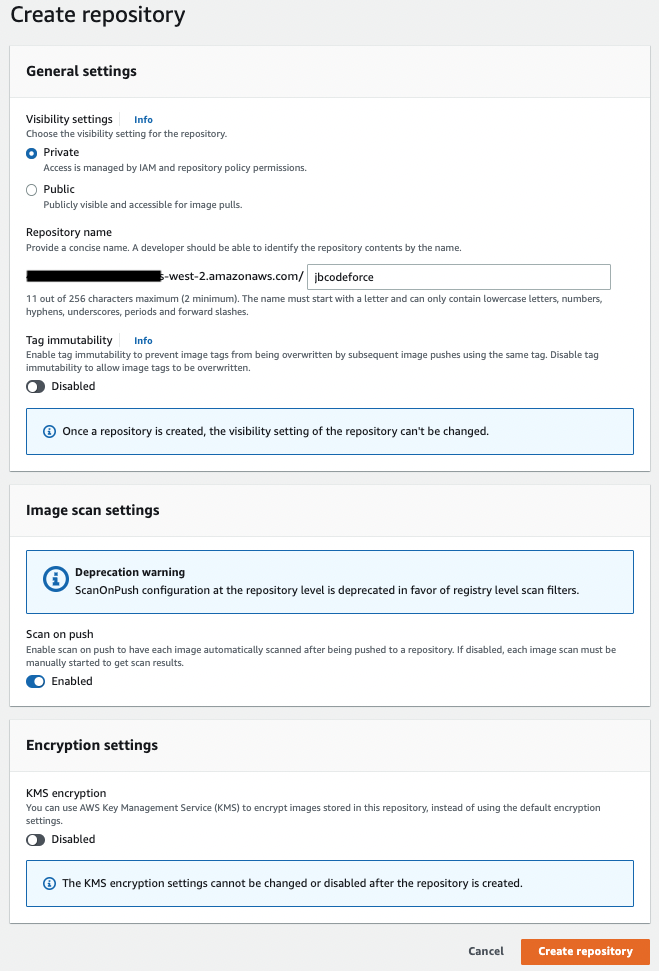
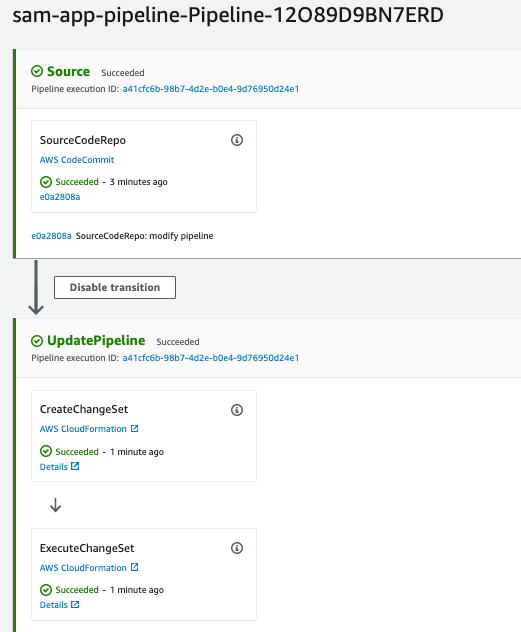
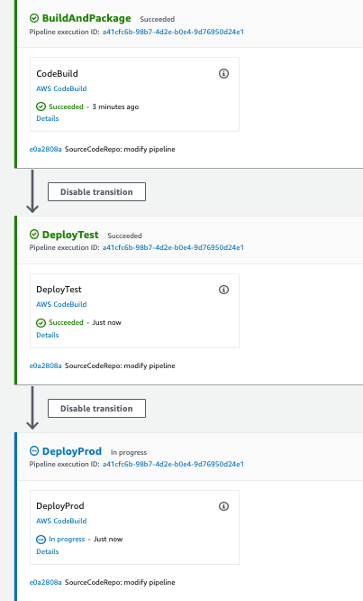
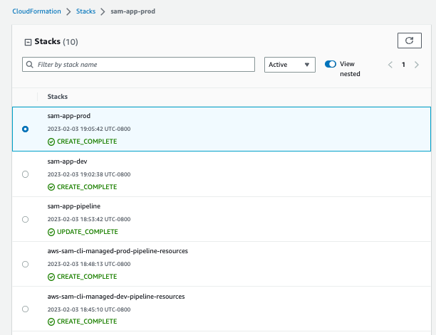

# Coding practices

!!!- info "Update"
    Created 09/20/2022 - Updated 05/03/2024

## How to reduce the cost as much as possible

* Using aws CLI can be done from own computer, using access key. But keys are on computer vias the `aws configure` so risky. The alternate is to use CloudShell
* CloudShell is free 
* Try to do cloud formation stack, CDK or SAM and then destroy resources once proof of concept is done.
* EC2 try to use the configuration best fitted for your need
* When using Cloud9, we pay for the EC2 we used to edit code.
* Sagemaker is very expensive

## AWS CLI common commands

We can access AWS using the CLI or the SDK which both use access keys generated from the console (> Users > jerome > Security credentials > Access Keys).

The keys are saved in `~/.aws/credentials` in different profile:

* A named profile is a collection of settings and credentials that we can apply to a AWS CLI command. When you specify a profile to run a command, the settings and credentials are used to run that command.
* Installation: [aws cli](https://aws.amazon.com/cli/)
* The cli needs to be configured: `aws configure` with the access key ID, and secret, and region to access. Use IAM user to get a new credentials key. The credentials and API key are in `~/.aws/credentials` in default profile. 
* We can use profile to change user

Test with some commands:

```sh
aws --version
# get your users
aws iam list-users
# For a given profile
aws iam list-users --profile hackaton
```

* [VPC scenario with CLI - Tutorial](https://docs.aws.amazon.com/vpc/latest/userguide/VPC_Scenarios-cli.html)
* [Use CloudShell in west-2 region for using aws cli](https://us-west-2.console.aws.amazon.com/cloudshell)
* [aws-shell](https://github.com/awslabs/aws-shell) is also available to facilitate the user experience using a laptop terminal console.


When using CLI in a EC2 instance, always use an IAM role to control security credentials. This role may come with a policy authorizing exactly what the EC2 instance should be able to do. 

Also within a EC2 instance, it is possible to use the URL http://169.254.169.254/latest/meta-data to get information about the EC2. We can retrieve the IAM Role name from that metadata.

## [SDK](https://aws.amazon.com/developer/tools/)

Supports different programming languages to integrate with a lot of AWS managed services from any business application. 

The [Python AWS SDK is boto3](https://aws.amazon.com/sdk-for-python/), with [product doc](https://boto3.amazonaws.com/v1/documentation/api/latest/index.html).

### Installation

```sh
pip install boto3[crt]
```

Set up authentication credentials for your AWS account using either the IAM Console or the AWS CLI.

```sh
aws configure
# Verify access
aws iam list-users
```

## [LocalStack](https://docs.localstack.cloud/overview/)

LocalStack is a container to get started with developing and testing AWS cloud & serverless applications locally. It uses:

* A docker container to support the AWS services API (it supports even CloudFormation)
* an `awslocal` CLI to do the same actions as `aws` CLI but to the localstack.

There are a lot of tutorials available [from this web site](https://docs.localstack.cloud/tutorials/) see also [my example for secret access](https://github.com/jbcodeforce/yarfba/tree/main/labs/security/secrets-game) from Quarkus app and [this docker compose file](https://github.com/jbcodeforce/yarfba/blob/main/labs/security/secrets-game/app/docker-compose.yaml) to start the local stack.

Quarkus dev mode is using LocalStack as soon as the AWS SDK library is added to the `pom.xml`.


## [DevOps](https://aws.amazon.com/devops/)

## [CloudFormation](./cloudFormation.md)

See [separate note](./cloudFormation.md).

## [App 2 container](https://docs.aws.amazon.com/app2container/latest/UserGuide/start-intro.html)

AWS App2Container is a tool that helps you break down the work of moving your applications into containers, and configuring them to be hosted in AWS using the Amazon ECS, Amazon EKS, or App Runner container management services.

## [CodeCommit](https://docs.aws.amazon.com/codecommit/)

Version control fully managed service to manage Git repositories. HA, secured, encryption at rest and in transit. 

Be sure to get the Git Credentials for the IAM user we will use to do the Git repository actions. 

* [Setup SSH connection to CodeCommit](https://docs.aws.amazon.com/codecommit/latest/userguide/setting-up-ssh-unixes.html)

* Create a repository (for the sam-app created below)

    ```sh
    aws codecommit create-repository --repository-name sam-app
    ```

* If not installed yet, get git-remote-codecommit

    ```sh
    pip install git-remote-codecommit
    ```

* Add origin and git in current folder

    ```sh
    git init -n main
    git remote add origin codecommit://sam-app
    # Example of build content not to push
    echo -e "\n\n.aws-sam" >> .gitignore
    git add .
    git commit -m "first drop"
    git push -u origin main
    ```

## [AWS Elastic Beanstalk](https://docs.aws.amazon.com/elasticbeanstalk/latest/dg/Welcome.html)

With Elastic Beanstalk, developers upload their application. Then, Elastic Beanstalk automatically handles the deployment details of EC2 capacity provisioning, load balancing, auto-scaling, RDS and application health monitoring.

* It is a managed service.
* Use the concept of application, which is a collection of Beanstalk components (environments, versions, configurations).
* Instance configuration and OS is managed by Beanstalk
* Deployment strategy is configurable. It uses [CloudFormation](#cloudformation) to deploy the application and the environment.
* It defines two pre-configured environments:

    * Web Server Tier: classical ELB, Auto scaling group and EC2s.
    * Worker environment with the use of SQS queue.

* Three architecture models:

    * Single instance
    * LB + ASG
    * ASG only, for worker type of application.

* Support blue/green deployment
* A custom AMI can improve provisioning times when instances are launched in our environment if we need to install a lot of software that isn't included in the standard AMIs.
* No charge.

## [Elastic Container Registry](https://docs.aws.amazon.com/ecr/)

AWS managed container image registry service that is secure, scalable, and reliable. 

An Amazon ECR **repository** contains your Docker _images_, Open Container Initiative (OCI) images, and OCI compatible artifacts. One repository per app.



Client must authenticate to Amazon ECR registries as an AWS user before it can push and pull images.

You can control access to your repositories and the images within them with repository policies.

As a developer you need AWS CLI and Docker.

[Pricing](https://aws.amazon.com/ecr/pricing/): pay for the amount of data you store in your repositories and for the data transfer from your image pushes and pulls.  50 GB per month of always-free storage for their public repositories. For private 500MB first year.
Data transfer to services within the same region is free of charge.

### Demonstration

* Create one ECR repository per app or microservice. Use AWS cli or AWS console to create the repository:

```sh
aws ecr help
# Get the authentication token and authenticate the docker client
aws ecr get-login-password --region us-west-2 | docker login --username AWS --password-stdin <ecr-endpoint>.amazonaws.com
# ecr end point is the form accountID.dkr.ecr.regionID.amazonaws.com
# ~/bin/loginECR is the script to use in my env
aws ecr create-repository --repository-name acr-car-ride-mgr
```

* From my Laptop use `docker build` with the ECR URL + repo:tag.

```sh

# Can also use the docker cli, see The View push commands for your repository
docker tag acr-car-ride-mgr:latest <...>us-west-2.amazonaws.com/acr-car-ride-mgr:latest
docker push  <...>.amazonaws.com/acr-car-ride-mgr:latest
```

If you want to run your application using docker engine inside of EC2, create a simple EC2 and then ssh to it and add docker, and do a docker run. Here are the installation you need:

```sh
sudo apt-get update
sudo apt-get install \
    apt-transport-https \
    ca-certificates \
    curl \
    gnupg-agent \
    software-properties-common
curl -fsSL https://download.docker.com/linux/ubuntu/gpg | sudo apt-key add -
sudo apt-get install docker-ce docker-ce-cli containerd.io
apt-cache madison docker-ce
sudo apt-get install docker-ce docker-ce-cli containerd.io
sudo apt install docker.io
```

Then SSH to the EC2 instance and pull the image from ECR, then start the image

```sh
docker pull 
docker run -p 8080:8080 ....
```

## App Runner

To be done

## [Chalice](https://aws.github.io/chalice/index.html)

A python framework to build serverless applications. We can have a REST API deployed to Amazon API Gateway and AWS Lambda in minutes.

[See tutorials for REST APIs, events apps...](https://aws.github.io/chalice/tutorials/index.html)

[Code sample for car ride in aws-cdk-project-templates repo](https://github.com/jbcodeforce/aws-cdk-project-templates/tree/main/app-samples/chalice-rest-api)

## AWS SAM - Serverless Application Model

[See more detailed article](./sam.md).


## [CodePipeline](https://docs.aws.amazon.com/codepipeline/latest/userguide/welcome.html)

AWS CodePipeline is a continuous delivery service.

* [Getting started](https://docs.aws.amazon.com/codepipeline/latest/userguide/welcome.html#welcome-get-started)
* Pricing 1$ / month per pipeline. All pipelines are free for the first 30 days.

### SAM build CodePipeline

* Create a CodePipeline with SAM CLI

    ```sh
    sam pipeline init --bootstrap
    # Select the different account, region and default values
    ```

    *The CloudFormation templates create all the required resources for dev and prod environments*

Now that AWS SAM has created supporting **resources**, we'll continue to create a CloudFormation template that will define our entire CI/CD pipeline.

* Define the pipeline as a new cloudformation template (after git push):

    ```sh
    sam deploy -t codepipeline.yaml --stack-name sam-app-pipeline --capabilities=CAPABILITY_IAM
    ```

    

    During the Deploy steps, cloudFormation stacks are built for each environments:

    

    Once the deployment steps are done the two new cloudformation stacks are executed

    

* Get URL endpoint of the two APIs deployed:

    ```sh
    export DEV_ENDPOINT=$(aws cloudformation describe-stacks --stack-name sam-app-dev | jq -r '.Stacks[].Outputs[].OutputValue | select(startswith("https://"))')
    curl -s $DEV_ENDPOINT
    export PROD_ENDPOINT=$(aws cloudformation describe-stacks --stack-name sam-app-prod | jq -r '.Stacks[].Outputs[].OutputValue | select(startswith("https://"))')
    curl -s $PROD_ENDPOINT
    ```

## [CodeBuild](https://docs.aws.amazon.com/codepipeline/latest/userguide/action-reference-CodeBuild.html)

AWS CodeBuild is a fully managed build service that compiles source code, runs tests, and produces software packages that are ready to deploy.

## [CodeDeploy](https://docs.aws.amazon.com/codedeploy/latest/userguide/welcome.html)

The key concepts to keep in mind are:

* **Application**: tells AWS CodeDeploy what to deploy and how to deploy it. For AWS Lambda application specifies a new version of a Lambda function and how to shift traffic to it.
* **Deployments**: lists an application's current and past deployments.
* **Deployment groups**: includes details about a target environment, how traffic shifts during a deployment, and monitoring settings.
* **Revisions**: contains a version of the source files to deploy to your instances or specifies the version of a Lambda function to shift traffic to.


## [CodeStar](https://aws.amazon.com/codestar/)

!!! Update 
    Deprecated mid 2024
    
AWS CodeStar provides a unified user interface, enabling us to easily manage our software development activities in one place.

To start a project, we can choose from a variety of AWS CodeStar templates for Amazon EC2, AWS Lambda, and AWS Elastic Beanstalk. We have the option to choose AWS CodeCommit or GitHub to use as the project’s source control.

There is no additional charge for AWS CodeStar.

* [Getting started](https://docs.aws.amazon.com/codestar/latest/userguide/getting-started-topnode.html)
* [Product documentation](https://docs.aws.amazon.com/codestar/)

## [Application Composer](https://docs.aws.amazon.com/application-composer/)

Visual designer to develop serverless app, with infrastructure as code CloudFormation templates, following AWS best practices. [Product doc](https://docs.aws.amazon.com/application-composer/latest/dg/what-is-composer.html).

* Can load an exiting CF templates.
* Can be synch with local work on VSCode IDE: AWS SAM templates are automatically saved to your local machine, making deployment a faster and more seamless experience.
* Deploy with SAM

Benefits: designing **what** we want to accomplish and let Application Composer build **how** it is accomplished.

## [AWS Proton](https://docs.aws.amazon.com/proton/latest/userguide/Welcome.html)

Automated infrastructure as code provisioning and deployment of serverless and container-based applications. It uses the concepts of environment templates (defines shared infrastructure used by multiple applications) and service templates (one application in the env).


## [AWS Amplify](https://docs.aws.amazon.com/amplify/latest/userguide/welcome.html)

AWS Amplify is a set of purpose-built tools and features that enables frontend web and mobile developers to quickly and easily build full-stack applications on AWS.

* installation and configuration

```sh
npm i -g @aws-amplify/cli
# do a configure like aws configure
amplify configure
```

See [also git doc](https://docs.amplify.aws/start/q/integration/vue/).

## [Amazon CodeWhisperer](https://aws.amazon.com/codewhisperer/)

Amazon CodeWhisperer offers developers a new and seamless way to build applications responsibly on AWS, with strong focus on automated enterprise security, through vulnerability scans and remediation recommendations and code compliance, to built-in code reference tracker and license attribution recommendations.

* Part of the Code AI tool like CodeGuru and DevOps Guru.
* Personas: data analyst (SQL, ETL), software engineer, cloud engineer (IaC, CDK), data scientist (inside SageMaker and Jupyter notebook, get rid of finding plumbing code), SecOps
* Trained on billions of open source projects and Amazon app lines of code, samples. 
* Reduce rewriting same type of code. Stop the infernal loop, search google or stack overflow to get the relevant answer to our question.
* It can flag or filter code suggestions that resemble open-source training data.
* Support AWS services APIs.
* Run in Lambda editor, and Cloud9
* IDE Context automatically sent to CodeWhisperer service to get code suggestions in real-time. 
* It is doing reference tracking.
* 57% productivity improvement. 
* Improve application security with scanning capability, detecting and fixing hard to find code vulnerabilities.
* Enterprise or free packaging: integrated with IAM Identity Center.
* Support cross-file context for Java. 

### Demo scripts

???+ info "Installation"
    In the IDE like VScode, install the [AWS Toolkit](https://docs.aws.amazon.com/toolkit-for-vscode/latest/userguide/welcome.html). Then choose the authentication method, and set up [our Builder ID](https://docs.aws.amazon.com/toolkit-for-vscode/latest/userguide/builder-id.html), IAM Identity Center, or IAM credential.

???+ info "Python app with CDK and lambda demonstration."
    The code is in [labs/code-whisperer-demo](https://github.com/jbcodeforce/yarfba/tree/main/labs/code-whisperer-demo) with a readme to demonstrate the code generation capability.

### CodeWhisperer resources:

* [Product documentation.](https://docs.aws.amazon.com/codewhisperer/latest/userguide/what-is-cwspr.html)
* [Amazon CodeWhisperer Overview - Video.](https://www.youtube.com/watch?v=j8BoVmHKFlI)
* [Build a Python Event-driven Serverless App with Amazon CodeWhisperer - Video.](https://www.youtube.com/watch?v=8vkHLnhIFGA) the labs/code-whisperer-demo includes the code for this demo.
* [Optimize software development with Amazon CodeWhisperer.](https://aws-blogs-prod.amazon.com/devops/optimize-software-development-with-amazon-codewhisperer/)
* [Short cuts for use actions](https://docs.aws.amazon.com/codewhisperer/latest/userguide/actions-and-shortcuts.html)
* [FAQs](https://aws.amazon.com/codewhisperer/faqs/).
* [10 ways to build applications faster with Amazon CodeWhisperer.](https://aws.amazon.com/blogs/devops/10-ways-to-build-applications-faster-with-amazon-codewhisperer/)

## Other resources

* [Open Web App security project, secure coding practices](https://owasp.org/www-pdf-archive/OWASP_SCP_Quick_Reference_Guide_v2.pdf)