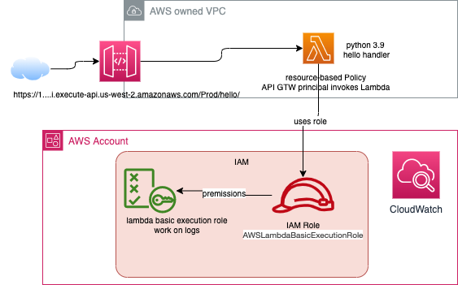

# [AWS SAM - Serverless Application Model](https://docs.aws.amazon.com/serverless-application-model/latest/developerguide/what-is-sam.html)

AWS SAM is an extension of AWS CloudFormation with a simpler syntax for configuring common serverless application resources such as functions, triggers, databases and APIs.

[SAM CLI](https://github.com/aws/aws-sam-cli) is an open-source. Better to use within Cloud9 environment and [install sam CLI](https://docs.aws.amazon.com/serverless-application-model/latest/developerguide/serverless-sam-cli-install.html).

SAM includes two parts:

1. SAM template specification: It is an extension on top of AWS CloudFormation.
1. A CLI to create new project, build and deploy, perform local debugging and testing, configure pipeline.

Here is an example of definition of a serverless app including: AWS Lambda, API gateway with HTTP api, database in DynamoDB and then IAM permissions for those services to work together.

```yaml
AWSTemplateFormatVersion: 2010-09-09
Transform: AWS::Serverless-2016-10-31
Resources:
  getAllItemsFunction:
    Type: AWS::Serverless::Function
    Properties:
        Handler: src/get-all-items.getAllItemsHandler
        Runtime: nodejs12.x
        Events:
            Api:
            Type: HttpApi
            Properties:
                Path: /
                Method: GET
        Connectors:
        MyConn:
            Properties:
            Destination:
            Id: SampleTable
            Permissions:
                - Read
    SampleTable:
        Type: AWS::Serverless::SimpleTable
```

During deployment, SAM transforms and expands the SAM syntax into AWS CloudFormation syntax.

See [SAM templates here](https://github.com/aws/aws-sam-cli-app-templates)

## Value propositions

* Define the application infrastructure code as quickly, using less code.
* Manage the serverless applications through their entire development lifecycle.
* Quickly provision permissions between resources with AWS SAM connectors.
* Continuously sync local changes to the cloud as we develop.
* On top of CloudFormation or Terraform.

## [Getting started](https://docs.aws.amazon.com/serverless-application-model/latest/developerguide/serverless-getting-started-hello-world.html)

SAM CLI provides a Lambda-like execution environment that lets you locally build, test, and debug applications defined by SAM templates or through the AWS Cloud Development Kit (CDK).

* [Install](https://docs.aws.amazon.com/serverless-application-model/latest/developerguide/serverless-sam-cli-install-mac.html), which can be summarized as:

```sh
brew install aws-sam-cli
# or upgrade
brew upgrade aws-sam-cli
sam --version
```

* [Serverlessland pattern collection.](https://serverlessland.com/patterns?framework=SAM)
* [A Complete SAM Workshop.](https://catalog.workshops.aws/complete-aws-sam/en-US)
* [Java samples with SAM CLI.](https://github.com/aws-samples/aws-sam-cli-java-examples)

### Summary of application development with SAM

The diagram below presents the classical app components that can be created with SAM:



The following steps presents how to get a Lambda in Python exposed with API in API Gateway.

* Create a SAM project

    ```sh
    # Create a new function using interactive mode:
    sam init
    # or using parameters: Xray tracing, CloudWatch insights, python
    sam init --name sam-app --runtime python3.9 --architecture arm64 --app-template hello-world --tracing --application-insights 
    # or using powertool so we have metrics, logging, tracing
    sam init --app-template hello-world-powertools-python --name carridegenerator --package-type Zip --runtime python3.9 --no-tracing
    ```

    *See the code templates in the [git repo](https://github.com/aws/aws-sam-cli-app-templates)*.

* When using container *Image* as the packaging mechanism, we need to login to ECR repo via:

    ```sh
    aws ecr-public get-login-password --region us-east-1 | docker login --username AWS --password-stdin public.ecr.aws
    ```

* Run locally - Any code update will be refreshed. First call may take sometime to download docker image. It needs docker engine to run locally. (finch is not supported yet)

    ```sh
    # a python app:
    cd sam-app/hello_world
    pip3 install -r requirements.txt

    cd ..
    sam local invoke
    # test with input event
    sam local invoke HelloWorldFunction --event events/event.json
    # Emulate API on port 8080
    sam local start-api --port 8080
    curl http://localhost:8080/hello
    ```

* Run unit tests

    ```sh
    # under sam-app
    pip3 install pytest pytest-mock
    python3 -m pytest tests/unit
    ```

* Build the packaging for AWS

    ```sh
    # under sam-app
    sam build
    # see .aws-sam folder
    # Build with Image on Mac
    DOCKER_HOST=unix://$HOME/.docker/run/docker.sock sam build --use-container
    # Build on linux
    sam build --use-container
    ```

* Deploy (be sure to get aws cli 'configured' with access key and secret). It is creating the resources (Lambda function, API Gateway and IAM roles)

    ```sh
    # under sam-app
    sam deploy --guided
    ```

    *The code is zipped and uploaded to a s3 bucket: `aws-sam-cli-managed-default-samclisourcebucket-...`*

    ```sh
    # deploy with parameters
    export AWS_REGION=$(aws --profile default configure get region)
    sam deploy \
        --stack-name wild-rydes-async-msg-1 \
        --capabilities CAPABILITY_IAM \
        --region $AWS_REGION \
        --guided
    ```

    ???- info "Deployment Output"
        A cloud formation template is created which includes Role, and API Gateway so the Lambda is accessible via REST API.
        ```sh
        CloudFormation stack changeset
        ----------------------------------------------------------------------------------------------------------------------------
        Operation                                    LogicalResourceId                            ResourceType                                                                 
        ----------------------------------------------------------------------------------------------------------------------------
        + Add                                        ApplicationInsightsMonitoring                AWS::ApplicationInsights::Application                                               
        + Add                                        ApplicationResourceGroup                     AWS::ResourceGroups::Group                   
        + Add                                        HelloWorldFunctionHelloWorldPermissionProd   AWS::Lambda::Permission                                                           
        + Add                                        HelloWorldFunctionRole                       AWS::IAM::Role                                                                     
        + Add                                        HelloWorldFunction                           AWS::Lambda::Function                                                               
        + Add                                        ServerlessRestApiDeployment47fc2d5f9d        AWS::ApiGateway::Deployment                                                        
        + Add                                        ServerlessRestApiProdStage                   AWS::ApiGateway::Stage                                                            
        + Add                                        ServerlessRestApi                            AWS::ApiGateway::RestApi                                                           
        -------------------------------------------------------------------------------------------------------------------------
        ```

* [Optional] We can continuously synchronize local change to the cloud:

    ```sh
    # look at all changes
    sam sync --watch
    # look to code only updates
    sam sync --watch --code
    ```

    The `sam sync` command can also synchronize code changes to the cloud without updating the infrastructure. This code synchronization uses the service APIs and bypasses `CloudFormation`, allowing AWS SAM to update the code in seconds instead of minutes.

* To clean up, we have two choices:

    ```sh
    aws cloudformation delete-stack --stack-name sam-app --region us-west-2
    # with sam
    sam delete
    ```


* For building a CodePipeline using `sam cli` see [next section](#sam-pipelines).

### The sam template

For the function section of the template, see the [lambda reference](https://github.com/aws/serverless-application-model/blob/master/versions/2016-10-31.md#awsserverlessfunction).

## SAM Pipelines

AWS SAM Pipelines makes it easier to create CI/CD [pipelines.](https://aws.amazon.com/blogs/compute/introducing-aws-sam-pipelines-automatically-generate-deployment-pipelines-for-serverless-applications/)

* Create a CodeCommit repository with something like (if needed see [codecommit authentication](https://docs.aws.amazon.com/codecommit/latest/userguide/auth-and-access-control.html)):

```sh
aws codecommit create-reposiory --repository-name sam-app
# if needed install python library to access code commit
pip3 install git-remote-codecommit
```

* Be sure to add .aws-sam and samconfig.yaml in .gitignore

```sh
echo -e "\n\n.aws-sam" >> .gitignore
echo -e "samconfig.toml" >> .gitignore
```

* To commit change use remote URL like:

```sh
git remote add origin codecommit://sam-app
```

* Create pipeline resources: 

`sam pipeline init --bootstrap` command creates the AWS resources and permissions required to deploy application artifacts from our code repository into our AWS environments.

An Amazon S3 bucket is required to store application build artifacts during the deployment process. 

Pipelines defines two stages, dev and production.

A `.gitlab-ci.yml` pipeline file is generated. The file contains a number of environment variables, which reference the details from AWS SAM pipeline bootstrap command.

The Cloud Formation template deploy two stacks and all the needed elements for the CI/CD in dev and prod envs. Going to Code Pipeline console to see the create pipeline.

To create a github and git action pipeline see [this doc.](https://catalog.workshops.aws/complete-aws-sam/en-US/module-4-cicd/module-4-cicd-gh).

### Canary deployments

Technique to slowly rolling out the changes to a small subset of users before rolling it out to the entire customer base.

AWS Lambda allows us to publish multiple versions of the same function. Each version has its own code and associated dependencies, as well as its own function settings.

## Useful information

* The [template anatomy documentation](https://docs.aws.amazon.com/serverless-application-model/latest/developerguide/sam-specification-template-anatomy.html) goes over the template structure. A must read.
* [Yaml template elements](https://docs.aws.amazon.com/serverless-application-model/latest/developerguide/sam-specification-template-anatomy.html#template-anatomy-outline.yaml)
* [Resources and property ref](https://docs.aws.amazon.com/serverless-application-model/latest/developerguide/sam-specification-resources-and-properties.html)
* [SAM Workshop](https://catalog.workshops.aws/complete-aws-sam/en-US).
* [Workshop: Serverless Task App with SAM and Amplify](https://catalog.us-east-1.prod.workshops.aws/workshops/841ce16b-9d86-48ac-a3f6-6a1b29f95d2b/) with git repo [serverless-tasks-webapp](https://github.com/aws-samples/serverless-tasks-webapp).

### How to / assessment

???+ question "Difference between SAM template and CloudFormation"
    SAM template is an abstraction above CloudFormation (`Transform: AWS::Serverless-2016-10-31`) but it reuses cloud formation templates for IaC in the "resources" section. It includes a "Global section" to define properties that are common to all your serverless functions and APIs. [Product doc](https://docs.aws.amazon.com/serverless-application-model/latest/developerguide/sam-specification-template-anatomy.html)

???- question "How to create and validate a SAM template?"
    Use CLI: 

    ```sh
    sam init -h
    sam init --runtime python3.9 --dependency-manager pip --app-template hello-world --name sam-app
    sam validate
    ```


???- question "Invoke function locally with SAM CLI"
    ```sh
    sam local invoke -e ./event.json
    ```

???- question "Declare an API Gateway"
    ```yaml
    RestAPI:
    Type: AWS::Serverless::Api
    Properties:
      StageName: Prod
      TracingEnabled: true
      Tags:
        Name: !Sub "${AWS::StackName}-API"
        Stack: !Sub "${AWS::StackName}" 
    ```

???- question "Run API Gateway locally with SAM CLI"
    ```sh
    sam local start-api --port 8080
    ```

???- question "Package and deploy an application with SAM CLI"
    ```sh
    sam build
    sam deploy --guided
    ```

???- question "Familiar with security best practices and how to leverage SAM policies when working with other services"
    To invoke a Lambda, from external service, we need to define [resource policies](https://docs.aws.amazon.com/serverless-application-model/latest/developerguide/serverless-policy-templates.html). For example a Step function calling a Lambda
    ```yaml
     ProcessFormStateMachineExpressSync:
        Type: AWS::Serverless::StateMachine
         Properties:
            Policies:  
                - LambdaInvokePolicy:
                    FunctionName: !Ref FunctionNameDeclareAbove
    ```

    For the function to call a AWS service we need to define execution policy:
    
    ```yaml
      OrderPublisher:
        Type: AWS::Serverless::Function
        Properties:
        FunctionName: OrderPublisher
        Handler: com.example.OrderPublisher::handleRequest
        CodeUri: target/sourceCode.zip
        Policies:
            - DynamoDBCrudPolicy:
                TableName: !Ref OrdersDDBTable
    ```

???- question "Build, package a Lambda Layer and/or Lambda Extension"
    [Lambda layer](https://docs.aws.amazon.com/lambda/latest/dg/configuration-layers.html) helps to reuse dependencies. Layers are uploaded as zip within S3 bucket. Content is in the `/opt` of the EC2 runner. This is the same process as function.
    ```sh
    aws lambda publish-layer-version --layer-name my-layer --description "My layer" \
    --license-info "MIT" --zip-file fileb://layer.zip \
    --compatible-runtimes python3.11 --compatible-architectures "arm64" "x86_64"
    ```

    A layer can be shared with other AWS account via command like:
    
    ```sh
    aws lambda add-layer-version-permission --layer-name my-layer --statement-id xaccount --action lambda:GetLayerVersion  --principal 111122223333 --version-number 1 
    ```

???- question "To use a Layer or Extension"
    Add the declaration in the function declaration in the sam template like:
    ```yaml
       ...
        Layers:
        - !Ref libs
    libs:
    Type: AWS::Lambda::LayerVersion
    Properties:
      LayerName: my-layer
      Description: Dependencies for the blank sample app.
      Content:
        S3Bucket: my-bucket-region-123456789012
        S3Key: layer.zip
      CompatibleRuntimes:
        - python3.11
    ```

???- question "Implement AWS Step Functions workflow using SAM"
    There are multiple sources of template in the [serverless-patterns github repo](https://github.com/aws-samples/serverless-patterns/). New project can be created by using one of the Multiple Step function choices.

???- question "Able to describe developer workflows"
    Start by creating a sam project, and then run locally to test the function code locally. Add unit test, package, and deploy to AWS account.

???- question "Familiar with AWS CDK and integration with SAM CLI"
    We can use [SAM within a CDK project](https://docs.aws.amazon.com/serverless-application-model/latest/developerguide/serverless-cdk-getting-started.html). In summary we do:

    * create CDK app: `cdk init app --language python`
    * Add lambda declaration in the CDK stack
    * Implement the lambda function
    * Test locally using SAM CLI and the Stack generated by CDK:
    ```sh
    cdk synth --no-staging
    sam local invoke MyFunction --no-event -t ./cdk.out/CdkSamExampleStack.template.json
    ```
    * Build using SAM
    ```sh
    sam build -t ./cdk.out/Stackname.template.json
    ```
    * Deploy via `cdk deploy`

???- question "How to use and deploy SAM Pipelines"
    ```sh
    sam pipeline init --bootstrap
    ```

???- question "How to perform canary release or other safe deployment with SAM"
    We can use canary deployment for different Lambda function version by using alias traffic shifting. Need to add the following within the function declaration in SAM template:
    ```yaml
    AutoPublishAlias: live
    DeploymentPreference:
        Type: Canary10Percent5Minutes
    ``` 

    Another type is the linear strategy: `Linear10PercentEvery3Minutes`.
    When using pipeline and CodeDeploy, it is possible to see the canary release in action and CodeDeploy can be configured to roll-back if there is an issue coming from CloudWatch alarm.

???- question "Deep understanding of debugging and testing strategies with SAM"
     [AWS SAM Accelerate](https://docs.aws.amazon.com/serverless-application-model/latest/developerguide/accelerate.html) (`sam sync --watch`) enables developers to test their code quickly against production AWS services in the cloud and avoid `sam deploy` with CF deployment. 

???- question "Use environment variables"
    Declaring an environment variables for a function, and to get the code from an external python script. The Function is also using a policy to be able to CRUD on the DynamoDB table.

    ```yaml
    UsersFunction:
        Type: AWS::Serverless::Function
        Properties:
          Handler: src/api/users.lambda_handler
          Description: Handler for all users related operations
          Environment:
            Variables:
              USERS_TABLE: !Ref UsersTable
          Policies:
            - DynamoDBCrudPolicy:
                TableName: !Ref UsersTable
          Tags:
            Stack: !Sub "${AWS::StackName}"
    ```

??? - question "Enabling X-Ray tracing"
    Add `TracingEnabled: true` properties

???- question "Add REST API definition for a function"
    Add the following events declaration in the Lambda function (which will be in the triggers view in Lambda console).
    ```yaml
    Events:
        GetUsersEvent:
          Type: Api
          Properties:
            Path: /users
            Method: get
            RestApiId: !Ref RestAPI
        PutUserEvent:
          Type: Api
          Properties:
            Path: /users
            Method: put
            RestApiId: !Ref RestAPI
        UpdateUserEvent:
          Type: Api
          Properties:
            Path: /users/{userid}
            Method: put
            RestApiId: !Ref RestAPI
        GetUserEvent:
          Type: Api
          Properties:
            Path: /users/{userid}
            Method: get
            RestApiId: !Ref RestAPI
        DeleteUserEvent:
          Type: Api
          Properties:
            Path: /users/{userid}
            Method: delete
            RestApiId: !Ref RestAPI
    ```

???- question "Add Cognito User Pool"
    ```yaml
    UserPool:
    Type: AWS::Cognito::UserPool
    Properties: 
      UserPoolName: !Sub ${AWS::StackName}-UserPool
      AdminCreateUserConfig: 
        AllowAdminCreateUserOnly: false
      AutoVerifiedAttributes: 
        - email
      Schema: 
        - Name: name
          AttributeDataType: String
          Mutable: true
          Required: true
        - Name: email
          AttributeDataType: String
          Mutable: true
          Required: true
      UsernameAttributes: 
        - email
      UserPoolTags:
          Key: Name
          Value: !Sub ${AWS::StackName} User Pool
    ```

???- question "Specify a s3_bucket to upload code"
    add s3_bucket in sam
    
    ```
    ```


## My examples

* [Repo to illustrate Getting GitHub events to API gtw, Lambda and Slack in Python](https://github.com/jbcodeforce/from-git-to-slack-serverless)
