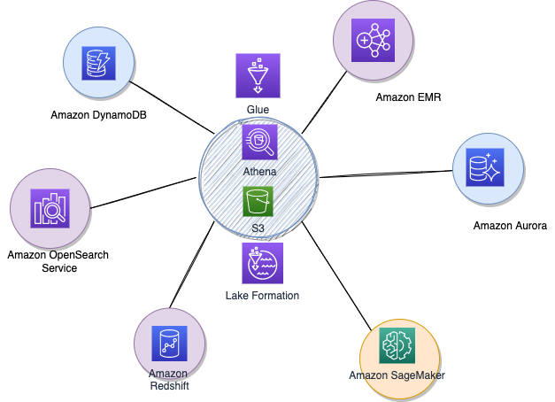

# Data Lake with AWS

[Talend's definitions](https://www.talend.com/resources/data-lake-vs-data-warehouse/) for data lake and data warehouse: "A data lake is a vast pool of raw data, the purpose for which is not yet defined. A data warehouse is a repository for structured, filtered data that has already been processed for a specific purpose."

In AWS context, a set of AWS services support your data strategy:

* [Amazon Redshift](./redshift.md)
* [S3](../infra/storage.md#s3-simple-storage-service)
* [Aurora](./rds.md/#amazon-aurora)
* [EMR](../analytics/emr.md): Created in 2009, it is a managed service to run Spark, Hadoop, Hive, Presto, HBase... Per-second pricing and save 50%-80% with Amazon EC2 Spot and reserved instances.
* [DynamoDB](./dynamodb.md)
* [Athena](../analytics/index.md#aws-athena)
* [Glue](./index.md#aws-glue)
* [OpenSearch](./index.md#opensearch)
* [Lake Formation](#lake-formation)
* [SageMaker](../ai-ml/sagemaker.md)

## Big Data

The 5 V's of big data are:

* **Volume:** terabytes, petabytes and even exabytes level. 
* **Variety:** includes data from a wide range of sources and formats.
* **Velocity:** data needs to be collected, stored, processed and analyzed within a short period of time.
* **Veracity:** Trust the data. Ensure data integrity within the entire data chain: security and free from compromise.
* **Value:** get the usefulness from the data, by querying the data and generate reports.

## Data engineering capabilities

* **Continuous or scheduled data ingestion**: ingest petabytes of data with auto-evolving schemas, read from files or streaming sources.
* **Declarative ETL pipelines**: intent-driven development. Automatic data lineage.
* **Data quality validation and monitoring**: support defining data quality and integrity controls.
* **Fault tolerant and automatic recovery**
* **Data pipeline observability** with data lineage, data flows diagrams, job monitoring.
* **Support both batch and streaming processing**

## [Lake Formation](https://aws.amazon.com/lake-formation/)

AWS Lake Formation is a service that makes it easy to set up a secure data lake in days instead of month. A data lake is a centralized, curated, and secured repository that stores all the data, structured and unstructured, both in its original form and prepared for analytics.

If we already use S3, we typically begin by registering existing S3 buckets that contain our data. Lake Formation creates new buckets for the data lake and import data into them. It adds its own permissions model, with fine grained access control down to the column, row or cell level.

Amazon S3 forms the storage layer for Lake Formation. 

AWS Lake Formation is integrated with AWS Glue which we can use to create a data catalog that describes available datasets and their appropriate business applications. Lake Formation lets us define policies and control data access with simple “grant and revoke permissions to data” sets at granular levels.

### Features

* Ingestion and cleaning

    * AWS Glue
    * Serverless Spark
    * Blueprints: predefined template to ingest data in one shot or incremental load.
    * ML transforms: deduplications

* Security

    * Data catalog
    * Centralized permissions
    * Real time monitoring
    * Auditing

* Analytics & ML - Integration

    * Redshift Spectrum
    * EMR
    * Glue
    * Athena
    * Quicksight

### Deeper Dive

* [How data formation works](https://docs.aws.amazon.com/lake-formation/latest/dg/how-it-works.html)
* [Create a data lake from a JDBC source](https://docs.aws.amazon.com/lake-formation/latest/dg/getting-started-tutorial.html)
* [Building secured data lakes on AWS](https://aws.amazon.com/blogs/big-data/building-securing-and-managing-data-lakes-with-aws-lake-formation/)
* [Cost modeling data lakes - whitepaper](https://d1.awsstatic.com/whitepapers/cost-modeling-data-lakes.pdf)

