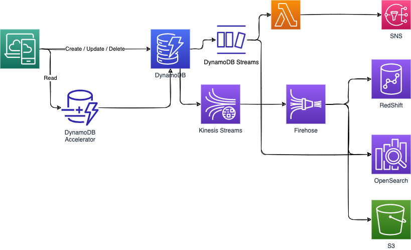

# [DynamoDB](https://docs.aws.amazon.com/amazondynamodb/latest/developerguide/Introduction.html)

AWS proprietary NoSQL database, Serverless, provisioned capacity, auto scaling, on demand capacity. Fully managed,  Highly Available with replication across multiple AZs in one AWS Region by default, Read and Writes are decoupled, and DAX can be used for delivering a read cache. 

Single digit ms latency, even with increased number of requests. Can support millions of requests per second, trillions of row, 100s of TB storage. Data is stored on solid-state disks (SSDs) and may be encrypted at rest.

It is integrated with IAM for authentication and authorization.

A `table` is a collection of `items`, and each item is a collection of `attributes`. DynamoDB uses primary keys to uniquely identify each item in a table and secondary indexes to provide more querying flexibility. 
Useful when the solution does not want to design a data schema upfront and which may change overtime. 

The maximum size for one item (or record) in a table is 400k.

The read operations can be eventually consistent or strongly consistent.

There is two capacities modes: 

* **provisioned**: where you specify and pay for read capacity units and write capacity units. Need to plan beforehand. Less expensive. Used when we know the traffic pattern.
* **on-demand**: read and writes automatically scale up/down with your workloads. Better for unpredictable workloads. More expensive.

Indexing is done using the primary key, but we can define secondary indexes which are a group of attributes to be used in queries. Global secondary index can span all of the data in the base table, across all partitions. It is stored in its own partition space away from the base table and scales separately from the base table.

## Scoping considerations

* Does the data model fit, key-value approach? what wil lbe the primary key?
* Do you need to support complex queries or just get by the primary key?
* Do you need global access patterns or data distribution across regions?
* Review the performance needs for read and write per second. Can operations be split between regions?
* How large will individual items be? How many items over time? Should items be deleted?
* What write/read consistency do you require? 

## Quotas / Limit / Pricing

* [Service, account, and table quotas in Amazon DynamoDB](https://docs.aws.amazon.com/amazondynamodb/latest/developerguide/ServiceQuotas.html).
* [Pricing](https://aws.amazon.com/dynamodb/pricing/)

## Security

DynamoDB defined a set of AWS managed policies that defined access policies on DynamoDB features, like replications, Read-write or read-only access.

DynamoDB supports resource-based policies for tables, indexes, and streams.

All user data stored is fully encrypted at rest, using symmetric keys in KMS (AWS owned (by default), AWS managed key, or customer managed key). It uses 256-bit Advanced Encryption Standard (AES-256). This includes primary key, local and global secondary indexes, streams, global tables, backups, and DynamoDB Accelerator (DAX) clusters. Developer cannot encrypt only a subset of items in a table: all table data is encrypted.

DynamoDB uses envelope encryption and key hierarchy to encrypt data. Your AWS KMS encryption key is used to encrypt the root key of this key hierarchy. Developer can use AWS CloudTrail and Amazon CloudWatch Logs to track the requests that DynamoDB sends to AWS KMS.

When client app access an encrypted table, DynamoDB decrypts the table data transparently. Call to KMS is not done at each table operation. The key is refreshed once every 5 minutes per caller with active traffic. Be sure to reuse connection with the SDK code. 

Developer can change the KMS key for a table at any time, either in the DynamoDB console or by using the `UpdateTable` operation.

All the data in DynamoDB is encrypted in transit. By default, communications to and from DynamoDB use the HTTPS protocol. Data in the application, needs to be encrypted before sending it to Dynamodb using client side encryption. If you store sensitive or confidential data in DynamoDB, consider including client-side encryption in your security plan. [See the What is the AWS Database Encryption SDK  product documentation.](https://docs.aws.amazon.com/database-encryption-sdk/latest/devguide/what-is-database-encryption-sdk.html)

Below is an example of approach using a KMS AWS managed key, knowing its arn in KMS:

```python
kms = boto3.client('kms')

def encrypt(text_to_encrypt):
    return kms.encrypt(
        KeyId=key_arn, 
        Plaintext=text_to_encrypt
    )['CiphertextBlob']

item['ssn']= encrypt(item['ssn']) 
dynamodb.put_item(
  TableName='MyTable',
  Item=item
)
```

Attention, with customer managed keys, deletion of the key, will make the tables not accessible. You cannot use a customer managed key with DynamoDB Accelerator (DAX) clusters.

See also this [important usage note](https://docs.aws.amazon.com/amazondynamodb/latest/developerguide/encryption.usagenotes.html).

## Coding

With the aws CLI:

```sh
aws dynamodb create-table --table-name Orders \
                          --attribute-definitions AttributeName=orderID,AttributeType=S \
                          --key-schema AttributeName=orderID,KeyType=HASH \
                          --provisioned-throughput ReadCapacityUnits=1,WriteCapacityUnits=1

```

See [AWS dynamodb cli cheat sheet](https://docs.aws.amazon.com/amazondynamodb/latest/developerguide/CheatSheet.html)

### SDK

Create Table with Python SDK:

```python
import boto3

# Create DynamoDB client
dynamodb = boto3.client('dynamodb')

# Table attributes
table = 'Products'
key_schema = [
    {'AttributeName': 'Id', 'KeyType': 'HASH'},
]

attribute_definitions = [
    {'AttributeName': 'Id', 'AttributeType': 'N'},  
]

# Create the table
try:
    response = dynamodb.create_table(                
        TableName=table,
        KeySchema=key_schema,
        AttributeDefinitions=attribute_definitions,
        ProvisionedThroughput={
            'ReadCapacityUnits': 10,
            'WriteCapacityUnits': 5
        }
    )
except:
    print("Unable to create table:", table)

else:
    print(f"Created table {table}")
```

* Transactional write with [TransactWriteItems API](https://docs.aws.amazon.com/amazondynamodb/latest/APIReference/API_TransactWriteItems.html)

```python
dynamodb = boto3.client('dynamodb') 
# prepare data
items = [
  {
    'Put': {
      'TableName': table,  
      'Item': {
        'Id': {'N': '123'}, 
        'Name': {'S': 'Item 1'}
      }
    }
  },...

try:
  response = dynamodb.transact_write_items(
    TransactItems=items,
    ClientRequestToken="unique_idempotency_id"
  )

except ClientError as e:
```

### CDK 

Create a dynamodb instance with CDK:

```python
class CdkStack(Stack):

    def __init__(self, scope: Construct, construct_id: str, **kwargs) -> None:
        super().__init__(scope, construct_id, **kwargs)
        # create dynamo table
        order_table = aws_dynamodb.Table(
            self, "orders",
            partition_key=aws_dynamodb.Attribute(
                name="orderID",
                type=aws_dynamodb.AttributeType.STRING,
            ),
            table_class= aws_dynamodb.TableClass.STANDARD_INFREQUENT_ACCESS,
            billing_mode=aws_dynamodb.BillingMode.PAY_PER_REQUEST,
            # make it global
            #replicationRegions= ['us-west-1', 'us-east-1', 'us-west-2'],
        )
```

See also [the examples for CDK](https://docs.aws.amazon.com/cdk/api/v2/python/aws_cdk.aws_dynamodb/README.html).


### [PartiSQL](https://docs.aws.amazon.com/amazondynamodb/latest/developerguide/ql-reference.html)

A SQL-compatible query language, to select, insert, update, and delete data in Amazon DynamoDB.


### Other coding pattern

* [Using quarkus, docker image for dynamodb, ](https://quarkus.pro/guides/dynamodb.html): Add dynamodb extension, and do data transformation between item and the business entity managed by the REST resource.
* For client application, there is this [nice tutorial from Quarkus](https://docs.quarkiverse.io/quarkus-amazon-services/dev/amazon-dynamodb.html).

## DynamoDB Accelerator - DAX

To address read congestion of the read operations, DAX is a managed service of a distributed cache cluster in front of DynamoDB. It brings microsecond latency. The APIs are the same as DynamoDB's APIs. 

It caches the most frequently used data, thus offloading the heavy reads on hot keys off the DynamoDB table, hence preventing the "ProvisionedThroughputExceededException" exception.

## DynamoDB Stream processing

It is possible to get ordered stream of item-level modification such as Create, Update, Delete in a DynamoDB table. It is relevant for:

* Reacting on changes in real-time.
* Real-time usage analytics
* Inserts into derivative tables
* Cross-region replication
* Lambda invocation on item updates 



## DynamoDB global table

The goal is to make a table accessible with low latency from different regions. It uses two-way replication, active-active so application can read and write to the table in any region. We need to enable streaming to get the replication running.

## DynamoDB Time to live

This feature helps to remove records after a specified timestamp. It is used to clean old records, like older than 2 years, or for session data, to be removed after 2 hours.

## Backup

DynamoDB supports continuous backup using point-in-time recovery (PITR). It can go up to the last 35 days. Recovery creates new table.