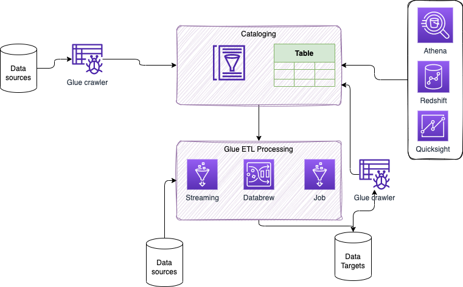
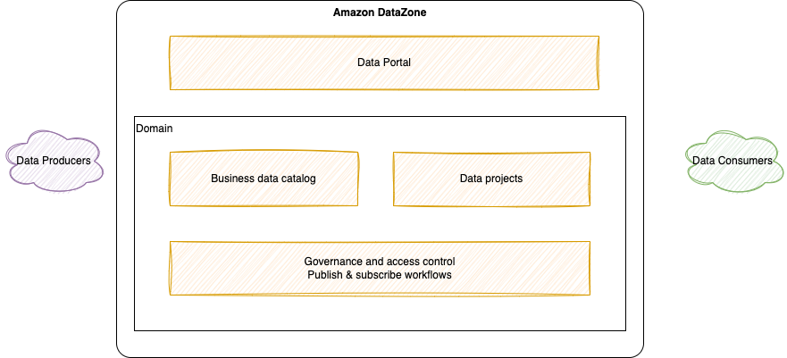
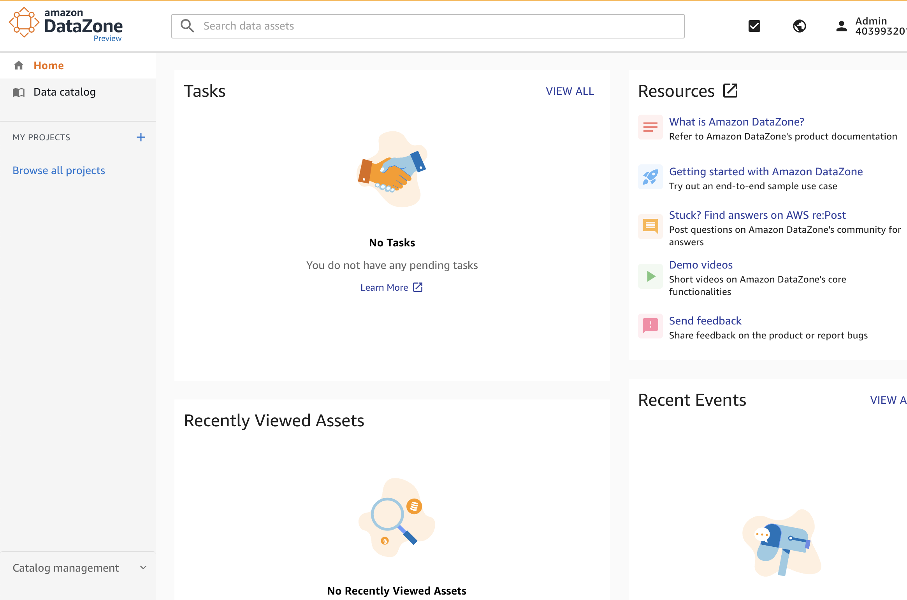
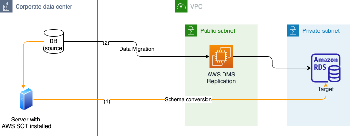

# Data services

!!! Info
    Created 12/8/2022 - Updated 11/26/23

AWS has a lot of services to manage data. This is an introduction of some services needed in a lot of solutions.

## [AWS Glue](https://aws.amazon.com/glue/)

Serverless data integration and data pipeline to do ETL jobs. We can discover and connect to over 70 diverse data sources, manage our data in a centralized data catalog, and visually create, run, and monitor ETL pipelines to load data into our data lakes. Pay only for resources used while running.

The classical AWS Glue architecture looks like:

* Data catalog is built by using crawlers to different data sources.
* ETL can be done on data streaming or jobs.
* To avoid reprocessing data, it use Job Bookmarks.
* Glue Elastic View is a feature to combine and replicate data across multiple data stores using SQL. It is like virtual table.
* Glue DataBrew to clean and normalize data using pre-built transformation.
* Glue Studio, GUI to create, run and monitor ETL jobs
* Glue Streaming ETL built on Apache Spark Structured Streaming to do data streaming compatible with Kafka, MSK and Kinesis data streaming.
* [Product documentation](https://docs.aws.amazon.com/glue/latest/dg/what-is-glue.html)
* [AWS Glue samples repository](https://github.com/aws-samples/aws-glue-samples)

### Use cases

* ETL pipeline building. Include real-time data as source.
* Data preparation and data profiling without coding. AWS Glue crawler to quickly discover the data and create the Data Catalog. 
* Quick job orchestration and visualization with drag and drop.
* Real-time data processing

### [Glue Schema Registry](https://docs.aws.amazon.com/glue/latest/dg/schema-registry.html)

Centralize schema management. Support Avro 1.10, Json Schema, Protobuf, Java. It allows disparate systems to share a schema for serialization and de-serialization.

A registry has an Amazon Resource Name so we can define access permissions to schema and registry. We define iam policies for producer and consumers differently.

Versioning is governed by a compatibility rule that is applied on a schema.

A schema version that is marked as a **checkpoint** is used to determine the compatibility of registering new versions of a schema.

Try to use BACKWARD compatibility rules, so consumer can read current and previous schema version.

AWS provides open-source [Serde libraries](https://docs.aws.amazon.com/glue/latest/dg/schema-registry-gs.html#schema-registry-gs-serde) as a framework for serializing and deserializing data. The serializer decorates each record with the schema version ID.

Cached schema version is for 24 hours.

We should use AWS PrivateLink to connect any data producer’s VPC to AWS Glue by defining an interface VPC endpoint for AWS Glue.

Quota: 10 registries per AWS account per AWS Region.

## Amazon [ElastiCache](https://aws.amazon.com/elasticache/)

This is the in-memory database service for AWS, at the microseconds access read level.

It supports managed Redis (Leader on the key-value store market) or Memcached clusters. Applications queries ElastiCache, if data is not available, gets it from RDS and store it in ElastiCache. 

It can be used for user session store so user interaction can go to different application instances. 

**ElastiCache for Redis** is a multi AZ with Auto-Failover, supports read replicas to scale on the read operations and to have high availability. It has data durability using Read Only File Feature, AOF, persistence, and has backup and restore features. It is supporting cross region replication, with up to 500+ nodes per cluster.

!!!- Attention "Amazon MemoryDB for Redis"
    MemoryDB for Redis is a durable, in-memory database for workloads that require an ultra-fast, primary database. It is used for application using Redis data structures and APIs with a primary, durable database. While ElastiCache for Redis is a service that is commonly used to cache data from other databases and data stores using Redis.

Redis supports sharding to scale the data partitioning.

Redis authentication tokens enable Redis to require a token (password) before allowing clients to execute commands, thereby improving data security. IAM Auth is not supported by ElastiCache.

**Memcached** is a multi-node, used for partitioning of data (sharding), it is not persisted, no backup and restore, no HA via replication. It is based on a multi-threaded architecture. Loosing a node means loosing data.

### Patterns

Some patterns for ElastiCache:

* **Lazy Loading**: all the read data is cached, data can become stale in cache. Cache misses, make a call to the database backend.
* **Write Through**: Adds or update data in the cache when written to a DB (no stale data)
* **Session Store**: store temporary session data in a cache (using Time To Live features)

Sub millisecond performance, in memory read replicas for sharding.

### Configuration

TBD add screen shots with some explanation

For the configuration, it can also being deployed on premises via AWS Outposts.

It does not support IAM authentication. But we can set a security token at the Redis cluster creation. For Redis we  can use Redis auth to force user to enter a password to connect. It supports SSL for in-flight encryption.

### Coding

There is the Redis Sorted Sets to guarantee both uniqueness and element ordering. Each time a new element is added to the cache, it is ranked and added in the correct order.

## DocumentDB

Amazon DocumentDB is a fast, scalable, highly available, and fully managed document database service that supports MongoDB workloads. As a document database, Amazon DocumentDB makes it easy to store, query, and index JSON data.

## [Neptune - GraphDB](https://docs.aws.amazon.com/neptune/latest/userguide/intro.html)

Fully managed graph database service that makes it easy to build and run applications that work with highly connected datasets. 

The core of Amazon Neptune is a purpose-built, high-performance graph database engine optimized for storing billions of relationships and querying the graph with milliseconds latency.

Neptune powers graph use cases such as recommendation engines, fraud detection, knowledge graphs, drug discovery, and network security.

## [AppSync](https://docs.aws.amazon.com/appsync/latest/devguide/what-is-appsync.html)

AWS AppSync provides a robust, scalable GraphQL interface for application developers to combine data from multiple sources, including Amazon DynamoDB, AWS Lambda, and HTTP APIs.

AppSync may be combined with DynamoDB to make it easy to build collaborative apps that keep shared data updated in real-time.

## Amazon QLDB

## [OpenSearch](https://docs.aws.amazon.com/opensearch-service/)

OpenSearch is a managed services to search data with indexing. It is the new name of open source project, ElasticSearch.
Can use up to 3 PB of attached storage.

Pricing is pay for each hour of use of an EC2 instance and for the cumulative size of any EBS storage volumes attached to our instances. If a domain uses multiple Availability Zones, OpenSearch Service does not bill for traffic between the Availability Zones. 

## [DataZone](https://docs.aws.amazon.com/datazone/latest/userguide/what-is-datazone.html)

* Service to catalog, discover, govern, share (cross regions and accounts), and analyze our data.
* Data producers can catalog and share data they produce
* Data consumers can discover and use those data

The components:

* Business data catalog 
* Data projects: link people, teams, analytics tools,... Creating a project, creates IAM role, S3 bucket, Glue data catalog, and Athena database. Project may have profile that defines AWS underlying resources used.
* Data portal: WebApp to access all the catalog. 
* Governance and access control: publish workflows to get data to the catalog.

### Sources

* [DataZone Getting started.](https://docs.aws.amazon.com/datazone/latest/userguide/getting-started.html)

## [Amazon Timestream](https://docs.aws.amazon.com/timestream/latest/developerguide/what-is-timestream.html)

Time series database to support trillions of data points per day, keeping recent data in memory and moving historical data to a cost optimized storage tier based upon user defined policies.

It includes a query engine with time based analytic functions

Timestream is serverless and automatically scales up or down to adjust capacity and performance. The architecture uses different layers to increase decoupling, and a cellular architecture using smaller copies of the time tables, with specific networking end-points. The layers are:

* **Write or Ingestion layer**: Amazon Timestream routes writes for a table, partition, to a fault-tolerant memory store instance that processes high throughput data writes. It uses indexes and partitions data before writing to storage. Partitions are isolated and do not share data. When data is stored in Timestream, data is organized in time order as well as across time based on context attributes written with the data. It is a two dimensions space. Partitions are called **Tiles**.
* **Storage layer**: Responsible to manage the life cycle of the time series data, it offers two data storage: in-memory and on magnetic disk. Time series data close to current time are in-memory and automatically sent to longer storage after a certain time or some retention policy. Once on magnetic store, data is reorganized into a format that is highly optimized for large volume data reads. Other retention policies can be added to get rid of data not useful anymore. 
* **Query layer**: Queries are done using SQL grammar. Queries are processed by an adaptive, distributed query engine that uses metadata from the tile tracking and indexing service to access and combine data across data stores at the time the query is issued. Queries are run by a dedicated fleet of workers where the number of workers enlisted to run a given query is determined by query complexity and data size.

HA with automatic replications among 3 AZs within same region.

With time series data, each data point consists of a timestamp, one or more attributes, and the event that changes over time.

* [Tutorial](https://docs.aws.amazon.com/timestream/latest/developerguide/getting-started.db-w-sample-data.html) to create a table, insert timestream records and query them.
* [Sample app](https://github.com/awslabs/amazon-timestream-tools/tree/mainline/sample_apps)

## [Data Migration Service](https://docs.aws.amazon.com/dms/latest/userguide/Welcome.html)

As a managed service, AWS DMS is a server (EC2) in the AWS Cloud that runs replication software, to move data from one database to another running in AWS. Schema transformation can be performed using Schema Conversion Tool (SCT). SCT can run on-premises.

Sources can be on-premises DBs, and the targets can still be on-premises DBs but most of time are  AWS data store such as RDS, Redshift, DynamoDB, S3, Elasticache, Kinesis data streams, DocumentDB...

We can use continuous replication with DMS:

First 1/ use the AWS Schema Conversion Tool to convert the source schema and code to match that of the target database, 2/ use the AWS Database Migration Service to migrate data from the source database to the target database, 3/ we can use AWS DMS data validation to ensure that the data has migrated accurately from the source to the target. DMS compares the source and target records and then reports any mismatches.

Example of configuration, with EC2 instance type, engine version, allocated storage space for the replication instance, network connectivity...

Once server is defined, we need to define data provider to specify source and target endpoints and create a migration project to do schema conversion (from Oracle or SQL server to MySQL or PostgreSQL as target). 

It is possible to leverage AWS Database Migration Service (AWS DMS) as a bridge between Amazon S3 and Amazon Kinesis Data Streams as an easier way to do so: See [Streaming Data from S3 to Kinesis using DMS](https://aws.amazon.com/blogs/big-data/streaming-data-from-amazon-s3-to-amazon-kinesis-data-streams-using-aws-dms/). 

* AWS DMS allows one-shot data migration and applies change data capture (CDC) files to these services.
* [DMS FAQ](https://aws.amazon.com/dms/faqs/)

## Replication to Aurora

For MySQL engine we have different options:

* Use RDS DB snapshot from RDS and restore it in Aurora
* Create an Autora read replica from the RDS MySQL source, when replication lag is 0, we can then promote Aurora as Write and Read.
* For external MySQL, use XtraBackup to create a file backup, upload it to S3 and import the file into Aurora from S3. Or use `mysqldump` utility to move to Aurora MySQL DB.
* Use DMS if both DBs run in parallel

## [AWS Backup](https://docs.aws.amazon.com/aws-backup/latest/devguide/whatisbackup.html)

Fully-managed service that makes it easy to centralize and automate data protection across AWS services, in the cloud, and on premises. It supports cross-region backups and in multiple AWS accounts across AWS Organizations.

Src: EC2, EBS, EFS, Amazon FSx for windows, Lustre, and Storage Gateway, RDS, DynamoDB..

Target is S3 bucket or Vault Lock.

A **backup plan** is a policy expression that defines when and how we want to back up the AWS resources. It uses incremental backup. Backup plans are composed of one or more backup rules. The number of days to store data is called the **backup lifecycle**.

Retention period for snapshots can be infinite, while the retention period for continuous backups can range from 1 day to 35 days.

Backup Vault lock is used for Write Once Read Many state. It is to defend on malicious delete as backup cannot be deleted.

We can create automated backup schedules and retention policies, lifecycle policies to expire unncecessary backups after a period of time.

We can use AWS **Backup Audit Manager** to audit the compliance of our AWS Backup policies against controls that we define. A control is a procedure designed to audit the compliance of a backup requirement.

AWS Backup helps to support the regulatory compliance or business policies for data protection.

Combined with AWS Organizations, we can configure AWS Backup to monitor activities in all of the accounts in one place. We can define Organizations backup policies to create the backup plans across multiple accounts. It is not possible to delete or edit these backup plans individually within the account. With this solution, we will enforce the company's backup policy reliably and consistently.

## [Application Discovery Service](https://docs.aws.amazon.com/application-discovery/latest/userguide/what-is-appdiscovery.html)

Managed service to help plan the migration to the AWS cloud by collecting usage and configuration data about the on-premises servers. It is integrated with AWS Migration Hub, which simplifies the migration tracking as it aggregates the migration status information into a single console.

It offers two ways of performing discovery: 

* Agentless: work on VM inventory, configuration, and performance history
* Agent-based: by deploying AD Agent on each of the VMs and physical servers, it collects static configuration data, detailed time-series system-performance information, inbound and outbound network connections, and processes that are running.

