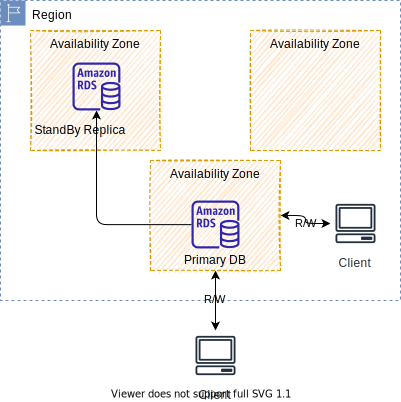
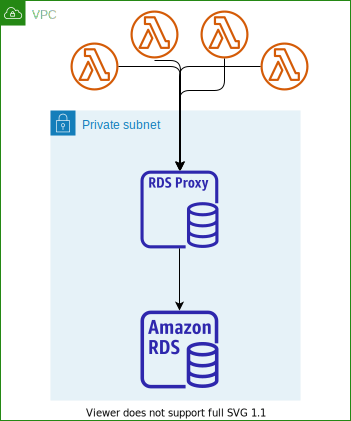

# Data services

!!! Info
    Created 12/8/2022 - Updated 11/26/23

## [Relational Database Service - RDS](https://docs.aws.amazon.com/rds/index.html)

Managed service for SQL based database (MariaDB, MySQL, PostgreSQL, SQL server, Oracle, Amazon Aurora), the only things customers do is to define their schema and optimize their queries, AWS manages scaling, HA, backups, software patching, server maintenance...  RDS is used for On Line Transaction Processing (OLTP). As an exception, RDS Custom for Oracle (or MSSQL) allows SRE to access and customize the database server host and operating system.

* A DB instance provides a network address called an *endpoint*.
* When deployed in own VPC, be sure to have at least two subnets, each in a separate Availability Zone. [See VPC and RDS](https://docs.aws.amazon.com/AmazonRDS/latest/UserGuide/USER_VPC.html). Prefer installation in private subnet with no public IP address (avoid it at least). 
* It uses general purpose SSD (gp2, gp3), provisioned IOPS (io1) or magnetic storage (magnetic storages do not have consistent performance). [See instance storage](https://docs.aws.amazon.com/AmazonRDS/latest/UserGuide/CHAP_Storage.html). Amazon RDS volumes are built using Amazon EBS volumes.
* HA supported with Primary, in-synch replication to secondary instance. Read replicas can be used to scale reading operations and they are asynchronously replicated. Resources aren't replicated across AWS Regions unless you do so specifically.

{ width=600 }

* Support multi AZs for Reliability Availability with automatic failover to standby, app uses one unique DNS name. Continuous backup and restore to specific point of time restore. 

* Transaction logs are backed-up every 5 minutes. Support user triggered snapshot.
* Supports **Storage Auto Scaling** to increase storage dynamically with automatic detections of running out of free storage and scale it. (Free storage < 10%, low storage last at least 5 minutes, 6 hours have passed since last notification)

* For Oracle and MS SQL it is possible to setup a RDS custom. Where you have access to OS and Database.

From a solution architecture point of view:

* **Operations**:  small downtime when failover happens. For maintenance, scaling with read replicas, updating underlying EC2 instances, or restore EBS, there will be manual interventions.
* **Security**: AWS is responsible for OS security, we are responsible for setting up KMS, security groups, IAM policies, authorizing user accesses to the DB, and enforcing SSL.
* **Reliability**: Multi AZ feature helps to address reliability, with automatic failover to the standby instance in case of failures.
* **Performance**: depends on EC2 instance type, EBS volume type, ability to add Read Replicas. Doesn’t auto-scale, adapt to workload manually. 
* **Fit for purpose**: for OLAP prefer Redshift.

### Multi AZ DB Cluster - Read Replicas

Read replicas helps to scale the read operations. Can create up to 5 read-replicas within a AZ, across AZ and across regions. Replication is asynch (eventually consistent). Use cases include, reporting, analytics on existing DB, or develop a ML model.
The application which needs to access a read-replica DB needs to change the connection parameters.

AWS charges for network when for example data goes from one AZ to another. Replicas in the same region in RDS managed services are for free, cross regions has a network cost.

Read replica is great for read-heavy workloads and takes the load off the primary database (BI jobs). 

### DR - Multi AZ DB instance

RDS supports instance standby with synchronous replication from master to standby. The application talks to one DNS name, and there will be automatic failover, if connection to master RDS fails.

Read-replica DB can be setup as a multi AZ for DR, but RTO is not 0. Read replicas can be promoted to become a primary database, but this is a manual procedure.

It is possible to move from a Single-AZ to a Multi-AZ with zero downtime, by changing the multi-AZ parameter in the RDS.  The internal process is creating a snapshot from master, create a DB via restore operation in target AZ and start synchronous replication from master to standby.

With Multi-AZ RDS, a failure of one node generally recovers within a minute by switching to the standby instance with the only availability impact being the time it takes for the DNS pointer to update.

For a single-AZ RDS instance, the RTO of an outage where the data isn't impacted, just the EC2 instance, the availability impact would be the length of time it takes for the underlying EC2 instance to recover, which could take several minutes plus the time to replay any transaction logs.

### Outpost integration

AWS Outposts uses the same hardware as in public AWS Regions to bring AWS services, infrastructure, and operation models on-premises. With RDS on Outposts, you can provision managed DB instances close to the business applications that must run on-premises.

### Security

* Support at rest Encryption (need to specify it at launch time). Master needs to be encrypted to get encrypted replicas. 
* We can create a snapshot from unencrypted DB and then copy it by enabling the encryption for this snapshot. From there, we can create an Encrypted DB
* For in-flight encryption use AWS TLS root certificates on the client side.
* To authenticate, traditional user/pwd can be used but also IAM roles to connect to your DB. Enable IAM Database Authentication.
* Audit Logs are sent to CloudWatch.

Customer's responsibilities:

* Check the ports / IP / security group inbound rules in DB’s SG
* In-database user creation and permissions or manage through IAM
* Creating a database with or without public access
* Ensure parameter groups or DB is configured to only allow SSL connections
* Specify a time window to do maintenance, for version to version migration for example.

### Backup

RDS has automatic bakcup executed daily during the maintenance window. But the transaction logs are backed-up every 5 minutes. 

* It is possible to restore the DB states from oldest backup to 5mn ago. 
* 1 to 35 days of retention for automatic backup (0 to disable). If you use manual backup with snapshot, then retention is defined as long as you want.  

!!! note
    The manual snapshot can be used when using the database rarely, and the cost of keeping a snapshot, is far less than letting the DB running. 

### RDS Proxy

This is a managed service to keep a pool of database connections between the DB and the clients, so it will improve the performance to access to the database servers. The connections are kept alive. The client connects to the proxy as it will do with the database. It is valuable with Lambda to DB connection.

This is a serverless, autoscaling, HA over multi-AZ.

With this failover on EDS or Aurora is reduced  by up to 66%.

Enforce IAM Authentication for DB and securely store credentials in AWS secrets manager.

Not expose to public internet. Only visible in the VPC.

### Code Examples

See [Playground RDS](../playground/rds.md)

* [Autonomous Car Ride](https://github.com/jbcodeforce/autonomous-car-ride) uses PostgreSQL in RDS and quarkus app.
* [SaaS demo - Tenant manager](https://github.com/jbcodeforce/big-data-tenant-analytics)

### Deeper dive

* [Burst vs Baseline with RDS and GP2](https://aws.amazon.com/blogs/database/understanding-burst-vs-baseline-performance-with-amazon-rds-and-gp2/):

    * Dimensions that matter are the size, latency, throughput, and IOPS of the volume.
    * With gp2, IOPS is a function of the size of the volume: 3x GiB with a min of 100 IOPS and a max of 10k IOPS
    * Starting with I/O credit at 3000 IOPS, it can be consumed at burst and replinished at the rate of 3 IOPS per GiB per s.
    * With disk above 1TB, the baseline performance > burst perf.

## [Amazon Aurora](https://docs.aws.amazon.com/AmazonRDS/latest/AuroraUserGuide/CHAP_AuroraOverview.html)

Proprietary SQL database storage engine, works using **PostgreSQL** and **mySQL** drivers.

* **Operations**:  less operation, auto scaling storage: it can grow up by increment of 10GB from 10GB to 128 TB.
* **Security**: AWS is responsible for OS security, users are responsible for setting up KMS, security groups, IAM policies, authorizing users in DB, enforcing SSL.
* **Reliability**: Multi-AZ, HA with minimum of 3 AZs, with 2 copies of the data in each AZ. 6 copies overall.
* **Performance**: Sub 10ms replica lag, up to 15 replicas (MySQL has only 5 replicas). It costs 20% more than RDS. 5x performance improvement over mySQL on RDS, and 3x for PostgreSQL. The compute resources can scale up to 96 vCPUs and 768 GB of memory.

### HA and Read Scaling

Failover in Aurora is instantaneous. It’s HA (High Availability) native. Use 1 master - 5 readers to create 6 copies of the data over 3 AZs. It supports cross-region replications.

* It needs 4 copies out of 6 to consider write operation as successful.
* And 3 copies out of 6 needed for read operations.
* There is a self-healing capability in case of data corruption with peer-to-peer replication.
* Storage is done across 100s of volumes.
* Autoscaling on the read operation from 1 to 15 read-replicas. 

 

It is CQRS at DB level, and read can be global.

Each connection is handled by a specific DB instance. When app connects to an Aurora cluster, the host name and port specify an intermediate handler called an **endpoint**. Aurora uses the endpoint mechanism to abstract these connections.

Use **writer endpoint** for write operation and **reader endpoint** to access read-replicas. Aurora automatically performing load-balancing among all the Aurora Replicas. It is also possible to design replicas to run on different EC2 server type, and then **custom** endpoints can be defined to access to those servers. This could be interesting for analytic queries.

It also supports one write with multiple readers and parallel query, multiple writes.

### Other capabilities

With Aurora Global Database, one primary region is used for write and then up to 5 read only regions with replica lag up to 1 s. Promoting another region (for disaster recovery) has an RTO of < 1 minute.

* **Serverless**: Amazon Aurora Serverless is an on-demand, auto-scaling configuration for Amazon Aurora. An Aurora Serverless DB cluster is a DB cluster that automatically starts up, shuts down, and scales up or down its compute capacity based on the application’s needs. Aurora Serverless provides a relatively simple, cost-effective option for infrequent, intermittent, sporadic or unpredictable workloads.
* Multi-master, to protect on write node failure. Every node supports read and write operations. The client has multiple DB connection definitions for failover.
* **Global Aurora**: across region replicas, or use Global Database with one primary region for R/W and up to 5 secondary regions (Read-only), with a replica lag < 1s and up to 16 read replicas per secondary region. Promoting a region for DR should lead to a RTO < 1 mn. It takes less than a second to do replicas cross region. 
* Aurora has integration with ML services like SageMaker and Comprehend. 

### Backup

Could not be disabled, and automatic is up to 35 days retention.

It is possible to clone an existing Aurora DB, which is fast and cost-effective. For example to create a 'Staging' DB from production one. 

We can share snapshot with other AWS accounts.

### Code examples

* [Building serverless applications with Amazon Aurora Serverless](https://aws.amazon.com/getting-started/hands-on/building-serverless-applications-with-amazon-aurora-serverless/)

## Fit for purpose

| Needs | Considerations | 
| --- | --- |
| Single digit latency | DynamoDB |
| SQL based OLTP | RDS |
| SQL based OLAP | RedShift |

