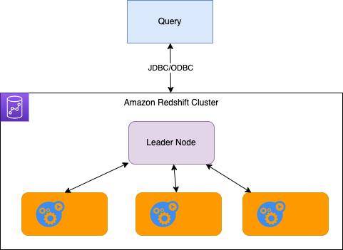
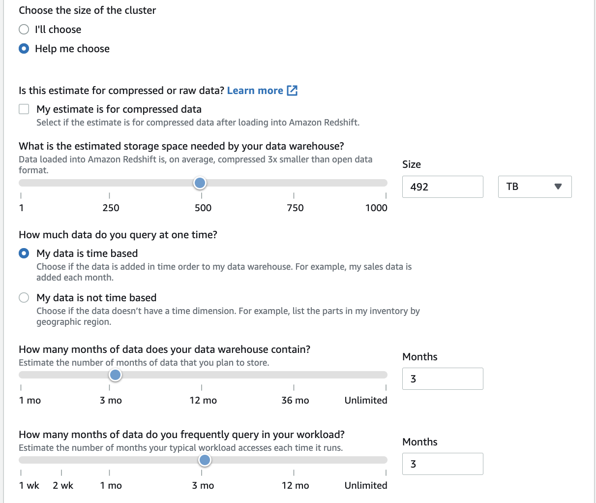
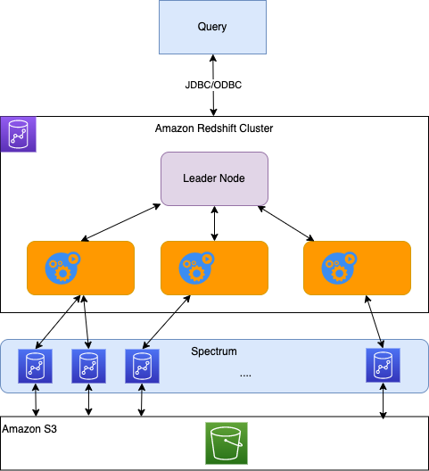

# [Amazon RedShift](https://docs.aws.amazon.com/redshift/latest/gsg/getting-started.html)

[Redshift](https://aws.amazon.com/redshift/) is the cloud data warehouse managed services, with no data movement or data transformation. Its goal is to manage up to 16 PB of data (it is like 500 billion pages of standard printed text, or 11,000 4k movies).

## Use cases

* Unified data warehouse and data lake.
* Get insights by running real-time and predictive analytics on all of your data, across operational databases, data lake, data warehouse, and thousands of third-party datasets.
* Support all analytics workload.
* Scalable, managed services, serverless, cost effective.

## Architecture

Amazon Redshift uses SQL to analyze structured and semi-structured data across data warehouses, operational databases, and data lakes, using AWS-designed hardware and machine learning to deliver the best price performance at any scale.

It is based on Postgresql but is not used for OLTP. It is used for analytical processing and data warehousing, scale to Peta Bytes. It is Columnar storage of data. It uses massively parallel query execution.

Data can be loaded from S3, DynamoDB, DMS and other DBs. It can scale from 1 to 128 nodes, and each node has 160GB per node. Redshift spectrum performs queries directly on top of S3.

The cluster architecture is based on a leader node to support query planning and aggregate results, manages metadata, and compute nodes to perform the queries, distribute the data and send results back.

* Provision node size in advance, and we can use Reserved Instances for cost saving.
* Node types include **Dense Compute** (dc2.large ...) with a number of slices and storage in SSD, and **Dense Storage** (ds2.xlarge) based on HDD up to 2 PB, or **RA3** with more vCPU and total capacity for very large datahouse.
* Slice is compute and storage and receives query script, executes those scripts and return results.
* During the cluster creation an tool can help size the cluster according to the data needs:

It will then propose on-demand, reserved (1 year), or 3 years pricing model.

* RedShift is not multi-AZ, but we can use snapshots to do point-in-time backup and store in S3. Snapshots are incremental. And backup can be restored in a new cluster.
* For DR purpose snapshot can be copied to another region.
* RedShift Spectrum helps to query data already in S3 without loading them. The query is submitted to thousands of redshift spectrum nodes.

* The configuration includes network, VPC, subnet, security group, enhanced VPC routing to keep traffic through a VPC. Database name and port and if we want encryption using KMS or HSM. Specify maintenance window, monitoring and backup.
* For monitoring we can use CloudWatch alarm to monitor the disk usage of our cluster and send notification to a SNS topic.
* Once create the managed service offers a JDBC endpoint, and ODBC endpoint and HTTP API.
* Redshift Spectrum pushes many compute-intensive tasks, such as predicate filtering and aggregation, down to the Redshift Spectrum layer. Thus, Redshift Spectrum queries use much less of your cluster's processing capacity than other queries. 

## Features

* Serverless or create and manage your own cluster
* Set up SQL Workbench/J to access your data in the Amazon Redshift cluster using the Amazon Redshift JDBC driver.
* Analyze the data with standard SQL from SQL Workbench/J.

## Deeper Dive

* [Product documentation](https://docs.aws.amazon.com/redshift/latest/gsg/getting-started.html)
* [Deploy a data warehouse](https://aws.amazon.com/getting-started/hands-on/deploy-data-warehouse/?ref=gsrchandson)