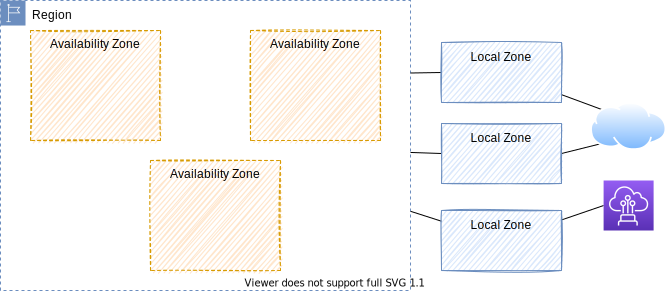
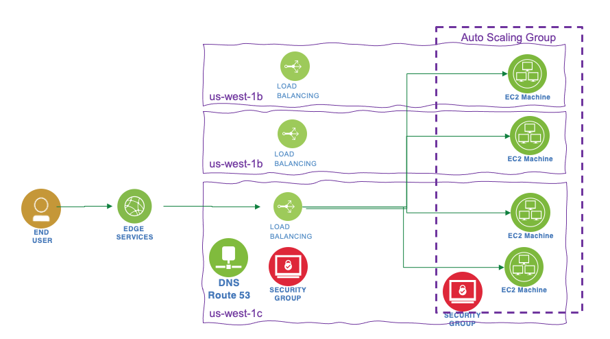

# Amazon Web Service Studies

This site is about deeper studies and keep all my notes on AWS services, while I learn all this world. It includes summary, and labs + references to other repos I built to do proof of concepts.

!!!- info "Version 0.23"
    Created 09/20/2022 - Updated 11/05/2023

## AWS

* Created in 2002, and launched as AWS in 2004 with S3, and SQS as first service offerings.

## Why cloud

There are 5 main advantages to AWS:

* **Cost Savings**: Only pay for what we use, leveraging economy of scale: EC2 instance with different pricing model. Usage from hundreds of thousands of customers is aggregated in the cloud. Moving from capex to variable expense (OPEX).
* **Agility**: Teams can experiment and innovate quickly and frequently at minimum cost. Define infrastructure in minutes, as code, not weeks or even months.
* **Elacticity**: Scale up and down so no need to guess resource capacity.
* **Innovation**: Focus on business apps, not IT infrastructure and data centers.
* **Global Footprint**: Extensible, reliable, and secure on global cloud infrastructure. Reach in a minutes.

???- "Notes"
    * The cloud transition has happened much faster because it yields great value and has fewer blockers, and bigger customer gains drive higher volume reinvestments into the platform.
    * **Scalability** is the ability of an application to accommodate growth without changing design. Scalability ensures that systems remain highly available into the future as the business expands. 
    * **Elasticity** is the power to instantly scale computing resources up or down easily. _Elastic Load Balancing_ and _Auto Scaling_ can automatically scale the AWS cloud-based resources up to meet unexpected demand.

## Use cases

* Enable to build scalable apps, adaptable to business demand
* Extend Enterprise IT
* Data lake support at scale with high availability
* Support flexible big data analytics

### Deep dive

* [Six strategies to move to the cloud](https://medium.com/aws-enterprise-collection/6-strategies-for-migrating-applications-to-the-cloud-eb4e85c412b4)

## Cloud Value Frameworks

The Frameworks includes four business value pilars:

* **Cost savings**: Total Cost Ownership. -50% is classical 
* **Staff productivity**:  62% improvement 
* **Operational resilience**: -32% downtime
* **Business Agility**: 47% improvement 

{ width=900 }

([IDC numbers](https://aws.amazon.com/resources/analyst-reports/?audit=2019q1&analyst-reports-main.sort-by=item.additionalFields.datePublished&analyst-reports-main.sort-order=desc&awsf.analyst-reports-flag=*all&awsf.tech-category=*all&awsf.analyst-reports-use-case=*all&awsf.analyst-reports-industry=*all&awsf.analyst-reports-firm=*all&awsf.analyst-reports-region=*all&awsf.analyst-reports-year=*all))

### Cost saving

* Understand the true cost of existing IT capabilities
* ROI = Cost saving / (sunk cost + migration cost)

    * For **sunk cost**: assess the hardware depreciation and the potential recovery value by reselling data center or hardware.
    * **Migration costs**: more difficult to assess, but we can use the break even migration cost per server by defining a target ROI. Now only one unknown in the previous equation: migration cost = Cost Savings / ROI - sunk cost. 

* OPEX (Operational Expenses)

For actual cost, we need to consider:

* Server cost with HW and SW license
* Storage cost with HW and SW license
* Network cost with HW and SW license
* Facilities cost for each of those machines: power, cooling, space
* SRE cost
* Extras: like project management, training, legal, advisors, contractors, cost of capital
* Think about standard depreciation of 3 or 5 years. Match to 3 year reserved instances
* Use Reserved Instance volume to assess discount
* Use realistic metrics and ratios like VM density,  servers, racks...)
* Explore current CPU and memory usage
* Apply cost saving by using automation and configuration as code.
* Cost assessment can take from 3 weeks to multi months.
* [Migration Evaluator](https://aws.amazon.com/migration-evaluator/) to do on-premise server analysis to optimize cloud migration planning.

### Cloud readiness

* Human skills and experience required to transition to the cloud
* Application readiness to migrate: dependencies, integrations, translation
* Each stakeholders (devOps, operations, CFO, procurement) have their point of view

### Additional impacts

* Cost of delays - risk premium
* Competition - competitve ability
* Governance and compliance

### Operational resilience

It really means security and up time.
Impact for downtime is a direct cost on business revenue, but also cost get back up: which include 3nd party fee, equipment replacement, recovery activities, investigation cost.... Customer churns, company's reputation...

### Business agility

Look at responding faster, experimenting more, and delivering results in the same or less amount of time. Business agility is about delivering more,respond faster to customer’s requests or problems, develop new product, add features more quickly, expend to new market. 

Business agility allows customers to innovate by increasing "failfast" while reducing risks and costs. Being able to easily shut down failed initiatives without the pain and wasted resources associated with an inflexible on-premises environment.

The KPIs to consider includes at least:

* New app launched per year
* Time to market for new app. (Observed 20% gain)
* Time to provision new environments (days)
* Deployment frequency
* Time to deploy to production, to test...
* Features per release (observed 26% more)
* Total # of defects
* % defects found in test
* MTTR: mean time to resolution
* Response time to defect
* Customer retention in %
* New festure adoption in %
* Value per release in $ (+34% more revenue per user)

**Moving to the cloud does not have to be a binary proposition**. We can move as much or as little of our infrastructure to the cloud as suits our business.

### Cloud financial management

Includes four key areas:

1. **Measurement and accountability**: establishing cost transparency to ensure visibility
1. **Cost Optimization**: identify waste, scale based on demand, improve cost efficiency

    * _Right sizing_: select the lowest cost instance that meets performance requirements. Look at CPU, RAM, storage and network usage to identify downsizing opportunity. See [AWS CloudWatch](https://aws.amazon.com/cloudwatch/)
    * _Increase elasticity_: shutdown test and dev instances. Automatic scaling. 
    * _Choose the right pricing model_: on-demand, reserved instances (predictable workload), convertible RIs, spot instance....
    * _Use the right storage_: automate aging from different S3 services

1. **Planning and forecasting**: based on actual and future costs and needs

    * [AWS pricing calculator](https://calculator.aws/#/) to estimate the cost of the architecture solution.
    * AWS price list API
    * [AWS Cost Explorer](https://aws.amazon.com/aws-cost-management/aws-cost-explorer/)

1. **Cloud financial operations**: invest in tools, people, and automation

## Global Infrastructure

AWS is a [global infrastructure](https://infrastructure.aws) with 32 regions and 2 to 6 separated availability zones per region (102 AZs). Ex: us-west-1-2a.

{ width=900 }

AZ is one or more Data Center with redundant power, networking and connectivity. Isolated from disasters using different facilities. Interconnected with low latency network (AWS maps the AZ letter identifiers to different physical AZs for different AWS accounts).

Data centers are independent facilities typically hosting 50k servers up to 80k servers. Larger DCs are not desirable because the economy of scale is not that great but the blast radius is becoming too big. Inbound traffic is 110 Tbps within a single DC.

[James Hamilton's presentation about AWS infrastructure](https://www.youtube.com/watch?v=JIQETrFC_SQ)

AWS services are local or very few are global:

* EC2 is a regional service. Region-scoped services come with availabiltiy and resiliency. 
* IAM is a global service.

**AWS Local Zone** location is an extension of an AWS Region where we can run latency sensitive applications in geography, in large population density, close to the end-users. We can extend any VPC from the parent AWS Region into Local Zones. Local Zones have their own connections to the internet and support AWS Direct Connect.

**AWS Wavelength** enables developers to build applications that deliver single-digit millisecond latencies to mobile devices and end-users. AWS compute and storage services are deployed within the telecommunications providers’ data centers at the edge of the 5G networks, and seamlessly access the breadth of AWS services in the region.

Choose an AWS region, depending of the requirements such as:

* Compliance with data governance and legal requirements.
* Close to users to reduce latency.
* [Service availability within a region](https://aws.amazon.com/about-aws/global-infrastructure/regional-product-services/) .
* Pricing.

### Availability and reliability

Be sure to get clear agreement on following definitions:

* **Fault Tolerant**: characteristic for a system to stay operational even if some of its component fails.
* **High Availability**: Ensures that systems are always functioning and accessible and that downtime is minimized as much as possible without the need for human intervention.
* **Durability**: A byproduct of storage redundancy, durability ensures that a customer’s data will be saved regardless of what happens.
* **Reliability**: The ability of a system to recover from infrastructure or service failures and the ability to dynamically acquire computing resources to meet demand and mitigate disruptions.
* **Disaster Recovery**: preparing for and recovering from a disaster.

[>>> Next Networking](infra/networking.md)

## Interact with AWS

* Management console: services are placed in categories: compute, serverless, database, analytics...
* [AWS CLI](https://aws.amazon.com/cli/)
* [SDK](https://aws.amazon.com/developer/tools/) for C++, Go, Java, JavaScript, .NET, Node.js, PHP, Python, and Ruby
* Defining infrastructure as code with Terraform, [AWS CDK](./coding/cdk.md), [AWS CloudFormation](./coding/cloudFormation.md), or [AWS SAM](./coding/sam.md).

--- 

## Some application patterns

For solution architecture, we need to assess cost, performance, reliability, security and operational excellence.

### Stateless App

The step to grow a stateless app: add vertical scaling by changing the EC2 profile, but while changing, user has out of service. Second step is to scale horizontal, each EC2 instance has static IP address and DNS is configured with 'A record' to get each EC2 end point. But if one instance is gone, the client App will see it down until TTL expires.

The reference architecture includes DNS record set with alias record (to point to ALB. Using alias as ALB address may change over time) with TTL of 1 hour. Use load balancers in 3 AZs (to survive disaster) to hide the horizontal scaling of EC2 instances (managed with auto scaling group) where the app runs. Health checks are added to keep system auto adaptable and hide system down, and restricted security group rules to control EC2 instance accesses. ALB and EC instances are in multi different AZs. The EC instances can be set up with reserved capacity to control cost.

 { width=900 }

### Stateful app

In this case we will add the pattern of shopping cart. If we apply the same architecture as before, at each interaction of the user, it is possible the traffic will be sent to another EC2 instance that started to process the shopping cart. Using ELB with stickiness will help to keep the traffic to the same EC2, but in case of EC2 failure we still loose the cart. An alternate is to use user cookies to keep the cart at each interaction. It is back to a stateless app as state is managed by client and cookie. For security reason the app needs to validate the cookie content. cookie has a limit of 4K data.

Another solution is to keep session data into an elastic cache, like Redis, and use the sessionId as key and persisted in a user cookie. So EC2 managing the interaction can get the cart data from the cache using the sessionID. It can be enhanced with a RDS to keep user data. Which can also support the CQRS pattern with read replicas. Cache can be update with data from RDS so if the user is requesting data in session, it hits the cache.

 { width=900 }

Cache and database are set on multi AZ, as well as EC2 instance and load balancer, all to support disaster. Security groups need to be defined to get all traffic to the ELB and limited traffic between ELB and EC2 and between EC2 and cache and EC2 and DB.

Another example of stateful app is the ones using image stored on disk. In this case EC2 EBS volume will work only for one app instance, but for multi app scaling out, we need to have a Elastic FS which can be Multi AZ too.

### Deploying app

The easiest solution is to create AMI containing OS, dependencies and app binary. This is completed with User Data to get dynamic configuration. Database data can be restored from Snapshot, and the same for EFS data.

[Elastic Beanstalk](https://aws.amazon.com/elasticbeanstalk/) is a developer centric view of the app, hiding the complexity of the IaaS. From one git repository it can automatically handle the deployment details of capacity provisioning, load balancing, auto-scaling, and application health monitoring. 

