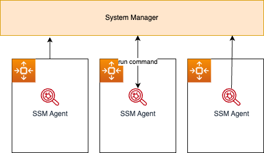

# Major infrastructure services

!!! Info
    Created Sep 23 - Updated 07/01/2024

## Amazon Elastic Compute Cloud - EC2 components

* EC2 is a renting machine, where users size for what the plan to use.
* Amazon EC2 instances are a combination of virtual processors (vCPUs), memory, network, graphics processing units (GPUs), and, instance storage.
* EC2 may store data on [EBS virtual drives.](./storage.md#amazon-elastic-block-storage-ebs).
* Distribute network load across machines using [Elastic Load Balancer](./networking.md/#elastic-load-balancers).
* Auto scale the instances via [Auto Scaling Group](#auto-scaling-group-asg).

EC2 can have MacOS, Linux or Windows OS.

Amazon Machine Image (AMI) is the OS image with preinstalled softwares. Amazon Linux 2 for linux base image. See `AMI Catalog` within the selected region to get what AMI could be used.

 

 **Figure 1: EC2 instance**

When creating an instance, user can select the OS, CPU, RAM, the VPC, the subnet, the storage (EBS) for root folder, the network card, and the firewall rules defined as [Security Group](#security-group).

The security group helps to isolate the EC2 instance, for example, to authorize traffic for ssh on port 22 (TCP) and HTTP on port 80.
Get the public ssh key, and when the instance is started, use a command like: `ssh -i EC2key.pem  ec2-user@ec2-52-8-75-8.us-west-1.compute.amazonaws.com ` to connect to the EC2 via ssh. On the client side, the downloaded `.pem` file needs to be restricted with `chmod 0400`.

User may also use **EC2 Instance Connect** to open a shell terminal from the web browser (still needs to get SSH port accessible in the security group).

vCPU represents thread running on core CPU. We can optimize vCPU allocation on the EC2 instance, once created, by updating the launch configuration.

???+ Warning
    There is a vCPU-based On-Demand Instance limit per region which may impact the creation of new instance. Just submit the limit increase form to AWS and retry the failed requests once approved.

See [this EC2 playground for the deployment of a HTTP server demonstration.](../playground/gettingstarted.md#deploying-apache-http-on-ec2)

or [install nginx on EC2](../playground/gettingstarted.md/#install-nginx-inside-a-ec2-t2micro)

### EC2 life cycle

1. When users launch an instance, it enters in the `pending` state. Billing is started when in `running` state.
1. During rebooting, instance remains on the same host, and maintains its public and private IP addresses, in addition to any data on its instance store.
1. Only EBS-backed instances can be stopped and restarted. With stopped instance, the instance can be rebooted or terminated.
1. When users `terminate` an instance, the instance stores are erased, and we lose both the public IP and private IP addresses of the machine. Storage for any Amazon EBS volumes is still *available and billed*. Note that Reserved Instances that applied to terminated instances are still billed until the end of their term (1 or 3 years) according to their payment option.
1. We will be billed when our On-Demand instance is preparing to hibernate with a stopping state.
1. If the instance is stopped, AWS usually moves the instance to a new host.

When user launches a new EC2 instance, the EC2 service (control plane) attempts to place the instance in such a way that all of the user's instances are spread out across underlying hardware to minimize correlated failures. Developer may use **placement** groups to influence the placement of a group of interdependent instances to meet the needs of the workload. For example in case of high performance computing, using a cluster placement group makes sense.

EC2 has a section to add `User data`, which could be used to define a *bash script* to install dependent software and to start some services at boot time (like `httpd`).

### EC2 Hibernate

When hibernating, in memory state is preserved, persisted to a file in the root EBS volume. It helps to make the instance startup time quicker. The root EBS volume needs to be encrypted.

To use hibernation for supported EC2 instance types, user must configure hibernation at the first launch of the EC2 instance. Provide the required root volume encryption by creating an AMI from an encrypted snapshot of the existing volume.

* Memory is constrained by 150GB RAM.
* No more than 60 days.
* No instance store volume possible.

### EC2 types

EC2 **instance types** like t2.micro or c5.2xlarge define CPU, memory capacities (see [ec2instances.info](https://www.ec2instances.info) or the reference [AWS ec2/instance-types](https://aws.amazon.com/ec2/instance-types/)). The first letter defines the class as:

* R: (memory) applications that needs a lot of RAM – in-memory caches.
* C: (Compute Optimized) applications that needs good CPU – compute / databases, ETL media transcoding, High Perf web servers, scientific modeling.
* M:  applications that are balanced (think “medium”) – general / web app.
* I: (storage) applications that need good local I/O (instance storage) – databases, NoSQL, cache like Redis, data warehousing, distributed file systems.
* G: applications that need a GPU.
* T2/T3 for burstable instance: When the machine needs to process something unexpected (a spike in load for example), it can burst. Use burst credits to control CPU usage.

[Graviton](https://aws.amazon.com/ec2/graviton/) processors are designed by AWS for cloud workloads to optimize cost and energy consumption. (t4g.*, M6g.*, C7*). It uses Arm64 architecture (not x86 compatible). Every vCPU is a full physical core, and use a single non-uniform memory access to get every CPU same access time to memory. 40% better price/performance ratio against other processors.

### [EC2 Nitro System](https://aws.amazon.com/ec2/nitro/)

The Nitro System is a rich collection of building blocks to bring flexible design and rapidly deliver EC2 instance types with an ever-broadening selection of compute, storage, memory, and networking options. It uses new virtualization infrastructure and hypervisor. Supports IPv6, better I/O on EBS and better security.

Nitro System includes next generations of EC2. Instance type starts with C5, D5,...

### Launch types

* **On-demand**: short workload, predictable pricing, pay per second after first minute. No long term commitment.
* **Reserved** for one or 3 years term, used for long workloads like database. Get discounted rate from on-demand. Up to 72% discount. Upfront cost and pay monthly. We can buy and sell reserved instance in the marketplace. When no more needed, `Terminate` the Reserved Instance as soon as possible to avoid getting billed at the on-demand price when renting term expires.
* **Convertible reserved** instance for changing resource capacity over time.
* **[Scheduled reserved](https://aws.amazon.com/ec2/pricing/reserved-instances/pricing/scheduled-ris/)** instance for job based workload, used on a recurring schedule. (Not all instance types are available)
* **Dedicated hosts** to book entire physical server and control instance placement. # years. Use cases arounf **BYOL** (Used to port Microsoft license). Can be on-demand or reserved. Most expensive solution. Use it when users deploy a database technology on an EC2 instance and the vendor license bills based on the physical cores. Bare-metal is part of this option.
* **Capacity reservations**: reserve capacity in a specific AZ for any duration.
* **Spot instance** for very short execution - 90% discount vs on-demand - used for work resilient to failure, like batch job, data analysis, image processing, stateless, containerized...

    * Define a **max spot price** and get the instance while the current spot price < max price user wants to pay. The hourly spot price varies based on offer and capacity.
    * If the current spot price > max, then instance will be stopped within 2 minutes.
    * With **spot block**, we can define a time frame without interruptions from 1 to 6 hours.
    * The expected state is defined in a 'spot request' which can be cancelled. One time or persistent request types are supported. Cancel a spot request does not terminate instance, but this is the first thing to do to avoid cost.
    * **Spot fleets** allow to automatically request spot and on-demand instances with the lowest price to meet the target capacity within the price constraints.

Use [**EC2 launch templates**](https://docs.aws.amazon.com/AWSEC2/latest/UserGuide/ec2-launch-templates.html) to automate instance launches, to simplify permission policies, and to enforce best practices across the organization. Look very similar to docker image. It includes AMI, instance type, EBS volume, a subnet, ... an user data. Launch templates are versioned and defined in one region. A template can be created from another one.

### Instance pools

When facing fluctuating demands, it is critical to maintain fault tolerance and application availability in a cost effective manner.

For each instance family (C5,..), each instance size (8XL, 4XL...), in each availability zone, in every region, there is a separate pool of machines, with different availability and different pricing.

So to be sure to get spot instances, we need to be flexible on the family, size, AZ and region.

Workload needs to be flexible to account for interruptions and or location to maximize application uptime.

### Metadata

Within an EC2 instance shell, we can get access to EC2 metadata by going to the URL: **http://169.254.169.254/latest/meta-data/**.

We can also review scripts used to bootstrap the instances at runtime using **http://169.254.169.254/latest/user-data/**

### EC2 monitoring

Use the following metrics:

* CPU utilization with credit usage and balance
* Network In/Out
* Status check, with instance status to check EC2 VM, and system status for underlying hardware. They are used to do EC2 recovery: set a CloudWatch alarm like StatusCheckFailed_System to do the recovery. Recall that a recovery keeps private and public addresses, EIP, metadata and placement group.
* Disk with read/write for ops/bytes
* RAM is not included in EC2 metrics, need to add an agent in EC2 to get those metrics back to CloudWatch.

### AMI

Bring our own image. Shareable on Amazon Marketplace. Can be saved within S3 storage. By default, the AMIs are privates, and locked for the account / region (need copy between regions).

AMIs can be copied and shared [See AWS doc - copying an AMI](https://docs.aws.amazon.com/AWSEC2/latest/UserGuide/CopyingAMIs.html).

### Basic Fault Tolerance

The following diagram illustrates some fault tolerance principles offered by the AWS services within one AZ:

{ width=700 }

**Figure 2**

* AMI defines image for the EC2 with static or dynamic configuration. From one AMI, user can scale by adding new EC2 based on same image.
* Instance failure can be replaced by starting a new instance from the same AMI.
* [Auto Scaling Group](#auto-scaling-group-asg) groups EC2 instances to adapt their quantity according to the current instances' state or workload.
* To minimize down time, user can have one EC2 instance in `Standby` mode, and uses elastic IP addresses to be re-assigned in case of the primary EC2 failure. 
* Data is saved on EBS and replicated to other EBS inside the same availability zone.
* Snapshot backup can be done to replicate data between AZs and/or regions, and persisted for long retention in S3. 
* Need to flush data from memory to disk before any snapshot.
* Elastic Load Balancer balances traffic among servers in multiple AZs and [DNS](./route53.md) will route traffic to the good server.
* Elastic IP addresses are static and defined at the AWS account level, per region. New EC2 instance can be reallocated to Elastic IP @. EIPs are mapped by internet gateway to the private address of the EC2. The service may be down until new EC2 instance is restarted.
* ELB ensures higher fault tolerance for EC2s, containers, lambdas, IP addresses  and physical servers.
* Application LB load balances at the HTTP, HTTPS level, and within a VPC based on the content of the request.
* NLB is for TCP, UDP, TLS routing and load balancing.  

### Placement groups

Define strategy to place EC2 instances:

* **Cluster**: groups instances into a low-latency group in a single Availability Zone.
    * Highest performance while talking to each other as when performing big data analysis.
* **Spread**: groups across underlying hardware (max 7 instances per group per AZ).
    * Reduced risk in case of simultaneous failure.
    * EC2 Instances are on different physical hardware.
    * Used for application that needs to maximize high availability.
    * Critical Applications where each instance must be isolated from failure from each other.
* **Partition**: spreads instances across many different partitions (which rely on different sets of racks) within an AZ.
    * Partition is a set of racks.
    * Up to 100s of EC2 instances.
    * The instances in a partition, do not share racks with the instances in the other partitions.
    * A partition failure can affect many EC2s but won’t affect other partitions.
    * EC2 instances get access to the partition information as metadata.
    * Good for applications such as HDFS, HBase, Cassandra, Kafka, because they have their own replication machnism

Access from network and policies menu, define the group with expected strategy, and then use it when creating the EC2 instance by adding the instance to a placement group.

### [EC2 network bandwidth](https://docs.aws.amazon.com/AWSEC2/latest/UserGuide/ec2-instance-network-bandwidth.html)

Each EC2 instance has a maximum bandwidth for aggregate inbound and outbound traffic, based on instance type and size. The network bandwidth available to an EC2 instance depends on the number of vCPUs configured, and for less than 32 vCPUs the limit (single flow of 5-tuple) (source IP address/port number, destination IP address/port number and the protocol) is around 5 Gbps when instances are not in the same cluster placement group.

Also bandwidth depends on the flow type: within one region or cross-regions.

To meet additional demand, EC2s can use a network I/O credit mechanism to burst beyond their baseline bandwidth.

However, instances might not achieve their available network bandwidth, if they exceed network allowances at the instance level, such as packet per second or number of tracked connections.

Recalls that Enterprise-grade WAN and DIA links more commonly have symmetrical bandwidth, the data capacity is the same in both directions.

### [EC2 Instance Store](./storage.md#ec2-instance-store-volumes)

See [section in storage.](./storage.md#ec2-instance-store-volumes)

### Optimizing usage

The new generation of infrastructure helps to optimize cost and capacity by looking at three key areas:

* EC2 **saving plans** and spot instances. Savings Plans are a flexible pricing model that offer low prices on EC2, Fargate and Lambda usage, in exchange for a commitment to a consistent amount of usage (1 or 3 years). It is accessible from EC2 console. It supports two types of Savings Plans: **Compute Savings Plans** and **EC2 Instance** SPs (EC2 instance family in a region).
* [ODCR- On-Demand Capacity Reservations](https://docs.aws.amazon.com/AWSEC2/latest/UserGuide/ec2-capacity-reservations.html) enable users to reserve compute capacity for the Amazon EC2 instances in a **specific** AZ for any duration. Create Capacity Reservation when running critical workloads with certain long term capacity (DR use cases, Events, Regulatory needs). No yearly commitment. Billing starts as soon as created. When creating the CR, users need to specify EC2 instance attributes like type, tenancy (shared HW or dedicated), OS (linux based)... that will be used to select EC2 from the pool. Capacity Reservations can be created in cluster placement groups.
* [EC2 Auto scaling](#auto-scaling-group-asg) help to scale down.
* [**Compute Optimizer**](https://docs.aws.amazon.com/compute-optimizer/latest/ug/what-is-compute-optimizer.html) is a new, free service to recommend optimal compute resource to reduce costs up to 25%.  It analyzes CloudWatch metrics and considers ASG configuration for recommendations. 

### Documentation

* [EC2 product doc](https://docs.aws.amazon.com/AWSEC2/latest/UserGuide/concepts.html)
* [EC2 cheat sheet](https://tutorialsdojo.com/amazon-elastic-compute-cloud-amazon-ec2/)

### Labs / Playground

* [Create keys and EC2 using console](../playground/gettingstarted.md/#create-a-ssh-keypair)
* [Create EC2 on default VPC with HTTPS server using CDK](https://github.com/jbcodeforce/aws-studies/blob/main/labs/cdk/ec2-basic/ec2_basic/ec2_basic_stack.py)
* [EC2 with Python Flask App in private subnet - CDK](https://github.com/jbcodeforce/aws-cdk-project-templates/blob/main/EC2pythonAppStack/ec2_python_stack.py)
* [Create EC2 with Terraform](../playground/gettingstarted.md/#create-a-ec2-instance-with-terraform)


## Quota

Service Quotas is an AWS service that helps manage user's quotas for over 100 AWS services from one user interface.
The AWS account has default quotas, formerly referred as limits, defined for each AWS service. Unless otherwise noted, each quota is Region specific. We can request increases for some quotas, and other quotas cannot be increased. Each EC2 instance can have a variance of the number of vCPUs, depending on its type and configuration, so it's always wise to calculate the vCPU needs to make sure developers are not going to hit quotas too early. Along with looking up the quota values, developers can also request a quota increase from the Service Quotas console.

## Security group

Define inbound and outbound security rules.  It is like a virtual firewall inside an EC2 instance. SGs regulate access to ports, authorized IP ranges IPv4 and IPv6, control inbound and outbound network. By default all inbound traffic is denied and outbound authorized.

* They contain `allow rules` only.
* Can be attached to multiple EC2 instances and to load balancers.
* An EC2 instance can have up to five SGs
* Locked down to a region / VPC combination.
* SG lives outside of the EC2 definition so can be attached to any EC2.
* Define one separate security group for SSH access where we can authorize only one IP@.
* Connection refused is an application error or the app is not launched - Spinning wheel in the web browser is an access rules error.
* EC2 instances with the same security group can access each other.
* Security group can reference other security groups: doing so allows traffic to flow to and from instances that are associated with the referenced security group in the peered VPC. One IP address using CIDR in the form 192.45.23.12/32 but not any DNS server. The following is a bad SG as port SSH 22 is accessible from the internet: 0.0.0.0/0.

 

**Figure 3: security group with inbound rules**

Important Ports:

* 22 for SSH (Secure Shell) and SFTP.
* 21 for FTP.
* 80 for HTTP.
* 443 for https.
* 3389: Remote desktop protocol.

## Auto Scaling Group (ASG)

The goal of an ASG is to scale out (add EC2 instances) to match an increased load, or scale in (remove EC2 instances) to match a decreased load. It can use different methods: predictive, dynamic, manual, instance level, or scheduled scaling. It helps to provision and balance capacity across Availability Zones to optimize availability. It uses historical data gathered from CloudWatch to build ML models to help calculating capacity requirements over time. The model continues to learn from new data to improve accuracy.

It can also ensure,  having a minimum and a maximum number of machines running. It detects when an instance is unhealthy. And automatically registers newly created instance to a load balancer.


[ASG](https://us-west-1.console.aws.amazon.com/ec2autoscaling/home?region=us-west-1#/) has the following attributes:

* AMI + Instance Type with EC2 User Data (Can use launch template to define instances).
* EBS Volumes.
* Security Groups.
* SSH Key Pair.
* Min Size / Max Size / Initial Capacity to control number of instances .
* Network + Subnets Information to specify where to run the EC2 instances.
* Load Balancer Information, with target groups to be used as a grouping mechanism of the newly created instance.


* Scaling Policies help to define rules to manage instance life cycle, based on CPU usage or network bandwidth usage, or count the number of request:

 

* ASG tries to balance the number of instances across AZs by default.

* The Default Termination Policy is designed to help ensure that the instances span Availability Zones evenly for high availability. Determine which Availability Zones have the most instances, and at least one instance that is not protected from scale in.

    * Determine which instances to terminate so as to align the remaining instances to the allocation strategy for the on-demand or spot instance that is terminating. This only applies to an Auto Scaling Group that specifies allocation strategies. For example, after the instances launch, user may change the priority order of the preferred instance types. When a scale-in event occurs, Amazon EC2 Auto Scaling tries to gradually shift the on-demand instances away from instance types that are lower priority.
    * Determine whether any of the instances use the oldest launch template or configuration: works for Auto Scaling Groups that use a launch template. Determine whether any of the instances use the oldest launch template unless there are instances that use this launch configuration. Amazon EC2 Auto Scaling terminates instances that use a launch configuration before instances that use a launch template.
    * For Auto Scaling Groups that use a launch configuration: Determine whether any of the instances use the oldest launch configuration. After applying all of the above criteria, if there are multiple unprotected instances to terminate, determine which instances are closest to the next billing hour. If there are multiple unprotected instances closest to the next billing hour, terminate one of these instances at random.

* When creating scaling policies, **CloudWatch** alarms are also created. Ex: "Create an alarm if: CPUUtilization < 36 for 15 data points within 15 minutes".
* To scale on unexpected peak of requests, it is better to use dynamic scaling based on the number of requests sent to each EC2, to anticipate when it goes higher, to start new instances on time. While looking at CPU will be too late.
* Target tracking scaling: we want average CPU to be under 40%.
* Scheduled action: increase capacity after 5 PM.
* Predictive scaling by looking at historical behavior to build forecast rules.

* The capacity of the ASG cannot go over the maximum capacity we have allocated during scale out events.
* Cool down period is set to 5 mn and will not change the number of instances until this period is reached.
* When an ALB validates an health check issue, ASG terminates the EC2 instance.

???- info "Tutorials:"
    * [Create your first Auto Scaling group](https://docs.aws.amazon.com/en_us/autoscaling/ec2/userguide/create-your-first-auto-scaling-group.html): present how to use Launch Template, to create a single instance in one ASG. 
    * [Set up a scaled and load-balanced application](https://docs.aws.amazon.com/en_us/autoscaling/ec2/userguide/tutorial-ec2-auto-scaling-load-balancer.html).
    * [Configure a lifecycle hook that invokes a Lambda function.](https://docs.aws.amazon.com/en_us/autoscaling/ec2/userguide/tutorial-lifecycle-hook-lambda.html)

???- question "ASG, placement group cluster, launch template and capacity reservations?"
    Auto Scaling Group uses launch template to simplify instances creation, and to ensure best practices using the EC2 group. Placement group helps to place EC2s within infrastructure, and spread or partition can be used within one AZ. Capacity reservations target a specific AZ and EC2 type.

???- question "Change EC2 type in an already created launch configuration"
    It is not possible to modify a launch configuration once it is created. If we need to change the EC2 instance type, for example, developers need to create a new launch configuration to use the correct instance type. Modify the Auto Scaling group to use this new launch configuration. Delete the old launch configuration as it is no longer needed.

???- question "How to update an existing application running in EC2/ ASG?"
    Create a new launch template, still associated with the same ASG, the ALB will route to both instance versions, when confident of the new version, we can terminate the first launch template. An alternate solution is to create a second ALB's target group with a new ASG with the new launch template. ALB can do traffic shifting to new version. A 3nd solution, involves using 2 ALB -> Target group -> ASG, and use Route 53 CNAME with weighted record.

    


## [AWS Outposts](https://docs.aws.amazon.com/outposts/latest/userguide/what-is-outposts.html)

Outpost is fully managed service that extends AWS infrastructure, services, APIs, and tools to customer on-premises. It is a Rack with n server blades installed by AWS team, on site, and then maintained by AWS. 


An Outpost extends a VPC from one AWS region, it is owned by one AZ and used to increase resiliency.


See [pricing for Outpost rack](https://aws.amazon.com/outposts/rack/pricing/).

## High Performance Computing (HPC)

The services that helps to design HPC solutions are:

* For data management and transfer:

    * [Direct Connect](./networking.md#direct-connect): moves GB of data over private secure network.
    * [Snowball & Snowmobile](./storage.md#snowball) at PB data transfer level.
    * [DataSync](./storage.md#datasync) moves large dataset between on-premises and S3, FSx for Windows, or EFS.

* Computation and network:

    * EC2 instance type using CPU or GPU optimized.
    * Spot fleet and spot instances for cost savings and using Auto Scaling Group for auto scaling.
    * Cluster [Placement groups](#placement-groups) in same rack and AZ to get the best network performance.
    * Enhanced Networking (SR-IOV): with high bandwidth, higher PPS, lower latency. 
    * Elastic Network Adapter (ENA) is up to 100 Gbps.
    * Intel 82599 VF up to 10 Gbps (a legacy solution).
    * Elastic Fabric Adapter (EFA), dedicated ENA for HPC, only for Linux. Improve inter-node communication, for tightly coupled workload. It leverages Message Passing Interface standard to bypass the Linux kernel to provide low-latency transport.

* Storage:

    * Instance storage with EBS scale to 256k IOPS with io2 Block Express or instance store to scale to millions of IOPS.
    * Network storage: S3, EFS and FSx for Lustre.

* Automate and orchestrate:

    * AWS Batch to support multi-node parallel jobs. Easily schedule jobs and launch EC2 instance accordingly.
    * ParallelCluster: open source project for cluster management, using infrastructure as code, and EFA.

## Simple Email Service - SES

Fully managed service to send and receive emails. Used to send email from applications using API, SMTP or AWS console.

## [Amazon PinPoint](https://docs.aws.amazon.com/pinpoint/latest/userguide/welcome.html)

Marketing communication services, SMS, email, push, voice, and in-app messaging. It supports customer segmentation and personalized messages. 

## [AWS Systems Manager](https://docs.aws.amazon.com/systems-manager/latest/userguide/what-is-systems-manager.html)

[Systems Manager](https://us-west-2.console.aws.amazon.com/systems-manager/home?region=us-west-2#) is a collection of capabilities to help manage the applications and infrastructure. Systems Manager simplifies application and resource management, shortens the time to detect and resolve operational problems, and helps SREs manage the AWS resources securely at scale.

With System Manager developers can remote access to EC2 instances.



It uses activation code and activationID which are similar to ec2 access key and secret key. Each instance runs a SSM Agent (by default in Ubuntu and Linux 2), installed by the user-data script as :

```sh
sudo yum update -Y
mkdir /tmp/ssm
curl https://s3.amazonaws.com/ec2-downloads-windows/SSMAgent/latest/linux_amd64/amazon-ssm-agent.rpm -o /tmp/ssm/amazon-ssm-agent.rpm
sudo yum install -y /tmp/ssm/amazon-ssm-agent.rpm
sudo stop amazon-ssm-agent
sudo amazon-ssm-agent -register -code "activation-code" -id "activation-id" -region us-east-1
sudo start amazon-ssm-agent
```

The IAM roles with the IAM policy: `AmazonSSMManagedInstanceCore` enables an EC2 instance to use AWS Systems Manager service core functionality. 

Ability to control AWS infrastructure like EC2, Amazon Relational Database Service (RDS), Amazon Elastic Container Service (ECS), and Amazon Elastic Kubernetes Service (EKS) instances,  with an unified user's experience. It includes a set of services like Session Manager, Patch Manager, Run Commands, Inventory or define maintenance windows.

A command is a script, and can be launched on multiple instances. CloudTrail is used to audit commands.

A **managed instance** is any machine configured for AWS Systems Manager. It supports machines on-premises. With System manager there is no need to use SSH, it uses the session manager, which helps to trace all actions done on the EC2 system.

Automation is the motivation to simplify maintenance and deployment tasks of EC2 instances, like automating runbooks.

It includes, `Parameter Store` which provides secure, hierarchical storage for configuration data and secrets management. You can store data such as passwords, database strings, Amazon Elastic Compute Cloud (Amazon EC2) instance IDs and Amazon Machine Image (AMI) IDs, and license codes as parameter values. Parameter Store is also integrated with Secrets Manager.

Path manager uses patch baseline, patch groups defined on tags, maintenance windows and a rate control to address concurrency and error threshold. 

It is free service.

* [Infrastructure Identity in AWS workshop](https://idm-infrastructure.awssecworkshops.com/) to use Systems Manager and IAM.

## [AWS Health](https://docs.aws.amazon.com/health/latest/ug/what-is-aws-health.html)

AWS Health provides ongoing visibility into our resource performance and the availability of our AWS services and accounts. 

Can be used as a way to automate the start and stop of the Amazon EC2 instance: set up an Amazon EventBridge rule that is triggered by the AWS Health event. Target a Lambda function to parse the incoming event and reference the Amazon EC2 instance, ID included. Have the function perform a stop and start of the instance.

.

## [AWS Application Migration Service](https://aws.amazon.com/application-migration-service/)

[AWS MGN](https://aws.amazon.com/blogs/aws/how-to-use-the-new-aws-application-migration-service-for-lift-and-shift-migrations/) is the primary migration service recommended for lift-and-shift migrations to AWS without having to make any changes to the applications, the architecture, or the migrated servers.

Implementation begins by installing the AWS Replication Agent on the source servers. When launch Test or Cutover instances are launched, AWS Application Migration Service automatically converts the source servers to boot and run natively on AWS.

Can be used to migrate Amazon Elastic Compute Cloud (EC2) workloads across AWS Regions, Availability Zones, or accounts.

