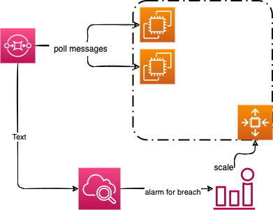
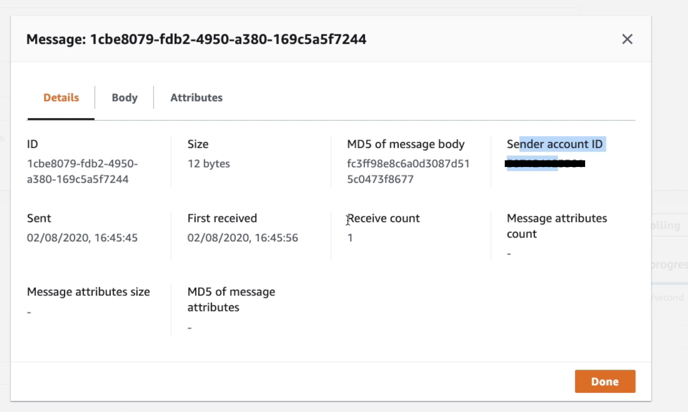
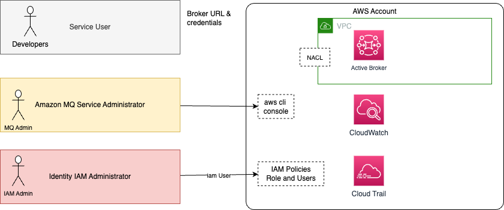
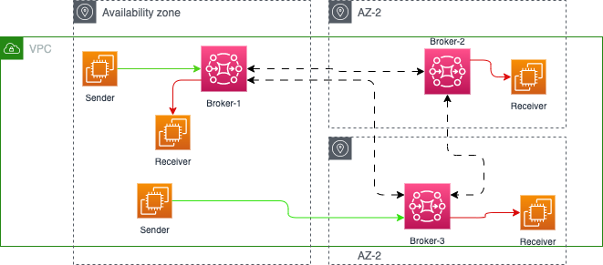
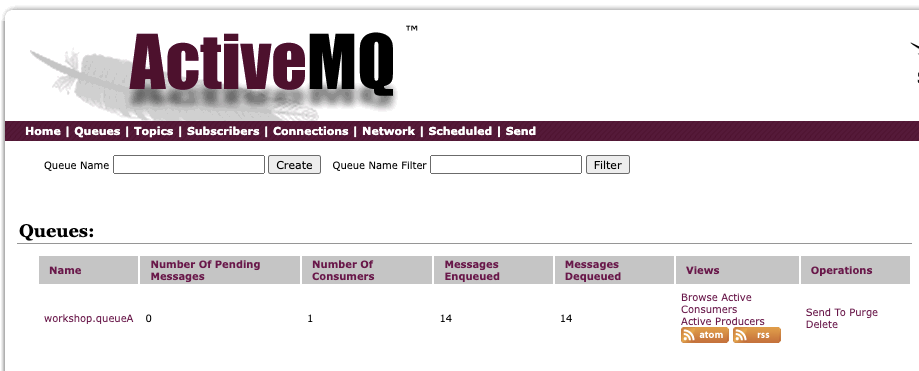
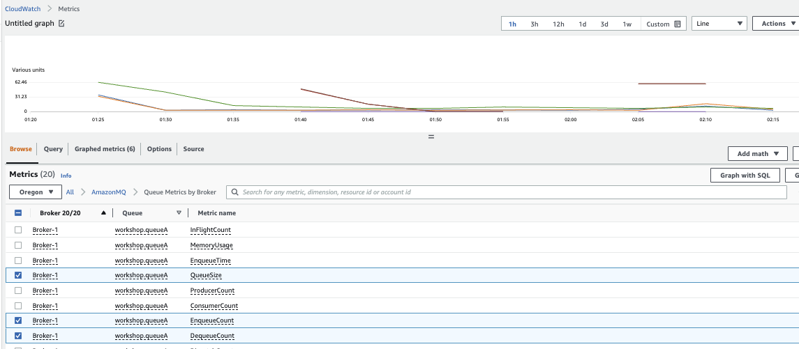
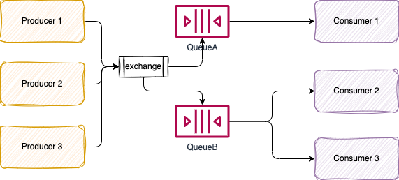
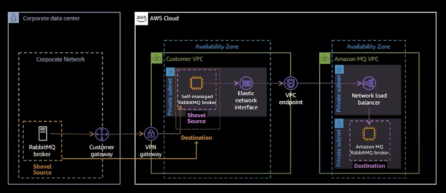
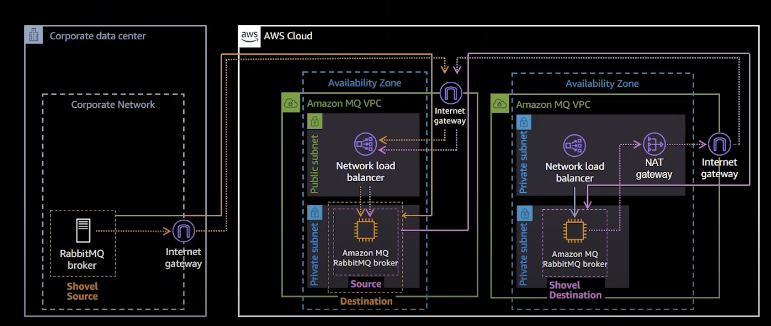

# Integration and middleware: SQS, SNS

## [SQS: Standard queue](https://docs.aws.amazon.com/AWSSimpleQueueService/latest/SQSDeveloperGuide/welcome.html)

* Oldest queueing service on AWS. Full managed service.
* Unlimited throughput and unlimited number of message in queue.
* The default retention is 4 days up to 14 days. low latency < 10ms. 
* Max message size is 256KB. Can be configured at the queue level. If messages are > 256k, use the claim-check pattern using S3 bucket.
* By default duplicate message is possible (at least once delivery) and out of order too (best effort).
* Consumer deletes the message.
* Supports automatic scaling.
* Max delay is 15 minutes
* Max queue size is 120k for standard and 20k for FIFO.
* SQS can be used as a write buffer for DynamoDB using a Lambda or other app to do the write.
* [See serverlessland patterns](https://serverlessland.com/search?search=SQS)

Specific SDK to integrate to `SendMessage`, `GetMessage`...

Consumers receive, process and then delete the messages. Parallelism is possible. The consumers can be in an auto scaling group (ASG) and with CloudWatch, it is possible to monitor the queue size / # of instances and in the CloudWatch alarm action, triggers EC2 scaling. 

{ width=600 }

**Figure 1: Auto scaling with  CloudWatch**

Message has metadata out of the box. After a message is polled by a consumer, it becomes invisible to other consumers.

 { width=600 }

**Figure 2: Messsage over SQS Metadata**

### Fan-out pattern

When we need to send the same message to more than one SQS consumer, we need to combine SNS and SQS: message is sent to the SNS topic and then "fan-out" to multiple SQS queues. It's fully decoupled, no data loss, and we have the ability to add more SQS queues (more applications) over time.

This is the pattern to use if consumer may be down for a long period: solution based on SNS only, will make some messages not processed and lost.

### [Visibility timeout](https://docs.aws.amazon.com/AWSSimpleQueueService/latest/SQSDeveloperGuide/sqs-visibility-timeout.html)

By default, the “message visibility timeout” is 30 seconds, which means the message has 30 seconds to be processed (Amazon SQS prevents other consumers from receiving and processing the message). If a consumer fails to process a message within the Visibility Timeout, the message goes back to the queue.

{ width=700 }

**Figure 3: SQS message visibility**

After the message visibility timeout is over, the message is “visible” in SQS, therefore the message may be processed twice. But a consumer could call the `ChangeMessageVisibility` API to get more time to process. When the visibility timeout is high (hours), and the consumer crashes then the re-processing of all the messages will take time. If it is set too low (seconds), we may get duplicates.

To reduce the number of API call to request message (improve latency and app performance), consumer can use the `long polling` API and wait for message arrival. 

When processing SQS messages in batches, if one of those messages cannot be processed, the consumer needs to handle the failure and returns a partial batch response, so only failed messages will be re-processed.  [See best practices for batch handling](https://docs.aws.amazon.com/prescriptive-guidance/latest/lambda-event-filtering-partial-batch-responses-for-sqs/best-practices-partial-batch-responses.html).

If you do not handle the error and just raise an exception on Lambda side, the whole batch will be reprocessed, including successfully processed messages.

### SQS Dead Letter Queue

We can set a threshold for how many times a message can go back to the queue.

After the `MaximumReceives` threshold is exceeded, the message goes into a dead letter queue (DLQ) (which has a limit of 14 days to process).

 { width=600 }

 **Figure 4: Dead letter queue configuration**

Delay queues let us postpone the delivery of new messages to a queue for a number of seconds. If we create a delay queue, any messages that we send to the queue remain invisible to consumers for the duration of the delay period. The default (minimum) delay for a queue is 0 seconds. The maximum is 15 minutes.

See [redrive back to source](https://docs.aws.amazon.com/AWSSimpleQueueService/latest/SQSDeveloperGuide/sqs-configure-dead-letter-queue-redrive.html)
to get the message back from the DLQ to the source queue (once the consumer application code is modified for example).

### SQS FIFO Queue

Queue can be set as FIFO to guaranty the order: limited to throughput at 300 msg/s without batching or 3000 msg/s with batching. It can also support [exactly once delivery](https://docs.aws.amazon.com/AWSSimpleQueueService/latest/SQSDeveloperGuide/FIFO-queues-exactly-once-processing.html). While configuring the FIFO queue a parameter (ContentBasedDeduplication) can be set to remove duplicate by looking at the content: Every message must have a unique `MessageDeduplicationId`.

*The name of the queue has to end with `.fifo`*.

If we don't use a Group ID, messages are consumed in the order they are sent, with only one consumer. But using Group ID, we can have as many consumers as there is groups. It looks like partition key in kinesis data streams.
Each consumer will get ordered records.

### Security

For security, there is encryption in flight via HTTPS, and at rest with KMS keys. SQS API access control via IAM policies, and SQS Access Policies for cross-account access and for other AWS services to access SQS.

It comes with monitoring.

### Sample Code

* [Python boto3 SQS](https://boto3.amazonaws.com/v1/documentation/api/latest/guide/sqs.html)
* [See consumerSQS and produceSQS in Python study / aws folder](https://github.com/jbcodeforce/python-code)

## SNS - Simple Notification Service

Serverless. Used for pub/sub communication. Producer sends message to one SNS Topic. SNS pushes data to subscribers. SNS supports up to 12,500,000 subscriptions per topic, 100,000 topic limit.

Each subscriber to the topic will get all the messages. As data is not persisted, we may lose messages not processed in a time window.

The producers can publish to topic via SDK and can use different protocols like: HTTP / HTTPS (with delivery retries – how many times), SMTP,  SMS, ... 

SNS can filter message (a JSON policy attached to the SNS topic's subscription).

The subscribers can be a SQS queue, a HTTPs endpoint, a Lambda function, Kinesis Firehose, Emails... But not Kinesis Data Streams.

Many AWS services can send data directly to SNS for notifications: CloudWatch (for alarms), AWS budget, Lambda, Auto Scaling Groups notifications, Amazon S3 (on bucket events), DynamoDB, CloudFormation, AWS Data Migration Service, RDS Event...

SNS can be combined with SQS: Producers push once in SNS, receive in all SQS queues that they subscribed to. It is fully decoupled without any data loss. SQS allows for data persistence, delayed processing and retries. SNS cannot send messages to SQS FIFO queues.

For security it supports HTTPS, and encryption at rest with KSM keys. For access control, IAM policies can be defined for the SNS API (looks like S3 policies). Same as SQS, used for cross account access and with other services. 

### Combining with SQS - Fan Out pattern

* An application pushes once in a SNS Service, and the SQS queues are subscribers to the topic and then get the messages. Fan Out.
* Fully decoupled with no data loss as SQS will always listen to SNS topic.
* SQS adds data persistence, delayed processing and retries of work.
* Increase the number of subscriber over time.
* Using SNS FIFO and SQS FIFO it will keep ordering.
* Can use Message Filtering using a JSON policy .
* Can be used for cross-region delivery, with a SQS queue in another region.

## Streaming

See [dedicated note](../kinesis/index.md) for Kinesis and [MSK for managed Kafka](../serverless/msk.md).

## [Amazon MQ](https://docs.aws.amazon.com/amazon-mq/latest/developer-guide/welcome.html)

Amazon MQ is a managed message broker for RabbitMQ or ActiveMQ. It runs on EC2 servers, and supports multi-AZs deployment with failover.

We can create brokers via Console or AWS CLI, see a [playground repository](https://github.com/jbcodeforce/aws-messaging-study) with CDK set up examples and code to produce and consume messages.

As a queueing system, when a message is received and acknowledged by one receiver, it is no longer on the queue, and the next receiver to connect gets the next message on the queue.

Multiple senders can send messages to the same queue, and multiple receivers can receive messages from the same queue. But each message is only delivered to one receiver only.

With topics, a consumer gets messages from when it starts to consume, previous messages will not be seen. Multiple subscribers will get the same message. All the messages sent to the topic, from any sender, are delivered to all receivers.

### Value propositions

* Keep skill investment and code compatibility for existing applications
* Reduce costs
* Deployment automation with CloudFormation, deploy in minutes.
* Reduced operation overhead, including provisioning, updates, monitoring, maintenance, security and troubleshooting.
* Vertical scaling with EC2 instance size and type
* Horizontal scaling through network of brokers.
* Queues and topics in one service so you can easily fan out or build durable queue
* Both Transient and persistent messages messaging to optimize for durability or performance
* Lower latency
* Support Lift and shift existing apps to the cloud, and use an hybrid architecture.

### Security

* Access to AWS Console and Specific engine console to administrators
* Encryption in transit via TLS
* Encryption at rest using KMS: when creating the broker, we can select the KMS key to use to encrypt data.
* VPC support for brokers isolation and applications isolation
* Security groups for firewall based rules
* Queue/topic authentication and authorization using Configuration declarations
* Integrated with CloudTrail for Amazon MQ API auditing
* User accesses can be defined in an external LDAP, used for management Console access or for service accounts. Apps identifications are done inside the broker configuration.



### Production deployment

In the Amazon MQ, the primary AWS resources are an Amazon MQ message broker and its configuration.

For production deployment, it supports clustering with active/standby mode with one server in a different AZ will be in passive mode, and will get data from Amazon EFS, which replicates data across AZs.
For an active/standby broker, Amazon MQ provides two ActiveMQ Web Console URLs, but only one URL is active at a time.

{ with=600 }

**Figure 5: Active/standby deployment with Amazon MQ**

We can choose a mesh network of 3 single-instance brokers for scaling and availability, or a mesh network of active/standby brokers. With Amazon MQ HA, any one of the two Active/Stanby brokers can be active at a time.

Each broker can accept connections from clients. The client endpoints are named transportConnectors. Any client connecting to a broker uses a failover string that defines each broker that the client can connect to send or receive messages.

```sh
amqp+ssl://b-5......87c1e-1.mq.us-west-2.amazonaws.com:5671
amqp+ssl://b-5......87c1e-2.mq.us-west-2.amazonaws.com:5671
```

In order to scale, client connections can be divided across brokers. The following diagram illustrates a configuration over 3 AZs, and the corresponding [CloudFormation template can be found here](https://s3.amazonaws.com/amazon-mq-workshop/CreateAmazonMQWorkshop.yaml).

{ width=900 }

**Figure 6: Amazon MQ cluster deployment**

Because those brokers are all connected using network connectors, when a producer sends messages to say NoB1, the messages can be consumed from NoB2 or from NoB3. This is because `conduitSubscriptions` is set to false.

Essentially we send messages to any brokers, and the messages can still be read from a different brokers.

### Maintenance

AWS is responsible of the hardware, OS, engine software update. Maintenance may be scheduled once a week and can take up to 2 hours. Automatic maintenance can be enforced for minor version upgrade.

Broker has a critical action required state, that can be addressed by an administrator.

### [Active MQ](https://activemq.apache.org/)

???+ info "Active MQ"
    Active MQ is an OOS, multi-protocol, java based message broker. It supports message load balancing, HA. Multiple connected "master" brokers can dynamically respond to consumer demand by moving messages between the nodes in the background. Brokers can also be paired together in a master-slave configuration. It also supports embedding the broker in a java app. Amazon MQ supports the classic version (5.x) (See personal [code and study](https://jbcodeforce.github.io/aws-messaging-study/)).

For detail explanations of the open source platform and the deployment on Amazon MQ see the [AWS Messaging studies site](https://jbcodeforce.github.io/aws-messaging-study/activemq).


For **queue** mechanisms:

* Queue supports point to point, and request/replyTo pattern.
* Queue can have multiple senders and consumers, the message will be load balanced between consumers. Messages acknowledged are removed from the queue.
* Message with a TTL will be removed from queue, without being consumed.

For **topic** mechanism:

* Support pub/sub.
* With Topic, receiver starts to receive only the new messages, that are being sent by the sender. Messages sent to topic without consumer are lost.
* Topics support the fan-out pattern. All Messages sent by any senders are received by all connected receivers.

For **access control** we can define users/applications to authorize access to the queues and topics.

#### Configurations

A configuration contains all of the settings for the ActiveMQ brokers, in XML format. It is possible to configure users and groups, and then `authorizationMap` so a specific queue or topic can only be accessed by a specific user/app (The declaration below, allows user1 to manage, write and read from `queue.user1`, but not user2, who is allowed instead to admin, read and write on `topic.user2`): 

```xml
<authorizationPlugin>
    <map>
    <authorizationMap>
        <authorizationEntries>
          <authorizationEntry admin="admin,activemq-webconsole" queue="&gt;" read="admin,activemq-webconsole" write="admin,activemq-webconsole"/>
          <authorizationEntry admin="admin,activemq-webconsole" topic="&gt;" read="admin,activemq-webconsole" write="admin,activemq-webconsole"/>
          <authorizationEntry admin="admin,user1" queue="queue.user1" read="user1" write="user1"/>
          <authorizationEntry admin="admin,user2" read="user2" topic="topic.user2" write="user2"/>
          <authorizationEntry admin="admin,user1,user2" read="admin,user1,user2" topic="ActiveMQ.Advisory.&gt;" write="admin,user1,user2"/>
        </authorizationEntries>
        <tempDestinationAuthorizationEntry>
        <tempDestinationAuthorizationEntry admin="tempDestinationAdmins" read="tempDestinationAdmins" write="tempDestinationAdmins"/>
        </tempDestinationAuthorizationEntry>
    </authorizationMap>
    </map>
</authorizationPlugin>
```

In order to apply the modifications done to the broker configuration, such as adding users, the broker must be rebooted. A reboot can be scheduled, and use specific configuration revision to specify which configuration updates to apply.

From the AWS Amazon MQ Broker console, we can access to the Active MQ console and see the queues.

{ width=800 }

**Figure 7: Active MQ admin console**


#### Performance considerations

* The size of the message determines performance of the broker, above 100k, storage throughput is a limiting factor.
* With in-memory queue without persistence, Active MQ can reach high throughput. With no message lost goal, it uses persistence with flush at each message, and it will be bound by the I/O capacity of the underlying persistence store, EBS or EFS. `mq.m5.large`.
* To improve throughput with Amazon MQ, make sure to have consumers processing messaging as fast as, or faster than the producers are pushing messages.
* With EFS replication, with cluster and HA, throughput will be lower.
* [Blog: "Measuring the throughput for Amazon MQ using the JMS Benchmark".](https://aws.amazon.com/blogs/compute/measuring-the-throughput-for-amazon-mq-using-the-jms-benchmark/)  


### Amazon MQ Monitoring

AmazonMQ publishes [utilization metrics for the brokers](https://docs.aws.amazon.com/amazon-mq/latest/developer-guide/security-logging-monitoring.html), such as `CpuUtilization, HeapUsage, NetworkOut`. If we have a configuration with a primary and a secondary broker, we will have independent metrics for each instance.

It also publishes metrics for queues and Topics such as `MemoryUsage, EnqueueCount` (messages published by producers), `DispatchCount` (message delivered to consumers).

{ width=900 }

**Figure 8: Queue monitoring with metrics**

Using Cloudwatch alarm we can auto scale the consumer based on metrics value.

### Amazon MQ  Network of brokers

In order to provide massive scalability, Amazon MQ supports a feature known as Network of Brokers using topology (see figure 6 above). Each active/standby broker runs in three availability zones, with messages stored in a **shared durable storage**. Thus, providing high availability and message durability in itself.

Brokers are connected with each other using `OpenWire` network connectors. Within each broker configuration, for each queue and topic, there are  a set of networkConnector items defining connection from the current broker and two other brokers in the mesh. So each broker has a different networkConnector, to pair to each other broker.

```xml
  <networkConnectors>
    <networkConnector conduitSubscriptions="false" consumerTTL="1" messageTTL="-1" name="QueueConnector_ConnectingBroker_1_To_2" uri="masterslave:(ssl://b-c2....2-1.mq.us-west-2.amazonaws.com:61617,ssl://b-c2...2-2.mq.us-west-2.amazonaws.com:61617)" userName="mqadmin">
      <excludedDestinations>
        <topic physicalName="&gt;"/>
      </excludedDestinations>
    </networkConnector>
    <networkConnector conduitSubscriptions="false" consumerTTL="1" messageTTL="-1" name="QueueConnector_ConnectingBroker_1_To_3" uri="masterslave:(ssl://b-ad...647-1.mq.us-west-2.amazonaws.com:61617,ssl://b-ad...d747-2.mq.us-west-2.amazonaws.com:61617)" userName="mqadmin">
      <excludedDestinations>
        <topic physicalName="&gt;"/>
      </excludedDestinations>
    </networkConnector>
```

In a network of brokers, messages flow between brokers using `networkConnectors` only when a consumer demands them. The messages do not flow to other brokers if no consumer is available.

The duplex attribute on `networkConnector` essentially establishes a two-way connection on the same port. This would be useful when network connections are traversing a firewall and is common in *Hub and Spoke* broker topology. In a Mesh topology, it is recommended to use explicit unidirectional networkConnector as it allows flexibility to include or exclude destinations.

Each broker can accept connections from clients. In order to scale, client connections can be divided across brokers. Because these brokers are all connected using network connectors, when a producer sends messages to say NoB1, the messages can be consumed from NoB2 or from NoB3.

For deeper studies on ActiveMQ, RabbitMQ with code samples see [the aws-messaging-study repository](https://github.com/jbcodeforce/aws-messaging-study).


### Amazon MQ [Pricing](https://aws.amazon.com/amazon-mq/pricing/)

We pay by the hour of broker time according to the type of EC2 used as broker. The topology also impact prcing between single, active/standby and cluster.

Storage price based on GB persisted on EFS in case of cluster, or EBS in case of single instance.

Data transfer pricing applies:

* For Traffic forwarded between brokers across availability zones in the same region
* For Traffic cross-region based on EC2 pricing. In region is not charged.
* For traffic out to the internet.

### Rabbit MQ

[RabbitMQ](https://www.rabbitmq.com/) is an OOS message broker with highly flexible **routing** capability.

Some Rabbit MQ important concepts:

* **Exchanges**: take a message and route it into zero or more queues or other exchanges. The supported types are `Direct, Topic, Fanout (like a pub/sub), Headers`. Exchanges are routing rules.
* **Bindings**: rules used by exchanges to route messages to queues.
* **Queues**: store messages. Single instance broker uses EBS as local storage.



Some key characteristics:

* RabbitMQ sends acknowledgements to publishers on message receipt
* Consumers maintain persistent TCP connections with RabbitMQ and declare which queue(s) they consume. Messages are pushed to consumers.
* Consumers send acknowledgements of success/failure.
* Messages are removed from queues once consumed successfully.
* We can have competing consumers to scale the message processing
* RabbitMQ offers "at most once delivery" and "at least once delivery"
* Consumer can configure a prefetch limit to avoid falling behind when producers send message faster than can be consumed.
* `Direct` exchanges route messages to queues/exchanges that have a Binding Key that exactly matches the routing key.
* `Header` exchanges route messages according to those header values.
* `Consistent Hashing` exchange that hashes either the routing key or a message header and routes to one queue only. This is used for order guarantees with scaled out consumers.
* The publisher can set the lifetime of the message and also the queue can have a message TTL.
* Exchanges and queues can be dynamically created and given auto delete characteristics. It is used for ephermal reply queues.
* RabbitMQ offers a set of plugins (consisten hashing exchange, STOMP, MQTT, web hooks, SMTP,...). For example the Management Plug-In that provides an HTTP server, with web UI and REST API.
* RabbitMQ offers Single Active Consumer (SAC) which prevents more than one consumer actively consuming a queue at the same time. So to cover scaling out and message ordering use the Consistent Hash Exchange and manually implement the consumer group logic of Kafka ourselves by using Single Active Consumer and custom hand-rolled logic.


* [See sample example in labs/messaging/rabbitmq](https://github.com/jbcodeforce/aws-studies/tree/main/labs/messaging/rabbitmq)
* [Summary from this article](https://jack-vanlightly.com/blog/2017/12/4/rabbitmq-vs-kafka-part-1-messaging-topologies)

#### Hybrid Cloud with Rabbit MQ

The classical needs are to move existing messaging solution running on-premises to cloud. Move the management to AWS will bring the operational responsability to AWS (product upgrage, infrastructure management). 

* Easy to describe the cluster configuration using code, with cloud formation for ex. From single instance or three-node, clustered broker.
* Encryption in transit over TLS and at rest with KMS keys.
* Supports ActiveMQ, Rabbit MQ, AMQP.

When moving from a single node to clustered there are some items to consider:

* Amazon MQ mirror queue configuration on nodes.
* Node replacement is done automatically. Consumers are disconnected and must reconnect. Queues automatically synchronize when a new mirror joins.
* Queue synchronization is a blocking operation per queue
* Keep queue size small by consuming messages quickly to minimize synchronization time.
* Public access to the broker: facade with a NLB. In private VPC, use VPC endpoint to NLB. NLBs are per AZ, so in a 3 node cluster, we have 3 NLBs.
* For migration there are two plugins that can be used: 

    * Federation plugin: downstream brokers initiate one-way, point-to-point connections to upstream brokers. Federated queues move messages from upstream queues to perform load balancing across downstream consumers. Fedreated exchanges copy messages from upstream exchanges to downstream ones, using connected topologies such as pairing, graphs, and fan-out.
    * Shovel plugin: the approach is to consume from source broker's queue and move message to a queue or exchange on a destination broker. It supports flexible topology but does not detect loop.

Below is a figure to illustrate an architecture to migrate from on-premises broker (without public access) to AWS managed cluster using Shovel plugin.

{ width=900 }

The same approach with a public access at the source level:

{ width=900 }

### Amazon MQ Hands-on

See the [git amazon-mq-workshop](https://github.com/aws-samples/amazon-mq-workshop.git) and my own [messaging study repository](https://github.com/jbcodeforce/aws-messaging-study) with CDK set up examples and code to produce and consume messages.

Here is a set of AWS CLI commands to get information of the brokers:

```sh
# change the name of the broker if needed
brokerId=$(aws mq list-brokers | jq '.BrokerSummaries[] | select(.BrokerName=="demo-jb") | {id:.BrokerId}' | grep "id" | cut -d '"' -f4)
url=$(aws mq describe-broker --broker-id=$brokerId | jq '.BrokerInstances[].Endpoints[0]' | xargs -n 2 | awk '{ print "failover:("$1","$2")" }')
userPassword=$(aws ssm get-parameter --name "MQBrokerUserPassword" |& grep "Value\|ParameterNotFound")
```

Here is [a simple code example for MQ client](https://github.com/aws-samples/amazon-mq-workshop/blob/master/amazon-mq-client/src/main/java/com/aws/sample/amazonmq/AmazonMqClient.java) in java using JMS but with failover management a better code will be [here (producer)](https://github.com/jbcodeforce/aws-messaging-study/blob/main/amazonMQ/activeMQ/classic/request-replyto/jms-orchestrator/src/main/java/org/acme/orders/infra/msg/OrderMessageProcessor.java) or [consumer](https://github.com/jbcodeforce/aws-messaging-study/blob/main/amazonMQ/activeMQ/classic/request-replyto/jms-participant/src/main/java/org/acme/participant/infra/msg/OrderMessageParticipantProcessor.java).

A producer: `java -jar ./bin/amazon-mq-client -url failover:(ssl://b-...0-1.mq.us-west-2.amazonaws.com:61617,ssl://b-2..f0-2.mq.us-west-2.amazonaws.com:61617) -name Sender-1 -mode sender -type queue -destination workshop.que`.

A topic producer: `java -jar ./bin/amazon-mq-client.jar -url $url -mode sender -type topic -destination demo.topicA -name Sender-2`

* [See also Python samples in labs/messaging/rabbitmq](https://github.com/jbcodeforce/aws-studies/tree/main/labs/messaging/rabbitmq)


### Deeper dive - sources

* [Implementing enterprise integration patterns with AWS messaging services: point-to-point channels.](https://aws.amazon.com/blogs/compute/implementing-enterprise-integration-patterns-with-aws-messaging-services-point-to-point-channels/)
* [CloudFormation template from the MQ Workshop](https://s3.amazonaws.com/amazon-mq-workshop/CreateAmazonMQWorkshop.yaml).
* [git amazon-mq-workshop](https://github.com/aws-samples/amazon-mq-workshop.git)
* [How do I troubleshoot Amazon MQ broker connection issues?](https://repost.aws/knowledge-center/mq-broker-connection-issues).