# Networking

All regions are interconnected via private AWS fiber links. This drives better availability, higher performance, lower jitter and reduced costs.
Each region has redundant path to transit centers, which connect to private links to other AWS regions, and to AWS Direct Connect customers' data centers, internet via peering and paid transit. The connections between AZs is a metro area over DWDM (Dense wavelength division multiplexing) links. 82k fibers in a region. single digit milisecond latency. 25Tbps peak inter AZs traffic. 

IPv4 allows 3.7 billions of different addresses. Private IP @ is for private network connections. Internet gateway has public and private connections. Public IP can be geo-located. When connected to an EC2 the prompt lists the private IP (`ec2-user@ip-172-31-18-48`). Private IP stays stable on instance restart, while public may change.

With Elastic IP address, we can mask an EC2 instance failure by rapidly remapping the address to another instance. But better to use DNS.
Elastic IP is a public IPv4 that we own as long as we want and we can attach it to one EC2 instance at a time. It is not free.

## [Virtual Private Cloud](https://docs.aws.amazon.com/vpc/latest/userguide/what-is-amazon-vpc.html)

A virtual private cloud (VPC) is a virtual network dedicated to our AWS account. All new accounts have a default VPC. It is logically isolated from other virtual networks in the AWS Cloud. We can launch our AWS resources, such as Amazon EC2 instances, within our VPC. New EC2 instances are launched into the default VPC if no subnet is specified.

When defining new VPC, we specify CIDR, add subnets, associate security groups (firewall type of rules), Access Control List, and configure route tables.

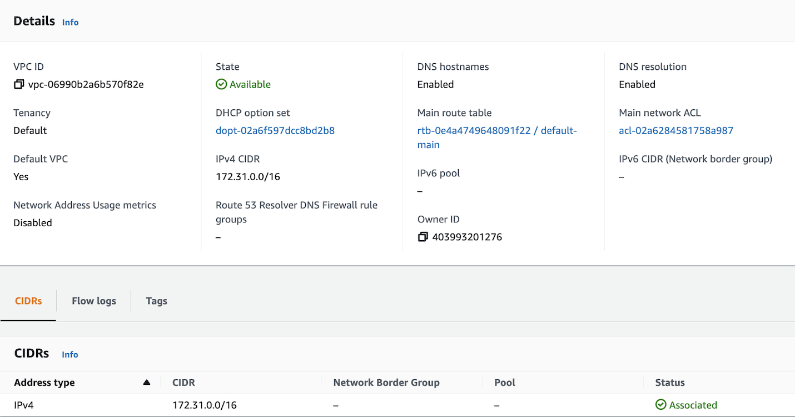{ width=700 }

**Figure 1: VPC**

By default, AWS creates a VPC with default public subnets, one per AZs, they are public because the main route table includes a route to the **Internet Gateway**. Internet gateway is a managed service which automatically scales, is redundant and highly available.

VPC Helps to:

* Assign static IP addresses, potentially multiple addresses for the same EC2 instance.
* Change security group membership for the instances while they're running.
* Control the outbound traffic from the instances (egress filtering) in addition to controlling the inbound traffic to them (ingress filtering).
* We can have multiple VPCs per region (max to 5 but this is a soft limit). 5 maximum CIDRs per VPC.
* The IP ranges are in 10.x.x.x, 172, or 192 base and a min /28 and max /16.

Network Access Control List can be defined at the VPC level, so will be shared between subnets. The default network ACL is configured to allow all traffic to flow in and out of the subnets which it is associated to. Each network ACL also includes a rule whose rule number is an asterisk. This rule ensures that if a packet doesn't match any of the other numbered rules, it's denied. 

The following diagram illustrates classical VPC, with one vpc, two availability zones, two public subnets with EC2 instances within those subnets. An internet gateway is connected to a router. Subnet is defined per availability zone. It defines an IP CIDR range: we should have less IP@ on public subnets as they are used for ELB and very few resources. Most of the service instances should be in private subnets.

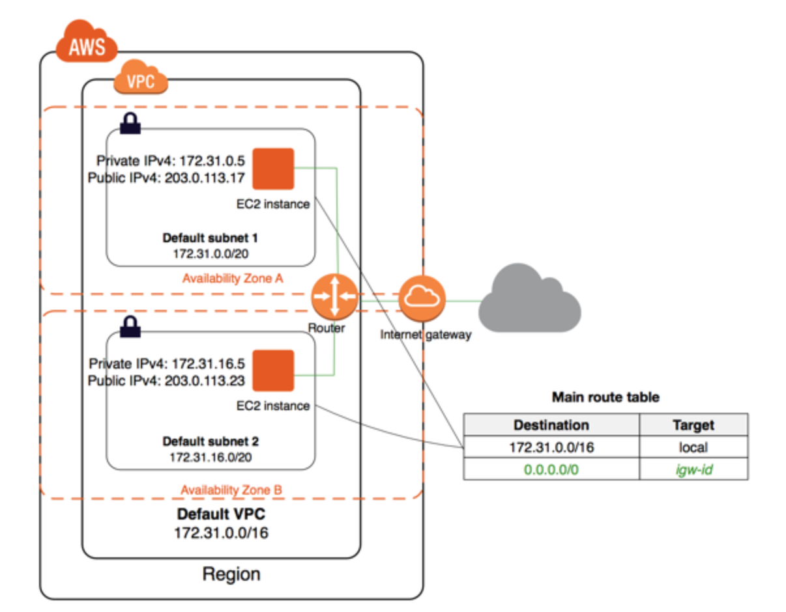{ width="700" }

**Figure 2: EC2s in public subnets**

* *A subnet is assigned a /24 CIDR block, which means 8 bits encoding (32-24), but AWS uses 5 IP addresses in each subnet for gateway, LB,... so the number of available addresses is 256 - 5 = 251. To identify a single 32 bit IPv4 address, we can use /32 CIDR convention* 
* We need to define at least one Route Table for the public subnets and one for the private subnets.
* Non-default subnet has a private IPv4 address, but no public IPv4 address.
* We can make a default subnet into a private subnet by removing the 0.0.0.0/0 route to the Internet Gateway. The route table in figure above defines such route, therefore the subnets are public.
* EC2 Instances should have either public IP or private IP and the subnet they belong to, must have a route to the internet gateway. The figure 5 above, illustrates a route going to any IP @ (0.0.0.0/0) via the internet gateway (`igw-id`). Any host in the private network 172.31.0.0/16 can communicate with other hosts in the local network.
* Route table defines `172.31` as local with `/16` CIDR address range, internal to the VPC.
* Because the VPC is cross AZs, we need a router to route between subnets. (See [TCP/IP summary](https://jbcodeforce.github.io/architecture/tcpip))

### Elastic Network Insterfaces

ENI is a logical component in a VPC that represents a virtual network card. It has the following attributes:

* One primary private IPv4, one or more secondary IPv4.
* One Elastic IP (IPv4) per private IPv4.
* One Public IPv4 address.
* One or more security groups.
* A MAC address.
* We can create ENI independently and attach them on the fly (move them) on EC2 instances during failover. It is also attached to any elastic load balancer. ENIs are defined at the account level.
* Bound to a specific availability zone (AZ), we cannot attach ENI to an EC2 instance in a different AZ. 

[New ENI doc.](https://aws.amazon.com/blogs/aws/new-elastic-network-interfaces-in-the-virtual-private-cloud/)

### Routing Tables

As illustrated in the following diagram, the main routing table defines routes for VPC internal traffic, while custom tables define how inbound and outbound traffic can be structured within a subnet.

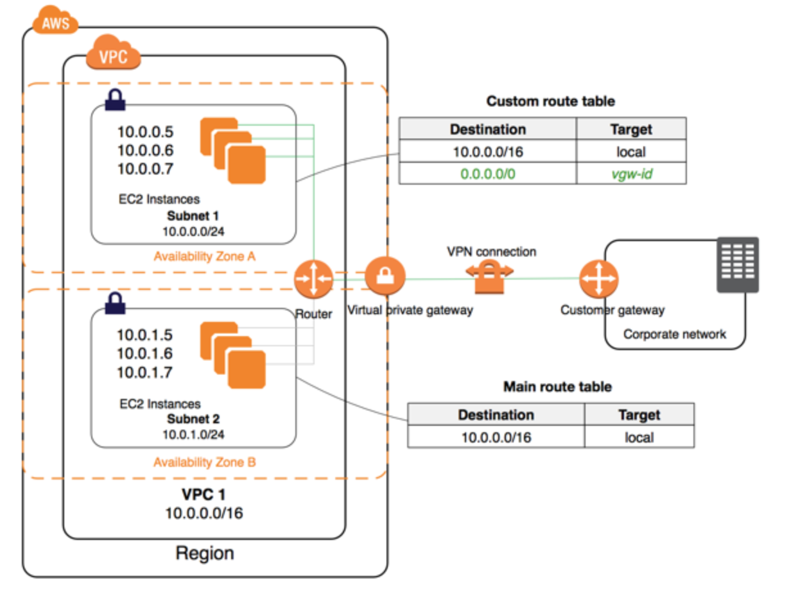{ width=700 }

**Figure 3: Routing tables**

EC2 instances in subnet 2 are in private subnet. The corporate network, or on-premises network, can be connected to the VPC via customer gateway deployed on-premises, vitual private GTW in AWS region, and at least one VPN connection between the two gateways.

### [NAT Gateway](https://docs.aws.amazon.com/vpc/latest/userguide/vpc-nat-gateway.html)

Use a NAT gateway so that EC2 instances in a private subnet can connect to services outside the VPC but external services cannot initiate a connection with those instances. This is a managed service with auto-scaling capability within one AZ. The bandwidth is from 5 Gbps to  automatic scale up 45Gbps.

Charged for each hour the NAT gateway is available and each Gigabyte of data that it processes.

It is created in a specified AZ, public subnet, and uses an Elastic IP and can only be used by EC2 in other subnets. The route is from the private subnet to the NATGW to the IGW. To get HA, we need one NATG per AZ.

### Network ACLs

Defines traffic rule at the subnet level. One NACL per subnet. A NACL specifies rules with number that defines evaluation priority. The last rule is an asterisk and denies a request in case of no rule conditions match.  As soon as a rule matches traffic, it’s applied immediately regardless of any higher-numbered rule that may contradict it.

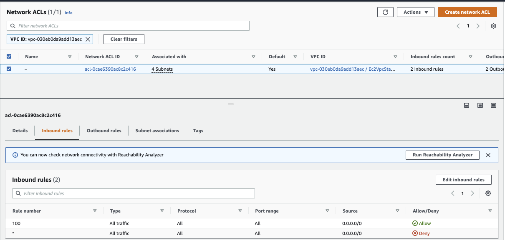
 
 **Figure 4: Default NACL** 

It is used to block a specific external IP address.

The VPC automatically comes with a modifiable default network ACL. By default, it allows all inbound and outbound IPv4 traffic and, if applicable, IPv6 traffic. By default, each custom network ACL denies all inbound and outbound traffic until we add rules.

Below is a complete figure to explain the process: A web server is initiating a connection to a DB on port 3306 and get response to an ephemeral port (allocated from 1024 to 65535):

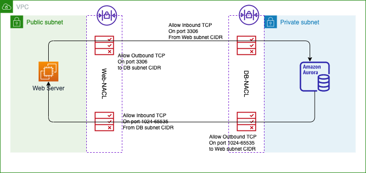{ width="1000" }

**Figure 5: Connection flow between public to private Apps**

Each subnet in the VPC must be associated with a network ACL. If you don't explicitly associate a subnet with a network ACL, the subnet is automatically associated with the default network ACL.

| Security Group | Network ACL |
| --- | --- |
| Acts as firewall for EC2 | Acts as firewall for subnet |
| Controls inbound & outbound traffic at the instance level | Controls inbound & outbound traffic at subnet level |
| Supports allow rules | Supports deny and allow rules | 
| Evaluates all rules before deciding to allow traffic | Evaluate rules in order |
| Instances associated with a SG can't talk to each other unless we add a rule to allow it | Each subnet must be associated with a NACL. |

### VPC peering

The goal of VPC peering is to connect two VPCs using AWS network and let them behave as if they were in the same network. They also work for inter-region and cross-account interconnections.

When defining the VPC, the CIDRs should not overlap for IPv4. There is no transitive VPC peering. And there is no edge to edge routing, which means a peered VPC could no go to on-premise server from another VPC, or could not use the internet gateway of another VPC to access internet.

Once the VPC peering connection is defined, we still need to specify the routes to the CIDR to reach the peered VPC. VPC uses the longest prefix match to select the specific route. For example, from a VPC_C, the route to 10.0.0.77/32 will go to VPCa-instance77 while a route with 10.0.0.0/16 will go to any instances in the VPC b. Vpc_a and Vpc_b has overlapping CIDR but are not peered together, only to VPC_C.

VPC sharing (part of Resource Access Manager) allows multiple AWS accounts to create their application resources such as EC2 instances, RDS databases, Redshift clusters, and Lambda functions, into shared and centrally-managed Amazon Virtual Private Clouds (VPCs). To set this up, the account that owns the VPC (owner) shares one or more subnets with other accounts (participants) that belong to the same Organization from AWS Organizations.

After a subnet is shared, the participants can view, create, modify, and delete their application resources in the subnets shared with them. Participants cannot view, modify, or delete resources that belong to other participants or to the VPC owner.

### [Transit Gateway](https://aws.amazon.com/transit-gateway/)

A transit gateway (TGW) is a network transit hub that interconnects attachments (VPCs and VPNs) within the same AWS account or across AWS accounts using Resource Access Manager.

This service provides transitive peering between thousands of VPCs and even on-premises servers. It could support hub and spoke connections. It runs on the AWS global private network.

Transit Gateway acts as a highly scalable cloud router: each new connection is made only once.

It is a regional resource but it can run cross-region. It works with Direct Connect gateway and VPN connections.

**Figure 6: TGW attachment to Direct Connect Gateway**

Control the connection vias Route Tables. This is also the only service supporting IP multicast. It addresses the use case of edge to edge routing, so instances in a VPC can access NAT gateway, NLB, PrivateLink, and EFS in other VPCs attached to the transit gateway.

Transit Gateway can be peered together as intra-region peering mesh, and as inter-region peering too.

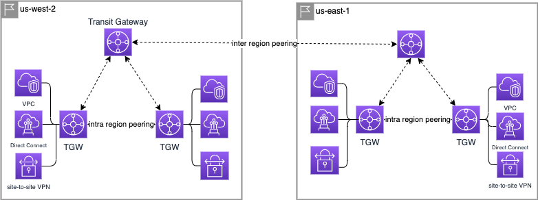

**Figure 7: Peering mesh**

To increase the bandwidth of the connection to VPC, there is the site to site VPN ECMP (Equal-cost multi-path routing) feature, which is a routing strategy to forward packet over multiple best paths. It uses double tunnels. The VPCs can be from different accounts.

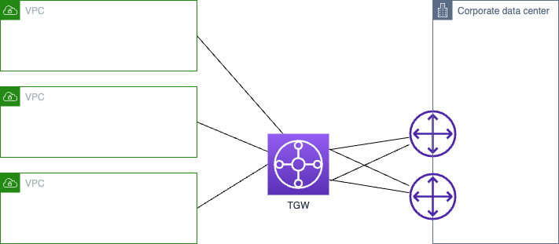

**Figure 8: Transit Gateway between VPCs and On-premises**

A transit gateway connects VPCs and on-premises networks through a central hub. An attachment between the transit gateway and a new Direct Connect gateway will extend hybrid connectivity to any VPCs that are associated with the Direct Connect gateway.

* [Centralized router use case](https://docs.aws.amazon.com/vpc/latest/tgw/transit-gateway-centralized-router.html)
* [Isolated VPCs with shared services](https://docs.aws.amazon.com/vpc/latest/tgw/transit-gateway-isolated-shared.html).

### [VPC Endpoint](https://docs.aws.amazon.com/vpc/latest/privatelink/create-interface-endpoint.html)

An interface VPC endpoint allows us to privately connect our Amazon VPC to supported AWS services without going over the internet. Interface VPC endpoints also connect to endpoint services hosted by other AWS accounts and AWS Marketplace partner services.

Two types of endpoint:

* **Interface endpoints** powered by PrivateLink: it provisions an ENI in the VPC, with a security group. Pay per hour and GB of data transferred. It can access AWS services such as Simple Queue Service (SQS), Simple Notification Service (SNS), Amazon Kinesis (all except DynamoDB). Can be accessed with site-to-site VPN and Direct Connect. It has a private domain name
* **Gateway endpoints**: provision a GTW and setup routes in route tables. Used for **S3 and DynamoDB** only. Free. Cannot be extended out of the VPC. One per VPC.

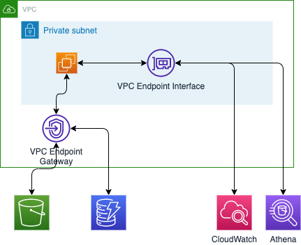

**Figure 9: VPC endpoints**

VPC Endpoints remove the need of IGW, NATGW to access AWS Services. The service is redundant and scale horizontally.

VPC endpoints are defined in Console, SDK API or CDK.

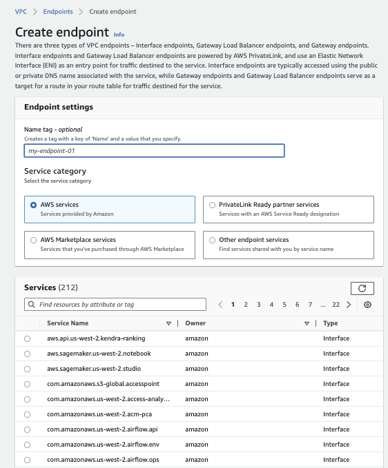

**Figure 10: VPC endpoints**

The VPC needs to enable DNS resolution. The same public hostname for S3 can be used, but once the route in the routing table defines the endpoint to be the target to S3 then the traffic will be over AWS private network.

#### VPC Endpoint policies

Endpoint Policies are JSON documents to control access to services, controlled at the endpoint level. It does not replace IAM user policies or service specific policies.

A endpoint policy can limit access to a SQS queue for a given user or role, then this user can still access the queue from outside of the VPC endpoint. To avoid that the SQS queue policy needs to deny any action not done through the VPC endpoint.

???- question "How to debug an access to S3 from EC2 in private subnet?"
    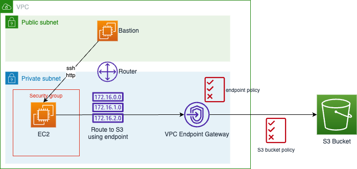

    1. Verify the security group has outbound rule to get traffic out
    1. Verify the VPC endpoint gateway has a policy to allow EC2 connection
    1. Be sure a route exists in VPC route table to the S3 bucket to go to the endpoint gateway
    1. Verify DNS resolution is enabled in VPC
    1. Verify the s3 bucket policy allows the EC2 access
    1. Verify the IAM role used by the EC2 has access to the bucket.

    See [this lab](https://github.com/jbcodeforce/aws-studies/tree/main/labs/networking/ec2-vpce-s3) with CDK to set this up.

### VPC Flow Logs

Capture IP traffic at the ENI, VPC, subnet level. This is used to monitor and troubleshoot connectivity issues. Can be saved in S3 and CloudWatch logs.
It can work on managed service like ELB, RDS, ElastiCache, RedShift, NATGW, Transit Gateway.

The log includes src and destination addresses, port number and action done (REJECT/ ACCEPT).

When an inboud request is rejected it could be a NACL or SG issue, while if the inbound is accepted but outbound rejected, it is only a NACL issue, as Security Groups are stateful, meaning an accepted inbound connection, makes the outbound also accepted.  

VPC Flow log is defined within the VPC:

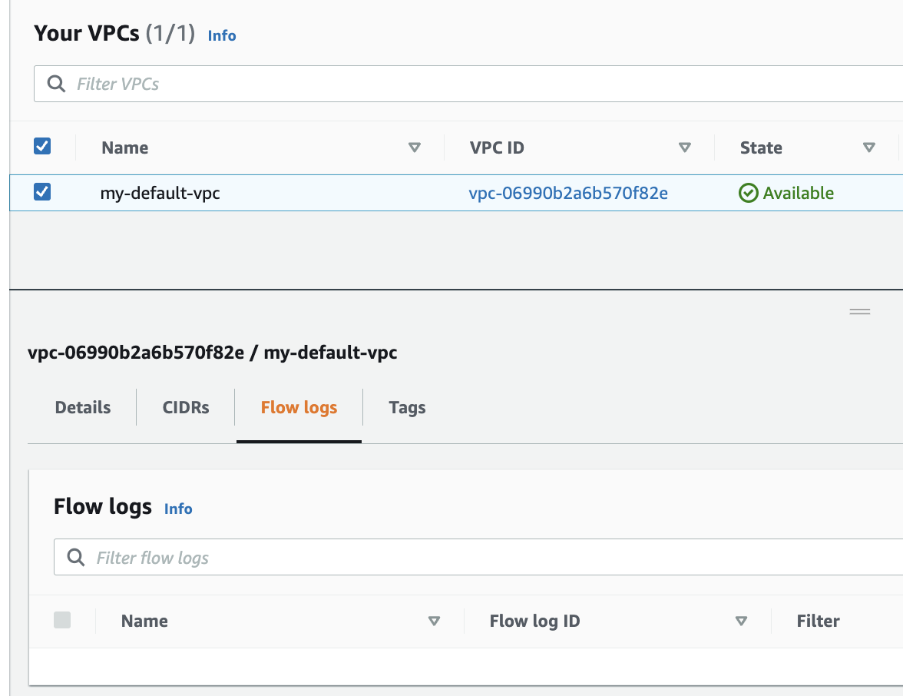

**Figure 11: VPC flow logs**

The Flow can target S3, Kinesis FireHose or CloudWatch

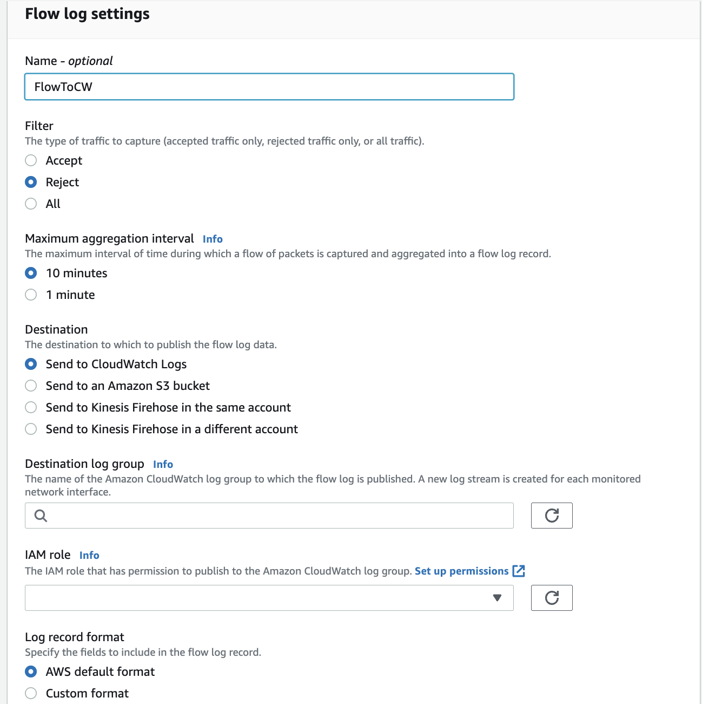

**Figure 12: VPC flow definition to CloudWatch**

VPC Flow logs are sources for GuardDuty.

### Bastion Host

The goal is to be able to access any EC2 instances running in the private subnets from outside of the VPC, using SSH. The bastion is running on public subnet, and then connected to the private subnets. 

* To use a **Bastion Host**, we attach a security group, to the EC2, to authorize inbound SSH and outbound HTTP traffic. CDK creates this SG automatically. So we can use Instance Connect to this instance, and within the terminal a ping to amazon.com will work. The bastion has a public IP address, and the VPC has a IGW with a route table.

    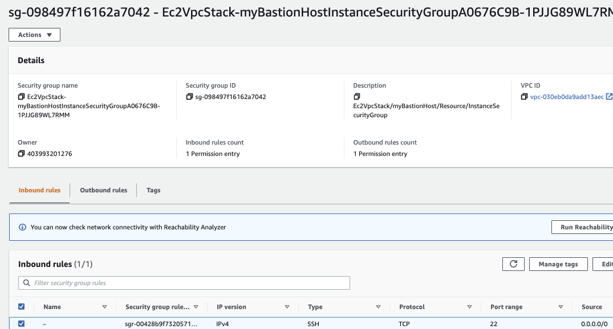

    **Figure 13: Security group for bastion host authorize public access to port 22**

* In the EC2 instance running in the private network, we need to add a Security Group with an inbound rule to specify SSH traffic from the SG of the Bastion. With this settings a SSH to the Bastion, then a copy of the target EC2 pem file in the bastion host and a command like: `ssh ec2-user@10.10.2.239 -i ec2.pem` on the private IP @ of the EC2 instance (10.10.2.239) will make the connection from Bastion to EC2.

    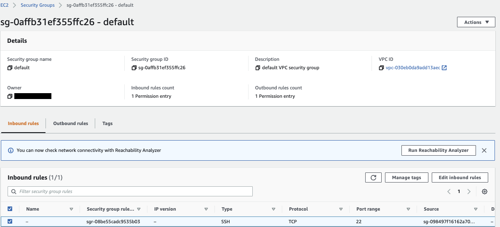

     **Figure 14: Security group for EC2 to accept port 22 from Bastion only**

The security group for the Bastion Host authorizies inbound on port 22 from restricted public CIDR.
Security group of the EC2 instance allows the SG of the bastion host to accept connection on port 22.

### Deeper Dive

* [VPC FAQs](https://aws.amazon.com/vpc/faqs/).
* [NAT gateway](https://docs.aws.amazon.com/vpc/latest/userguide/vpc-nat-gateway.html).

--- 

## Hybrid networking

### [Client VPN ](https://docs.aws.amazon.com/vpn/latest/clientvpn-user/client-vpn-user-what-is.html)

Managed client-based VPN service to securaly connect to AWS resources.

[How it works](https://docs.aws.amazon.com/vpn/latest/clientvpn-admin/how-it-works.html)

### [Site-to-Site VPN](https://docs.aws.amazon.com/vpn/latest/s2svpn/VPC_VPN.html)

Connect on-premises network to a VPC, and support IPsec. It uses a customer gateway device or software app to support the site to site connection. It is connected to the target gateway on Amazon side (a virtual private gateway).

### [Direct Connect](https://aws.amazon.com/directconnect/)

It provides a dedicated connection, over fiver optic cable, from a remote network to the VPC bypassing public internet. The main components are the connections (to a region) and the virtual interfaces to AWS services. 1, 10, 100 Gbps ethernet connection. Supports BGP.
\Install a direct connection setup can take more than a month, and it involves AWS Direct Connect Partners. Direct Connect provides three types of virtual interfaces: public, private, and transit:

* **Public virtual interface**: To connect to AWS resources (like S3, EC2) that are reachable by a public IP address.
* **Private virtual interface**: To connect to resources hosted in a VPC using their private IP addresses.
* **Transit virtual interface**: To connect to resources hosted in VPC through a transit gateway. 

To connect to a VPC in the same region, we need to setup a Virtual Private GTW. It is a private connection so it supports better bandwidth throughput at lower cost. It is not encrypted by default.

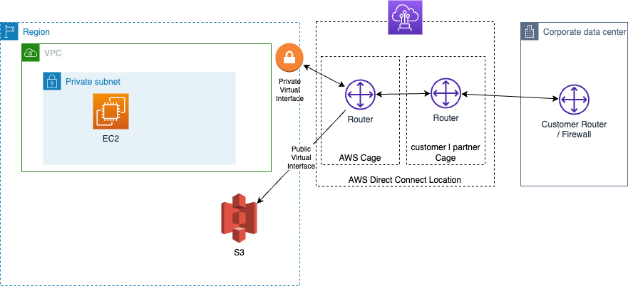

**Figure 15: Direct Connect between on-premise and VPC**

If we need to access two VPCs in two different regions from the corporate data center then we need a Direct Connect Gateway.

As another solution we can connect DC to a transit gateway through a central hub. An attachment between the transit gateway and a new Direct Connect gateway will extend hybrid connectivity to any VPCs that are associated with the Direct Connect gateway.

When we want to **encrypt** the traffic flowing through Direct Connect, we need VPN to provide an IPsec-encrypted private connection. VPN over DC will use the public virtual interface.

To get reliability, at lower cost, we can setup a VPN site-to-site connection in parallel to the Direct Connect link. For maximum resiliency for critical workloads, it is  recommended to have double connections per data center.

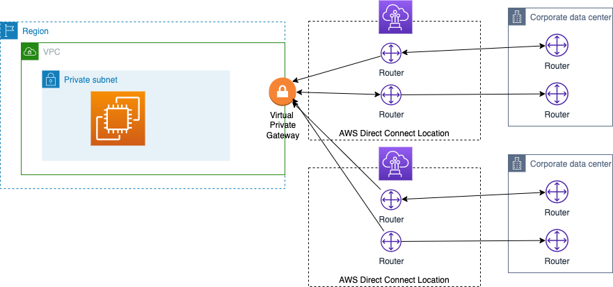

**Figure 16: Direct Connect HA**

The Link Aggregation Groups or LAG, helps to get increased speed and failover by aggregate up to 4 connections on active/active mode.

Hosted Direct Connect connection supports 50Mbps, 500Mbps, up to 10Gbps, while Dedicated offers higher bandwidth.

The main pricing parameter while using the Direct Connect connection is the Data Transfer Out (DTO) from AWS to the on-premises data center, and the port hours. DTO refers to the cumulative network traffic that is sent through AWS Direct Connect to destinations outside of AWS. This is charged per gigabyte (GB), and unlike capacity measurements, DTO refers to the amount of data transferred, not the speed.

---

## Extended picture

The following animation is presenting external integration from on-premises servers to AWS services and VPCs via site to site VPN, Private Gateway, Customer Gateway.

{ width= "1000" }

**Figure 17: Full VPC diagram**

* We need to have [VPC endpoint service](https://wa.aws.amazon.com/wellarchitected/2020-07-02T19-33-23/wat.concept.vpc-endpoint.en.html) to access [the AWS services](https://docs.aws.amazon.com/vpc/latest/privatelink/aws-services-privatelink-support.html), like S3, privately as they are in our VPC. 
* We need to ensure there is one interface endpoint for each availability zone. 
* We need to pick a subnet in each AZ and add an interface endpoint to that subnet. 
* TCP traffic is isolated. It is part of a larger offering called [AWS PrivateLink](https://docs.aws.amazon.com/vpc/latest/privatelink/what-is-privatelink.html) to establish private connectivity between VPCs and services hosted on AWS or on-premises, without exposing data to the internet (No internet gateway, no NAT, no public IP @).

* CIDR Blocks should not overlap between VPCs for setting up a peering connection. Peering connection is allowed within a region, across regions, across different accounts.

* We can optionally connect our VPC to our own corporate data center using an IPsec AWS managed VPN connection, making the AWS Cloud an extension of our data center. A VPN connection consists of a virtual private gateway (VGW) attached to our VPC and a customer gateway located in the data center. 
* A Virtual Private Gateway is the VPN concentrator on the Amazon side of the VPN connection. 
* A customer gateway is a physical device or software appliance on the on-premise side of the VPN connection. We need to create a Site-to-site VPN connection between the CP GTW and Customer GTW.

* As seen in Figure 18 "Full VPC diagram", the `VPC peering` helps to connect between VPCs in different region, or within the same region. And [Transit GTW](https://docs.aws.amazon.com/vpc/latest/tgw/what-is-transit-gateway.html) is used to interconnect our virtual private clouds (VPCs) and on-premises networks. In fact Transit Gateway is a more modern and easier approach to link VPCs. Using Transit Gateway route tables, We can control the traffic flow between VPCs. The peering connection would work; however, it requires a lot of point-to-point connections.
* If we have multiple AWS Site-to-Site VPN connections, we can provide secure communication between sites using the [AWS VPN CloudHub](https://docs.aws.amazon.com/vpn/latest/s2svpn/VPN_CloudHub.html). This enables our remote sites to communicate with each other, and not just with the VPC. 
* AWS VPN CloudHub operates on a simple hub-and-spoke model that we can use with or without a VPC.

---

## [Elastic Load balancers](https://docs.aws.amazon.com/elasticloadbalancing/latest/userguide/what-is-load-balancing.html)

Route traffic into the different EC2 instances, containers or any IP @ end points in one or more AZs. As a managed service, Elastic Load Balancing scales automatically in response to changes in incoming traffic. It is deployed per region.

The goal is to improve availability and fault tolerance. It also exposes a single point of access (DNS) to the deployed applications.

It uses health check (`/health` on the app called the `ping path`) to assess instance availability. It also provides SSL termination. It is used to separate private (internal) to public (external) traffic.

 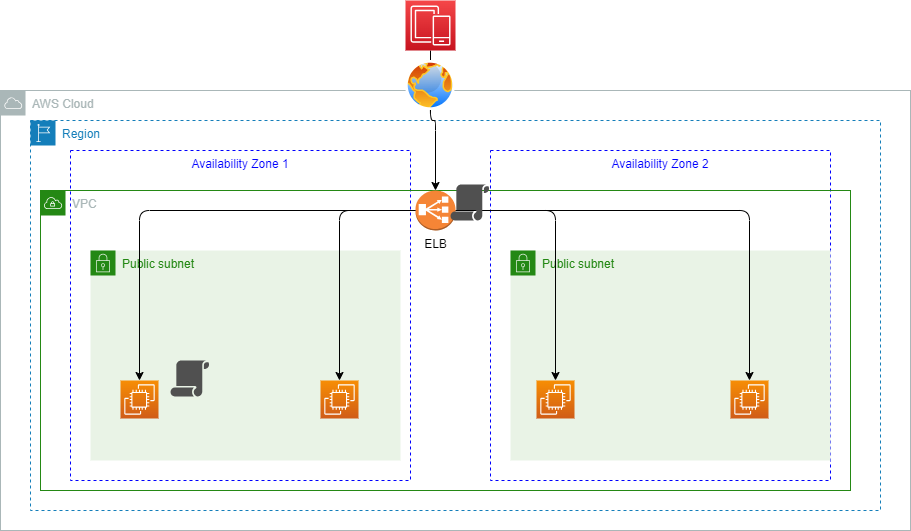

 **Figure 18: ELB**

When we create a load balancer, we must choose whether to make it an internal load balancer or an internet-facing load balancer, and select the availability zones to route traffic to.

Internet-facing load balancers have public IP addresses. The DNS name of an internet-facing load balancer is publicly resolvable to the public IP addresses of the nodes. Internal load balancers have only private IP addresses.  They can only route requests from clients with access to the VPC of the load balancer.

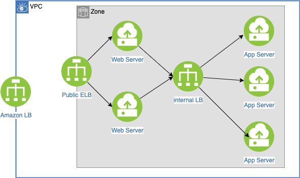

**Figure 19: Public and private ELBs**

For certain needs, it also supports stickness cookie to route to the same EC2 instance.
ELB has security group defined for HTTP and HTTPS traffic coming from the internet, and the EC2 security group defines HTTP traffic to the ELB only.

### Four types of ELB supported

* **Classic** load balancer: older generation. TCP and HTTP layer. For each instance created, update the load balancer configuration so it can route the traffic.
* **Application load balancer**: HTTP, HTTPS (layer 7), Web Socket. 

    * It specifies availability zones: it routes traffic to the targets within these Availability Zones. To increase availability, we need at least two AZs.
    * It uses target groups, to group applications.
    * Route on URL, hostname and query string.
    * Get a fixed hostname in DNS.
    * The application do not see the IP address of the client directly (ELB does a connection termination), but ELB puts client information in the header `X-Forwarded-For` (IP @), `X-Forwarded-Port` (port #) and `X-Forwarded-Proto` (protocol).
    * Great for microservices or for container based apps (ECS).
    * Support dynamic port mapping for ECS container.
    * Support HTTP/2 and WebSocket.

!!! info
    **Target group**: group EC2 instances by specifying a Auto Scaling Group. They may be tasks or containers in ECS, or lambda functions. Health check is done at the EC2 or container level. Application Load Balancers are the only load balancers that support the lambda target type.

* **Network load balancer**: TCP, UDP (layer 4), TLS

    * Handles millions request/s.
    * Reaches less than 100ms latency while ALB is at 400ms.
    * Uses one public static IP address per availability zone.
    * Routes each individual TCP connection to a single target for the life of the connection. If we specify targets using an instance ID, traffic is routed to instances using the primary private IP address specified in the primary network interface for the instance. If we specify targets using IP addresses, we can route traffic to an instance using any private IP address from one or more network interfaces. This enables multiple applications on an instance to use the same port.
    * Not free.
    * Can reach target groups of EC2s, IP @, or ALB.
    * Health check is based on TCP, HTTP, and HTTPS.
    * For NLB we need to add a rule in the security group attached to the EC2 to get HTTP:80 to anywhere.

* **Gateway LB**: 
    
    * Used to analyze in traffic before routing to applications.
    * Applies firewalls rules, intrusion detection, deep packet inspection.
    * Works at layer 3: IP packet.
    * Combine NLB and gateway service.
    * Also use target groups.
    * Use the Geneve protocol (support network virtualization use cases for data center ) on port 6081 

To route traffic, first the DNS name of the load balancer is resolved. (They are part of the `amazonaws.com` domain). 1 to many IP Addresses are sent back to the client. With NLBs, Elastic Load Balancing creates a network interface for each Availability Zone that is enabled. Each load balancer node in the Availability Zone uses this network interface to get a static IP address. ELB scales the load balancer nodes and updates the DNS entry. The time to live is set to 60s.

To control that only the load balancer is sending traffic to the application, we need to set up an application **security group** on HTTP, and HTTPS with the source being the security group id of the ELB. LBs can scale but need to engage AWS operational team.

HTTP 503 means LB is at capacity or target app is not registered. Verify security group in case of no communication between LB and app.

Target group defines the protocol to use, the health check parameters and what applications to reach (instance, IP or lambda). Below is an example of listener rule for an ALB:

**Figure 23: ALB rule**

ALB and Classic can use [HTTP connection multiplexing](https://www.haproxy.com/blog/http-keep-alive-pipelining-multiplexing-and-connection-pooling/) to keep one connection with the backend application. Connection multiplexing improves latency and reduces the load on our applications.

### Load balancer stickiness

Used when the same client needs to interact with the same backend instance. A cookie, with expiration date, is used to identify the client. The classical LB or ALB manages the routing. This could lead to unbalance traffic so overloading one instance. 
With ALB, stickness is configured in the target group properties.

Two types of cookie:

* **Application-based cookie**: generated by the target app. The cookie name is specific to the target group. 
* **Duration-based cookie**: generated by the Load Balancer.

The following cookie names are reserved by the ELB (AWSALB, AWSALBAPP, AWSALBTG).

### [Cross Zone Load Balancing](https://docs.aws.amazon.com/elasticloadbalancing/latest/userguide/how-elastic-load-balancing-works.html#cross-zone-load-balancing)

Each load balancer instance distributes traffic evenly across all registered instances in all availability zones. 

If one AZ has 2 targets and another one has 8 targets, then with cross-zone, the LBs in each availability zone will route to any instance, so each will receive 10% of the traffic. Without that, the 2 targets zone will receive 25% traffic each, and the instance on the othe AZ only 6.25% of the traffic. This is the default setting for ALB and free of charge. It is disabled by default for NLB.

### TLS - Transport Layer Security,

An SSL/TLS Certificate allows traffic between clients and load balancer to be encrypted in transit (in-flight encryption).

* Load balancer uses an X.509 certificate (SSL/TLS server certificate).
* Manage our own certificates using ACM (AWS Certificate Manager).
* When defining a HTTPS listener in a LB, we must specify a default certificate for the HTTPS protocol, while defining the routing rule to a given target group. Need multiple certs to support multiple domains. 
* Clients can use SNI (Server Name Indication) to specify the hostname they want to reach. The ALB or NLB will get the certificates for each host to support the TLS handshake.

### Connection draining

This is a setting to control connection timeout and reconnect when an instance is not responding. It is to set up the time to complete “in-flight requests”. When an instance is "draining", ELB stops sending new requests to the instance. The time out can be adjusted, depending of the application, from 1 to 3600 seconds, default is 300 seconds, or disabled (set value to 0).

It is called `Deregistration Delay` in NLB & ALB.

### Deeper dive

* [Product documentation](https://docs.aws.amazon.com/elasticloadbalancing/latest/network/introduction.html)
* [Networking Immersion Day - lvl 300](https://catalog.workshops.aws/networking/en-US)

---

## [CloudFront](https://aws.amazon.com/cloudfront/)

Content Delivery Network service with DDoS protection. It caches data to the edge to improve web browsing and application performance. 410+ Edge locations. This is a global service. 

When configuring we need to specify the origin for the data which could be S3 objects, or Custom Origin resource accessible via HTTP (ALB, EC2...), the caching behavior, and the edge distribution.

CloudFront keeps cache for the data read. For the edge to access the S3 bucket, it uses an origin access identity (OAI), managed as IAM role.

For EC2 instance, the security group needs to accept traffic from edge location IP addresses.

It is possible to control with geographic restriction using whitelist or blacklist.

It also supports the concept of signed URL. When we want to distribute content to different user groups over the world, attach a policy with:

* URL expiration.
* IP range to access the data from.
* Trusted signers (which AWS accounts can create signed URLs).
* How long should the URL be valid for?
* Shared content (movie, music): make it short (a few minutes).
* Private content (private to the user): we can make it last for years.
* Signed URL = access to individual files (one signed URL per file).
* Signed Cookies = access to multiple files (one signed cookie for many files).

When the backend content is modified, CloudFront will not get it until its TTL has expired. But we can force an entire cache refresh with CloudFront Invalidation.

CloudFront supports HTTP/RTMP (streaming distribution from Adobe) protocol based requests only.

The cost is based on the number of HTTP requests, and data transfer. 

Lambda@Edge is a feature of Amazon CloudFront that lets us run code closer to users of the application, which improves performance and reduces latency. Lambda@Edge runs code in response to events generated by the Amazon CloudFront content delivery network (CDN).

* [CloudFront FAQs](https://aws.amazon.com/cloudfront/faqs/)
* [CloudFront Pricing](https://aws.amazon.com/cloudfront/pricing)

## [Global Accelerator](https://docs.aws.amazon.com/global-accelerator/latest/dg/what-is-global-accelerator.html)

AWS Global Accelerator is a network layer service that directs traffic to optimal endpoints over the AWS global network, this improves the availability and performance of the internet applications. 

It is a global service, and it provides two static anycast IP addresses that act as a fixed entry point to the application endpoints in a single or multiple AWS Regions, such as the Application Load Balancers, Network Load Balancers, Elastic IP addresses or Amazon EC2 instances, in a single or in multiple AWS regions.

A listener is a process that checks for connection requests that arrive to an assigned set of static IP addresses on a port or port range. It routes traffic to one or more endpoint groups. An endpoint group includes endpoints, such as load balancers.

The goal is to expose quickly an application to the WW. The problem is the number of internet hops done to access the target public ALB. The solution is to get as fast as possible to a AWS global network endpoint (Edge location), nearest region to the client. It is a global service.

With Anycast IP, a client is routed to the nearest server. All servers hold the same IP address. So for each application, we create 2 Anycast IPs, and the traffic is sent to the edge location.

AWS Global Accelerator uses endpoint weights to determine the proportion of traffic that is directed to endpoints in an endpoint group, and traffic dials to control the percentage of traffic that is directed to an endpoint group. We may use it to do blue-green deployments.

Global Accelerator is a good fit for non-HTTP use cases, such as gaming (UDP), IoT (MQTT), or Voice over IP.

## VPN CloudHub

If we have multiple AWS Site-to-Site VPN connections, we can provide secure communication between sites using the AWS VPN CloudHub. 

This enables our remote sites to communicate with each other, and not just with the VPC. 

Sites that use AWS Direct Connect connections to the virtual private gateway can also be part of the AWS VPN CloudHub. 

The VPN CloudHub operates on a simple hub-and-spoke model that we can use with or without a VPC. 

This design is suitable if we have multiple branch offices and existing internet connections and would like to implement a convenient, potentially low-cost hub-and-spoke model for primary or backup connectivity between these remote offices.

## FAQs

???- "What differentiates a public subnet from a private subnet?"
    A public subnet is a subnet that's associated with a route table that has a route to an internet gateway

## [Traffic mirroring](https://docs.aws.amazon.com/vpc/latest/mirroring/traffic-mirroring-how-it-works.html)

* Copies inbound and outbound traffic from the network interfaces attached to EC2 instances.
* Used to mirror inbound TCP traffic to a single monitoring appliance.
* Some open source tools to be used as monitoring: [Zeek](https://zeek.org/), or [Suricata.io](https://suricata.io/)

* Classical steps to get started:

    * Step 1: Create the traffic mirror target
    * Step 2: Create the traffic mirror filter
    * Step 3: Create the traffic mirror session
    * Step 4: Analyze the data

## [Cloud WAN](https://docs.aws.amazon.com/network-manager/latest/cloudwan/what-is-cloudwan.html)

The goal is to build a global network to interconnect VPCs via transit gateways oand other Cloud WAN, on-premises environments, using a single central dashboard. It uses the concept of **core network policy** to define what we want the network to be.

[AWS Cloud WAN and AWS Transit Gateway migration and interoperability patterns](https://aws.amazon.com/blogs/networking-and-content-delivery/aws-cloud-wan-and-aws-transit-gateway-migration-and-interoperability-patterns/)