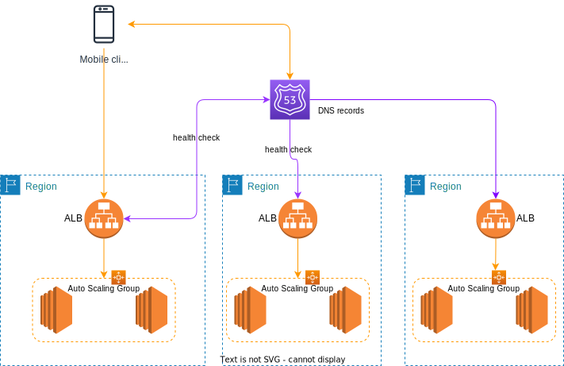

# [Route 53](https://aws.amazon.com/route53/features/)

A highly available, scalable, fully managed, and authoritative (we can update public DNS records) DNS. It is also a Domain Registra and a health checking services to route traffic to healthy endpoints. It supports a lot of routing types to respond to DNS query by taking into account % of traffic, latency, healthchecks...

This is a global WW service, which is globally distributed anycast network (networking and routing technology to get DNS query answered from the most optimal server) of DNS servers around the world.

It uses the concept of `hosted zone` which is a "container" that holds information about how we want to route traffic for a domain or subdomain. The zone can be **public** (internet facing) or **private** (inside a VPC). All resource record sets within a hosted zone must have the hosted zone’s domain name as a suffix. Need a DNS domain for that.  Each Amazon Route 53 hosted zone is served by its own set of virtual DNS servers.

A domain is at least 12$ a year and Route 53 fees is $0.5 per month per hosted zone. See [Pricing page](https://aws.amazon.com/route53/pricing/).

## DNS

DNS is a collection of rules and records which helps client apps understand how to reach a server through URLs. Here is a quick figure to summarize the process, which in fact should also has the root server (for the `.com`... resolution) and TLD server (for `amazon` or `google`). The SLD server is the one presented in the figure.

 

### [Route 53 FAQs](https://aws.amazon.com/route53/faqs/)

### DNSSEC

Is a protocol to secure DNS traffic, to verify DNS data integrity and origin. It protects for man in the middle (MITM) attacks. Route 53 supports DNSSEC for domain registration and signing. It works only for public hosted zone.


## Records

Record defines how to route traffic for a domain. Each record contains:

* a Domain name.
* a record type A (maps to IPv4) or AAAA(for IPv6), CNAME (canonical name of a hostname), NS (name server, for hosted zone).
* a value.
* a routing policy.
* a Time to Live (TTL): is set, on the client side, to get the web browser to keep the DNS resolution in cache. High TTL is around 24 hours, low TTL, at 60s, which leads to make more DNS calls. TTL should be set to strike a balance between how long the value should be cached vs how much pressure should go on the DNS server. Need to define the TTL for the app depending on the expected deployment model.

### CNAME vs Alias

[CNAME](https://en.wikipedia.org/wiki/CNAME_record) is a DNS record to maps one domain name to another. CNAME should point to a ALB. Works on non root domain. We could not create a CNAME record for the top node of a DNS namespace (No APEX domain).

Any public facing AWS resources expose an AWS DNS name: `.....us-west-2.elb.amazonaws.com` for ex.

**Alias** is used to point a hostname of an *AWS resource* only, and can work on root domain (domainname.com). The alias record target could be: ELB, CloudFront distributions, API gateway, Elastic Beanstalk environments, S3 Websites, VPC Interface endpoints, global accelerator, route 53 record (in the same hosted zone). EC2 DNS name could not be a target of alias.

Use `dig <hostname>` to get the DNS resolution record from a Mac or for linux EC2 do the following.

```sh
sudo yum install -y bind-utils
nslookup domainname.com
# or
dig domainname.com
```

## Demonstration



* Create three EC2 t2.micro instances, in different AZs / regions, using security group to authorize SSH and HTTP from anywhere, with the following `User data` script, so the returned HTML page includes the AZ name:

```
#!/bin/bash
yum update -y
yum install -y httpd
systemctl start httpd
systemctl enable httpd
EC2_AVAIL_ZONE=$(curl -s http://169.254.169.254/latest/meta-data/placement/availability-zone)
echo "<h1>Hello World from $(hostname -f) in AZ $EC2_AVAIL_ZONE </h1>" > /var/www/html/index.html
```

* Add at least one ALB to route to instances in a region to different AZs
* Define a domain name (5$ to 12$ a year)
* Create a hosted zone in Route 53.
* Define DNS records in Route 53 for each ALB and EC2 IP @ based on a subdomain name, using one of the type as specified in next section.

## Routing policies

It defines how Route 53 responds to DNS queries. It can be used to apply A/B testing, or looking query.

Eight routing types:

1. A **simple** routing policy to get an IP @ from a single resource (still can specify multiple IP@ to be returned in the response, and the client will pick one of the address randomly). There is no health check associated to this record.
1. The **weighted** routing policy controls the % of the requests that go to specific endpoint. Can do blue-green traffic management. It can also help to split traffic between two regions. It can be associated with Health Checks
1. The **latency** routing Policy redirects to the server that has the least latency close to the client. Latency is based on traffic between users to AWS Regions.
1. **Health check** monitors the health and performance of the public resources and assesses DNS failure with automatic failover. We can have HTTP, TCP or HTTPS health checks. We can define from which region to run the health check. They are charged per HC / month. 15 Health checkers exist WW. Send every 30s. Need at least 18% health checkers reporting the endpoint is healthy. HTTP RC code 2xx or 3xx. It is recommended to have one HC per app deployment. It can also monitor latency. To assess private endpoint within a VPC, we need to add a CloudWatch metric and alarm, then create a Health Check to the alarm itself.
1. The **failover** routing policy helps us to specify a record set to point to a primary and then a secondary instance for DR purpose.
1. The **Geo Location** routing policy is based on user's location, and we may specify how the traffic from a given country should go to a specific IP@. Need to define a “default” policy in case there’s no match on location. It is interesting for website localization, restrict content distribution, load balancing,...
1. **Geoproximity** takes into account the user and AWS resources locations. It also supports shifting more traffic to resources based on the defined bias. It is part of **Route 53 Traffic Flow** feature.
1. The **Multi Value** routing policy is used to access multiple resources. The record set, associates a Route 53 health checks with the records. The client on DNS request gets up to 8 healthy records returned for each Multi Value query. If one fails then the client can try one other IP @ from the list.
1. IP origin based routing. Use clients IP @ to define destination location. Can be useful to isolate traffic from one ISP.

## Health checks

We can use Route 53 health checking to configure active-active and active-passive failover configurations. We configure active-active failover using any routing policy (or combination of routing policies) other than failover, and we configure active-passive failover using the failover routing policy.

In active-active failover, all the records that have the same name, the same type (such as A or AAAA), and the same routing policy (such as weighted or latency) are active unless Route 53 considers them unhealthy. With Active-Active Failover, it uses all available resources all the time without a primary nor a secondary resource.

If we used another domain registra, it is possible to get the list of AWS DNS servers associated to the hosted public zone, and then configure the registra for the NS records to go to those DNS servers.

Health checks can monitor CloudWatch alarms, for example, alarm on RDS, or any custom metrics. It is the only way to monitor internal to VPC resources as health checks are outside the VPC and control public end-points. 

## Hybrid DNS

By default, Route 53 Resolver automatically answers DNS queries for local domain names for EC2 instances, or records in Private Hosted Zones or records in public Name Servers.

[Hybrid DNS](https://docs.aws.amazon.com/prescriptive-guidance/latest/patterns/set-up-dns-resolution-for-hybrid-networks-in-a-multi-account-aws-environment.html) helps to resolve DNS queries between VPCs, and on-premises network:


* `aws.priv` is the domain in private VPC.
* Inbound resolver endpoints forward DNS queries to Route 53 resolver.
* The DNS records for resources in private subnets are in the route 53 private hosted zones.
* Outbound resolver endpoints are for Route 53 resolver to forward (with  conditional rules) the DNS queries to an on-premises DNS resolvers.
* Resolver endpoints are associated with one or more VPCs in the same Region. They are HA when used on 2 AZs.
* Each resolver endpoints have different ENIs, one in each AZ. The outboud ENIs are not represented in the figure above (they should have an IP of 10.0.0.20 and 10.0.1.20 for example).
* For `app.aws.priv` query, the resolver inbound endpoint is linked to the Route 53, which lookup in the private hosted zone to get IP address of the EC2 instance.
* Each Endpoint supports 10,000 queries per second per IP address.
* Direct connect or VPN is set up to do the network connection.
* Forward rules can be shared between AWS accounts via RAM.

## Route 53 ARC

For multi-site, the Amazon Route 53 Application Recovery Controller helps SREs to assess when applications are ready for recovery.

* **Zonal shift** enable fast recovery from an AZ failure by moving the traffic to other resources. This is a multi-AZ recovery. Usable on any Route 53 registered resources within a region. Zonal shift is triggered by SRE and has an expiration date. ALB or NLB should not use cross-zone load balancing.
* **Readiness check** to monitor resource quotas, capacity, and network routing policies, suggesting remediation when changes are made that would affect the ability to fail over to a standby replica.
* **Routing controls** are like on/off switches that control ARC health check. To re-balance traffic across application replicas during failures. This is a Multi-Region recovery. The routing control components in Route 53 ARC are: clusters, control panels, routing controls, and routing control health checks. Each cluster in Route 53 ARC is a data plane of endpoints in five AWS Regions.

Resources are grouped into cells (in region) and nested cells (AZ) as recovery group. Cell represents a coherent set of components running for the application and can be replicated. Readiness check monitors a resource set: which include auditing configuration, quotas or routing policies. [See product doc](https://docs.aws.amazon.com/r53recovery/latest/dg/introduction-components.html).

For EC2 recovery we need to build a golden AMI and distributed in different regions.

## Resources

* [Private hosted zone with different account](https://aws.amazon.com/premiumsupport/knowledge-center/private-hosted-zone-different-account/)
* [Associate VPC with privated hosted zone](https://docs.aws.amazon.com/Route53/latest/DeveloperGuide/hosted-zone-private-associate-vpcs.html)
* [Associate VPC from different accounts.](https://docs.aws.amazon.com/Route53/latest/DeveloperGuide/hosted-zone-private-associate-vpcs-different-accounts.html)
* [Amazon Route 53 Dojo Cheat Sheet](https://tutorialsdojo.com/amazon-route-53/)
