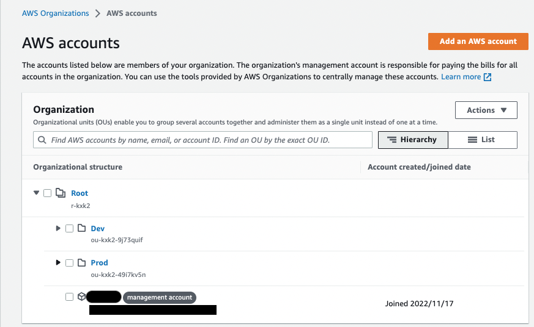
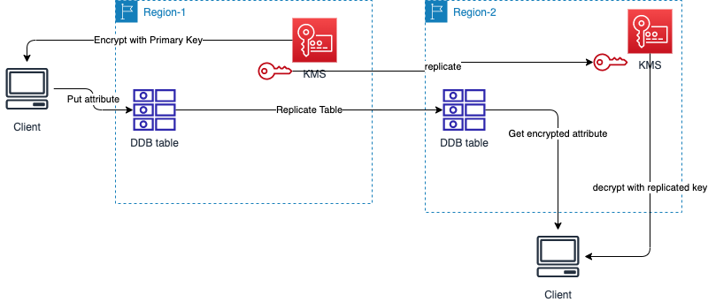
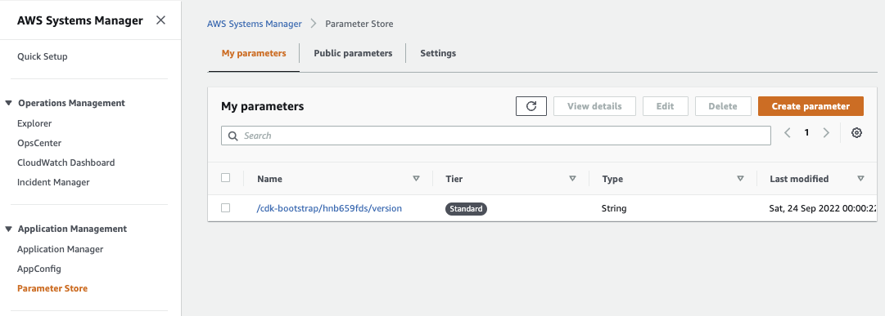
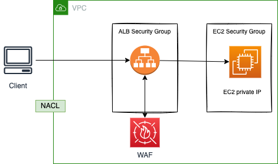

# Security

!!! Info
    Created Oct/2022  - Updated 10/25/2023 - Between level 100 to 400.

## Introduction

With the AWS Cloud, managing security and compliance is a [shared responsibility](https://aws.amazon.com/compliance/shared-responsibility-model/) between AWS and the customer:

* [AWS is responsible of security **of** the cloud](https://aws.amazon.com/security/) and offers the most flexible and secure cloud computing environment available today. AWS is responsible for patching their managed services and infrastructure security.
* Customers are responsible for the security **in** the cloud: secure workloads and applications that are deployed onto the cloud. When using EC2, we are responsible to patch OS for security (but AWS helps by providing patched AMIs, or tools such as [Systems Manager](https://aws.amazon.com/systems-manager), or [Inspector](https://aws.amazon.com/inspector/) for continuous vulnerability testing).

AWS runs highly secured data centers. Multiple geographic regions and Availability Zones allow customers to remain resilient in the face of most failure modes, from system failure to natural disasters.

For highly regulated industry, AWS helps by getting more than 50 certifications for the infrastructure, globally but also regionaly for specific countries. At global, these include the [ISO 27001](https://www.iso.org/isoiec-27001-information-security.html), SOC 1 and 2 certifications. For regional in the USA, AWS aligns with [FISMA](https://www.cisa.gov/federal-information-security-modernization-act) and [FedRAMP](https://www.gsa.gov/technology/government-it-initiatives/fedramp), in UK with Cyber Essentials, in Australia with IRA... The audits are done by a 3nd party and we can find reports in [aws/artifact](https://aws.amazon.com/artifact/).

[AWS Compliance Center is a central location to research cloud-related regulatory requirements](https://aws.amazon.com/financial-services/security-compliance/compliance-center/)

Fine-grain identity and access controls combined with continuous monitoring for near real-time security information ([CloudTrail](https://aws.amazon.com/cloudtrail/)) ensures that the right resources have the right access at all times, wherever the information is stored

The following figure illustrates the AWS security domains and the services to support those domains:

{ width=800 }

Security scope needs to address all those domains, and leverage the four core security services: `Security Hub, GuardDuty, Shield Advanced, KMS`.

--- 

## 1- Identity

### [IAM Identity and Access Management](https://docs.aws.amazon.com/IAM/latest/UserGuide/introduction.html)

* Helps to control access to AWS services, for **identities** like users or other services, via console, CLI or SDK.

{ width=800 }

* IAM is a global service, defined at the account level, cross regions.
* IAM helps defining users (physical person), groups and roles, permissions (policies) and control access to **Resources**.
* An AWS account is not the same as a user. The users are defined in IAM for development or SRE needs. Identity Center users are also different.

{ width=800 }

* **Resources** are entities created in AWS (S3 bucket is a resource).
* Users attempt to perform **Actions** on resources. **Policy** authorizes to perform action.

* Each account has a root user. Root user access should be set up to use Multi Factor Authentication (MFA) and use complex password. Do not delete root user. But do not use root user, create a user with administrator role.
* Administrator users are part of an admin group with admin priviledges, like `AdministratorAccess` policy.
* Assign users to groups (`admin` and `developers`) and assign policies to groups and not to individual user.
* Groups can only contain users, not other groups.
* Users can belong to multiple groups.
* A classical use case: Create the user, create a group for each department, create and attach an appropriate policy to each group, and place each user into their department’s group. When new team members are onboarded, create their user and put them in the appropriate group. If an existing team member changes departments, move their user to their new IAM group.
* AWS Account has a unique ID but can be set with an alias. The console URL includes the user alias.
* **Principal**: A person or application that can make a request for an action or operation on an AWS resource. Role sessions, IAM users, federated users, and root users are principals that make requests.
* **Identity-based policies**: Policies that are attached to an IAM user, group, or role. These policies let us specify what that identity can do (its permissions). Identity-based policies can be managed or inline(not shareable).
* **Resource-based policies**: Policies that are attached to a resource. Not all AWS resources authorize such policies.
* **IAM Roles** are used to get temporary credential, via [STS](#aws-security-token-service-api), to do something on other services. EC2 has **instance role** to access remote services. Service roles is also used from service to service authorization, and finally Cross account roles are used to do action within another AWS Account.

???- "Identity Center"
    This is another service to manage user for single sign on on applications deployed on AWS. This is in Identity Center that we define Organizations.

#### Multi Factor Authentication - MFA

* Multi Factor Authentication is used to verify a human is the real user of a service
 
    * Always protect root account with MFA. 
    * MFA = password + device we own. 
    * The device could be a universal 2nd factor security key. (ubikey) 

* [Authy](https://authy.com/) is a multi-device service with free mobile app. We can have multiple users on the same device.

### Security Policies

* Security Policies are written in JSON, and define permissions `Allow`, `Deny` for users or roles to perform action on AWS services, for an IAM identity such a user, user groups or role...
* **AWS Managed policy** (e.g. AdminstratorAccess policy) are predefined by AWS. 
* Policies defined by customer (**Customer managed**)
* **Inline policies** assigned to one user or role and not shareable
* **Resource based policies** for access resources like S3 bucket.

    

* Policy applies to **Principal**: an account | user | role, list the **actions** (what is allowed or denied) on the given **resources**.
* It must define an ID, a version and one or more statement(s). The following policy authorizes to create any lambda function. (resource = '*' is to support any resource arn, so here any function).

    ```json
    {
        "Version": "2012-10-17",
        "Statement": [
            {
                "Effect": "Allow",
                "Action": [
                    "lambda:CreateFunction"
                ],
                "Resource": "*",
                "Condition" : {}
            }
        ]
    }
    ```

The condition part can reference specific principals or resource, and use the format:

```json
"Condition" : { "{condition-operator}" : { "{condition-key}" : "{condition-value}" }}
```

* Another example to control access to IAM itself:

    { width=800 }


* Use the `Least privilege permission` approach: Give users the minimal amount of permission they need, to do their job.
* Developer may have the AWS managed policy name: `PowerUserAccess` to enable them to create and configure resources and services that support AWS aware application development.
* As soon as there is one `deny` in the chain of policy evaluation, any `allows` will not work. See the diagram below from [the product documentation](https://docs.aws.amazon.com/IAM/latest/UserGuide/reference_policies_evaluation-logic.html) to review the decision flow for resource access authorization:


???- exercise "IAM policy evaluation workshop"
    The [IAM policy evaluation workshop](https://catalog.us-east-1.prod.workshops.aws/workshops/6dc3124a-6bd4-46eb-b5c4-be438a82ba3d/en-US) is useful to understand the policy evaluation. The [CF template is in labs/security/iam](https://github.com/jbcodeforce/aws-studies/tree/main/labs/security/iam/lab-template.yaml). The lab illustrates the Role defined and assigned to the EC2 running Cloud9, cannot list S3 bucket, but 1/ adding an inline identity-based policy will get it working. There is no resource based policy on S3. The session policy allows all access and acts as a pass through. 2/ Adding a resource-based policy on S3 denies access to the role. The role used in the workshop has action like: `s3:GetBucketPolicy` and `s3:PutBucketPolicy`, so it can create policies. Deleting the identity policy on the role and then adding a resource-policy on s3 bucket like the one below, lets the role accessing the bucket.
    
    ```json
    "Sid": "AccessToLabBucket",
            "Effect": "Allow",
            "Principal": {
                "AWS": "$IAM_LAB_ROLE_ARN"
            },
            "Action": "s3:ListBucket",
            "Resource": "arn:aws:s3:::$S3_LAB_BUCKET_NAME"
    ```

    In Part 2 of the lab, it demonstrates that a resource based policy with an Allow on all Principals, bypasses the permission boundary, so exits at column 3 in figure above. While a deny on permission boundary with a resource-based policy (This works because we are in the same AWS account):

    ```json
      {
            "Sid": "AccessToLabBucket",
            "Effect": "Allow",
            "Principal": {
                "AWS": "$IAM_LAB_ROLE_ARN"
            },
            "Action": "s3:ListBucket",
            "Resource": "arn:aws:s3:::$S3_LAB_BUCKET_NAME"
        }

        When evaluating policies for a cross-account request, the resource-based policy and all policies attached to the principal making the request are evaluated separately and both must allow access, regardless of what value is used in the Principal element of the resource-based policy.
    ```

* [Access Advisor](https://docs.aws.amazon.com/IAM/latest/UserGuide/access_policies_access-advisor.html?icmpid=docs_iam_console) helps to see permission granted to a user or role, and when services  were last accessed. It helps to identify unused permissions so that we can remove them.
* [Access Analyzer](https://docs.aws.amazon.com/IAM/latest/UserGuide/access-analyzer-getting-started.html): Analyze resources (S3 buckets, IAM roles, KMS keys, Lambda fct, SQS Queues, secrets) that are shared with external entity.
* Policy may define the password type `> Account settings > Password policy`, and when users are allowed to change the password.
* Inline policy can be defined at the user level, but it is recommended to use Group and Group level policies. As user can be part of multi groups, she/he will heritate to the different policies of those groups.
* IAM is not used for website authentication and authorization. AWS Cognito is a better fit for that.
* For identity federation, use SAML standard.
* We can test Policies with the [policy simulator](https://policysim.aws.amazon.com/home/index.jsp?#).
* We can update a policy attached to a role and it takes immediate effect.

* We can attach & detach roles to running EC2, without having to stop and restart it.
* A policy has a max character count size around 10,240. 
* IAM policies can use variables, like `$aws:username`, and Tags like `aws:PrincipalTag/key-name`.

* Very interesting [examples of IAM identity based policies.](https://docs.aws.amazon.com/IAM/latest/UserGuide/access_policies_examples.html)


### [IAM Roles](https://docs.aws.amazon.com/IAM/latest/UserGuide/id_roles.html)

An IAM role is an IAM identity (as a user is) that we can create in our account to grant it specific permissions.

* [Found this summary very good](https://docs.aws.amazon.com/bedrock/latest/userguide/security-iam.html)

* To get AWS services doing work on other service, we need to define IAM Role and policies. Roles are assigned per application, or per EC2 or lambda function... A lot of roles are predefined and can be reused. We can also define new role for any service intance we create. Here are example of predefined service roles:

    

* A role is intended to be **assumable** by anyone who needs it. This means another identity will identify itself to be that role. The following diagram is used for Account A to access S3 bucket in Account B via a role defined in Account B with policies to access S3.

    

* In the role definition there is `Link to switch roles in console` URL that permits to assume the role for a given user.
* There is no password for a role, when a service assumes a role, IAM dynamically provides temporary security credentials that expire after a defined period of time, between 15 minutes to 36 hours. Temporary Security Credentials (consisting of access key id, secret access key and a security token). The credentials are coming from AWS Security Token Service via AssumeRole API. It solves use cases like cross account access and single sign-on to AWS.

    

* When a user, app, service, assumes a role, it gave up the original permissions it had and takes the permissions assigned to the role. While with resource based policy the principal doesn't have to give up permissions.
* The assumed role needs to trust the assuming identity explicitly via a **Trust relationship** declaration: The following statement enables EC2 to assume the role to which this trust relationship is attached to:

    ```json
    {
        "Version": "2012-10-17",
        "Statement": [
            {
                "Effect": "Allow",
                "Principal": {
                    "Service": "ec2.amazonaws.com"
                },
                "Action": "sts:AssumeRole"
            }
        ]
    }
    ```

* So when defining a role, we should define the trusted entity (principals), that may use this role, and then a policy to define what actions can be done on the service (in the role's permission settings). Trust relationship is used to share resources between accounts, it is a bidirectional relationship. Account owner may authorize to have users assuming a given role.
* A role that a service assumes to perform actions on our behalf is called a **service role**.
* A **service-linked role** is a type of service role that is linked to an AWS service. They are own by the services, be visible in our AWS account but not editable.
* A [role can be attached to an EC2 instance](https://docs.aws.amazon.com/IAM/latest/UserGuide/id_roles_use_switch-role-ec2.html), and so any applications running on that EC2 instance, can get temporary AWS credentials to access permitted services. The role supplies temporary permissions that applications can use when they make calls to other AWS resources:

{ width=500 }


???- example "EC2 control with IAM role"
    When connected to an EC2 machine via ssh or using EC2 Instance Connect tool, we need to set an IAM role to define who can use the EC2 and what command they can do within EC2. Inside the EC2 shell, a command like `aws iam list-users` will not work until a role is attached to EC2 with a policy to autorize IAM actions. For example, the following `DemoEC2Role` role is defined to let read-only IAM access:

    { width=800 }

    This role is then used in the EC2 / Security  > attach IAM role, and now read-only commands with `aws iam` will execute successfully inside this EC2.

???- example "IAM user and role with CDK"
    Example of creating a user to get EC2 full access via a role (see code under [labs/cdk/iam-user](https://github.com/jbcodeforce/aws-studies/tree/main/labs/cdk/iam-user)):

    ```python
    user = iam.User(self,
                    "Julie",
                    user_name="Julie",
                    password=SecretValue.unsafe_plain_text("Passw0rd!")
                    )

    role = iam.Role(self,"EC2FullAccess",
                    role_name="EC2FullAccess",
                    description="A role to allow specified user to do EC2 work",
                    assumed_by=user,
                    managed_policies=[iam.ManagedPolicy.from_aws_managed_policy_name("AmazonEC2FullAccess")])
    ```

???- example "IAM user and role using SDK"
    [See product documentation](https://docs.aws.amazon.com/IAM/latest/UserGuide/example_iam_CreateRole_section.html) and the following [personal AWS Organization play examples](https://github.com/jbcodeforce/aws-organization-play).


???- example "Lamba to access S3 bucket"
    We want to implement a lambda function, that will access one S3 bucket to read files and another s3 bucket to put objects. We need a new role as illustrated in following figure, with permission to execute on lambda service, trace with XRay and R/W to S3 policy.

    { width=1000 }

    See the policy examples defined in [labs/s3-lambda](https://github.com/jbcodeforce/aws-studies/blob/main/labs/lambdas/s3-lambda/s3-read-write-permission.txt). `AWSLambdaBasicExecutionRole` is for logs, `AWSXRayDaemonWriteAccess` for the function to put traces into CloudWatch XRay.

    When defining the Lambda function we select the role defined with the expected permissions so the function can access other services.

???- example "Playing with Organizations"
    [See readme and code in the aws-organization-play repo](https://github.com/jbcodeforce/aws-organization-play.git) with assume role between accounts.

#### Resource-based policy

When user, application or service assumes a role, it takes the permissions assigned to the role, and **looses** its original permissions. While when we use resource-based policy, the principal doesn't have to give up his permissions. For example if a user in Account A needs to scan DynamoDB table in account A and dumps it in S3 bucket in account B, then it is important to use resource-based policy for S3 bucket, so user does not loose its access to dynamoDB.

#### Attribute-based access control

Attribute-based access control (ABAC) helps to determine access to resources based on attributes of the user, resource, application' states and environment conditions. An ABAC policy could allow access to a payment processing endpoint only for users in the finance department during business hours.

Attributes may come from multiple sources: IAM tags, STS session tags, resource tags.

ABAC gives a lot of flexibility compared to traditional IAM policies by enabling dynamic, context-aware authorization decisions:  who is the user? What are they trying to access? How are they trying to access it? What environment are they in? 

The disadvantage to using the traditional RBAC model is that when employees add new resources, you must update policies to allow access to those resources. 

Here is an example of such policy:

```json
{ "Version": "2012-10-17", 
  "Statement": [ 
    { "Effect": "Allow", 
      "Action": "s3:ListBucket", 
      "Resource": "arn:aws:s3:::example_bucket", 
      "Condition": { 
        "StringEquals": { "aws:PrincipalOrgID": "o-12345", "aws:PrincipalTag/Department": "Finance" } } } 
    ]
}
```

[ABAC policy examples.](https://docs.aws.amazon.com/verifiedpermissions/latest/userguide/policies_examples-abac.html)

sts:TagSession permission allows an IAM user or role to pass session tags when assuming a role or federating users. Session tags are custom attributes that get attached to the resulting temporary security credentials

Session tags are key-value pairs that can be used to organize or track assumed role sessions.

Session tags get returned with the AssumeRole response and can then be referenced in IAM policies or AWS Config rules. This allows conditional access based on session attributes.
The maximum number of session tags per response is 10, with a maximum key and value size of 128 bytes each.


#### Some important articles

* [Learn to create a user, a role, using the console](https://docs.aws.amazon.com/IAM/latest/UserGuide/getting-started.html).
* [IAM tutorials](https://docs.aws.amazon.com/IAM/latest/UserGuide/tutorials.html) with matching aws cli iam scripts in [labs/security/iam](https://github.com/jbcodeforce/aws-studies/tree/main/labs/security/iam)
* [Using IAM role product documentation](https://docs.aws.amazon.com/IAM/latest/UserGuide/id_roles_use.html)
* [Use IAM roles to connect GitHub Actions to actions in AWS](https://aws.amazon.com/blogs/security/use-iam-roles-to-connect-github-actions-to-actions-in-aws/) to get an example of trusting an external system to access AWS services via our AWS account.
* [Policy evaluation logic](https://docs.aws.amazon.com/IAM/latest/UserGuide/reference_policies_evaluation-logic.html)

### Permissions boundary

Set a permissions boundary to control the maximum permissions a user can have using identity-based policies. This is defined at user's or role level, and we define a customer managed policy or a AWS managed policy, for example, to authorize the user to do anything on EC2, CloudWatch or S3.
Permissions boundary limits the user's permissions but does not provide permissions on its own.

The effective permission of a user is the join between Organization SCP, Permissions Boundary, and identity-based policies.

{ width=600 }

???- exercise "IAM policy evaluation workshop"
    The [IAM policy evaluation workshop](https://catalog.us-east-1.prod.workshops.aws/workshops/6dc3124a-6bd4-46eb-b5c4-be438a82ba3d/en-US) lab2 demonstrates permission boundary.

They are used to:

* Delegate responsibilities to non-admin users within their permission boundaries to create specific resources, like an IAM user.
* Allow developers to self-assign policies and manage their own permissions, while making sure they can increase their privileges (to an admin user).
* Restrict one user.

[See this blog as a good example of things to do.](https://aws.amazon.com/blogs/security/delegate-permission-management-to-developers-using-iam-permissions-boundaries/).

### Security tools

* In IAM, use `> Credentials report` to download account based report.
* In IAM, use `> Users > select one user and then Access Advisor tab`:
Access Advisor shows the services that the selected user can access and when those services were last accessed.
* [Amazon GuardDuty](https://aws.amazon.com/guardduty/) is a security tool to continuously monitor the AWS accounts, instances, containers, users, and storage for potential threats.
* [Access Analyzer](https://docs.aws.amazon.com/IAM/latest/UserGuide/access-analyzer-getting-started.html): Analyze resources (S3 buckets, IAM roles, KMS keys, Lambda fct, SQS Queues, secrets) that are shared with external entity. It uses the concept of Zone of Trust, which is an AWS account or Organization. Any potential violation is called a **finding**. It can be used to validate policy syntax, but to generate policy too. The diagram below illustrates how Access Analyzer can use CloudTrail logs from a lambda execution to help create an accurate IAM policy, to define accurate security scope:

    


### [IAM Identity Center](https://docs.aws.amazon.com/singlesignon/index.html)

This is a single sign-on managed services for all AWS accounts within AWS Organizations, cloud applications, SAML2.0-enabled applications, EC2 Windows instances. IAM Identity Center requires AWS Organizations. When Identity Center is enabled, it creates a service-linked role in all accounts within the organization in AWS Organizations.

By default IC has an identity store. But it can be connected to a remote directory service. The SSO works with a login, and users/groups are defined within IC store.

AWS Organizations supports IAM Identity Center in only one AWS Region at a time. We need to delete IC if we want to use another region.

The goal of identity federation is to get user outside of AWS, the permissions to access AWS resources into our accounts. Identity federation is supported by different solutions:

* SAML 2.0: Open standard used by many identity providers like Microsfodt Active Directory Federations Services (ADFS). We need to define a trust between the SAML 2.0 identity provider and AWS IAM, and then use `AssumeRoleWithSAML` STS API.
* Custom Identity Broker
* Web identity with Amazon Cognito
* SSO

The identity provider can be an identity store in IAM Identity center or a 3nd party solution like an Active Directory, OneLogin, Okta...

Permission sets are a way to define permissions centrally in IAM Identity Center so that they can be applied to all of our AWS accounts. These permission sets are provisioned to each AWS account as an IAM role.


The user can access the access portal (URL like https://d-92676f0fd8.awsapps.com/start), then the account it is associated to, and the permission sets he wants to use, then he can access the AWS management console. Depending of the permission sets the user can perform different actions to services.

A permission sets can have customer permission, defined as part of a customer managed policies.

???- example "Apply permission set for an SRE team"
    A SRE team needs to access different member accounts, but only to see CloudWatch log groups. To support that do:

    1. Create a customer managed IAM policy to allow "logs:CreateLogStream"... on specific account `id:log-group:*`
    1. Create a permission set in IC, and use the custom permission using the policy from previous step.
    1. Create a group in IC: `operations`
    1. Create a user `operationsUser` and add to the group `operations`
    1. Select the account we want those user to access, and assign the permission set to it.

???- example "Define attribute based access control"
    When creating a user in IC, there are attributes (tags) defined, like a Department. Those can be used to as conditions in an IAM policy, and then assigned to a permission set.
    
    ```json
    "Condition": {
                "StringEquals": {
                 "ec2:ResourceTag/Department": "${aws:PrincipalTag/Department}"
                }
    ```

    Then enable attributes for access control, in IC settings. And use `Key: Department` and `Value:  ${path:enterprise.department}`

* [API reference](https://docs.aws.amazon.com/singlesignon/latest/APIReference/welcome.html)

### AWS Organizations

[AWS Organizations](https://us-east-1.console.aws.amazon.com/organizations) helps to centraly manage multiple AWS accounts, group accounts, defines security policies cross account, and simplify account creation. Using accounts helps to isolate AWS resources. It is a global service.

* We can set up a single payment method for all the AWS accounts in our organization through **consolidated billing**.
* It groups accounts via organizational units (OUs), on which we can define policies.
* It is well suited to define custom multi-account environments with advanced governance and management capabilities.

#### Concepts

{ width=800 }

**Figure 5: Organization concepts**

* A **management account** is the AWS account you use to create your organization.
* An organization is a hierarchical structure (a tree) with an **administrative root** and Organization Units (OU), and AWS accounts.
* The `root` user is a single sign-in identity that has complete access to all AWS services and resources in any accounts.
* Organization unit (OU) contains AWS Accounts or other OUs. It can have only one parent.

{ width=800 }

**Figure 6: Organization Services - manage accounts**

* OU can be per team, per line of business.
* When creating an account, the management account may use the `OrganizationAccountAccessRole` role to grant full admin permissions in the member accounts to the management account itself. It is used to perform admin tasks in the member accounts, like creating IAM users.

    

* Once account created, a user needs to go to the AWS login console (https://signin.aws.amazon.com/), use the email address and forgot password option, or use the one-time password defined during creation.
* AWS Organizations uses [IAM service-linked roles](https://docs.aws.amazon.com/organizations/latest/userguide/orgs_integrate_services.html#orgs_integrate_services-using_slrs) to enable trusted services to perform tasks on our behalf in our organization's member accounts.
* We can create **Service Control Policies** (SCPs) cross AWS accounts to filter which AWS services can be used for individuals or group of accounts in an OU. Explicit allow. The root OU will have `FullAWSAccess` SCP.
* AWS Organization exposes APIs to automate account management.
* Organization helps consolidating billing accross all the accounts and user can get pricing benefits from aggregate usage. Shared reserved instances and Saving Plans discounts apply across accounts. Can define Blocklist or Allowlist strategies.
* There is no cost to use AWS Organizations.
* We can invite an existing AWS account to our organization. But paymen t changes of ownership.
* There is a special feature called `All Features` to include consolidated billing, integration with AWS services and SCPs. To share a RI or Savings Plans discount with an account, both accounts must have sharing turned on.
* With Organizations, we can centrally orchestrate any AWS CloudFormation enabled service across multiple AWS accounts and regions.

#### Advantages

* Group resources for categorization and discovery
* Define logical boundary for security purpose.
* Limit blast radius in case of unauthorized access.
* More easily manage user access to different environments. If team A can't support team B's app, the applications should not be in the same account.
* Can use tagging for billing purpose.
* Help to bypass the limit per account, for example the number of lambda function per account.
* Enable CloudTrail for all accounts and get report in a central S3 bucket.

{ width=800 }

**Figure 7: Organization policies**

#### Service Control Policies

They define the `maximum available` permissions for IAM entities in an account. SCPs are attached to the root org, OUs, or individual accounts. They are inherited. SCPs alone are not sufficient for allowing access to the accounts in our organization. Attaching an SCP to an AWS Organizations entity just defines a guardrail for what actions the principals can perform.

We can define allowance policy on resources within the account using something like:

```json
{
   "Effect": "Allow",
    " Action" : [
        "ec2:*", "ds:*", "s3:*"
    ],
    "Resource": "*",
    "Condition": {
        "StringEquals": {
            "aws:RequestedRegion" : [ "eu-central-1", "us-west-1" ]
        }
    }
}
```

Or denying like: (Be sure to have policy to allow "*" )

```json
{
   "Effect": "Deny",
    " Action" : [
        "organizations:LeaveOrganization", "ec2:TerminateInstances"
        , "ec2:PurchaseReservedInstancesOffering", "ec2:ModifyReservedInstances"
    ],
    "Resource": "*"
}
```

Account administrator must still attach identity-based policies to IAM users or roles, or resource-based policies to the resources in the accounts to actually grant permissions. The effective permissions are the logical intersection between what is allowed by the SCP and what is allowed by the identity-based and resource-based policies.

SCP defined at the management account level has no impact as management account can do anything.

As some AWS AI services may use the data of an account, it is possible to define OptOut policies.

???- example "Enforce using tags to launch EC2 instances"
    Use Organizations. Create a Service Control Policy that restricts launching any AWS resources without a tag by including the Condition element in the policy which uses the `ForAllValues` qualifier and the `aws:TagKeys` condition. 
    ```json
    "Statement": [
    {
      "Sid": "RequireTags",
      "Effect": "Deny",
      "Action": ["*"],
      "Resource": ["*"],
      "Condition": {
        "ForAllValues:StringEquals": {
          "aws:TagKeys": ["TagKey1","TagKey2"] 
        }
      }
    }
    ]
    ```
    

#### Deeper Dive

* [Presentation on organizations](https://broadcast.amazon.com/videos/192190)
* [User guide](https://docs.aws.amazon.com/organizations/latest/userguide/orgs_introduction.html)
* [Organization API](https://docs.aws.amazon.com/organizations/latest/APIReference/API_Organization.html)
* [My Organization playground repo](https://github.com/jbcodeforce/aws-organization-play)
* [S3 storage lens with Organization playground lab](../playground/s3-org-billing.md)
* [Tutorials Dojo, cheat sheet.](https://tutorialsdojo.com/aws-organizations/)
* [Infrastructure Identity in AWS workshop](https://idm-infrastructure.awssecworkshops.com/) to use Systems Manager and IAM.


??? question "Limit creating EC2 instance without needed tag"
    ```json
    {   "Effect": "Deny",
        "Action" : "ec2:RunInstances",
        "Resource": "arn:aws:ec2:*:*:instance/*",
        "Condition": {
            "Null": {
                "aws:RequestTag/Project": "true"
            }
        }
    }
    ```

### AWS [Security Token Service API](https://docs.aws.amazon.com/STS/latest/APIReference/welcome.html)

Very important service to assume role accross accounts, within the same account, and to support identity federation:

* The STS is used to request temporary, limited-privilege credentials for users, via the `AssumeRole` API.

    

* There is a global service https://sts.amazonaws.com endpoint with regional access endpoints too.
* The API has the main action called `AssumeRole` which returns a AccessKeyId, SecretAccessKey, and SessionToken, so the requester can access AWS resources via API (but not sts getFederationToken or getSessionToken).
* To assume a role from a different account, the AWS account must be trusted by the role.
* User must assume the role using the AWS management console, or using CLI, or AWS API.

    ```sh
    # with the user key in the .aws/config
    aws configure --profile Bill
    aws sts assume-role --role-arn "arn:aws:iam::<account-id-cust-A1>:role/UpdateApp" --role-session-name "Bill-Update"
    ```
    
* STS offers the ability to revoke active session and credentials for a role, by adding time statement within a policy or by using API `AWSRevokeOlderSessions`.
* When the AWS account is owned by 3nd party (not part of our zone of trust), STS should use an `externalID`, which is a secret between our account and the 3nd party to uniquely associate a role with the 3nd party. This id is used during the assumeRole API call to ensure this is the correct account and 3nd party, to avoid the confused deputy issue.
* When doing the API call, we can pass session policies and the returned permissions are the intersection of the role's identity-based policy and the session policies.
* Session policies are advanced policies that we pass as a parameter when we programmatically create a temporary session for a role or federated user.
* We can pass a single JSON policy document to use as an inline session policy, or pass 10 managed policy ARNs
* STS stores the data relating to the tags, policies, and ARNs within the AWS session token. All this data counts towards the PackedPolicySize limit. Inline session policies and session tags are serialized and compressed in the session token. [See this re:Post note](https://repost.aws/knowledge-center/iam-role-aws-sts-error)
* The plaintext to reference ARN or pass inline policy is limited to 2048 chars. [Size limites.](https://docs.aws.amazon.com/IAM/latest/UserGuide/reference_iam-quotas.html).

* [Session tags](https://docs.aws.amazon.com/IAM/latest/UserGuide/id_session-tags.html) are (key-value pairs) passed to the assumeRole API. Tag are added (50 tags max) to the session to control access to resources or to control what tags can be passed into a subsequent session. They are normally used for attribute-based access control (ABAC).

[See code example to get a token for a role and control access via session policies](https://github.com/jbcodeforce/aws-studies/tree/main/labs/security/session.py)

### [Amazon Cognito](https://docs.aws.amazon.com/cognito/latest/developerguide/what-is-amazon-cognito.html)

Amazon Cognito is a managed service which offers Authentication and Authorization features, it has **User pools** and **Identity pools**. It is scalable and highly available. Allows user to add user registration, sign in, and define access control.

* Supports standards based identity providers like OAuth 2.0, SAML, OIDC.
* **User pools** are user directories that provide sign-up and sign-in options for our apps or mobile users. 
* User pool is for sign-in functionality, and it integrates with API Gateway and ALB.
* **Identity pools** provide AWS credentials to grant our users access to our APIs, other AWS services via IAM permissions.

{ width=500 }

* Free tier of 50,000 MAUs for users who sign in directly to Cognito User Pools and 50 MAUs for users federated through SAML 2.0 based identity providers.
* Users can sign in through social identity providers like Google, Facebook, and Amazon. They can also sign in through enterprise providers like ADFS and Okta with SAML 2.0 and OpenID Connect authentication.
* Use Amazon Cognito's built-in UI and options for federating with multiple identity providers to add user sign-in, sign-up into an application. 
* use [AWS Amplify](https://docs.amplify.aws/) and the [aws-amplify-vue](https://docs.amplify.aws/start/) module to provide basic user sign up, sign in, and sign out functionality.


#### Examples

* Configure how user login:

{ width=800 }

* Then define if we want to use MFA, get an option to reset password..
* Configure sign-up and message delivery. We can disable auto sign-up and sending email.

### [Resource Access Manager](https://aws.amazon.com/ram/)

* **Goal**: share resources with any AWS accounts. It avoid declaring duplicate resources within multiple accounts.
* No additional charge
* Share CIDR blocks via managed prefix list, so other account can define security policies using the lists
* Share VPC subnets, Transit Gateway, Route 53 outbound resolver

* [Cheat Sheet.](https://tutorialsdojo.com/aws-resource-access-manager/)
* [Product Doc](https://aws.amazon.com/ram/)
* [FAQ](https://aws.amazon.com/ram/faqs/)


### [AWS Control Tower](https://docs.aws.amazon.com/controltower/latest/userguide/what-is-control-tower.html)

AWS Control Tower orchestrates other services like AWS Organizations, IAM identity center, Service Catalog. It helps to set up and to govern **multi-account** environments to avoid them to drift from best practices. Drift may happen when we create an account outside of Control Tower.

It uses the concepts of **Landing zone** as the multi-account environment. When creating a landing zone, it creates a `Security` OU with the log archive account, and the security audit account.


**controls** or guardrails which are rule to provide governance for the environment. **Detective Controls** detect noncompliant resources in our accounts and provide alerts through the Control Tower dashboard. They are implemented in *AWS Config* rules. **Proactive Controls** check compliance of the resources before they are provisioned and are implemented using *CloudFormation hooks* and Guard rules. **Preventive Controls** prevent actions from occurring and are implemented as *Service Control Policies* (SCPs) attached to the OUs.

???- info "Control example"
    If you enable the detective control Detect whether public write access to Amazon S3 buckets is allowed on an OU, you can determine whether a user would be permitted to have read access to any S3 buckets for any accounts under that OU.

**Account Factory** is a configurable account template that helps to standardize the provisioning of new accounts with pre-approved account configurations (VPC default, subnets, regions...)

It runs on top of Organization and leverages SCPs for preventative guardrails and AWS Config for detective guardrails.

Detect policy violations and remediate them.

It uses Service Catalog to provision new AWS accounts.

AWS Control Tower aggregates information from all accounts into the organization trail and delivers the logged information to a specified Amazon S3 bucket.

AWS Control Tower provides us with over 360 controls out-of-the-box to support the distinct security requirements of our workloads.

No additional charge exists for using AWS Control Tower. We only pay for the AWS services enabled by AWS Control Tower, and the services we use in our landing zone.

* [Control Tower workshop](https://catalog.workshops.aws/control-tower)
* [Flat multi-account environment](https://docs.aws.amazon.com/whitepapers/latest/organizing-your-aws-environment/appendix-e-establish-multi-account.html#example-workloads-flat-structure)
* [Organizing Environments](https://docs.aws.amazon.com/whitepapers/latest/organizing-your-aws-environment/appendix-c-worksheet-for-identifying-attributes-of-workload-hosting-environments.html)

---------------------

## 2- Data Protection

### Encryption

Encryption is widely available through a lot of services and features on top of the platform. We will be able to develop application that can encrypt data at rest, or in transit as it flows over the network between services. S3 storage or EBS block attached storage, have a single click option to do encryption at rest with keys (using KMS or S3).

{ width=700 }

**Figure 1: Encryption settings for EBS volume, using KMS**

### [KMS](https://docs.aws.amazon.com/kms/latest/developerguide/overview.html)

As a managed service, [AWS Key Management Service](https://aws.amazon.com/kms/), helps centrally managing our own keys material or the one created by AWS service. User controls access and usage of the keys.

A KMS key is a logical representation of a cryptographic key. In addition to the key material used in cryptographic operations, a KMS key includes metadata, such as the key ID, key policy, creation date, description, and key state.

With client side encryption, the data is encrypted by the client, and never decrypted by the Server. Only client with the data key can decrypt the data.

{ width=700 }

**Figure 2: KMS & AWS keys**

* Integrated with IAM and most AWS services (EBS,S3, RDS, SSM...). The keys never leave AWS.
* Audit KMS Key usage using Amazon CloudTrail.
* Two types of KMS Keys:
    
    * Symmetric (AES 265 bits) is a single key used to encrypt and decrypt data. Must call KMS API to use it.
    * Asymmetrics (RSA, ECC key pairs) - Public key to encrypt and private key to decrypt. Used to encrypt outside of AWS, with no KMS API access.

* There are different types of KMS keys:

    * Customer managed keys: full control to end-user to create, manage and use the key.
    * AWS managed keys by AWS services within our account, like S3, EBS, redshift
    * AWS owned keys used for AWS services managed services.

    { width=600 }

* The Key material Origin is used to identify the source of the key. The Origin can be KMS, or an external service outside AWS but imported inside KMS, or a Custom Key Store which is a [AWS CloudHSM](#aws-cloudhsm) cluster managed by us, and where KMS creates the key but let the external key store to manage it. 
* Finally a Key source could be completely external, and supports the Bring Your Own Key use case. The key needs to be a 256-bit symmetric key. The process looks like in the figure below:

    

* For AWS managed keys, they are automatically rotated every year.
* KMS Keys are **per region**. But when doing snapshot of a EBS volume and moving it to another region, AWS will reencrypt the data with a KMS key from the target region automatically. 
* KMS Key policies help to control who (users, roles ) can access the KMS keys. There is one policy per key. Without permission from the key policy, IAM policies that allow permissions to access the key have no effect. We need both. See [the product doc.](https://docs.aws.amazon.com/kms/latest/developerguide/key-policy-default.html#key-policy-default-allow-root-enable-iam)
* Key policies are used to do cross account access: the copy of a encrypted snapshot done from origin account to the target account will use this policy to access the key to decrypt the snapshot, and then will encrypt the copy with a new private key within the target account.

{ width=800 }

**Figure 3: AWS key for S3 encryption, with Key policy**

* To encrypt a local file using a symmetric Key in KMS (referenced as `alias/jb-key`), we can use the CLI like:

    ```sh
    aws kms encrypt --key-id alias/jb-key --plaintext fileb://ExampleSecretFile.txt --output text --query CiphertextBlob  --region eu-west-2 > ExampleSecretFileEncrypted.base64
    ```

* To share the encrypted file, we can do: 

    ```sh
    cat ExampleSecretFileEncrypted.base64 | base64 --decode > ExampleSecretFileEncrypted
    ```

* Then to decrypt this file using KMS:

    ```sh
    aws kms decrypt --ciphertext-blob fileb://ExampleSecretFileEncrypted   --output text --query Plaintext > ExampleFileDecrypted.base64  --region eu-west-2
    # back to the text version
    cat ExampleFileDecrypted.base64 | base64 --decode > ExampleFileDecrypted.txt
    ```

KMS supports also **Multi-Region Keys**, where primary key from one region is replicated to other regions. The Key ID stays the same. The idea is to be able to encrypt in one region and decrypt in another region. A use case will be to encrypt attribute of a DynamoDB Global Table with the Primary key, and let client, who has access to the replicated key, decrypt the attribute with lower latency.

{ width=800 }

**Figure 4: DB table encrypted and replicated with Keys**

The attribute is decrypted only if the client has access to the KMS Key.

* [See AWS kms create-key CLI](https://awscli.amazonaws.com/v2/documentation/api/latest/reference/kms/create-key.html) for examples of creating customer managed keys.

### S3 encryption considerations

By default objects encrypted (or not) with SSE-S3 are replicated.

With SSE-C, we, as customer, provide the encryption key, so the encrypted objects are not replicated.

With SSE-KMS then we need to specify the KMS Key to encrypt the object in target bucket, adapt the KMS policy so the key is accessible in another region, and in the IAM role, be sure the actions `kms:Decrypt` is enabled for the source key and `kms:Encrypt` for the target KMS Key.

### Encrypted AMI sharing process

* AMI in source account is encrypted with KMS Key from source account.
* AMI image should authorize the Launch permission for the target account.
* Define IAM role for the target account to use, and share KMS key accesses (DescribeKey, ReEncrypted, CreateGrant, Decrypt) via the role.
* When launching EC2 instance from this AMI in the target account, it is possible to use a new, local KMS key to re-encrypt the volumes.

### [System management parameter store](https://docs.aws.amazon.com/systems-manager/latest/userguide/systems-manager-parameter-store.html)

Managed service, serverless, it is a secure storage for configuration and secrets. This is a key-value storage, with simple SDK for easy integration in application code. 



* SSM Parameter Store has built-in version tracking capability. Each time we edit the value of a parameter, SSM Parameter Store creates a new version of the parameter and retains the previous versions.

* It is using KMS for seamless encryption. The security access control is via IAM and notifications can be propagated to EventBridge for routing. 

* It stores data in a hierarchical tree. For example  

    ```sh
    aws ssm get-parameters-by-path --path /an-app/dev/
    ```

* It is integration with CloudFormation and be used to keep application parameters. 
* [Parameter store walkthroughs.](https://docs.aws.amazon.com/systems-manager/latest/userguide/sysman-paramstore-walk.html)
* [Quarkus app to access SSM parameter store with Java SDK](https://docs.quarkiverse.io/quarkus-amazon-services/dev/amazon-ssm.html).


### [Amazon Macie](https://docs.aws.amazon.com/macie/latest/user/what-is-macie.html)

Amazon Macie is a fully managed data security service that uses Machine Learning to discover and protect our sensitive data stored in S3 buckets. It automatically provides an inventory of S3 buckets including a list of unencrypted buckets, publicly accessible buckets, and buckets shared with other AWS accounts. It allows us to identify and alert us to sensitive data, such as Personally Identifiable Information (PII).

All Macie findings are sent to Amazon EventBridge and can also be published to AWS Security Hub to initiate automated remediation such as blocking public access to our S3 storage.

* Multi account support, integrated with AWS Organization
* Automated sensitive data discovery
* Can run scan jobs
* Scan 1% of content in buckets $1 per GB for first 50TB/ month.

### [Secrets Manager](https://docs.aws.amazon.com/secretsmanager/latest/userguide/intro.html)

Keep Secret information (unique key-value, or JSON doc), with automatic rotation enforced, and integration with RDS, Redshift, ECS Task, DocumentDB.... Secrets can be replicated between regions. They are encrypted, and keys are in KMS and can be a customer managed key.

Secret has metadata like ARN of the key used. SM keeps version of the secrets .When user changes the secret value, or the secret is rotated, Secrets Manager creates a new version.

When Secrets Manager rotates a secret, it updates the credentials in both the secret and the database or service. The **Single user** [rotation strategy](https://docs.aws.amazon.com/secretsmanager/latest/userguide/getting-started.html#rotation-strategy) updates credentials for one user in one secret. The **alternating users**v strategy updates credentials for two users in one secret. We create the first user, and during the first rotation, the rotation function clones it to create the second user. Every time the secret rotates, the rotation function alternates which user's password it updates.

See [product tutorials](https://docs.aws.amazon.com/secretsmanager/latest/userguide/tutorials.html).

We need two IAM roles to manage permission to the Secret. 1/ A role that manages the secrets. 2/ A role that use the credentials at runtime `RoleToRetrieveSecretAtRuntime`.

We can control access to secrets using Resource-based Policy, specially when using cross account. The following diagram illustrates the process for getting cross account access:


For ECS task, at boot time, secrets are pulled and set in environment variables accessible to the container within the task.

A [simple demo of CDK to create secrets and ECS cluster with a Quarkus app accessing the Secrets](https://github.com/jbcodeforce/aws-studies/tree/main/labs/security/secret-game).

### [ACM - Certificate Manager](https://docs.aws.amazon.com/acm/latest/userguide/acm-overview.html)

Manage and deploy TLS certificates. Supports public and private certificates. Automatic renewal.

Free of charge for public certificates. 

Integrated with ELBs, Cloudfront, APIs on API gateway. Cannot use ACM with EC2.

### AWS [CloudHSM](https://aws.amazon.com/cloudhsm/?nc2=type_a)

[AWS CloudHSM](https://docs.aws.amazon.com/cloudhsm/latest/userguide/introduction.html) (Hardware Security Module) helps  meet corporate, contractual, and regulatory compliance requirements for data security.

HSM provides secure key storage and cryptographic operations within a tamper-resistant hardware device. HSMs are designed to securely store cryptographic key material and use the key material without exposing it outside the cryptographic boundary of the hardware.

We can create a cluster that has from 1 to 28 HSMs (the default limit is 6 HSMs per AWS account per AWS Region).


Example of use case is when hosted on EC2, must encrypt the data before writing the data to a storage.

We can also use AWS KMS if we need to encrypt data before writing to storage when an AWS managed hardware security module for the cryptographic keys is not required.

-------

## 3- Network and App Protection


### [WAF Web Application Firewall](https://docs.aws.amazon.com/waf/latest/developerguide/waf-chapter.html)

* Used to monitor the HTTP(S) requests that are forwarded to the protected (Layer 7) web application resources.
* It is deployed on ALB, API Gateway, CloudFront, AppSync GraphQL API, Cognito User Pool.

* Rules are defined in Web Access Control List: they can apply to IP@, HTTP headers, body, URI strings, SQL injection, Cross-site Scripting...
* We can define size constraints, geographic matches, or rate-based rules for DDoS protection.
For example we can implement a rule capable of blocking all IPs that have more than 2,000 requests in the last 5 minute interval.
* It provides real-time metrics and captures raw requests that include details about IP addresses, geo locations, URIs, User-Agent and Referers.
* Rules can be combined into WebACL to define action for each rule. WebACL is regional, except for CloudFront.
* Can add custom HTTP header to validate the requests.
* Charges based on the number of Web ACLs

#### Deeper dive

* [Cheat sheet.](https://tutorialsdojo.com/aws-waf/)
* [Rate-based rule statement](https://docs.aws.amazon.com/waf/latest/developerguide/waf-rule-statement-type-rate-based.html)
* [WAF FAQ](https://aws.amazon.com/waf/faqs/)

### [AWS Shield](https://aws.amazon.com/shield/)

AWS Shield Standard is enabled by default, and free, it provides protection from layer 3 and 4 attacks, like SYN/UDP floods, refection attacks. 

Shield Advanced is for DDoS attacks. Protects against more sophisticated attack on Amazon EC2, Elastic Load Balancing (ELB), Amazon CloudFront, AWS Global Accelerator, Route 53. It supports  network and transport layer protections with near real-time visibility into attacks and 24/7 access to Shield Response Team.

???- info "DDoS"
    Distributed Denial of Service (DDoS), includes infrastructure and Application attacks. Uses bots to makes calls to servers or applications, so normal users see not responsive server.
    AWS Shield standard and Advanced protect against DDoS.


### [Firewall manager](https://docs.aws.amazon.com/waf/latest/developerguide/fms-chapter.html)

Firewall manager simplifies the administration and maintenance tasks across multiple accounts of an AWS Organization and resources for a variety of protections, including AWS WAF, AWS Shield Advanced, Amazon VPC security groups, AWS Network Firewall, and Amazon Route 53 Resolver DNS Firewall.

It uses security policy with security rules. Those rules could be:

* WAF rules to apply to ALB, API Gateways, CloudFront
* AWS Shield Advanced to appy to ALB, CLB, NLB, Elastic IP, CloudFront
* To standardize on Security group for EC2, ALB, ENI in VPC
* AWS Network Firewall, VPC level rules.
* Rules are defined at the Region level.

???- info "WAF vs. Firewall Manager vs. Shield"
    WAF, Shield and Firewall Manager are used together for comprehensive protection. Start by defining Web ACL rules in WAF. When we need one resource at a time protection then WAF alone is the correct choice. If we want to use AWS WAF across accounts, accelerate WAF configuration, automate the protection of new resources, use Firewall Manager with AWS WAF. Shield Advanced adds additional features on top of AWS WAF, such as dedicated support from the Shield ResponseTeam (SRT) and advanced reporting. If we’re prone to frequent DDoS attacks, consider purchasing Shield Advanced.

---

## 4 - Threat Detection & monitoring

### [AWS Security Hub](https://docs.aws.amazon.com/securityhub/latest/userguide/what-is-securityhub.html)

AWS Security Hub is a Cloud Security Posture Management service that performs security best practice checks, aggregates alerts, and enables automated remediation.

AWS Security Hub is a single place to view all our security alerts from services like Amazon GuardDuty, Amazon Inspector, Amazon Macie, and AWS Firewall Manager. It is not used for producing audit reports.

### [Amazon GuardDuty](https://docs.aws.amazon.com/guardduty/latest/ug/what-is-guardduty.html)

Amazon GuardDuty is a threat detection service that continuously monitors for malicious activity and unauthorized behavior to protect the AWS accounts, workloads, and data stored in Amazon S3.

Security monitoring service that analyzes and processes data sources such as:

* AWS CloudTrail event logs: to track unusual API calls, unauthorized deployments, or S3 data events for get object, list object... 
* CloudTrail management event logs, 
* DNS logs: compromized EC2 instances sending encoded data with DNS queries...
* Amazon EBS volume data, 
* Kubernetes audit logs, 
* Amazon VPC Flow Logs, to track unusual internal traffic.
* RDS login activity

It uses ML/AI model, anomaly detection, and integrated threat intelligence to identify and prioritize potential threats..


GuardDuty can detect compromised EC2 instances and container workloads serving malware, or mining crypto currency.

By integrating with Amazon EventBridge Events, GuardDuty alerts are actionable, easy to aggregate across multiple accounts, and straightforward to push into existing event management and workflow systems.

### [Amazon Detective](https://aws.amazon.com/detective/)

When security findings coming from tools like GuardDuty, Macie, or Security Hub, require deeper analysis to isolate the root cause and take action, Amazon Detective can be used.

Detective collects logs (VPC Flow logs, CloudTrail, GuardDuty) data from our AWS resources and uses machine learning, statistical analysis, and graph theory for security investigations.

* [Cheat sheet.](https://tutorialsdojo.com/amazon-detective/)
* [FAQs](https://aws.amazon.com/detective/faqs/)

### [Amazon Inspector](https://docs.aws.amazon.com/inspector/latest/user/what-is-inspector.html)

Vulnerability management service that continuously scans our AWS workloads for software vulnerabilities and unintended network exposure. Includes **EC2** instance scan and **container images** in Amazon ECR when pushed to the registry, and the same for **Lambda** function.

It uses a database of CVE vulnerabilities.

The reports are sent to Security Hub and to EventBridge.


---

## Privacy and Compliance

### [AWS Audit Manager](https://docs.aws.amazon.com/audit-manager/latest/userguide/what-is.html)

AWS Audit Manager is an automated service to continually audit our AWS usage to simplify how we manage risk and compliance with regulations and industry standards. It eifjcbfdjifhurnicntgjklgrihfkfcdfierkgkghcdi
produces reports specific to auditors for PCI compliance, GDPR, and more.


## [AWS CloudTrail](https://aws.amazon.com/cloudtrail/)

* Provides governance, compliance and audit for any AWS account. It is enable by defaults
* Track all the API calls made within an AWS account. This includes SDK, CLI, Console and IAM roles and users.
* A trail can be applied to all regions or a single region. 
* Helpful to assess who deleted a resource. 
* The events can be sent to CloudWatch logs, EventBridge, a S3 bucket.
* Different events tracked:

    * Management Events: related to resources within our account. Read and write events can be separated.
    * Data Events: not logged by defaults. Example: S3 object activities, lambda execution activities
    * Insights Events: to detect unusual activity in our account: hitting service limits, bursts on IAM actions, gaps in periodic maintenance... It use normal behavior to create a baseline, and then continuously analyzes write events.
* Retention is for 90 days. For longer retention saved to S3 and then query with Athena.


--- 

## Security FAQs

???- question "Sensitive data in the cloud can be accessed by everyone"
    AWS storage managed services are secured by default. We control who can access the data. For example, in S3 bucket, objects, by default, are only available by the owner who created them. IAM policies define access to buckets, and in S3 itself we can define policies. Some policies can be defined at the Account level to forbid to define public bucket. From detection services like `CloudTrail` and `CloudWatch  Events` we can route events to security team or respond in real-time to those events with code in a Lambda function.

???- question "Integrate with existing Directory?"
    IAM can integrate with an existing directory where we can map IAM groups to directory group membership. We can also set up a Federation proxy or an Identity provider, and use AWS Security Token Service to generate temporary tokens so that users in the LDAP can access S3 bucket for example. Note that IAM roles & IAM policy need to be defined to access the bucket.

???- question  "Running intrusion/penetration testing and vulnerability scan"
    We can run any of those tests on our own workloads and for the following services:
    
    * Amazon EC2 instances
    * NAT Gateways
    * Elastic Load Balancers
    * Amazon RDS
    * Amazon CloudFront
    * Amazon Aurora
    * Amazon API Gateways
    * AWS Fargate
    * AWS Lambda and Lambda Edge functions
    * Amazon Lightsail resources
    * Amazon Elastic Beanstalk environments

    We need to sign a "Seek approval" document so AWS can understand what we are doing and is not searching for malicious activities on our account or triggers security alarms. To integrate Penetration tests in our CI/CD [Amazon Inspector](https://aws.amazon.com/inspector) is an automated vulnerability management service that continually scans AWS workloads for software vulnerabilities and unintended network exposure.

???- question "How to ensure RDS database can only be accessed using profile credentials specific to EC2 instance?"
    IAM has [database authentication capabilities](https://docs.aws.amazon.com/AmazonRDS/latest/UserGuide/UsingWithRDS.IAMDBAuth.html) that would allow an RDS database to only be accessed using the profile credentials specific to the EC2 instances.

???- question "Specifics business oriented accreditations"
    The workload is certified by a 3nd party auditor. AWS provides the accreditation doc for infrastructure and hosting operations. We have full visibility into the logical infrastructure via API calls, so the auditors can get information on items like security group (firewall) rules or RDS configuration via API calls, or account access information through our API auditing service, `CloudTrail`.

???- question "How does IDS/IPS works on AWS?"
    Intrusion Detection and Prevention can be achieved in number of ways:  `Guard Duty`, 3rd party solution (AWS marketplace) as well architecture best practices. Amazon VPC traffic mirroring is a “virtual fiber tap” that gives us direct access to the network packets flowing through the VPC.

???- question "Encrypted traffic between instances?"
    Within the AWS network, traffic between our instances stay within our VPC. Other customers cannot see our traffic. Configuring inter-instance traffic encryption would be the same as on-premises.

???- question "Does AWS provide DDoS protection?"
    [AWS Shield Standard](https://aws.amazon.com/shield/) is automically provided to all AWS customers and AWS Shield advanced service can be bought for additional features. AWS Shield is a managed Distributed Denial of Service events protection service that safeguards applications running on AWS.

???- question "How to be sure data is really deleted"
    We own the data inside AWS. But on delete operation the data is destroyed and wiped out. When destroying physical hardware, AWS follows the NIST 888 requirements, and it is done in a secure zone in the data center. Audits are done by 3nd party vendor, and compliances are reported in [Artifact](https://aws.amazon.com/artifact).

???- question "Is serverless secured?"
    Roles are used to define who can push code, access it, and fine grained control can be define for the serverless execution. All serverless managed services inherit from the underlying platform security control. As an example, Lambda execution are authenticated, authorized and are made visible to the SREs via the common logging mechanism.

???- question "EC2 to access RDS MySQL"
    Create an outbound rule in the SG for the EC2 using TCP on port 3306 and the destination to be the SGP of RDS
    Create an inbound rule in the SG of RDS to allow TCP on port 3306 with source being the EC2's SG.
    There is no need to specify outbound rule for RDS, as security groups are stateful therefore the response from the DB servers would be allowed out of the DB servers.

## Solution Design

The most important questions to ask and address when designing AWS solution with security consideration are:

* who can access the resources in the account?
* what can access the resources, and how access is allowed?

Address how to secure, web tier, app tier and database access. What firewalls to use, and where.

For each compute resource, address access to monitoring and logging and network environment that contain those resources.

Is there any Gateway needed?

Finally consider data life cycle and access control over time. What are the compliance requirements? 

### Blocking IP address

* At the VPC level, the best approach is to use Network ACL, when EC2 is exposed via public IP address, as illustrasted in the diagram below:

    

    Use a denial rule in [NACL](./networking.md/#network-acls) for a specific IP address. Security group inbound rule specifies allowed only IP range (no deny rule), which should work, but then it blocks larger set of clients, so it will not be a solution for global application. Running a firewall on the EC2 will help, but it is more complex to administer.  

* If an ALB is added in the middle, then the EC2 security group will specify the Security Group of the ALB, and we are still using NACL:

    

    ALB does connection termination, so client will not be able to attack EC2. ALB initiates a new connection to EC2.

    To add more control we can add a Web Application Firewall to add complex filtering on the IP @.

* Using a NLB, there will be no security group at the network load balancer level, so traffic reaches EC2s. In this case only the NACL rules will help to protect.

* When using CloudFront (outside of VPC), we need to add WAF, as NACL at the VPC level will not work, the ALB being connected to the CloudFront public IP address (via security group).

    

    Geo restriction can be defined at the CloudFront level, to deny a complete country for example.

## Security Learn more

* [Data Safe cloud checklist](https://aws.amazon.com/campaigns/cloud-security/data-safe-cloud-checklist/)
* [Top security myth - dispelled](https://www.youtube.com/watch?v=MxDO78BYsU0)
* [Security demos](../playground/security/index.md)