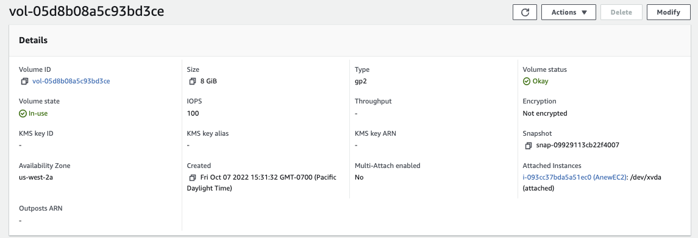
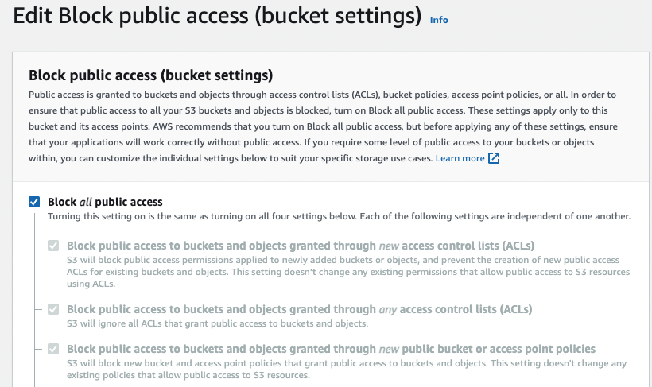
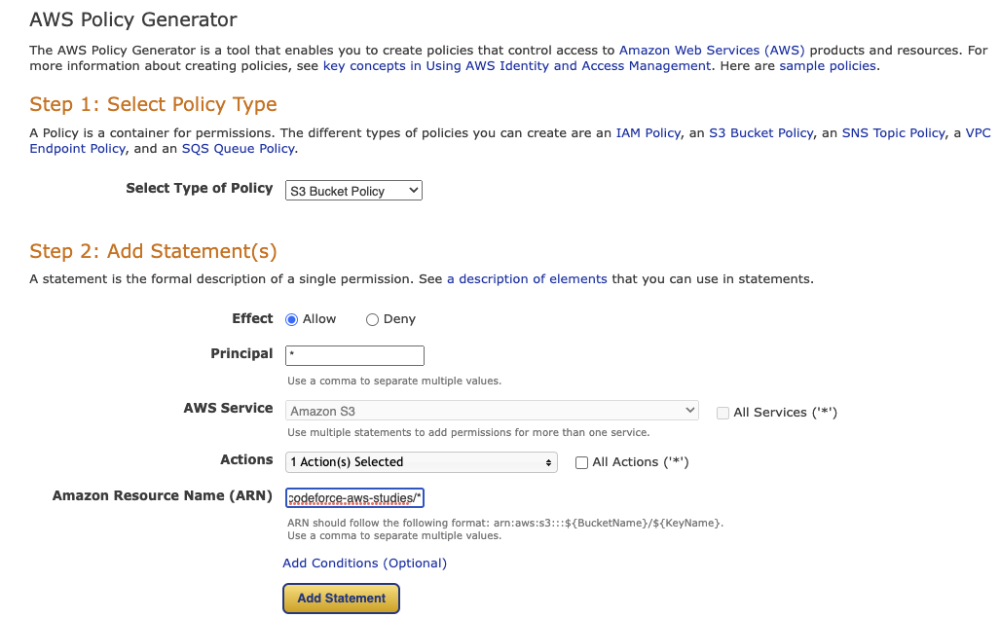

# Storage

AWS storage services are grouped into three categories – block storage, file storage, and object storage.

???- Info "Updates"
    Created Oct 2022 - Update 11/27/23

## EC2 instance store volumes

This is a storage on volumes physically residing on the same host that provides the EC2 instance itself, acting as local disc drives, allowing to store data locally to that instance. The storage is ephemeral, so do not use it for valuable data. For rebooted instance the data are kept while stopped and terminated, data is lost. The cost is included in the use of EC2. It offer a very high I/O speed, millions read per s and 700k write IOPS. Not all instances support instance store volumes.


???- Info "IOPS 100/3000?"
    IOPS are a unit of measure representing input/output operations per second. 3000 is max IOPS  and 100 min. Consider the hardware capacity to get the maximum amount of data in a single I/O measured in KiB. I/O size is capped at 256 KiB for SSD volumes and 1,024 KiB for HDD. Some techno like EBS tries to merge physically contiguous operations: a 1,024 KiB will be 4 operations on SSD, or 8 small 32 KiB will be one operation. However on HDD, 8 random operations of 128 KiB I/O will be 8 operations. Throughput = IOPS x allocation unit size per operation. T= 3000 x 64KiB = 187 MB/s. If application uses smaller size requests than the allocation unit, then we can reach max T.
    Allocation unit size of EBS volume [depends of the volume type](https://docs.aws.amazon.com/AWSEC2/latest/WindowsGuide/volume_constraints.html).  For gp2 it is 4KiB. But on the cloud data storage on a modern hard drive is managed through **logical block addressing** with a default size to 4KiB. EBS advertises 512-byte sectors to the operating system to do the mappting between logical and physical sector. Block size selection impacts storage max capacity.

If we need to run a high-performance database that requires 210,000 IOPS for its underlying filesystem, we need `instance store` and DB replication in place.

Backup and replication are the user's responsability.

## Different storage technologies

### File Storage

File storage is ideal when we require centralized access to files that need to be easily shared and managed by multiple host computers. Typically, this storage is mounted onto multiple hosts, and requires file locking and integration with existing file system communication protocols.

File storage systems are often supported with a network attached storage (NAS) servers.

### Block Storage

Block storage splits files into fixed-size chunks of data called blocks that have their own addresses, which improves read access.

Outside of the address, no additional metadata is associated with each block.

Block storage in the cloud is analogous to direct-attached storage (DAS) or a storage area network (SAN).

Amazon EC2 `instance store` provides temporary block-level storage for an instance.

### Object Storage

Objects are stored in a flat structure instead of a hierarchy. We can store almost any type of data, and there is no limit to the number of objects stored, which makes it readily scalable.

## Amazon Elastic Block Storage EBS

Elastic Block Store Volume is a network drive attached to the EC2 instance. It is locked to one AZ, and uses provisioned capacity in GBs and IOPS. It is HA, every write is replicated multiple times within the same AZ, and can be backed up to other AZ or Region. Below are the main attributes for a EBS volume.



* Create a EBS while creating the EC2 instance and keep it. It is not deleted on EC2 shutdown.
* Existing EBS volume can be attached to a new EC2 instance, normally there is a 1 to 1 relation between volume and EC2 instance. Except for multi-attached EBS.
* The maximum amount of storage is 16 TB.
* Support encryption at rest and in transit using AES-256 encryption, with keys managed in KMS. Any snapshot taken from an encrypted volume will also be encrypted, and also any volume created from this encrypted snapshot will also be encrypted.
* Creating EBS volume can be done as a standalone volume later attached to an instance. Below is an example of the type of parameters to enter:

    

    Same with  `boto3` SDK:

    ```python
    volume = ec2.create_volume(
        AvailabilityZone='us-west-2a',
        Size=10,  # in GB
        VolumeType='gp2',
        MultiAttachEnabled=True,
        Encrypted=False,
        DryRun=True,
        Iops=100, # IOPS provisioned for the volume, represents the rate at which the volume accumulates I/O credits for bursting
    )
    ```

* Once logged to the EC2 instance, add a filesystem, mount to a folder and modify boot so the volume is mounted at start time. See below shell commands:

    ```shell
    # List existing block storage, verify our created storage is present
    lsblk
    # Verify file system type
    sudo file -s /dev/xdvf
    # Create a ext4 file system on the device 
    sudo mkfs -t ext4 /dev/xvdb
    # make a mount point
    sudo mkdir /data
    sudo mount  /dev/xvdb /data
    # Add entry in /etc/fstab with line like:
    /dev/xvdb /data ext4 default,nofail 0 2
    ```

* For cross-region replication we need to use [Data Lifecycle Manager](#data-lifecyle-manager).
* Backup is done by using snapshot, and we can rebuild a volume from a snapshot, in case of AZ failure.
* EC2 instance has a logical volume that can be attached to two or more EBS RAID 0 volumes, where write operations are distributed among them. It is used to increase IOPS without any fault tolerance. If one fails, we lost data. It could be used for database with built-in replication mechanism or for Kafka node.
* RAID 1 is for better fault tolerance: a write operation is going to all attached volumes. RAID 1 is also not recommended for use with EBS.

!!!- info "RAID"
    Creating a [RAID 0](https://docs.aws.amazon.com/AWSEC2/latest/UserGuide/raid-config.html) array allows to achieve a higher level of performance for a file system than on a single EBS volume. I/O is distributed across the volumes in a stripe. If we add a volume, we get the straight addition of throughput and IOPS. Loss of a single volume in the set results in a complete data loss for the array. The resulting size is the sum of the sizes of the volumes within it, and the bandwidth is the sum of the available bandwidth of the volumes within it.

### [Volume types](https://docs.aws.amazon.com/AWSEC2/latest/UserGuide/ebs-volume-types.html)

There are two type of volumes: SSD or HDD. SSD is to work with smaller blocks (like database, or boot volumes for EC2 instance), HD is for higher rate of throughput (like logging, streaming, big data,...)

When creating EC2 instances, we can only use the following EBS volume types as boot volumes: gp2, gp3, io1, io2, and Magnetic (Standard)

* **gp2 or gp3**: SSD, used for most workloads, it goes up to 16 TB at 16000 IOPS max  (3 IOPS per GB brustable up to 3000 IOPS).
* **io 1** or **io 2**: critical app with large database workloads. max ratio 50:1 IOPS/GB. Min 100 iops and 4G to 16T. 99.9% durability and even 99.999% for io2.
EBS Provisioned IOPS SSD (io2 Block Express) is the highest-performance SSD volume designed for business-critical latency-sensitive transactional workloads.
* **st 1**: HDD. Streaming workloads requiring consistent, fast throughput at a low price. For Big data, Data warehouses, Log processing. Up to 16 TiB. 99.9% durability.
* **sc 1**: throughput oriented storage.  500G- 16T, 500MiB/s. Max IOPs at 250. Used for cold HDD, and infrequently accessed data. 99.9% durability.

Encryption has a minimum impact on latency. It encrypts data at rest and during snapshots.

* Provisioned IOPS (PIOPS) SSD: used for critical apps with sustained IOPS performance, even more than 16k IOPS.


??? - "Use case examples"
    * App requires up to 400 GB of storage for temporary data that is discarded after usage. The application requires approximately 40,000 random IOPS to perform the work on file. => Prefer a SSD-Backed Storage Optimized (i2) EC2 instances to get more than 365,000 random IOPS. The instance store has no additional cost, compared with the regular hourly cost of the instance. Provisioned IOPS SSD (io1 or io2) EBS volumes can deliver more than the 40,000 IOPS that are required in the scenario. However, this solution is not as cost-effective as an instance store because Amazon EBS adds cost to the hourly instance rate. This solution provides persistence of data beyond the lifecycle of the instance, but persistence is not required in this use case.
    * A database must provide at least 40 GiB of storage capacity and 1,000 IOPS. The most effective storage is gp2 with 334 GB storage: Baseline I/O performance for General Purpose SSD storage is 3 IOPS for each GiB. For 334 GiB of storage, the baseline performance would be 1,002 IOPS. Additionally, General Purpose SSD storage is more cost-effective than Provisioned IOPS storage.

### Snapshots

EBS snapshots are incremental backups that only save the blocks on the volume that have changed after our most recent snapshot.
Used to backup disk at any point of time of a volume and stores it on S3.
**Snapshot Lifecycle policy** helps to create snapshot with scheduling it by defining policies.
To move a volume to another AZ or data center we can create a volume from a snapshot.

EBS snapshots can be used to create multiple new volumes, whether they’re in the same Availability Zone or a different one.

For a consistent snapshot of an EBS Volume, we need to ensure the application flushes any cached data to disk and no other write I/O is performed by the file system on that volume. Once that is taken care of, we can issue a snapshot command. The snapshot command needs only a couple of seconds to capture a point-in-time. We can start using the volume after this. The actual data backup happens in the background, and we don’t have to wait for the data copy to complete. 

### EBS Multi-attach

Only for io1 or io2 EBS type, a volume can be attached to multiple EC2 instances (up to 16) running in the same AZ. Each instance has full R/W permission. 
The file system must be cluster aware.

### [Data lifecyle manager](https://docs.aws.amazon.com/AWSEC2/latest/UserGuide/snapshot-lifecycle.html)

Used to define EBS backup policies with backup schedule requirement definitions.

* Default policies back up all volumes and instances in a Region that do not have recent backups. Snapshot or EBS backed AMIs.
* Custom policies supports advanced features such as, fast snapshot restore, snapshot archiving, cross-account copying, and pre and post scripts. It uses resource tags to identify the resources to back up.

Policy must be associated with an IAM role that has the appropriate permissions to create snapshot, AMI, describe to EC2 and EBS volume.

Cross-account can go cross region too.

### Other resources

* [Reduce EBS volume size.](https://cloudacademy.com/blog/amazon-ebs-shink-volume/)

## [S3 - Simple Storage Service](https://docs.aws.amazon.com/AmazonS3/latest/userguide/Welcome.html)

[Amazon S3](https://s3.console.aws.amazon.com/s3/get-started?region=us-west-1) is a managed service for high scaling, unlimited object storage. S3 allows people to store objects (files) in **buckets** (root directory), which must have a globally unique name (cross users, cross regions!). Buckets are defined at the region level. **Object** in a bucket, is referenced as a **key** (folder + filename )which can be seen as a file path in a file system. An account has a soft limit of 200 buckets. The max size for an object is 5 TB but big file needs to be uploaded in multi-part using 5GB max size.

S3 has 11x9's high **durability** of objects as it uses replications across **multiple AZ** (At least 3). Service **Availability** varies with storage class, from 99.5% to 99.99%.

S3 supports **strong consistency** for all operations with a read-after-write consistency.

S3 supports versioning at the bucket level. So file can be restored from previous version, and even deleted file can be retrieved from a previous version.

Within the S3 console we will see all buckets in one view (it is a global service). But the buckets are created within a region and are local to the region. 

### Use cases

* Backup and restore.
* Disaster Recovery.
* Archive.
* [Data lakes](https://aws.amazon.com/big-data/datalakes-and-analytics/) and big data analytics.
* Hybrid cloud storage: seamless connection between on-premises applications and S3 with AWS Storage Gateway.
* Cloud-native application data.
* Media hosting.
* Software delivery.
* Static website.

[GETTING started](https://docs.aws.amazon.com/AmazonS3/latest/userguide/GetStartedWithS3.html)

### S3 Storage classes

When uploading a document into an existing bucket, we can specify the storage class used to keep data over time. Different levels are offered with different cost and SLA.

 

**Standard** is the general purpose class, for low latency and high throughput use cases, but at higher cost. HA is supported by copying to different AZs.

S3 automates the process of moving objects to the most cost-effective access tier based on access frequency.

With **Intelligent Tiering**, depending on the data access patterns of objects, S3 will move the objects between two different tiers. It is used when the access frequency is not known.

With **One Zone Infrequent Access**, there is a risk of data loss in the event of availability zone destruction, and some objects may be unavailable when an AZ goes down.  **Standard IA** has a separate retrieval fee.

Amazon **Glacier** is for archiving, like writing to tapes. The pricing includes storage and object retrieval cost. This is the lowest cost to persist objects for long time period.  It can take up to several hours to gain access to objects. The structure uses vault and archives and no more bucket and folders.

**Glacier Deep Archive** (also named Bulk) is the lowest cost storage option for long-term archival and digital preservation. Deep Archive may take several hours (from 12 to 48 hours) depending on the retrieval tier.

We can transition objects between storage classes. For infrequently accessed object, move them to STANDARD_IA. For archive objects, that we don’t need in real-time, use GLACIER or DEEP_ARCHIVE. Moving objects can be automated using a lifecycle configuration.

At the bucket level, a user may define lifecycle rules for when to transition an object to another storage class.

 

 and

 

To prevent accidental file deletions, we can setup MFA Delete to use MFA tokens before deleting objects.

To improve performance, a big file can be split and then uploaded with local connection to the closed edge access and then use AWS private network to copy between buckets in different region. In case of unfinished parts, use S3 Lifecycle policy to automate old/unfinished parts deletion.

**Storage Class Analysis** can continuously monitor the bucket and track how the objects are accessed over time. This tool generates detailed reports on the percentage of data retrieved and by age groups. We can use this report to manage lifecycle policies.

### Security control

* By default a bucket access is not public, see the `Block Public Access` settings. Access can be enforced at the account level and needs to be disabled at the account level, before doing it at the bucket level (Amazon S3 > block public access settings for this account > edit block public access settings for this account).

    

* To control access with policies, we need to disable this setting, and then define Bucket policies.
* **S3 Bucket Policy**: is a security policy defined in S3 console. It allows cross-account access control. Can be set at the bucket or object level.
* Explicit DENY in an IAM policy will take precedence over a [bucket policy permissions](https://docs.aws.amazon.com/AmazonS3/latest/userguide/example-bucket-policies.html).
* Define policies from [examples](https://docs.aws.amazon.com/AmazonS3/latest/userguide/example-bucket-policies.html) or using [policy generator tool](https://awspolicygen.s3.amazonaws.com/policygen.html):

    

    And copy paste the generated policy

    

* By default, when another AWS account uploads an object to our S3 bucket, that account (the object writer) owns the object, has access to it, and can grant other users access to it through ACLs. Bucket owner can take ownership of all objects. It is recommended to disable ACL and use IAM identity and bucket policies. 
* Traffic coming from our VPC to our S3 bucket is going to the public internet. So to avoid that we need to add a VPC gateway endpoint to keep traffic within AWS network. See [this EC2 to VPC endpoint gateway to S3 example](https://github.com/jbcodeforce/aws-studies/tree/main/labs/networking/ec2-vpce-s3).
* Objects can also be encrypted, and different mechanisms are available:

    * **SSE-S3**: server-side encrypted S3 objects using keys handled & managed and own by AWS using AES-256 protocol must set `x-amz-server-side-encryption: "AES256"` header in the POST request to upload the file.

    

    * **SSE-KMS**: leverage [AWS Key Management Service](https://us-west-2.console.aws.amazon.com/kms/home) to manage encryption keys. Use `x-amz-server-side-encryption: "aws:kms"` header in POST request. Server side encrypted. It gives user control of the key rotation policy and audit trail with [CloudTrail](https://us-west-2.console.aws.amazon.com/cloudtrail/home).
    * **SSE-C**: when we want to manage our own encryption keys. Server-side encrypted. Encryption key must be provided in HTTPS headers, for every HTTPS request made. HTTPS is mandatory.

    

    * **Client Side Encryption**: encrypt before sending objects to S3. Only owner of the key can decrypt the objects.

* Encryption can be done at the bucket level, or using bucker policies to refuse any PUT calls on S3 object without encryption header.

### S3 Website hosting

We can have static website on S3. Once html pages are uploaded, setting the properties as static web site from the bucket. The bucket needs to be public, and have a security policy to allow any user to `GetObject` action. The URL may look like: `<bucket-name>.s3-website.<AWS-region>.amazonaws.com`


???- Example "Publishing a mkdocs site to s3 after enabling public access"

    ```sh
    mkdocs build
    aws s3 sync ./site s3://jbcodeforce-aws-studies 
    # The url is at the bottom of the bucket in the website under the Bucket website endpoint for example:
    http://jbcodeforce-aws-studies.s3-website-us-west-2.amazonaws.com
    ```

* To securely serve static content for specific end-user group (premium for ex.) we can use CloudFront signed URL or signed cookie. Better to use signed URL for file based access, while cookies are to access multiple restricted files.
* **Cross Origin Resource Sharing CORS**: The web browser requests won’t be fulfilled unless the other origin allows for the requests, using CORS Headers `Access-Control-Allow-Origin`. If a client does a cross-origin request on our S3 bucket, we need to enable the correct CORS headers: this is done by adding a security policy with CORS configuration like:

    ```xml
    <CORSConfiguration>
        <CORSRule>
            <AllowedOrigin>enter-bucket-url-here</AllowedOrigin>
            <AllowedMethod>GET</AllowedMethod>
            <MaxAgeSeconds>3000</MaxAgeSeconds>
            <AllowedHeader>Authorization</AllowedHeader>
        </CORSRule>
    </CORSConfiguration>
    ```

### [S3 replication](https://docs.aws.amazon.com/AmazonS3/latest/userguide/replication.html)

Once versioning enabled on source and target, a bucket can be replicated in the same region (SRR) or cross regions (CRR). S3 replication is done on at least 3 AZs. One AZ down does not impact S3 availability. The replication is done asynchronously. 

* SRR is used for log aggregation for example, or for live replication between production and test environments
* CRR is used for compliance and DR or replication across AWS accounts. 
* Delete operations are not replicated. But can be enabled with the advanced options.
* Use S3 Replication Time Control (S3 RTC) to replicate with a predictable time frame. S3 RTC replicates 99.99 percent of new objects stored in Amazon S3 within 15 minutes.
* Must give proper IAM permissions to S3. When replication is set, only new objects are replicated. To replicate exiting objects use S3 Batch Replication.
* We can specify a different storage class for the replicas.
* Before objects transition from standard class to another class we need to store them for 30 days.
* **S3 Batch Replication** replicates existing objects before a replication configuration was in place, objects that have previously been replicated, and objects that have failed replication.

The **AWS S3 sync** command uses the CopyObject APIs to copy objects between S3 buckets in same region. The sync command lists the source and target buckets to identify objects that are in the source bucket but that aren't in the target bucket. The command also identifies objects in the source bucket that have different LastModified dates than the objects that are in the target bucket. The sync command on a versioned bucket copies only the current version of the object (previous versions aren't copied).

**Storage Lens** provides a dashboard on all S3 activities and is automatically enabled.

### [S3 Access Points](https://docs.aws.amazon.com/AmazonS3/latest/userguide/access-points.html)

Access points are named network endpoints that are attached to buckets that we can use to perform S3 object Get and Put operations. It simplify data access, as user can create unique access control policies for each access point to easily control access to shared datasets. It is possible to define one access point per application, or group of apps, which needs access to dataset.


Every access point is associated with a single bucket and contains a network origin control, and a Block Public Access control. We can attach IAM resource based [policies directly](https://docs.aws.amazon.com/AmazonS3/latest/userguide/access-points-policies.html) to the S3 access points.

We can have 10,000 access points per Region for each AWS account. An access point can reference a bucket in another account. An access point can be accessible from the internet or from a specific VPC, Amazon S3 rejects any request made to the access point that doesn't originate from that VPC. We can also block public access at the access point level.

See [S3 playground](../playground/s3-play.md) for example of access point definition.

Access point and bucket, both, must permit access. Users would have a single URL to access their objects. Access points may have public access or not.

An Access Point alias provides the same functionality as an Access Point ARN and can be substituted for use anywhere an S3 bucket name is normally used for data access.

Access points support access only over HTTPS.

No additional cost, and no latency impact.


### S3 Express Zone


### Other features

* **Secure FTP**: server to let us send file via SFTP.
* **Requester Pay**: The requester (AWS authenticated) of the data pay for the cost of the request and the data download from the bucket, not the owner.
* **Amazon S3 Transfer Acceleration** enables fast, easy, and secure transfers of files over long distances between our client and an S3 bucket. Transfer Acceleration takes advantage of Amazon CloudFront’s globally distributed edge locations. As the data arrives at an edge location, data is routed to Amazon S3 over an optimized network path.
* **Pre-signed URL**: share object with URL with temporary access. Can be done with the command: `aws s3 presign`. Up to 168 hours valid.
* **S3 Select and Glacier Select**: to retrieve a smaller set of data from an object using server-side SQL. Can filter by rows and columns. 80% cheaper and 400% faster as it uses less network transfer and less CPU on client side.
* **Event Notifications**: on actions like S3:ObjectCreated, S3:ObjectRemoved, S3:ObjectRestore. Can be combined with name filtering. Events may be sent to SNS, SQS, Lambda function, and EventBridge.
* **Amazon Macie**: is a machine learning security service to discover, classify and protect sensitive data stored in S3. 
* **S3 Object lock**: to meet regulatory/compliance requirements of write once read many, storage. Set only on newly *created* bucket. Object Lock with a 5-year retention period would lock the objects and prevent the objects from being overwritten or deleted. In compliance mode, objects cannot be overwritten or deleted by any user, including the root user of the account, for the duration of the retention period. Use _Legal Hold_ to prevent an object or its versions from being overwritten or deleted indefinitely and gives the ability to remove it manually.
* **S3 Inventory** used to audit and report on replication or encryption status. It can generate CSV, ORC, or Parquet files to list the objects and their corresponding metadata on a daily or weekly basis for an S3 bucket or objects with a shared prefix.
* **S3 Byte-Range Fetches**: parallelize GET by requesting specific byte ranges. Used to speed up download or do partial download.
* **S3 Batch operations**: perform bulk operations on existing S3 objects with a single request. To get the list of object, use [S3 Inventory](). Could not integrate custom code.
* **Server Access Logs**: used for audit purpose to track any request made to S3 in the same region, from any account. Logs are saved in another bucket.
* **S3 Glacier Vault Lock**: Adopt a Write Once Read Many model, by creating a Vault Lock Policy. Data will never be deleted.

* **Multi-region access point** offers a global S3 hostname that provides access to multiple S3 buckets across AWS Regions (1 bucket per region pe MRAP) with automatic routing and failover between buckets. Application requests made to a Multi-Region Access Point global endpoint use AWS Global Accelerator to automatically route over the AWS global network to the closest-proximity S3 bucket with an active routing status. Each access point has an automatically-generated and globally unique alias, and an ARN. We can configure your Amazon S3 Multi-Region Access Point to be in an active-active state or active-passive state. To access a MRAP from a private subnet we need to configure a VPC interface endpoint so the traffic is routed to the MRAP with PrivateLink: a DNS query from an EC2 instance within the subnet(s) for `accesspoint.s3-global.amazonaws.com` should resolve to an IP address within that subnet.

See [Multi-region access point tutorial](https://aws.amazon.com/getting-started/hands-on/getting-started-with-amazon-s3-multi-region-access-points). 

### S3 FAQ

???- "The last one MB of each file in a bucket contains summary information that we want to expose in a search, what function to use?"
    **Byte-Range fetch** allows to read only a portion of data from the object. Since the summary is a small part of each object, it is efficient to directly read the summary rather than downloading an entire object from S3.

???- "Pricing factors"
    Frequency of access, storage cost, retrieval cost and retrieval time.
    The S3 Intelligent Tiering automatically changes storage class depending on usage to optimize cost. S3 lifecycle is based on age and can be defined with rules.
    [See how to reduce S3 costs.](https://repost.aws/knowledge-center/s3-reduce-costs)

???- "Expected performance?"
    S3 automatically scales to high request rates and latency around 100 to 200ms. 5500 GET/HEAD requests per s per prefix in a bucket. 3500 PUT/COPY/POST/DELETE. When uploading files from internet host, it is recommended to upload to AWS edge location and then use AWS private backbone to move file to S3 bucket in target region. This will limit internet traffic and cost.

???- "How to be informed if an object is restored to S3 from Glacier?"
    The Amazon S3 notification feature enables us to receive notifications when certain events happen in the bucket. To enable notifications, we must first add a notification configuration that identifies the events we want Amazon S3 to publish and the destinations where we want Amazon S3 to send the notifications.

???- "How to upload local file to s3 bucket using CLI?"
    We can use python and the boto3 library or `aws s3` CLI. Be sure to have a IAM user (e.g. s3admin) with `AmazonS3FullAccess` managed policy. The aws config may have added access Key and secret, may be in a dedicated profile.

    ```sh
    aws s3 cp $PWD/companies.csv s3://jb-data-set/ --profile s3admin
    ```

    For boto3 example see code under [big-data-tenant-analytics / copyToS3.py](https://github.com/jbcodeforce/big-data-tenant-analytics/blob/main/CompanyRisk/copyToS3.py)  project.

???- "How to retrieve in minutes up to 250MB of archive from Glacier?"
    **Expedited** retrievals allow to quickly access (1 to 5 minutes) the data when occasional urgent requests for a subset of archives are required. It provides up to 150 MB/s of retrieval throughput. If we require access to Expedited retrievals under all circumstances, we must purchase `provisioned retrieval capacity`.

???- "What is provisioned capacity in Glacier?"
    **Provisioned capacity** ensures that our retrieval capacity for expedited retrievals is available when we need it. Each unit of capacity provides that at least three expedited retrievals can be performed every five minutes and provides up to 150 MB/s of retrieval throughput.

???- "Run S3 locally"
    See [quarkiverse S3 guide](https://quarkiverse.github.io/quarkiverse-docs/quarkus-amazon-services/dev/amazon-s3.html) using [Localstack image](https://hub.docker.com/r/localstack/localstack). 

    ```sh
    docker run --rm --name local-s3 -p 8008:4566 -e SERVICES=s3 -e START_WEB=0 -d localstack/localstack
    aws configure --profile localstack
    aws s3 mb s3://quarkus.s3.quickstart --profile localstack --endpoint-url=http://localhost:8008
    ```

## [Amazon AppFlow](https://docs.aws.amazon.com/appflow/latest/userguide/what-is-appflow.html)

AppFlow offers a fully managed service for easily automating the bidirectional exchange of data to SaaS vendors from AWS services like Amazon S3. This helps avoid resource constraints.

## [Elastic File System (EFS)](https://docs.aws.amazon.com/efs/latest/ug/whatisefs.html)

* Fully managed NFS (4.1 and 4.0) file system, like a NAS or SAN on-premises. 
* Only Linux based AMI. POSIX filesystem. AMI Linux v2 has the necessary NFS client. 
* EC2 accesses file system via mount points. EFS can scale to petabytes in size, with low latency access.

* Support different performance mode, like max I/O or general purpose
* When creating a file system we need to select a storage class that could be regional (multi AZs) or One Zone.

    

* To access EFS in a VPC, create one or more **mount targets** in the VPC. The target properties include and ID, the subnet ID in which it is created, the file system ID for which it is created, an IP address at which the file system may be mounted, VPC security groups, and the mount target state. The IP @ is maaped to a DNS name (e.g. `file-system-id.efs.aws-region.amazonaws.com `), one in each AZ. All EC2 instances in that Availability Zone share the mount target.It is defined in a subnet, so the EC2 needs to specify in which subnet it runs. Use Amazon EFS tool in each EC2 instance to mount the EFS to a target mount point.
* EFS can be accessed from on-premises servers via Direct Connect and Virtual Private gateway

    { width=600 }

(3x gp2 cost), controlled by using security group. This security group needs to add in bound rule of type NFS connected / linked to the SG of the EC2.

* Encryption is supported using KMS.
* 1000 concurrent clients.
* 10GB+/s throughput. Different model: Elastic, bursting or provisioned. It grows to petabyte.
* Billed for what we use.
* Is integrated with IAM so user need to have credentials to create file systems, and role needs to be used for NFS clients.
* Support storage tiers to move files after n days. Infrequent access (IA) used for access few times a quarter, where Archive storage is for few times a year. so lifecycle management move file to EFS-IA.
* EFS provides the close-to-open consistency semantics: write operations, in a region, are durably stored across AZs, if the app uses synchronous write, or if it closes a file.But applications that perform synchronous data access and perform non-appending writes have read-after-write consistency for data access.
* use AWS DataSync to transfer files from an existing file system to EFS
* Can be used with AWS Backup.


[The FAQ](https://aws.amazon.com/efs/faq/) for multi AZs support within a region.

## [Snowball](https://aws.amazon.com/snowball/)

Move TB to PB of data in and out AWS using physical device to ship data as doing over network will take a lot of time, and may fail. To get the is setup it takes multiple day between ordering, hardware delivery, and get the device back.

* The **Snowball Edge** device has 100TB and compute power to do some local data processing.  With Compute Optimized version there are 52 vCPUs, 200GB of RAM, optional GPU, 42TB capacity. And for Storage Optimized version, 40 vCPUs,, 80 GB RAM, and object storage clustering.
We can use Snowball Edge Storage Optimized if we have a large backlog of data to transfer or if we frequently collect data that needs to be transferred to AWS and the storage is in an area where high-bandwidth internet connections are not available or cost-prohibitive.

* **Snowcone**: smaller portable, secured, rugged, for harsh environments. Limited to 8TB. We can use AWS DataSync to sned data. 2 CPUs, 4GB of mem.
* **SnowMobile** is a truck with 100 PB capacity. Once on site, it is transferred to S3.

Can be used for Edge Computing when there is no internet access.

* All can run EC2 instances and AWS lambda function using AWS IoT Greengrass.
* For local configuration of the Snowball, there is a the AWS OpsHub app.

## [FSx](https://aws.amazon.com/fsx/)

A managed service for file system technology from 3nd party vendors like Lustre, NetApp ONTAP, Windows File Server, OpenZFS...

* For Windows FS, supports SMB protocol and NTFS. Can be mounted to Linux EC2. 10s GB/s IOPS and 100s PB of data. Can be configured on multi AZ.
* Data is backed-up on S3
* Lustre is a linux clustered FS and supports High Performance Computing, POSIX... sub ms latency, 100s GB/s IOPS.
* NetApp ONTAP: supports NFS, SMB, iSCSI protocols. Supports storage auto scaling, and point in time instantaneous cloning.
* OpenZFS compatibles with NFS, scale to 1 million IOPS with < 0,5ms latency, and point in time instantaneous cloning. 

Deployment options:

* Scratch FS is used for temporary storage with no replication. Supports High burst
* Persistent FS: long-term storage, replicaed in same AZ

* [FSx Lustre FAQ](https://aws.amazon.com/fsx/lustre/faqs/)

## [AWS Storage Gateway](https://aws.amazon.com/storagegateway/) 

AWS [Storage Gateway](https://aws.amazon.com/storagegateway/) exposes an API in front of S3 to provide on-premises applications with access to virtually unlimited cloud storage. It is a VM as a software appliance. 

Three gateway types:

* **file**: FSx or S3 . 

    * S3 buckets are accessible using NFS or SMB protocols, so mounted in a filesystem. Controlled access via IAM roles. File gateway communicates with AWS via HTTPS, with SSE-S3 encryption.
    * FSx, storage gateways brings cache of last accessed files.

* **volume**: this is a block storage using iSCSI protocol. On-premise and visible as a local volume, backed up asynchronously to S3. Two volume types:

    * **Cached** volumes: The primary data is stored in Amazon S3 while the frequently acccessed data is retained locally in the cache for low-latency access. Each volume is up to 32 TB, and the total capacity can be up to 1024TB per cached volume gateway. 
    * **Stored** volumes: the entire dataset is stored locally while also being asynchronously backed up to Amazon S3. It uses EBS snapshot uploaded to S3 via HTTPS, with incremental updates.

* virtual **tape**: same approach but with virtual tape library. Can go to S3 and Glacier. Works with existing tape software. Support 1500 virtual tape. each gateway-VTL is preconfigured with a media changer and tape drives, which are presented as iSCSI device.
* Hardware appliance to run a Storage gateway in the on-premises data center. 

## [Transfer Family](https://docs.aws.amazon.com/transfer/latest/userguide)

To transfer data with FTP, FTPS, SFTP protocols to AWS Storage services like S3, EFS

## [DataSync](https://docs.aws.amazon.com/datasync/latest/userguide/)

AWS DataSync is an online data transfer service that simplifies, automates, and accelerates copying large amounts of data between on-premises storage systems and AWS Storage services, as well as between AWS Storage services.

Move a large amount of data to and from on-premises (using agent) to AWS, or to AWS to AWS different storage services.

Can be used for:

* Data Migration with automatic encryption and data integrity validation.
* Archive cold data.
* Data protection.
* Data movement for timely in-cloud processing.
* Support S3, EFS, FSx for Windows.
* making an initial copy of the entire dataset and schedule subsequent incremental transfers of changing data towards Amazon S3. Enabling S3 Object Lock prevents existing and future records from being deleted or overwritten.

Replication tasks can be scheduled.

It keeps the metadata and permissions about the file. 

One agent task can get 10 GB/s


As an example to support the above architecture, we can configure an AWS DataSync agent on the on-premises server that has access to the NFS file system. Transfer data over the Direct Connect connection to an AWS PrivateLink interface VPC endpoint for Amazon EFS by using a private Virtual InterFace (VIF). Set up a DataSync scheduled task to send the video files to the EFS file system every 24 hours.

The DataSync agent is deployed as a virtual machine that should be deployed on-premises in the same LAN as the source storage to minimize the distance traveled.

* [Transferring files from on-premises to AWS and back without leaving our VPC using AWS DataSync](https://aws.amazon.com/blogs/storage/transferring-files-from-on-premises-to-aws-and-back-without-leaving-your-vpc-using-aws-datasync/).
* [DataSynch FAQ](https://aws.amazon.com/datasync/faqs/).
* [Public and Private interface](https://aws.amazon.com/premiumsupport/knowledge-center/public-private-interface-dx/).

## Storage comparison

* S3: Object Storage.
* Glacier: Object Archival.
* EFS: When we need distributed, highly resilient storage, using Network File System for Linux instances, POSIX filesystem. Across multiple AZs.
* FSx for Windows: Network File System for Windows servers. Central storage for Windows based applications.
* FSx for Lustre: High Performance Computing (HPC) Linux file system. It can store data directly to S3 too.
* FSx for NetApp: High OS compatibility.
* FSx for OpenZFS: for ZFS compatibility.
* EBS volumes: Network storage for one EC2 instance at a time.
* Instance Storage: Physical storage for our EC2 instance (high IOPS). But Ephemeral.
* Storage Gateway: File Gateway, Volume Gateway (cache & stored), Tape Gateway.
* Snowcone, Snowball / Snowmobile: to move large amount of data to the cloud, physically.
* Database: for specific workloads, usually with indexing and querying.
* DataSync: schedule data sync from on-premises to AWS or AWS to AWS services.