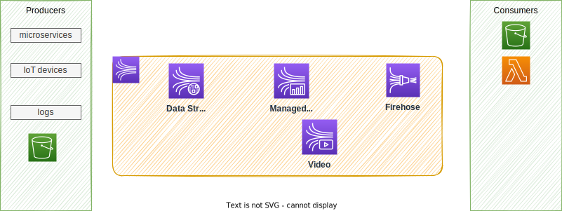
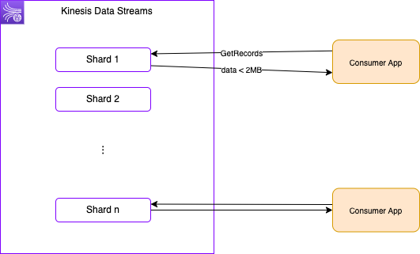
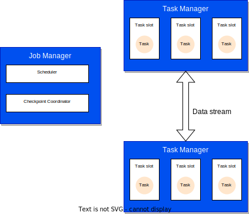

# Kinesis services

!!! Updates
    Created 12/2022 - Updated 12/04/2023

Designed to process real-time streaming data.

 

Three main different components are:

* **Kinesis Streams**: low latency streaming ingest at scale. They offer patterns for data stream processing. It looks similar to Kafka, but MSK is the Kafka deployment.
* **Amazon Managed Service for Apache Flink**: perform real-time analytics on streams using SQL. This Apache Flink as managed service.
* **Kinesis Firehose**: load streams into S3, Redshift, ElasticSearch. No administration, auto scaling, serverless.

## [Kinesis Data Streams](https://docs.aws.amazon.com/streams/latest/dev/introduction.html)

It is a distributed data stream into Shards for parallel processing.



It uses a public endpoint and applications can authenticate using IAM role. Kinesis Data Streams is using a throughput provisioning model, a shard can inject 1 Mb/s or 1000 msg /s with an egress of 2Mb/s. Adding shards help to scale the throughput. A single shard supports up to 5 messages per second, so a unique consumer gets records every 200ms. Adding more consumers on the same shard, the propagation delay increases and throughput per consumer decreases. With 5 consumers, each receives 400kB max every second.

Producer sends message with `Partition Key`. A sequence number is added to the message to note where the message is in the Shard.

* Retention from 1 to 365 days.
* Capable to replay the messages.
* Immutable records, not deleted by applications.
* Message in a shard, can share partition key, and keep ordering.
* It is possible to support exactly-once delivery.
* Producer can use SDK, or **Kinesis Producer Library** (KPL) or being a Kinesis agent.
* [**Kinesis Agent**](https://docs.aws.amazon.com/streams/latest/dev/writing-with-agents.html) is a stand-alone Java app that offers an easy way to collect and send data to KDS, as it monitors a set of files. It runs on RHEL, or Amazon Linux 2.
* Consumer may use SDK and **Kinesis Client Library** (KCL), or being one of the managed services like: Lambda, Kinesis Data Firehose, Managed Service for Apache Flink.
* For consuming side, each Shard gets 2MB/s out.
* If consumer fails on one record in a batch, the entire batch (and thus the shard) is blocked until either the message processes successfully or the retention period for the data records in the batch expires.
* It uses enhanced fan-out if we have multiple consumers retrieving data from a stream in parallel. This throughput automatically scales with the number of shards in a stream.
* Pricing is per Shard provisioned per hour.
* The capacity limits of a Kinesis data stream are defined by the number of shards within the data stream. The limits can be exceeded by either data throughput or the number of reading data calls. Each shard allows for 1 MB/s incoming data and 2 MB/s outgoing data. We should increase the number of shards within our data stream to provide enough capacity.

There is an On-demand mode, pay as we go, with a default capacity of 4MB/s or 4000mg/s. Pricing per stream, per hour and data in/out per GB.

Captured Metrics are:

* number of incoming/outgoing bytes,
* number incoming/outgoing records,
* Write / read provisioned throughput exceeded,
* iterator age ms.

### Deployment

Using CDK, see example in [cdk/kinesis](https://github.com/jbcodeforce/big-data-tenant-analytics/tree/main/cdk/kinesis), but can be summarized as:

```python
from aws_cdk import (
    aws_kinesis as kinesis
)

kinesis.Stream(self, "SaaSdemoStream",
    stream_name="bg-jobs",
    shard_count=1,
    retention_period=Duration.hours(24)
)
```

Using CLI:

```sh
aws kinesis create-stream --stream-name ExampleInputStream --shard-count 1 --region us-west-2 --profile adminuser
```

### Producer

Producer applications are done using Kinesis Producer Library (KPL) and they can batch events, and perform retries. Internally KPL uses queue to bufferize messages.  Example of python code using boto3 and KPL:

```python
STREAM_NAME = "companies"
my_session = boto3.session.Session()
my_region = my_session.region_name
kinesis_client = boto3.client('kinesis',region_name=my_region)

def sendCompanyJson():
    company={"companyID" : "comp_4",
            "industry": "retail",
            "revenu": 29080,
            "employees": 14540,
            "job30": 4,
            "job90":13,
            "monthlyFee": 460.00,
            "totalFee": 1172.00
    }
    companyAsString =json.dumps(company)
    kinesis_client.put_record(
                StreamName=STREAM_NAME,
                Data=companyAsString,
                PartitionKey="partitionkey")
```

#### AWS CLI

Produce:

```sh
aws kinesis put-record --stream-name test --partition-key user1 --data "user signup" --cli-binary-format raw-in-base64-out
```

### Consumer

#### AWS SDK


??? Warning
    To be done 

#### AWS CLI

Consume:

```sh
# Describe the stream
aws kinesis describe-stream --stream-name test
# Get some data
aws kinesis get-shard-iterator --stream-name test --shard-id shardId--00000000 --shard-iterator-type TRIM_HORIZON
# The returned message gave the next message iterator that should be used in the next call.
aws kinesis get-records --shard-iterator <the-iterator-id>
```

## [Kinesis Data Firehose](https://docs.aws.amazon.com/firehose/latest/dev/what-is-this-service.html)

Firehose is a fully managed service for delivering real-time streaming data to various supported destinations.


* Firehose buffers incoming streaming data to a certain size (MBs) or for a certain period of time (in s) before delivering it to destinations.
* We create **delivery stream**, for sources that are most of the time logs from the different AWS services. Transformations are done in Lambda function.
* It is tuned to stream to the target destination, as simpler to configure than doing custom solution on top of Kinesis Data Streams or MSK.
* Data Firehose does not guarantee order delivery and exactly once semantic.
* It can delegates the record transformation processing to a custom Lambda function, but it supports different format already. It tries the invocation 3 times and then skips the batch of records. Records that failed to process are delivered to an Amazon S3 bucket in a processing_failed folder.
* It outputs batch files to the target destinations. Batch is based on 60s (or more) window or 1 MB of data. Therefore it is a near real-time service.
* As a managed services it also supports auto scaling. The number of shards is managed by the service based on data volume.
* IAM role needs to be referenced to write to S3.
* Firehose uses S3 to backup all or failed only data that it attempts to deliver to the chosen destination.
* Use an *interface VPC endpoint* to keep traffic between our VPC and Kinesis Data Firehose from leaving the Amazon network.

## [Managed Service for Apache Flink](https://docs.aws.amazon.com/managed-flink/latest/java/what-is.html)

This is a managed service to transform and analyze streaming data in real time using Apache Flink. It can consume records from different sources, and in this demonstration we use Kinesis Data Streams.


The underlying architecture consists of a **Job Manager** and n **Task Managers**.

* The **JobManager** controls the execution of a single application. It receives an application for execution and builds a Task Execution Graph from the defined Job Graph. It manages job submission and the job lifecycle then allocates work to Task Managers
* The **Resource Manager** manages Task Slots and leverages underlying orchestrator, like Kubernetes or Yarn.
* A **Task slot** is the unit of work executed on CPU.
* The **Task Managers** execute the actual stream processing logic. There are multiple task managers running in a cluster. 

The number of slots limits the number of tasks a TaskManager can execute. After it has been started, a TaskManager registers its slots to the ResourceManager



[See my Flink studies](https://jbcodeforce.github.io/flink-studies/)

### When to choose what

As Apache Flink is an open-source project, it is possible to deploy it in a Kubernetes cluster, using Flink operator. This will bring us with the most flexible solution as we can select the underlying EC2 instances needed, to optimize our cost. Also we will have fine-grained control over cluster settings, debugging tools and monitoring.

While Managed Service for Apache Flink helps us to focus on the application logic, which is not simple programming experience, as stateful processing is challenging, there is no management of infrastructure, monitoring, auto scaling and high availability integrated in the service.

In addition to the AWS integrations, the Managed Service for Apache Flink libraries include more than 10 Apache Flink connectors and the ability to build custom integrations.

### Considerations

When connecting to Managed Service for Apache Flink, we need to consider the number of shards and the constraint on the throughput to design the Flink application to avoid getting throttled. As introduced previously, with one Flink Application, we may need to pause around 200ms before doing the next GetRecords.

### Deployment Flink App to Managed Service for Apache Flink

??? Warning
    To be done

### Deeper dive

* [Amazon Kinesis Data Analytics for SQL Applications Developer Guide](https://docs.aws.amazon.com/kinesisanalytics/latest/dev/examples.html)
* [Getting started](https://docs.aws.amazon.com/kinesisanalytics/latest/java/get-started-exercise.html#get-started-exercise-7-cli) with example on how to create application with CLI.
* [AWS Kafka and DynamoDB for real time fraud detection](https://jaehyeon.me/blog/2023-09-14-fraud-detection-part-2/)
* [Real Time Streaming with Amazon Kinesis](https://catalog.us-east-1.prod.workshops.aws/workshops/2300137e-f2ac-4eb9-a4ac-3d25026b235f/en-US)
* [Mastering AWS Kinesis Data Streams, Part 1](https://dev.solita.fi/2020/05/28/kinesis-streams-part-1.html) very good article to keep in bookmark. 
* [Mastering AWS Kinesis Data Streams, Part 2](https://dev.solita.fi/2020/12/21/kinesis-streams-part-2.html) consumer side of the story.