# Monitoring and Audit

## [CloudWatch](https://docs.aws.amazon.com/cloudwatch/)

CloudWatch collects monitoring and operational data in the form of logs, metrics, and events, and visualizes it using automated dashboards so we can get a unified view of our AWS resources, applications, and services that run in AWS and also on-premises. The basic features set:

* correlate the metrics and logs to better understand the health and performance of our resources.
* create alarms based on metric value thresholds or anomalous metric behavior based on machine learning algorithms. 
* support grouping resources to manage at the application / solution level. 

### [CloudWatch Metrics](https://docs.aws.amazon.com/cloudwatch/)

CloudWatch provides metrics for every services in AWS. Metric represents a variable to measure like CPU utilization, Network inbound traffic... 

Metrics are within a VPC and belong to a namespace. They have timestamps and up to 10 attributes or dimensions.

* To monitor our EC2 instance memory and disk usage... we need to use a Unified CloudWatch Agent to push memory usage as a custom metric to CW. 
* When creating an EC2 instance we need to enable `Detailed CloudWatch monitoring`.
* Status Check metrics give health of the system (AWS infrastructure like the host server) and instance (guest, software and network). Status check metric is use by ELB so it can stop traffic to an unhealthy EC2 instance. Auto Scaling group uses it too to restart EC2.

### CloudWatch Alarms

Alarms are used to trigger notification from any metrics. The states of an alarm are: OK, INSUFFICIENT_DATA, ALARM. A period specifies the length of time in seconds to evaluate the metric: the evaluation period. 

* Alarms invoke actions for sustained state changes only. The state must have changed and been maintained for a specified number of periods
* Alarm is associated with one metric. A metric alarm watches a single CloudWatch metric or the result of a math expression based on CloudWatch metrics. The alarm performs one or more actions based on the value of the metric or expression relative to a threshold over a number of time periods. Below the alarm applies to ApiGateway call metrics, over a period of 5 minutes. 

    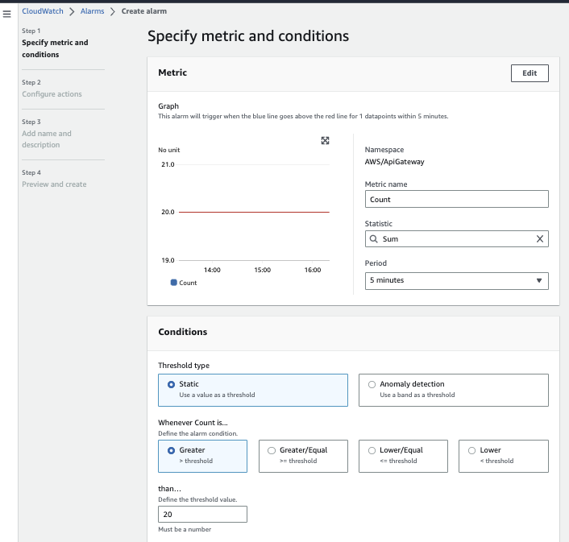

* The target of the alarm may be to stop, reboot, terminate, recover of an EC2 instance, trigger an Auto Scaling Action for EC2, or send notification to SNS. 
* We need to specify the number of datapoints within the evaluation period that must be breaching to cause the alarm. This is used to avoid reacting to spike. 
* Notifications are sent to SNS and to an email recipient. It is possible to also define automatic actions like auto scaling, specific EC2 action, create a ticker or create an incident in System Manager.
* CloudWatch Alarms are designed to invoke only the alarm actions when a state change happens. Here is an example of alarm set on total number of api call:

    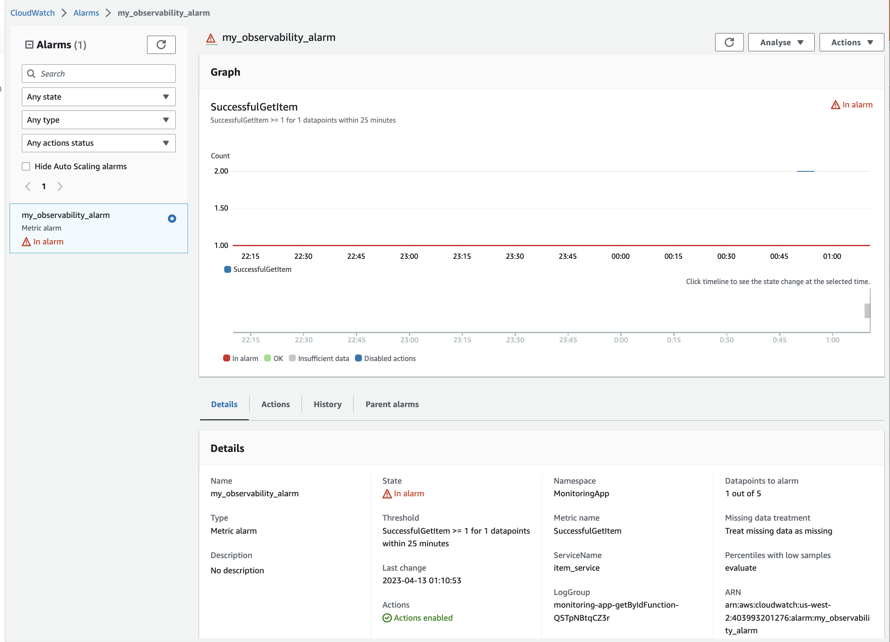

* We can also combine outcome of two alarms using the CloudWatch Composite Alarm.
* A composite alarm includes a rule expression that takes into account the alarm states of other alarms that we have created. The composite alarm goes into ALARM state only if all conditions of the rule are met.

We can use the stop or terminate actions to help us save money when we no longer need an instance to be running. We can create an CloudWatch alarm that monitors an EC2 instance and automatically reboots the instance. The reboot alarm action is recommended for Instance Health Check failures. While if a System Status Check fails use the Recover the instance to find another host server for this EC2.

### CloudWatch Logs

Concepts:

* Log groups to groups logs, representing an application.

    { width=800 }

* Log streams: instances within an application / log files or containers.

    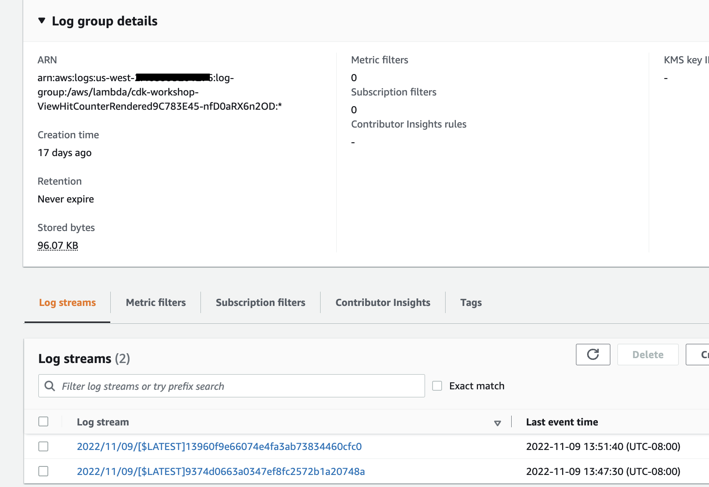{ width=800 }

Priced for retention period, so expiration policies can be defined. 

CloudWatch can send logs to S3, Kinesis Firehose, Kinesis Data Streams, Lambda,... 

Can define filters to reduce logs or trigger CloudWatch alarms, or add insights to query logs and for Dashboards. Here are simple filter:

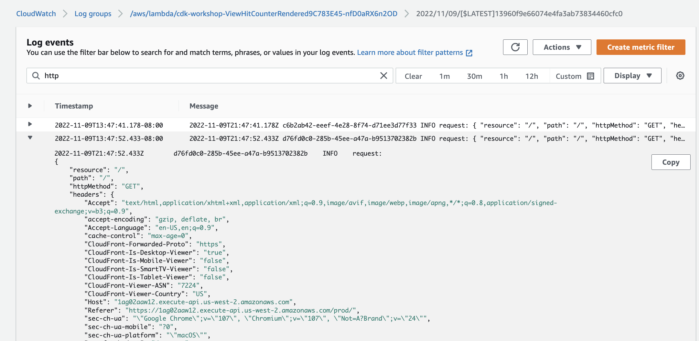

Use Subscription Filter to get near real-time logs to targeted sink:

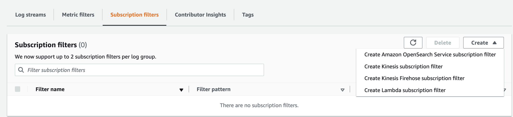

Logs Insights helps to define query to search within the logs. 

### CloudWatch Agent

By default EC2 instances do not send logs to CloudWatch. We need to run agent on EC2 to push log files we want. We need to use an IAM role that let the EC2 instance be able to send logs to CW.

The new Unified Agent send logs and system-level metrics. 

For memory usage, disk swap, disk space, page file usage, and log collection we need the CloudWatch Agent.

### CloudWatch Event 

Is now [EventBridge](../serverless/eventbridge.md), a more generic event-driven, serverless managed service.

### CloudWatch Insight

CloudWatch Container Insights collects, aggregates, and summarizes metrics and logs from our containerized applications and microservices. Available for ECS, EKS, K8S on EC2s. 

CloudWatch Lambda Insights simplifies the collection, visualization, and investigation of detailed compute performance metrics, errors, and logs to isolate performance problems and optimize our Lambda environment.

Application Insight is to set up monitoring and gain insights to our application health so we can quickly detect and diagnose problems and reduce the mean time to resolution

Contributor Insights allows us to create real time Top N time series reports by analyzing CloudWatch Logs based on rules we define. The rule matches log events and reports the top Contributors, where a "Contributor" is a unique combination of the fields defined in the rule. It can be used to identify the heaviest network users, find the URLs that generate the most erroes.

* [EKS workshop with CloudWatch container insight](https://www.eksworkshop.com/intermediate/250_cloudwatch_container_insights/)

### [Synthetic canaries](https://docs.aws.amazon.com/AmazonCloudWatch/latest/monitoring/CloudWatch_Synthetics_Canaries.html)

Canaries are Nodejs or Python scripts that run on a schedule, to monitor (availability and latency) our endpoints and APIs. They follow the same routes and perform the same actions as a customer. They work on HTTP or HTTPs. 

An example of creating a canary for API endpoint:

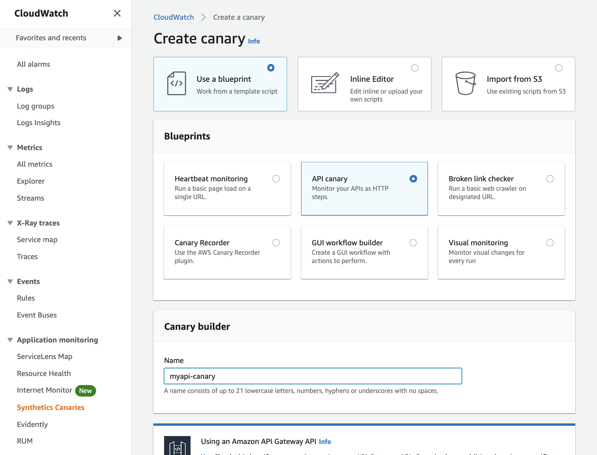{ width=800 }

The API is in the API Gateway so select the domain and stage:

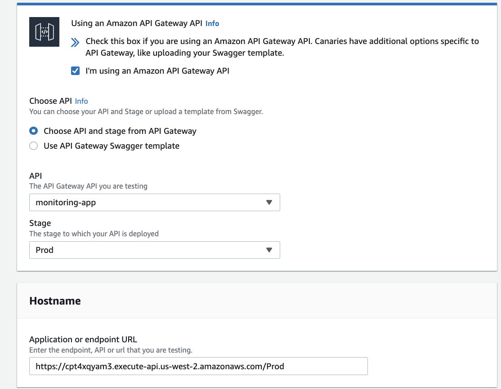{ width=800 }

Once started the canary show if it passes or fails the API call.

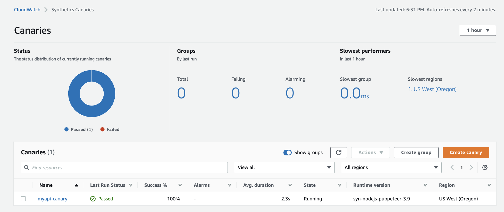{ width=800 }

### CloudWatch Deeper Dive

* [CloudWatch Product documentation](https://docs.aws.amazon.com/AmazonCloudWatch/latest/monitoring/WhatIsCloudWatch.html)
* [CloudWatch CDK sample: CDK Python Backup & Cloudwatch event](https://github.com/aws-samples/aws-cdk-examples/tree/master/python/ec2-cloudwatch) to illustrate a cloudwatch event rule to stop instances at UTC 15pm everyday
* [CloudWatch Container Insights for EKS cluster workshop](https://www.eksworkshop.com/intermediate/250_cloudwatch_container_insights/)
* [AWS CloudWatch sample: repeats an alarm with Event Bridge](https://github.com/aws-samples/amazon-cloudwatch-alarms-repeated-notification-cdk) has some CDK examples of alarm, cw groups.. but very bad implementation as Step function and lambda code are inside the CDK code. 

## [AWS CloudTrail](https://aws.amazon.com/cloudtrail/)

A managed service to provides governance, audit capabilities for all activities (API calls) and events within an Account. Can be across regions and accounts on a single, centrally controlled platform. We can use CloudTrail to detect unusual activity in our AWS accounts.

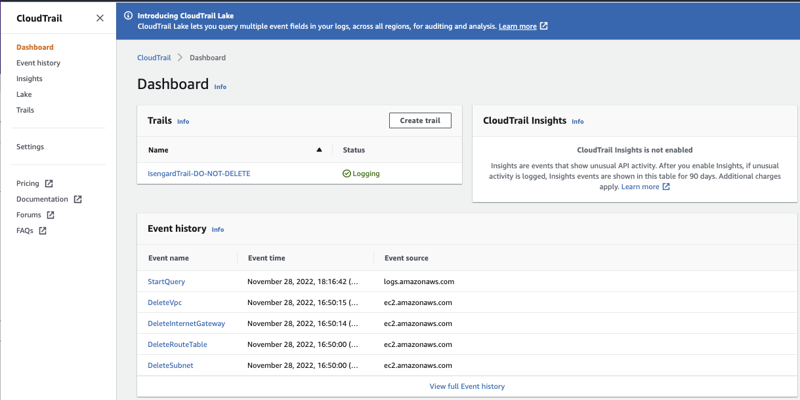

By default, trails are configured to log management events (operations performed on AWS resources). Data events are not logged.

This is a usage-based paid service.

CloudTrail Insight is used to detect unusual activity in AWS account.

## [AWS Config](https://docs.aws.amazon.com/config/index.html#lang/en_us)

Record and evaluate our AWS resource configurations and changes over time against compliance rules. For example can be used to continuously monitor our EC2 instances to assess if they have a specific port exposed.

It is a pre-region service. But data can be aggregated across regions and accounts.

The following screen shots help to understand the type of configuration that needs to be done to use AWS Config:

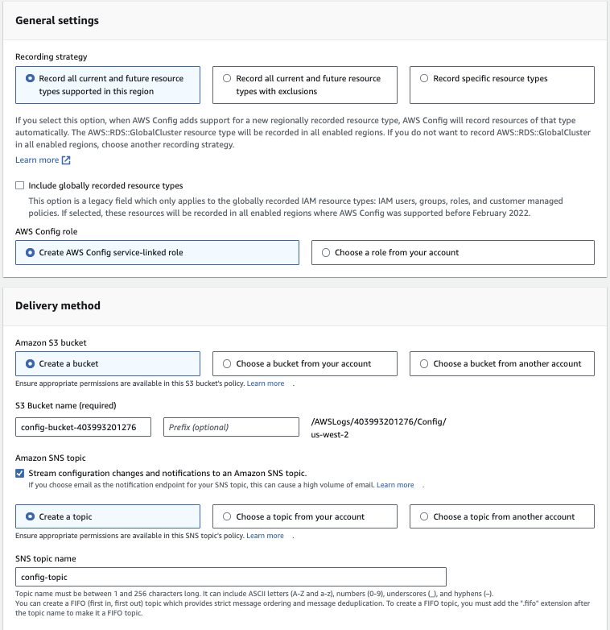

Configuration snapshots and configuration history files are delivered to S3 bucket, and configuration change notifications are delivered through SNS. Can send events to EventBridge.

AWS Config rules are used to evaluate compliance to best practices, and remediate using AWS Systems Manager Automation documents. This is done at the Action level of a config rule. There are a lot of pre-built rules to select from:

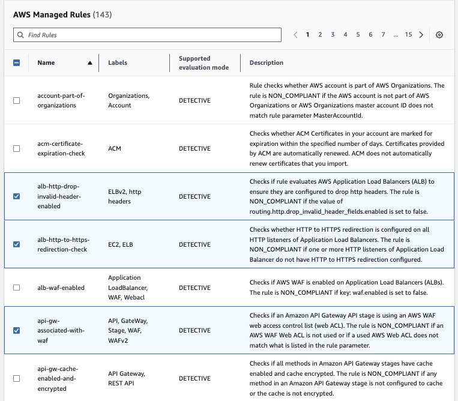

Custom rule has to be defined in Lambda function.

We can leverage an AWS Config managed rule to check if any ACM certificates in our account are marked for expiration within the specified number of days.

Rules are not here to prevent actions to be done on resources, but notifies in case of non-compliance.

Combined with CloudTrail, we know who did the change to a configuration.

See [tutorialsdojo summary](https://tutorialsdojo.com/aws-config/).

## Putting them together

If we define an Elastic Load Balancer then, 

* **CloudWatch** will help us to monitor incoming connections metric, visualize error codes as % over time, and supports dashbaord to get performance monitoring.
* **Config** will help us to track security group rules, configuration changes done on the load balancer, as well as defining compliance rules to ensure SSL certificates are always assigned to LB.
* **CloudTrail** tracks who made any changes to the configuration with API calls.

