# ECS playgrounds

Different examples of how to deploy apps on ECS cluster.

See also [ECS service summary](../serverless/ecs.md).

## Deploy NGinx docker image on Fargate

This is using the AWS Console.

1. Create an ECS cluster, using Fargate runtime, and CloudWatch container insights.

    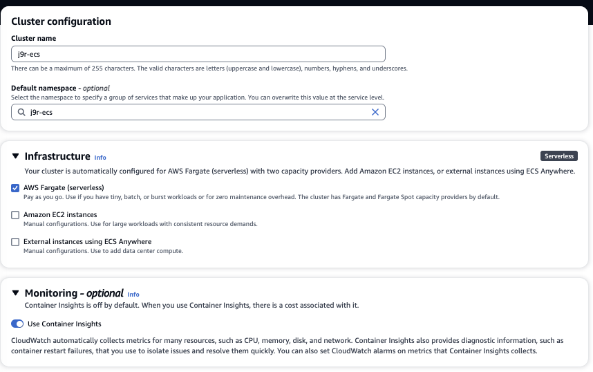

    As an alternate approach, use aws CLI or CDK/cloudformation as illustrated [below](#deploy-a-python-flask-app-with-cdk).

1. Ensure the VPC in which the ECS cluster is deployed, has a route to access to the port number of the app to deploy (port 8080 or 80) 
1. Add a task definition to use NGInx demo hello docker image

    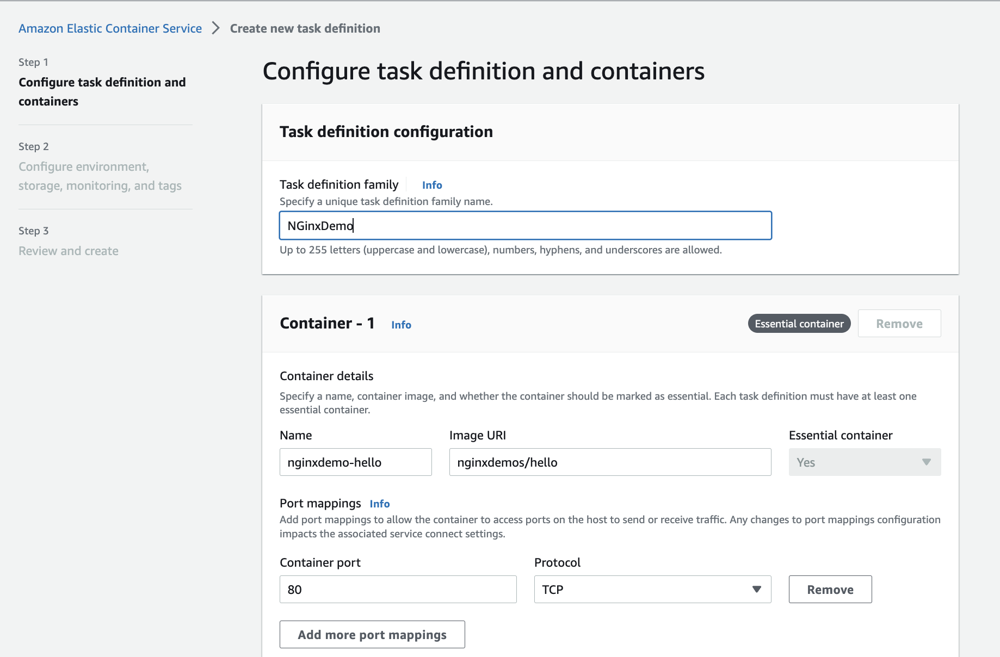{ width=700 }

    There is no need to specify environment variables in this demonstration.

    Specify the environment like EC2 or Fargate and then the CPU requirements.

    There is not need to add a `Task role` as the container is not accessing any AWS service via API (if not, specify a IAM role which has the necessary policies). No Storage needed neither.

    Enable `log collection` to CloudWatch, but no need to send trace to AWS X-Ray and metrics to AWS Distro.

    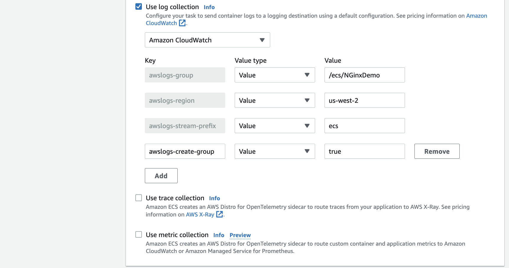{ width=700 }

1. A web app may need to scale horizontally, and in this case we need to create a service to expose it: Select the ECS cluster as target environment:

    { width=700 }

    Then specify that the service will use more than one replica:

    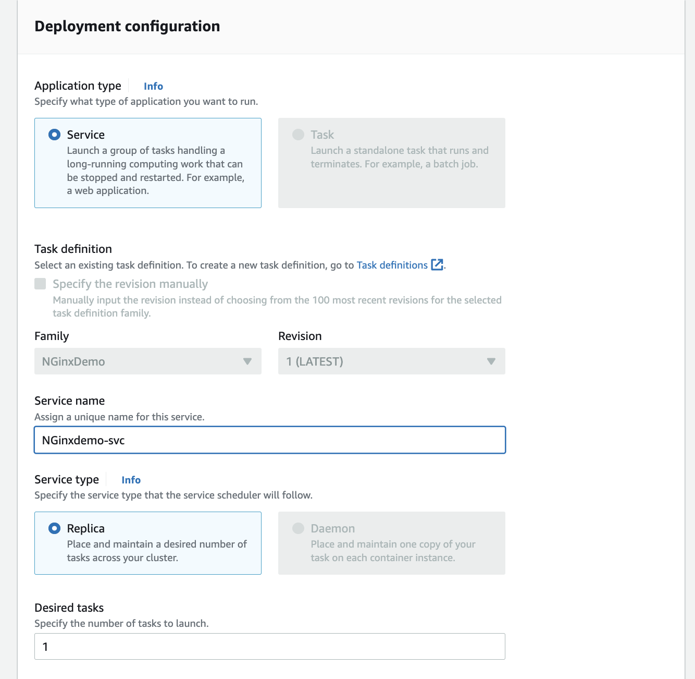{ width=700 }

    The deployment parameters control the % allocated during deployment:

    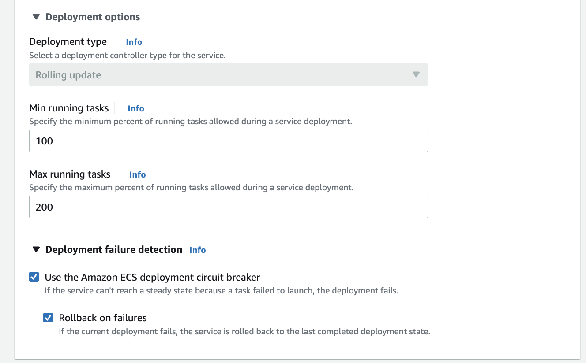{ width=700 }

    Be sure to select the VPC where the ECS cluster is defined then the subnets, and a specific security group granting access on port 80 coming from the ALB security group:

    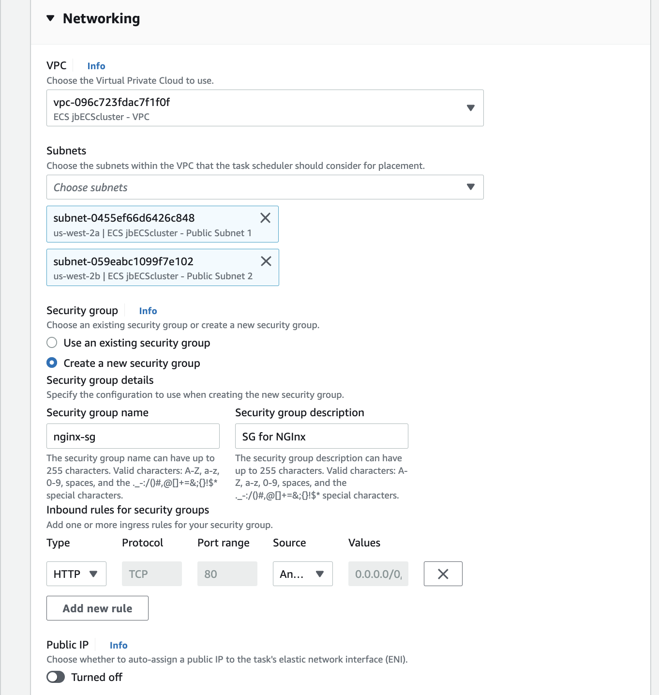{ width=700 }

    As we want to facade with an ALB, we do not want to setup a public IP address with a ENI. 

    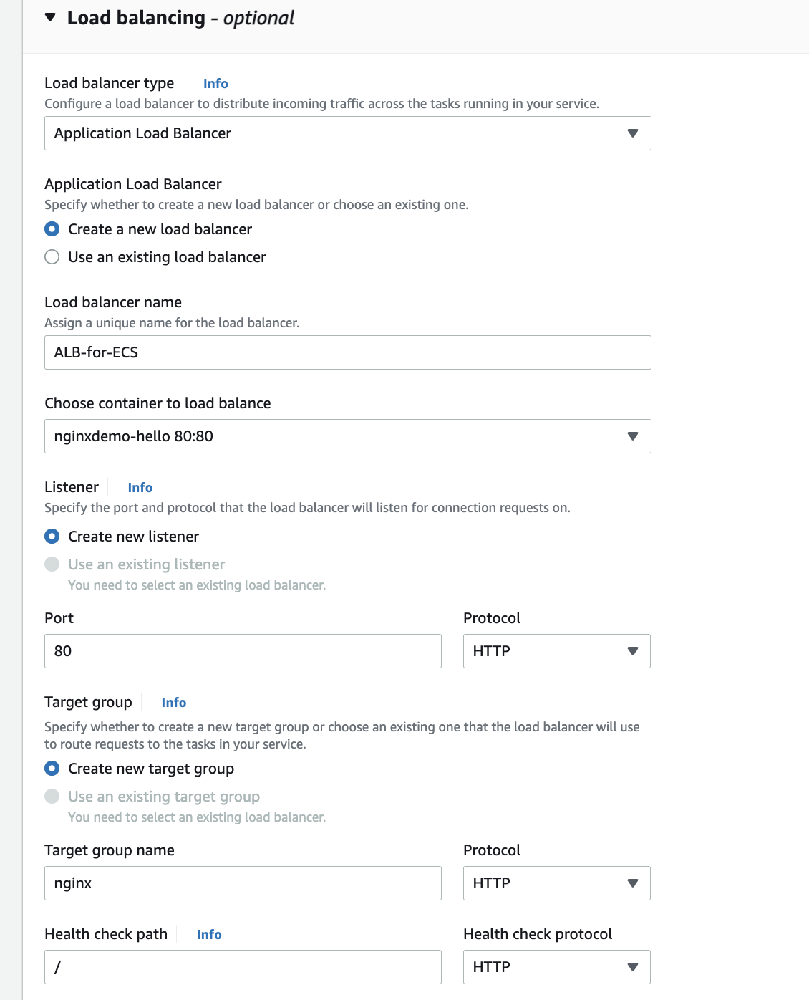{ width=700 }

1. Get DNS name of the ALB or the  IP address

    * If we created a public IP address then an ENI was created, and going to the ENI definition will let access to the DNS name, something like: `ec2-34-216-228-13.us-west-2.compute.amazonaws.com` 


## Deploy a Python Flask app using AWS Console on ECS Fargate

1. Create a ECS cluster if not done already.
1. Build the docker image for the Flask App. If build on MAC M1|M2 CPU, use the platform parameter.

    ```sh
    docker build --platform linux/amd64 -t j9r_flaskapp . 
    ```

1. Upload the image to ECR repository (see [commands here](./gettingstarted.md/#ecr-for-container-registry)): be sure to match repository name with the docker image name

    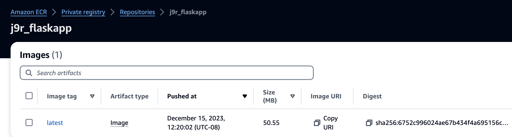

1. Create a task definition, mostly the same as in previous example, the image reference is the one in the private registry in the same AWS Account. Be sure to select a Task execution role with the `AmazonECSTaskExecutionRolePolicy` managed policies attached to it:

    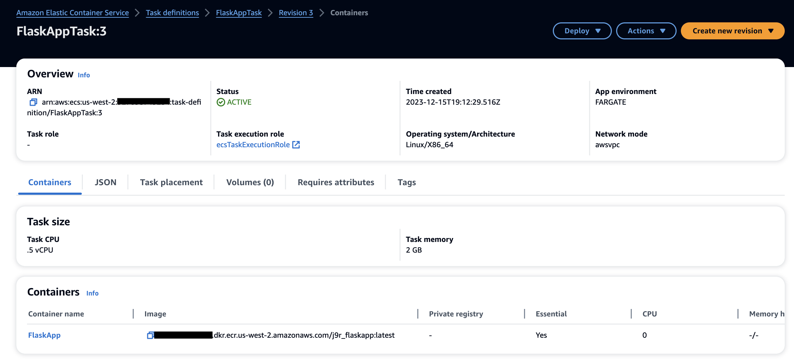

    ???- info "Task role vs execution task role"
        *ECS task roles* allow the containers in the task to assume an IAM role to call AWS APIs without having to use AWS Credentials inside the containers. The trusted principals in the role is the `ecs-tasks.amazonaws.com` service.  *ECS task execution roles* grant the ECS agents permission to make AWS API calls who are responsible for managing the tasks in the cluster.

1. As the task should run as a web application, we need to create a service from the task definition detail panel. Choose Capacity provider strategy for the computation deployment configuration, then `Replica` and one desired task, select the Default VPC and one or 2 subnets. Select an existing Security Group is the matching port is already expose (port http 80). No need to create an ALB for this deployment. Defining a service, builds a cloud formation template. After few minutes the service and task are running. The URL is the public IP address for the task. 

    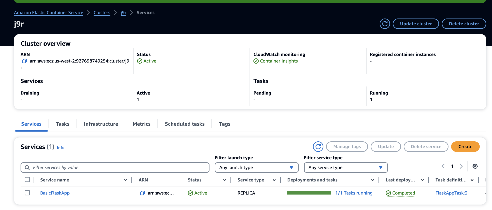

1. Update the security group if needed to get HTTP port 80 open. Use the URL.
1. Stop the service.


### How to connect to an Amazon ECS container using AWS ECS execute command

It is possible to use tool like [ecs-exec-checker](https://github.com/aws-containers/amazon-ecs-exec-checker) to remote connect to a container started as a task in ECS.

## Deploy a Python Flask app with CDK ecs_patterns

See the [folder: labs/cdk/ecs-fargate](https://github.com/jbcodeforce/yarfba/tree/main/labs/cdk/ecs-fargate-flask) with a ECS cluster in the Default VPC, a Python flask application build and pushed to ECR in private repository. Below is the extract from the stack definition:

```python
    vpc = ec2.Vpc.from_lookup(self, "lookup", is_default=True)     # default is all AZs in region
        
    cluster = ecs.Cluster(self, "MyCluster", vpc=vpc)

    ecs_patterns.ApplicationLoadBalancedFargateService(self, "MyFargateService",
        cluster=cluster,            # Required
        cpu=256,                    # Default is 256
        desired_count=1,            # Default is 1
        task_image_options=ecs_patterns.ApplicationLoadBalancedTaskImageOptions(
            image=ecs.ContainerImage.from_asset("./server")),
        memory_limit_mib=512,      # Default is 512
        public_load_balancer=True)
```

* Cluster created with the name of the stack:

    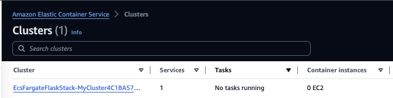

* ALB: As the CDK code used the [ecs.patterns]() with an ALB, we can see the ALB declaration in AWS console. The target group being the ECS service. There is also a DNS A record created, and using the DNS URL should bring the Flask app hello world message.

    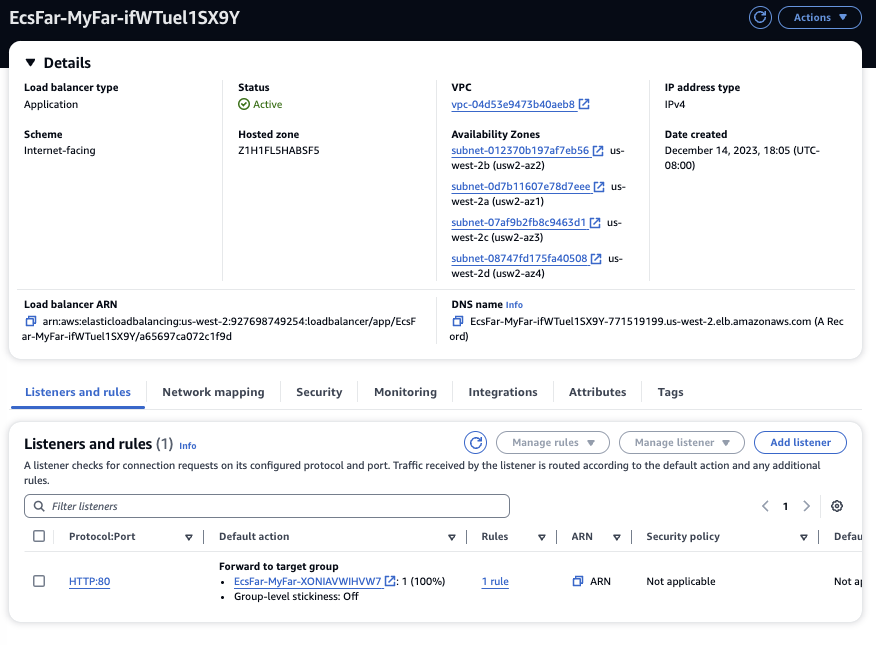

* The target group

* ECS Service 

    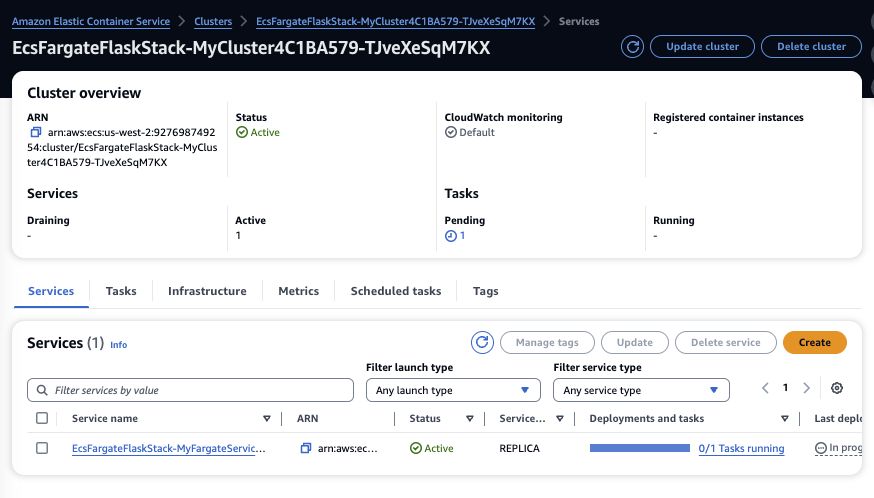

* ECS Task Definition illustrates the two IAM roles created: 1/ to get ECS principals being able to call ECR, and writing to logs, and 2/ an execution role to write logs

    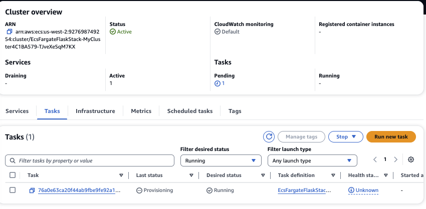

???- info "Networking topology change on Fargate 1.4.0+"
    There is only one ENI now per task. All traffic stays inside of our VPC, even the Fargate platform traffic, like accessing ECR and Secret Manager. To be able for the task to access ECR private registry, Secret Manager... we need to add a privatelink to those services. 

## Deploying Quarkus App with CDK

See [this aws-cdk-project-templates repository](https://github.com/jbcodeforce/aws-cdk-project-templates) for a project template.

1. Create a CDK app, define a VPC, public, private subnets and routing inbound rule on the same port as the exposed port of the app (80 or 8080) in its security group, and add ECS cluster construct to the stack: The code below use a config dict to share some configuration values.

    ```python
     self.ecs_cluster: ecs.Cluster = ecs.Cluster(
            self, "ECSCluster", 
            vpc=self.vpc, 
            cluster_name=self.config.get("ecs_cluster_name")
        )
    ```

1. Define an IAM role to let the application accessing other AWS Service, with the secure policies attached to it
1. Add a task definition
1. Add a load balancer

## Some how-tos

???- Info "Deactivate a task"
    Select the task definition name to open a second panel with `Deregister` action.

???- Info "Delete task definition"
    A task definition deletion request will not complete if there are any Amazon ECS resources that depend on the task definition revision. Select the task definition name, and in the second panel the delete option.

## Other examples

* [Deploying Quarkus native app with Postgresql Aurora](https://awstip.com/deploying-a-container-image-with-a-quarkus-native-application-on-aws-fargate-ecs-b09141fe7ff4)