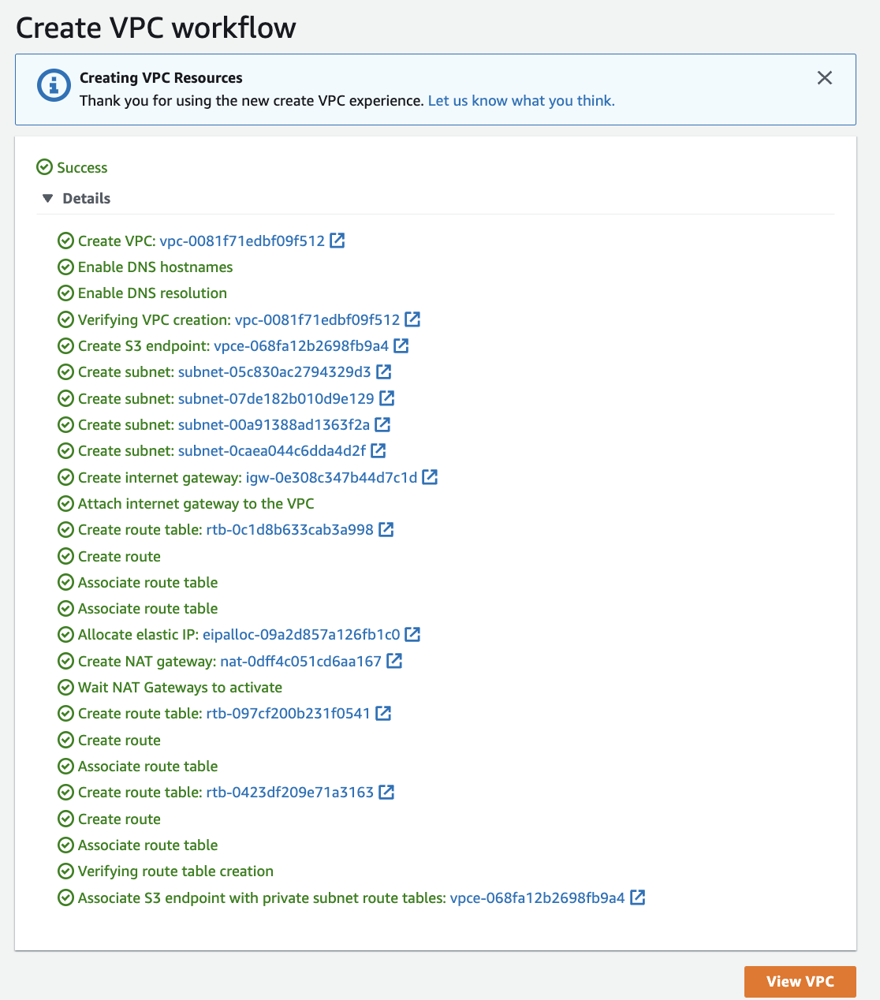

# Getting started

## Create a SSH KeyPair

A key pair, consisting of a public key and a private key. The public key is saved on the EC2 instance, during the first boot (under `~/.ssh/authorized_keys`).  See the [product documentation](https://docs.aws.amazon.com/AWSEC2/latest/UserGuide/ec2-key-pairs.html?icmpid=docs_ec2_console#having-ec2-create-your-key-pair).

Using the CLI:

```sh
aws ec2 create-key-pair \
    --key-name my-ec2-key-pair \
    --key-type rsa \
    --key-format pem \
    --query "KeyMaterial" \
    --output text > my-ec2-key-pair.pem
chmod 0400 my-ec2-key-pair.pem

# Verify the key
aws ec2 describe-key-pairs --key-names my-ec2-key-pair
```

When we create a new key pair using AWS CloudFormation, the private key is saved to AWS Systems Manager Parameter Store.

```yaml
Resources:
  NewKeyPair:
    Type: 'AWS::EC2::KeyPair'
    Properties: 
      KeyName: new-key-pair
```

Then get the reference 

```sh
aws ec2 describe-key-pairs --filters Name=key-name,Values=new-key-pair --query KeyPairs[*].KeyPairId --output text
```

And `.pem` file

```sh
aws ssm get-parameter --name /ec2/keypair/<REPLACE_WITH_RESULT_PREVIOUS_CMD> --with-decryption --query Parameter.Value --output text > new-key-pair.pem
```

To get the public key from a private key:

```sh
ssh-keygen -y -f /path_to_key_pair/new-key-pair.pem
```

## Deploying Apache HTTP on EC2

Using AWS console, create a EC2 t2.micro instance with AWS Linux, a public IP address, a security group with SSH enabled from anywhere and HTTP on port 80 accessible from the internet (0.0.0.0/0). Associate the EC2 with a Key Pair so we can do SSH on the instance (and download the .pem file). The free tier is eligible to 30 GB of disk. Under the `Advanced details` section, add the following `bash` script in the `User Data` field:

```shell
#!/bin/bash
# update OS
yum update -y
# Get Apache HTTPd
yum install -y httpd
# Start the service
systemctl start httpd
# Enable it cross restart
systemctl enable httpd
> Created symlink from /etc/systemd/system/multi-user.target.wants/httpd.service to /usr/lib/systemd/system/httpd.service
# Get the availability zone
EC2-AZ=$(curl -s http://169.254.169.254/latest/meta-data/placement/availability-zone/)
# Change the home page by changing /var/www/html/index.html
echo "<h1>Hello from $(hostname -f)</h1>" > /var/www/html/index.html
# or use the following
echo "<h3>Hello World from $(hostname -f) in AZ= $EC2_AZ </h3>" > /var/www/html/index.html
```

Once launched, from the console, get the DNS name or the public IP address and try a curl or use your web browser to that HTTP address (not https).

We can do the same with IaC, see the example [labs/cdk/ec2-basic](https://github.com/jbcodeforce/yarkba/tree/main/labs/cdk/ec2-basic) and use the output to get the URL of the web server.

### Troubleshooting

* Connection timeout: Any timeout (not just for SSH) is related to security groups or a firewall rule. This may also means a corporate firewall or a personal firewall is blocking the connection. Go to the security group and look at inbound rules.
* `Permission denied (publickey,gssapi-keyex,gssapi-with-mic)`: You are using the wrong security key or not using a security key. 
* "Able to connect yesterday, but not today": When you restart a EC2 instance, the public IP of your EC2 instance will change, so prefer to use the DNS name and not the IP @. 


### SSH to EC2

* Get public IP address of the EC2 instance
* Get pem certificate for the CA while you created the EC2 via the Key pair (e.g. `my-key-pair.pem`)
* Issue the following command where the certificate is to open a SSH session

```sh
ssh -i my-key-pair.pem ec2-user@35.91.239.193
```

you should get the prompt:

```sh
Last login: Wed Nov  2 17:24:30 2022 from ec2-18-237-140-165.us-west-2.compute.amazonaws.com

       __|  __|_  )
       _|  (     /   Amazon Linux 2 AMI
      ___|\___|___|

https://aws.amazon.com/amazon-linux-2/
```

### EC2 Instance Connect

Access the EC2 terminal inside the web browser using SSH. Select the instance and then `Connect` button at the top. 


It comes with the `aws cli`. Never enter any account id inside `aws configure` inside an EC2 instance, use IAM role instead.

For example to access another service (like IAM), we need an IAM Role added to the EC2 instance: go to the EC2 instance, `Action > Security > Modify IAM Roles` add `DemoEC2Role` for example. We should be able to do `aws iam list-users` command.

### Access to service within the EC2

To access to external AWS service we need to use IAM role. So define a Role in IAM 


with the Permission Policy linked to the resource you try to access, for example select on S3 policies to be able to access S3 bucket. 


On an existing EC2 we can use the menu `Actions > Security > Modify IAM Roles`.   

## Using EC2 with a Redis Server


The user-data for Redis server looks like:

```sh
sudo yum -y install gcc make # install GCC compiler
cd /usr/local/src 
sudo wget http://download.redis.io/redis-stable.tar.gz
sudo tar xvzf redis-stable.tar.gz
sudo rm -f redis-stable.tar.gz
cd redis-stable
sudo yum groupinstall "Development Tools"
sudo make distclean
sudo make
sudo yum install -y tcl
sudo cp src/redis-server /usr/local/bin/
sudo cp src/redis-cli /usr/local/bin/
redis-server --protected-mode no
```

See also the cloud formation template [labs/networking](https://github.com/jbcodeforce/yarkba/tree/main/labs/networking)


## A High availability WebApp deployment summary

Based on the AWS essential training, here is a quick summary of the things to do for a classical HA webapp deployment.


1. Create a VPC with private and public subnets, using at least 2 AZs. This is simplified with the new console which creates all those elements in one click:

    

    The results, with all the networking objects created, look like below:

    

1. Verify routing table for public and private subnets. 
1. Add security group to the VPC using HTTP and HTTPS to the internet gateway.
1. Start EC2 to one of the public subnet and define user data to start your app. Here is an example

    ```sh
    #!/bin/bash -ex
    yum -y update
    curl -sL https://rpm.nodesource.com/setup_15.x | bash -
    yum -y install nodejs
    mkdir -p /var/app
    wget https://aws-tc-largeobjects.s3-us-west-2.amazonaws.com/ILT-TF-100-TECESS-5/app/app.zip
    unzip app.zip -d /var/app/
    cd /var/app
    npm install
    npm start
    ```

1. Get the security key with .pem file for the public certificate
1. Be sure the inbound rules include HTTP and HTTPS on all IPv4 addresses defined in the security group.  

## Create a EC2 instance with Terraform

* Build a main.tf [labs/terraform-vpc](https://github.com/jbcodeforce/yarkba/tree/main/labs/terraform-vpc), which uses the aws provider to provision a micro EC2 instance:

    ```json
    terraform {
    required_providers {
        aws = {
        source  = "hashicorp/aws"
        version = "~> 3.27"
        }
    }

    required_version = ">= 0.14.9"
    }

    provider "aws" {
        profile = "default"
        region  = "us-west-2"
    }

    resource "aws_instance" "app_server" {
        ami           = "ami-830c94e3"
        instance_type = "t2.micro"

        tags = {
            Name = "ExampleAppServerInstance"
        }
    }

    ```

    Resource blocks contain arguments which you use to configure the resource. 
    Arguments can include things like machine sizes, disk image names, or VPC IDs.

```sh
terraform apply
# inspect state
terraform show
```

## Install nginx inside a EC2 t2.micro.

Be sure to have a policy to authorize HTTP inbound traffic on port 80 for 0.0.0.0/0.

## ASG, launch template and load balancer

1.  Create a launch template


## ECR for Container Registry

Amazon Elastic Container Registry (Amazon ECR) is an AWS managed container image registry service that is secure, scalable, and reliable.

See [Getting started guide](https://docs.aws.amazon.com/AmazonECR/latest/userguide/what-is-ecr.html) which can be summarized as:

* Any client (CLIs) must authenticate to Amazon ECR registries as an AWS user before we can push and pull images.
* We define public or private repositories using the console or cli.
* Repository names can support namespaces and then image name.
* Create OCI with tag with the repository URI. When in private registry see the `Push commands` button to get the list of docker CLI commands to run. Something like:

```sh
export ACCOUNT_ID
aws ecr get-login-password --region us-west-2 | docker login --username AWS --password-stdin $ACCOUNT_ID.dkr.ecr.us-west-2.amazonaws.com

docker build  --platform linux/amd64 -t j9r_flaskapp .
docker tag j9r_flaskapp:latest $ACCOUNT_ID.dkr.ecr.us-west-2.amazonaws.com/j9r_flaskapp:latest
docker push $ACCOUNT_ID.dkr.ecr.us-west-2.amazonaws.com/j9r_flaskapp:latest
```

* Images can be replicated to other repositories across Regions in our own registry and across accounts.
* We can control access to our repositories and the images within them with repository policies.
* We can get public images from docker hub or other public regisry and cache them to our private registry.
* For a ECS task to be able to pull image from private registry, we need to attach the `AmazonECSTaskExecutionRolePolicy` managed policies to the execution role of the task.

Finally [ECR supports sharing public image via the public gallery](https://gallery.ecr.aws/) service.

## Deploy a Web App on AWS Elastic Beanstalk

Elastic Beanstalk is an easy-to-use service for deploying and scaling web applications and services developed with Java, .NET, PHP, Node.js, Python, Ruby, Go, and Docker on familiar servers such as Apache, Nginx, Passenger, and IIS

[Guide](https://aws.amazon.com/getting-started/guides/deploy-webapp-elb/)


