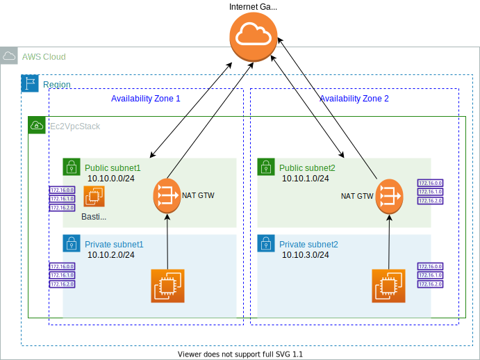
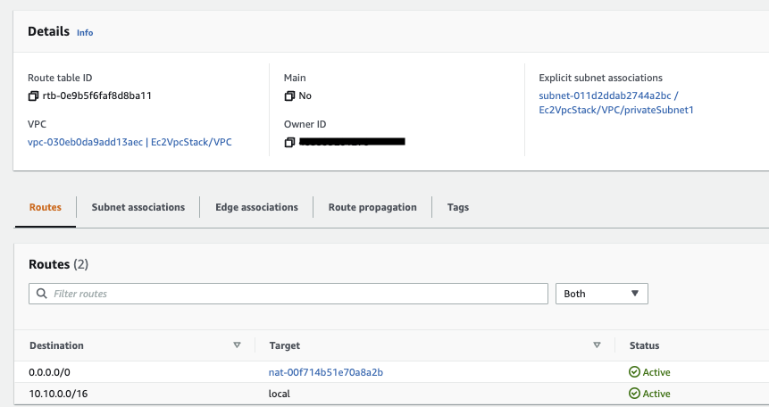
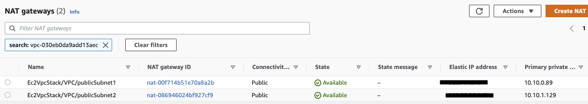

# Networking hands on

## VPC hands-on work

The CDK example in [the ec2-vpc folder](https://github.com/jbcodeforce/aws-studies/tree/main/labs/cdk/ec2-vpc) supports the following definitions:

{ width= "1000" }

* The routes needs to define that traffic from internet goes to the IGW. The following route is associated to the public subnet-1:

* Alternatively, to allow an instance in our VPC to initiate outbound connections to the internet but prevents unsolicited inbound connections from the internet, we can use a Network Address Translation (NAT) service for IPv4 traffic. NAT gateway maps multiple private IPv4 addresses to a single public IPv4 address, and does IP translation so host in the internet sees only public IP, original EC2's IP @ is in the header.
* In the private subnet, outbound to reach the internet has to go to the NAT Gateway, while traffic from machines in the subnets stays local, as illustrated in the routing table  below:

{ width="1000" }

* IPv6 uses Egress only Internet Gateway for outbound requests from a private Subnet. For IPv4 oubtound internet traffic from a private subnet, we use a NAT instance or NAT Gateway. There is always an IP v4 assigned to EC2 instance.
* NAT gateway is deployed inside a subnet and it can scale only inside that subnet. For fault tolerance, it is recommended that we deploy one NAT gateway per availability zone.
* As we have set up a NAT Gateway in each public subnet, and the route in the private network routes all IP to the NAT gateway, we can ping from the EC2 running in the private subnet to the internet.

* Below are the two NAT gateway references, one in each subnet/AZ:

