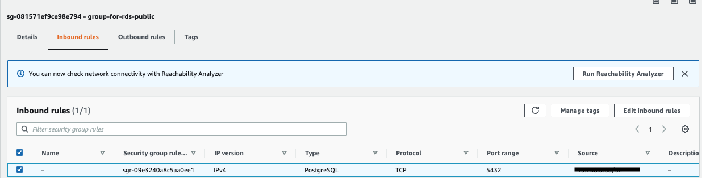
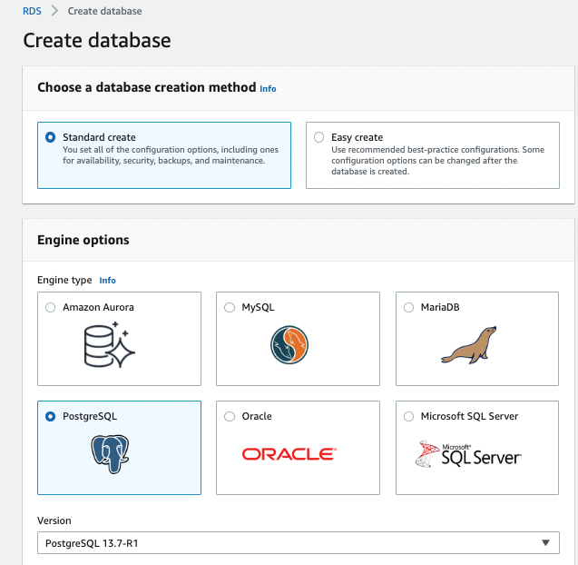
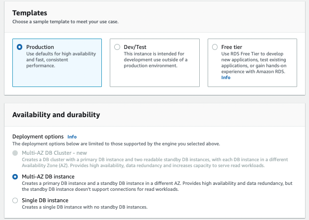
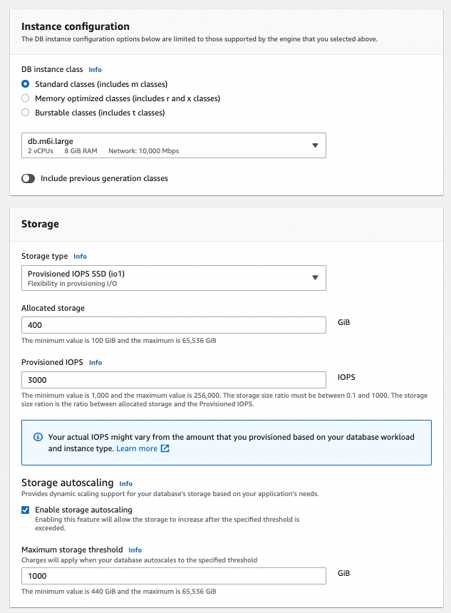
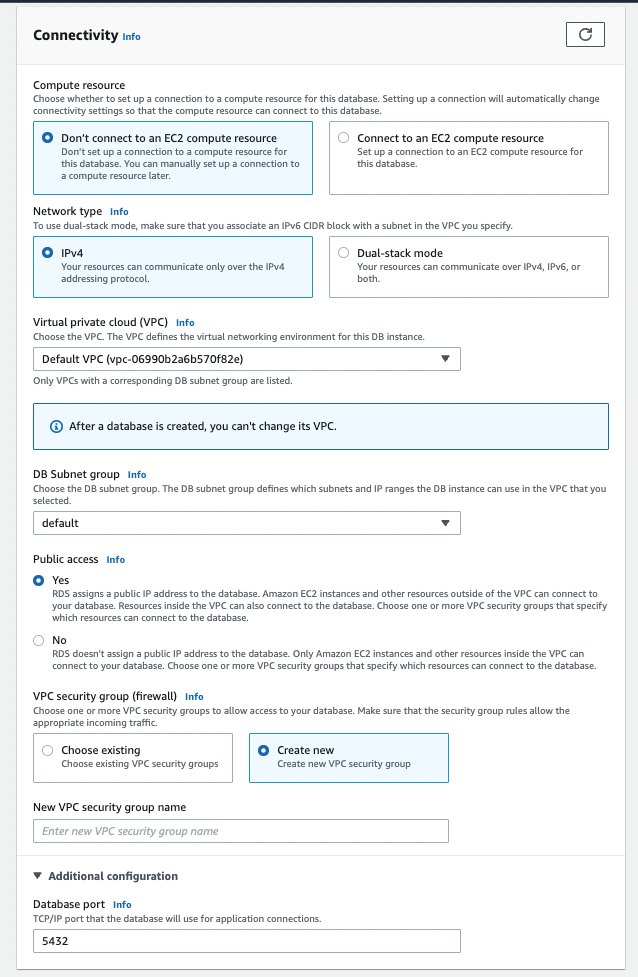
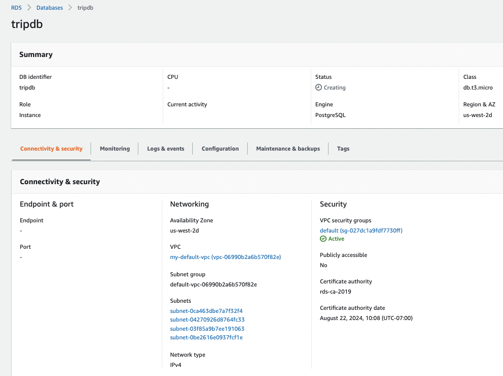
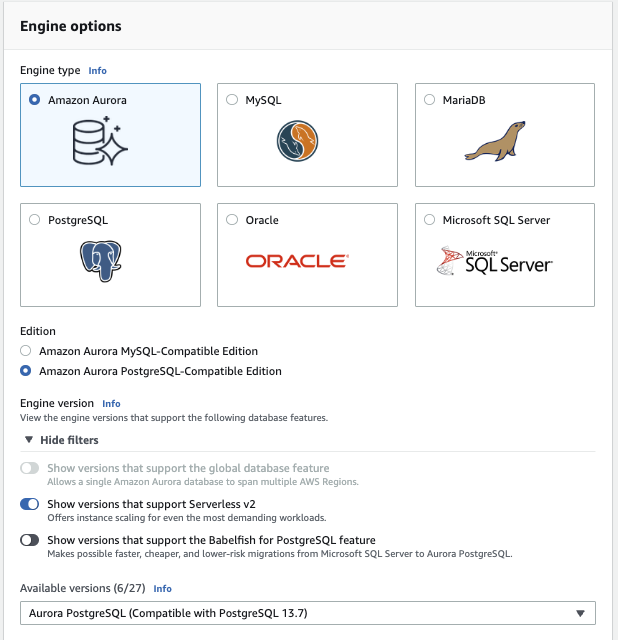
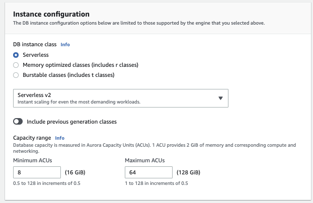
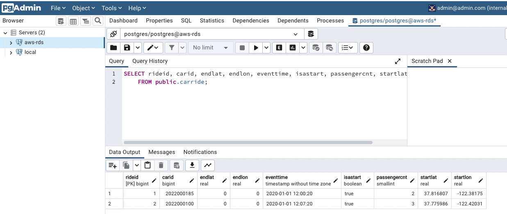

# Hands-on RDS


## Create RDS Postgresql with Console

* Be sure to define a _security group_ in your VPC with a Inbound rules for the expected port number and MyIP address so you can run your app locally on your laptop and access RDS PostgreSQL DB.

    

* Using PostgreSQL instance: 

    

See also the [tutorial of creating Postgresql](https://docs.aws.amazon.com/AmazonRDS/latest/UserGuide/CHAP_GettingStarted.CreatingConnecting.PostgreSQL.html) to get the different steps and default practices.

Some remarks from the AWS tutorial:

* In `Templates` changes the options in the form, for a production deployment with multi-AZ DB instance with primary and standby DB instances.

    

* Be sure to keep the username and password
* Specify EC2 instance type and Storage class, and if you need storage autoscaling or not. 

    

* Assign to a VPC, choose network IP type and subnets, public access (not for production), and exposed port:

    

* Be sure the DB instance is associated with a security group that provides access to it (port 5432). If your DB instance is publicly accessible, make sure its associated security group has inbound rules for the IP addresses that you want to access from. 

???- "Info"
    Access to the created security group via the RDS instance panel:
    

* Verify the Monitoring panel to see the traffic you may have generated (see next sections)
* To delete the DB using the list of DB panel and `Actions > Delete`. In case of modify the RDS database configuration to authorize deletion.

### Modify an existing instance to be public

* Choose Databases, and then select the Aurora DB instance in the Aurora Cluster that you want to modify.
* Choose Modify.
* From the Modify DB instance page, under Connectivity, expand the Additional Configuration section. Set Public access to Yes or No.
* Choose Continue, and check the summary of modifications.
* To apply the changes immediately, select Apply immediately. Changing this setting on the existing DB instance in the cluster affects the network connectivity.

* [See this note for more detail.](https://aws.amazon.com/premiumsupport/knowledge-center/aurora-private-public-endpoints/)

## Create an Aurora Serverless instance

The difference with previous step is the Aurora database, with a postgresql driver, 



and then serverless option. 



This will be a better solution for demonstration and to have access to an SQL editor inside AWS RDS console webapp, if not we need an external tool like pgadmin remotely connected.

## Quarkus App Client

See the repository [Autonomous Car Ride](https://github.com/jbcodeforce/autonomous-car-ride) which uses Quarkus, Panache, and CarRide entity. The repository includes a docker file to start local postgresql and pgadmin containers.

When changing to the URL properties to the one of the RDS service, then the local execution with `quarkus dev` connect to the RDS database.

```shell
quarkus.datasource.jdbc.url=jdbc:postgresql://<>.us-west-2.rds.amazonaws.com:5432/postgres
```

Adding a `new server` definition in the PGADMIN tool, with the RDS URL, user and password, we can see the DB and records from the RDS DB as illustrated below:



The URL for the quarkus app can be overwritten by environment variable: `QUARKUS_DATASOURCE_JDBC_URL`

## Python Client

* Need to install boto3 wiht pip. [Bot3 RDS API documentation.](https://boto3.amazonaws.com/v1/documentation/api/latest/reference/services/rds.html#client)

```python
import boto3

client = boto3.client('rds')

response = client.describe_db_instances(
    DBInstanceIdentifier='customer-action-instance-1',
)
print(response)
```
