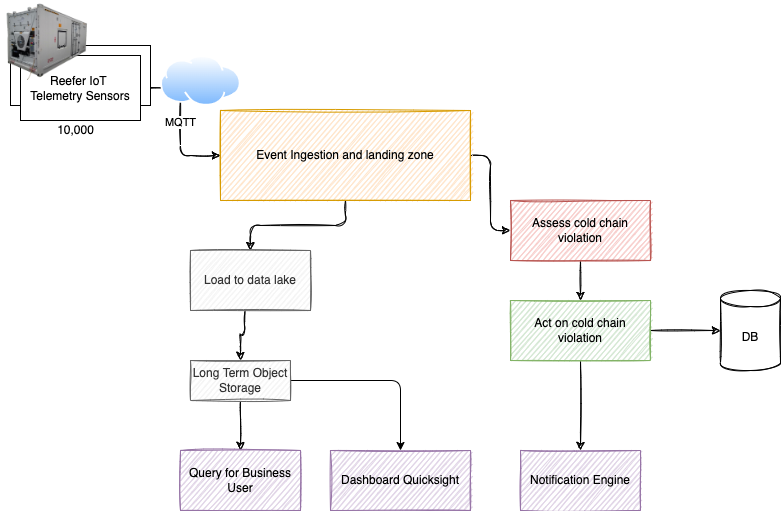
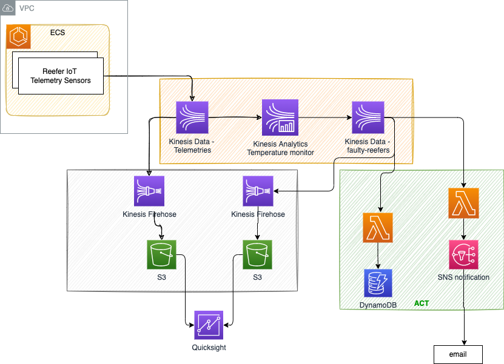

# Build a Serverless Real-Time Data Processing App

From [this hands-on lab](https://aws.amazon.com/getting-started/hands-on/build-serverless-real-time-data-processing-app-lambda-kinesis-s3-dynamodb-cognito-athena/)

Some changes from the lab itself.


## Another Demo

### Functional architecture

* We have 10000 refrigerator containers in the field, which send sensor telemetry messages using MQTT over HTTPS to a data ingestion and real-time event backbone as landing zone. This layer keeps data for 7 days, so on the left side we are moving records to Data Lake



* From Data lake data engineers and data scientists will query data at rest, encrypted, and even build dashboards
* On the right side we have the cold chain monitor component, and the best action processing in case there is a refrigeration container or reefer with problem.
* As part of the action processing we can notify a field engineer to work on container, persist data in a DB for triggering a downstream business process


### Hands-on architecture

* Now on the scope of the demonstration we build for you, using AWS managed services, this is the architecture we are proposing



* We do not have refrigerator at our hand so we get the data structure from your engineers, and develop a small simulator to send records to the data ingestion layer.
* The AWS Kinesis Data Stream is the service to manage pub/sub processing from streams (like a  topic). we have telemetries and faulty-reefers 
* The stateful logic processing  is done inside Kinesis analytics: The logic is to consume messages from data stream, process them with time window constraint and logic then write messages to the faulty-reefers data stream 
* On the right side we have the act part, where you can have different consumers which are getting message asynchronously to process the faulty message
* For data lake, Firehose is the service to do data movement and transformation, like ETL. The target is distributed storage, called S3. The persistence looks like a file system folder, and is named bucker.
* For dashboard we use QuickSight

[Kinesis SDK for python](https://github.com/awsdocs/aws-doc-sdk-examples/tree/main/python/example_code/kinesis#code-examples)

### Create Kinesis Elements

#### Data Streams


#### Streams Analytics 

```sql
CREATE OR REPLACE PUMP "STREAM_PUMP" AS
  INSERT INTO "FAULTY_REEFERS"
  SELECT STREAM "container_id","measurement_time","product_id", "temperature","kilowatts","oxygen_level","carbon_dioxide_level","fan_1","latitude","longitude",
 TUMBLE_START(ts, INTERVAL '1' MINUTE) as window_start,
 TUMBLE_STOP(ts, INTERVAL '1' MINUTE) as window_stop,
COUNT(temperature)
FROM "SOURCE_SQL_STREAM_001"
GROUP BY TUMBLE(ts, INTERVAL '1' MINUTE), temperature
    WHERE "temperature" > 18; 
```

