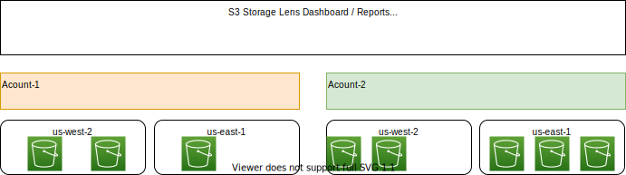
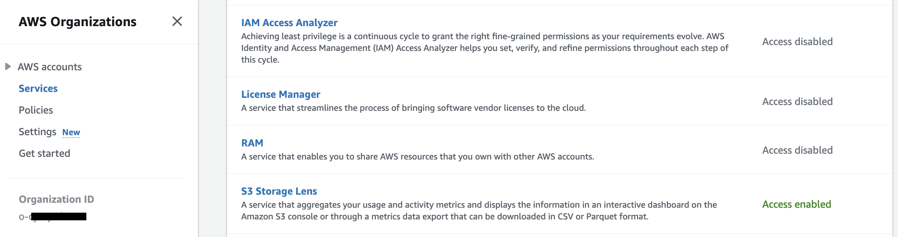
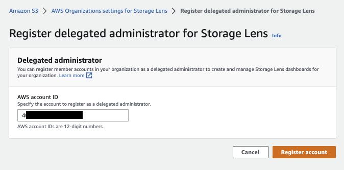
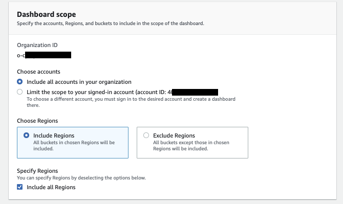
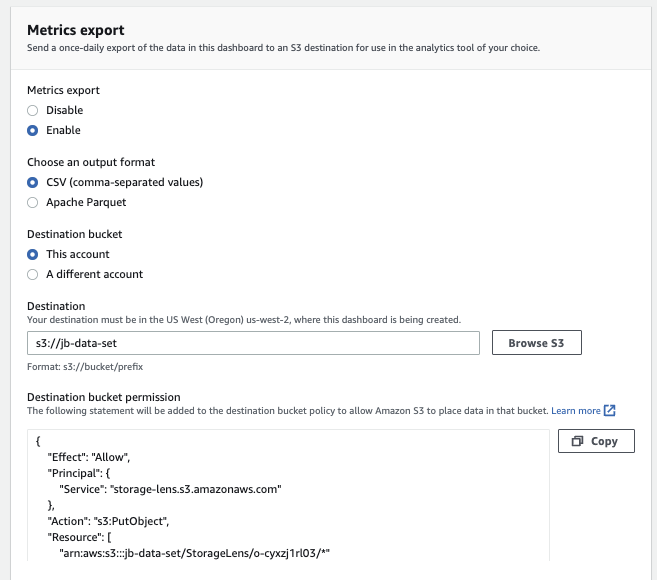
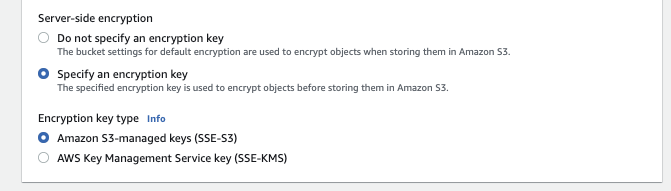
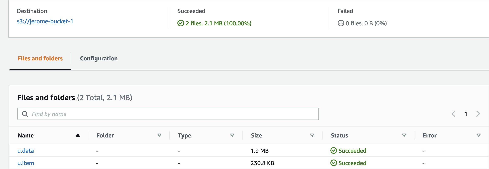
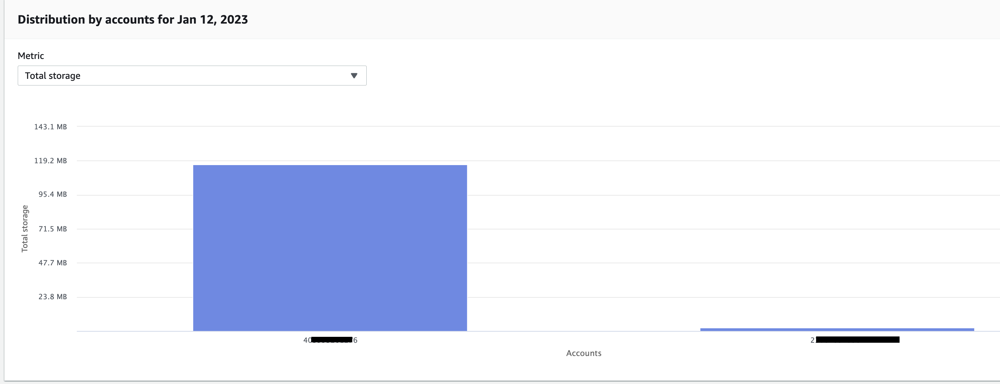
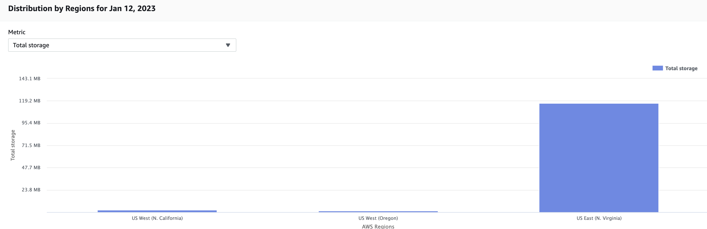

# S3 storage aggregation with S3 Storage Lens and AWS Organization

!!! Info
    Created 1/11/2023 - Updated 1/18/23


The goal of this lab is to demonstrate the single view in S3 Storage Lens of S3 bucket usages created in multiple regions, in multiple accounts.


## Requirements

* Get one AWS Organization to centralize 2 child AWS accounts.
* Get S3 buckets for the 2 accounts each in 2 regions.

    

* Create a Storage Lens dashboard to see consolidated metrics.

## AWS Organizations

AWS Organizations is an AWS managed service that helps us aggregate all of our AWS accounts under one organization hierarchy.

* Invite or add an account from AWS Organization.

    

* Enable trusted access from S3 Storage Lens to Organization, to aggregate storage metrics and usage data for all member accounts in our organization.

    

## S3 Storage Lens

A service that aggregates our usage and activity metrics and displays the information in an interactive dashboard on the Amazon S3 console or through a metrics data export that can be downloaded in CSV or Parquet format.


* [Optional] Add an accountID to be S3 Storage Lens administrator:

    

* Create a S3 Storage Lens dashboard, using an home region to keep dashboard's states:

    

    Metrics are updated daily.

* Still in the same web entry form, we should see the organization linked to the service, and select include all accounts and all regions:

    

* We can select metrics and define new metrics, here we use the free ones:

    

    Metrics will help to find out how much storage we have across the entire organization. Which are the fastest-growing buckets and prefixes...   

    We can specify advanced metrics to get prefix-level aggregation. Free metrics are available for queries for a 14-day period, and advanced metrics are available for queries for a 15-month period.

* We export metrics generated every day, in CSV or Parquet format, and save result in the parent account's s3 bucket:

    

* Finally the data should be encrypted at rest, so using S3 managed keys will be the default:

    

The dashboard is created and will get data in the next 24h to 48h.

Lens pricing can be found in the Management and Analytics tab in [S3 pricing page.](https://aws.amazon.com/s3/pricing/)

## Add files in buckets

* Account 1: add buckets in regions us-west-2 and us-east-1

```sh
aws w3 cp ... s3://jb-data-set/
```

* Account 2: add buckets in regions us-west-2 

    

* The results are reported in the Storage Lens dashboard, with a view per account (the aggregation is done during a time period we selected):

    

    or per region:

    

## Resources

* [S3 Storage Lens user guide](https://docs.aws.amazon.com/AmazonS3/latest/userguide/storage_lens_basics_metrics_recommendations.html)