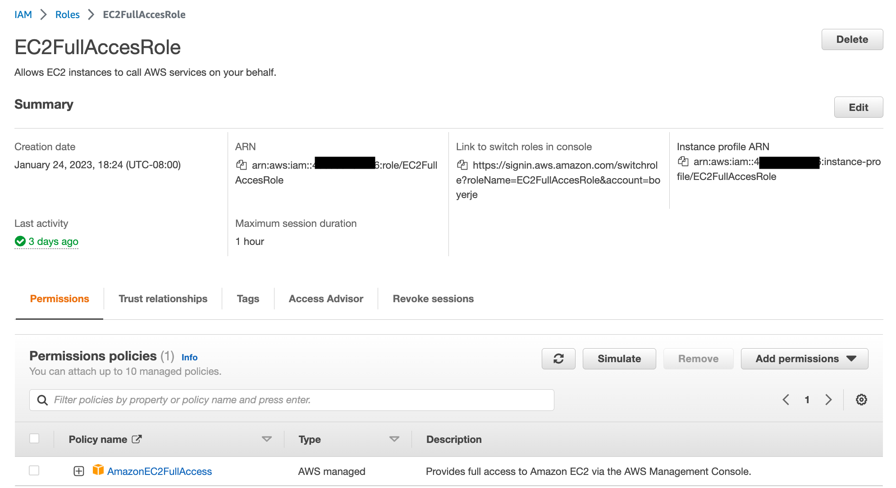

# Security Demonstrations

The security demonstrations are aimed to get hands-on experience around:

* Basic [IAM role and user authorization](#iam-role-to-trust-a-user-to-access-aws-service-like-ec2)
* Evaluating [cross-account access management](#cross-accounts-authorization)
* Integrating with third-party identity providers
* Deploying encryption strategies for data at rest and data in transit
* Developing a strategy for centralized security event notifications and auditing

## Defined users and groups with IAM

See [summary on IAM](../../infra/security.md#iam-identity-and-access-management), better to define user and do not use root user. User can be created using CloudFormation or CDK. See 
[cdk samples](../../coding/cdk.md#some-how-to) and [the repository to demonstrate remote service access from k8s.](https://github.com/jbcodeforce/aws-remote-svc-access-from-k8s/tree/main/cdk).

## IAM Role to trust a user to access AWS Service like EC2

A user has no access to any of AWS services, but can login to the AWS console. The demo aims to show how to add an IAM role, trusting an IAM user, and defining a policy to get full access to EC2 service.  When user switches to the new role in the AWS console, the security context changes.

### Manual demonstration

1. Create an IAM user (named Julie)
1. Create a user in IAM: authorize access to the AWS console, with custom password, and no other permissions.

    { width=700 }

1. Add a role named `EC2FullAccessRole`, with a trusted relationship, with the created user as principal: `iam:user...`:

    ```json
    {
        "Version": "2012-10-17",
        "Statement": [
            {
                "Effect": "Allow",
                "Principal": {
                    "AWS": "arn:aws:iam::4....:user/Julie"
                },
                "Action": "sts:AssumeRole"
            }
        ]
    }
    ```

    Add the `permission` for the user to get EC2 full access via the managed policy: AmazonEC2FullAccess

    { width=700 }

    So now the user will be able to assume the role.

1. Login in a private web browser session, using IAM user option on the AWS account the user belongs to, and the newly created user.

    { width=700 }

1. Go to the EC2 service, we should get API errors like below:

    { width=700 }

1. Switch Role from the AWS console, user top right menu, and select the role:

    { width=700 }

1. Should now see the EC2 console without any error.

    { width=700 }

### Using CDK to create users and policies

The cdk in [labs/cdk/iam-user](https://github.com/jbcodeforce/aws-studies/tree/main/labs/cdk/iam-user) creates the Julie user, role, the EC2 permission policy, then we can use the same step as above to login to the console and assume the role

???- "How it was built"
    * Jumpstart the cdk

    ```sh
    cdk init sample-app --language python
    ```

    * Modify the iam_user_stack.py by adding a user, a role, and attach amazon policy.
    ```python
     user = iam.User(self,
                        "Julie",
                        user_name="Julie",
                        password=SecretValue.unsafe_plain_text("Passw0rd!")
                        )

        role = iam.Role(self,"EC2FullAccess",
                        role_name="EC2FullAccess",
                        description="A role to allow user to do EC2 work",
                        assumed_by=user,
                        managed_policies=[iam.ManagedPolicy.from_aws_managed_policy_name("AmazonEC2FullAccess")])
    ```
    
    * `cdk synth` and `cdk deploy`
    * Execute the same demo to login Julie user and access to EC2.

## [IAM tutorials](https://docs.aws.amazon.com/IAM/latest/UserGuide/tutorials.html)

The second tutorial is to create a role to establish trust with another account and define what actions trusted entities can take. Then, modify a user group policy to control which IAM users can access the role. As a result, developers from the Development account can make updates to the productionapp bucket in the Production account by using temporary credentials.

The [attribute based access control](https://docs.aws.amazon.com/IAM/latest/UserGuide/tutorial_attribute-based-access-control.html) uses tags to control access to resources for 2 projects, using different groups of user (dev, qas). See the [labs/security/iam folder](https://github.com/jbcodeforce/aws-studies/tree/main/labs/security/iam/abqc) for cdk to do the tutorial.

## Cross Accounts authorization

This is a common use case, where a main account A can read DynamoDB table and put message to SQS queue in a second account B, the owner of the queue.

* Create a second account. It has console access using AdministratorAccess policy
* Create a SQS and define an Amazon SQS policy that specifies both accounts as Principal

    ```json
    "Effect": "Allow",
      "Principal": {
        "AWS": [
          "arn:aws:iam::<account_id_owner_queue>:root",
          "arn:aws:iam::<account_id_client_queue>:root"
        ]
      },
      "Action": "SQS:*",
      "Resource": "arn:aws:sqs:us-west-2:<account_id_owner_queue>:MyQueue"
    }
    ```

* Test to send and receive message from the owner account
* Login to the client account (via STS token while using from a remote computer/laptop)
* Specify the SQS client to use queue and id of the specified account

    ```python
    sqs = boto3.resource('sqs')
    queue = sqs.get_queue_by_name(QueueName='MyQueue',QueueOwnerAWSAccountId="account_id_owner_queue")
    response = queue.send_message(MessageBody='Hello from client app')
    ```

* Use the AWS console, SQS console to look at the messages

## Other samples

* [AWS Organizations playground](https://github.com/jbcodeforce/aws-organization-play): a repo to play with cross accounts access control using Organizations.