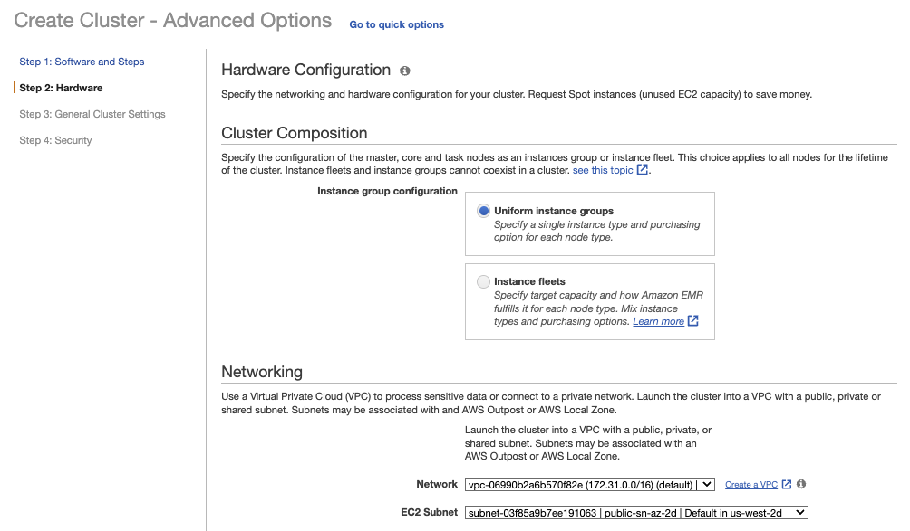
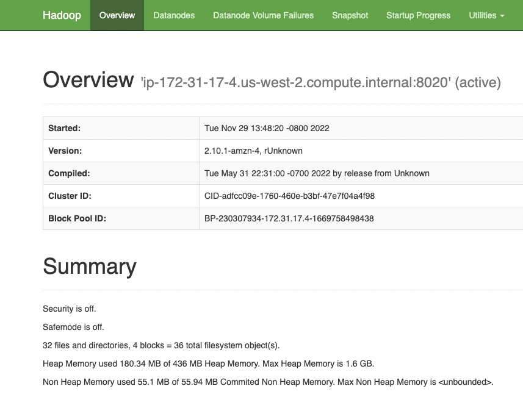
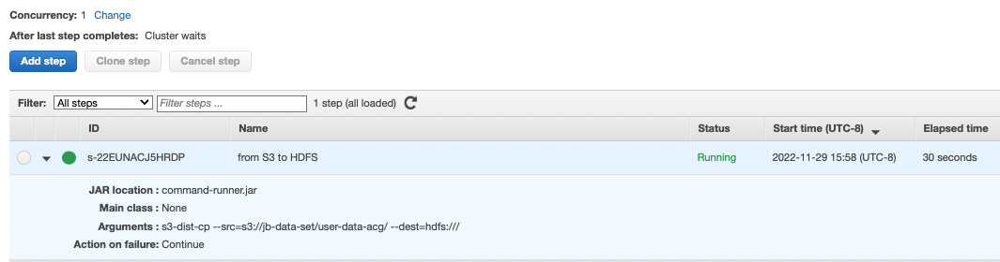

# Data analytics with Spark and EMR

## EMR Serverless demo: product recommendations

Sources are in `labs/analytics/emr-serverless-demo`. 

???- "Summary of the demonstration steps"
    1. Create S3 bucket and upload `dataset_en_dev.json` and `reviews.py` files.
    1. Define IAM policy, named `EMRServerlessS3AndGlueAccessPolicy`, used by EMR using the content of `EMRServerlessS3AndGlueAccessPolicy.txt`
    1. Create IAM role, named `emrserverlessrole`, using Custom trust policy, and the content of `EMR Serverless Trust policy.txt` which let this role to assume role on the `emr-serverless.amazonaws.com` principal
    1. Access EMR Studio as to create an Amazon EMR Serverless application, we need an EMR Studio.
    1. Create an application `ProductRecommendation`, use default spark settings.
    1. Submit a job: 
        
    1. After the run status is complete, go to S3 bucket output folder to review the results.
    1. Clean up: Delete the EMR application in EMR Studio, delete S3 bucket content 

## Product recommendation with EMR-EC2 cluster

Sources are in `labs/analytics/emr-ec2-demo` and the dataset in `labs/analytics/emr-serverless-demo`.

???- "Summary of the demonstration steps"
    1. Create VPC with 1 public subnet with no  NAT gtw and no private subnet
    1. Create S3 bucket and input folder, upload `dataset_en_dev.json` file
    1. Create IAM role, named `EMRstudio` with AWS service as trusted entity, and in User cases for other service, select EMR.
    1. Add to the created role, a permission to read from the Amazon S3 bucket, select to attach S3FullAccess for this demo.
    1. Add permission to create EMRStudio and EMR clusters, using create inline policy and use `Studio_inlinepolicy.txt` which allow action on EC2, EMR...
    1. Modify the Trust relationships of the EMRstudio role with the content of `Trustpolicy.txt` file, modify the region and accountID.
    1. Create EMR cluster with the VPC and subnet, role created before and with the custom packages as:

        
    
    1. Create an instance of EMR Studio
    
         

    1. Create a Workspace in EMR Studio to link to the EMR cluster.

        
    1. Upload the `labs/analytics/emr-ec2-demo/reviews.ipynb` using the Upload arrow icon on the left of EMR notebook UI. Update the paths to the S3 bucket, then wait to get the kernel ready and execute all cells. The process creates parquet files in the `output/analyze` folder in s3.

        

## Gender - Age Analytics

This is based on the tutorial from A Cloud Guru on Data Analytics with Spark and EMR, with some new adaptations.  

???+ "The problem statement"

    The marketing department has personal information in thousand of CSV files and wants to run analytics by counting the gender per age groups...

    * Hundred of CSV files are in S3 bucket. Using `s3-dist-cp` to move them into the EMR cluster.
    * Use EMR to run Spark job.
    * Define Spark processing in python to read all CSV files from HDFS then group records by age and gender then count records and order the results in descending mode. Result in HDFS.
    * Copy result back to S3.

!!! Error
    11/29 Still issue in S3 to HDFS step

???- "Detailed steps"
    1. Create a EMR cluster last version (6.9) with Spark runtime 3.3, Hadoop, Hue, Hive and Pig

        

    1. Do not change the networking or cluster config...

        

    1. Change the EC2 to `m4.large`, if it is available within the AWS Region you selected and use only one instance for the core node:

        

    1. Set a cluster name:

        

    1. Do not use key pair as we do not need to SSH on core node

        


    1. Once the cluster is started, get the URL of the HDFS Name Node console and keep note of the associated port number

        

    1. Update the `Security Groups for Master `: 

        

        to authorize access to the port number from anywhere 0.0.0.0/0. Be sure to use `Custom TCP` protocol for the Inbound rule:

        

    1. Open the `HDFS Name Node` URL in a web browser to get visibility into the files in our Hadoop cluster.

        

    1. Upload data files (folder upload) to S3 bucket. (The data files are in user-data-acg.zip)
    1. Use `s3-dist-cp` as a Step (type: Custom jar) to copy data from S3 to HDFS. (This command is defined in `command-runner.jar`).

        

        Here is the arguments to use:

        ```sh
        s3-dist-cp --src=s3://jb-data-set/user-data-acg/ --dest=hdfs:///
        ```

        Running the task...

        

    1. Create a Step to run the python code
    1. Create a S3 bucket as target for the output: `s3://jb-data-set/gender-age-output`
    1. Define a new Step with s3-disp-cp from HDFS to S3. 

        ```sh
        s3-dist-cp --src=hdfs:///results --dest= s3://jb-data-set/gender-age-output
        ```


spark-summit hdfs://pyspark-script/gender-age-count.py

s3://emr-scripts-403993201276/scripts/gender-age-count.py 

### AWS CLI based deployment

Under the labs/analytics/ folder.

* Create the EMR cluster with Spark, Hadoop and Hive (version 6.9)

    ```sh
    ./emr-starting/create-cluster.sh
    ```

* Under `gender-age/data` folder unzip the `user-data-acg.zip` then upload the `user-data-acg` folder to a s3 bucket
* Upload data to s3 bucket

    ```sh
    aws s3 cp gender-age/data/user-data-acg s3://jb-data-set/
    ```

* Deploy the S3 to HDFS step

    ```sh
    cd gender-age
    ./s3-to-hdfs.sh
    ```
    
* Start the python
* Copy the HDFS result to S3

### Clean up

* Delete cluster: `./emr-starting/delete-cluster.sh`
* Delete S3 bucket content and buckets
* Remove `emr` roles in IAM
