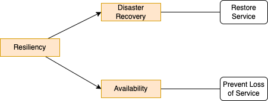

# Resiliency

Resiliency is the ability of a workload to recover from infrastructure or service disruptions, dynamically acquire computing resources to meet demand, and mitigate disruptions, such as misconfigurations or transient network issues.  It addresses **DR** (restore service) and **Availability** (prevent loss of service).

Apply the sharing responsibility of resiliency: AWS for resiliency **of** the cloud: infrastructure. Customer responsible for resiliency **in** the cloud: adopting instance deployment across multiple locations, support self-healing, design for resilience.

### Assessing resiliency needs

* Start by looking at business impact: assess cost of downtime? business metrics used to measure impact? and existing metrics and tools to compute outage impact. 70% of CIO wants to be resilient, 80% have nothing in place, and most has no real metrics.
* Assess what is the current method to detect downtime, and the definition of downtime. Moving to a standby region cost time and effort, getting a clear assessment of what downtime means is very important before triggering the failover. Is it latency? is it missing orders?
* Get an application inventory by category of criticality, including compliance requirements
* What is the process in place to alert human for downtime?
* What are the current observalbiltiy practice?
* What is the recovery strategy?

[Operational Readiness Review (ORR)](https://docs.aws.amazon.com/wellarchitecttandted/latest/operational-readiness-reviews/wa-operational-readiness-reviews.html) has questions and tools to help understand current state, assess risks, and presents best practices to create highly available, resilient systems. 

## Disaster recovery

DR is about business continuity. Review the core principles of DR in [this note](https://jbcodeforce.github.io/architecture/DR/) and then the [AWS options whitepaper](https://docs.aws.amazon.com/whitepapers/latest/disaster-recovery-workloads-on-aws/disaster-recovery-options-in-the-cloud.html). Recalls the important recovery metrics of RTO and RPO, while for availability we measure mean over time (99.99%), and the assessment of the [acceptable recovery cost](http://jbcodeforce.github.io/architecture/DR/#different-implementations-at-different-costs) to select the best solution possible.

DR in the cloud, AZ is the equivalent of data center for on-premises deployment, also users are responsible for backups and need to assess the Multi-region deployment. The DR site does not need to have the same capacity at first to run back the business. Most of the serverless platform supports HA and elastic scaling.

### Region, AZ

* Region and AZs are the building blocks to support HA and DR in the cloud. With very low latency network between AZs we can do in-synch replicas.
* Non-AZ affinity: a write operation can cross AZs and with data replications, it can make a lot of hops.
* AZ-affinity helps to reduce the number of hops, but it enforces using NLB and not ALB.

### Strategies for DR

* **Backup/restore** is for lower priority workload, cost less, and provision cloud resources after the event. RTO/RPO in hours
* **Pilot Light**: Data is live but services are idle. Provision some resource and scale after event. RPO/RTO on 10s of minutes
* **Warm standby**: The DR site is always running but smaller scale. Resources will scale after the event. RPO/RTO at the minutes level.
* **Multi-site active/active**: Zero downtime, near zero data loss. This is really for mission critical services. 

### Route 53 ARC

See [dedicated note on Route 53 ARC](../infra/route53.md/#route-53-arc) to support resiliency.

### [Elastic Disaster Recovery](https://docs.aws.amazon.com/drs/latest/userguide/what-is-drs.html)

Helps to support application DR from on-premises to AWS or cloud based apps. It uses a Replication agent on source server to replicate data to AWS region and account.

It supports testing non-disruptive recovery and failback drills, replications monitoring.

## High Availability

It is not DR. Here is a classical AWS deployment for HA, where Apps running on EC2, ELB, Database are deployed in 3 AZs.

S3 and DynamoDB are also deployed in AWS AZs outside of the customer's VPC.

Availability is measured as:

)

It cannot be better than it's least available dependency.

Spare components improves availability. Multi-AZ deployment improve availability.

### Measuring availability

Metrics to consider:

* Mean time between failure MTBF, try to increase it
* Mean time to detection MTTD
* Mean time to repair MTTR

* Consider server-side and client-side request success rate. Define what unit of work to be used: HTTP request, message in queue, async job.
* Define downtime, for example, drop below 95% availabiltiy for any API during a 5 minutes window.

**Use CW embedded metric format EMF to combine logs and metrics**

### Latency

Latency impacts availability. Analyze histograms for latency distribution trends. Use percentiles and trimmed man to measure latency.

## Resiliency Patterns

Need to see it from the client or/and server side:

* Client side, use circuit braker, retries with jitter, multiplexing connection with new protocol like HTTP/3, gRPC
* Server side, apply caching strategy, cache-aside is more resilient, inline cache, like DynamoDB DAX, may be a single point of failure. 

## Fault isolation concepts

* Control plane is a complex orchestration with many dependencies so is more difficult to make it resilient. But the lower level of APIs makes it less risky. Still they will fail more often. Latency is not a strong requirement, 100s ms.
* Do not rely on Auto Scaling Group for EC2 in case of AZ failure, but plan for overcapacity to support the load after AZ failure.
* Examples of control plan and data plane:

    | Service | Control plane | Data plane |
    | --- | --- | --- |
    | Amazon S3 | create bucket, put bucket policy | GetObject, PutObject |
    | DynamoDB | Create table, update table | GetItem ... |
    | ELB | CreateLoadBalancer, CreateTargetGroup | The load balancer itself |
    | EKS | CreateCluster, PodScheduling, scale worker nodes | worker node, pod |
    | Route 53 | CreateHostedZone ... | DNS resolution, health checks |
    | IAM | CreateRole | Authn, Authz |
    | RDS | Create DB instance | The data base |

* Static stability: system still running even dependencies fail without the need to make changes. Use the following approaches: prevent circular dependencies, pre-provision capacity, maintain existing state, eliminate synchronous interaction.
* One way AWS achieve static statbility is by removing control plane deplendencis from the data plane in AWS services. 
* Relying on data plane operations for recovery can help make the system more staticall stable, this may include pre-provisioning resources, or relying on data plane operations.

## AWS Partitions

AWS Partitions are isolated infrastructure and services. It include**s *commercial partition*, *China* , and *GovCloud*. Within a partition there are regions. There is no cross IAM definition sharing.

| Type | Service | Planes |
| --- | --- | --- | 
| Zonal  | RDS, EC2, EBS | Control plane is regional while data plane is zonal |
| Regional | S3, SQS, DynamoDB | Control plane  and data plane are regional |
| Global | CloudFront, Global accelerator, Route 53, IAM |  Control plane is single region  and data plane is global |

There are three categories of global services: partitional, Edge and globally-scoped operations.
Global services have a single control plane and a distributed, highly available data plane.
Avoid control plane dependencies in global services in the recovery path, implement static stability.

## [Cell-based architecture](https://aws.amazon.com/solutions/guidance/cell-based-architecture-on-aws/?did=sl_card&trk=sl_card) and shuffle sharding

Goal is to reduce the blast-radius. Use the concept of `Cell` which is a construct to isolate compute, routing, and storage (workload). Cells are not AZs but cross AZs. Cell shares nothing with each other. Cell can scale-up and out. Cell have a maximum size.

It is not fitting for all type of workloads.

API Gateway uses this Cell-based architecture.

Some e-commerce fullfilment delivery centers use cell-based architecture.

Considerations to address:

* Cell size
* Router robustness
* Partitioning dimension
* Cross-cell use cases
* Cell migration
* Alignment to AZs and Regions

Shards is another construct to isolate blast radius, but not at the level of resources.  Any serverless services is using the concept of shuffle sharding.

## Multi-AZ patterns: AZ gray failure

* System follows differential observability. 
* Different perspective: system versus application

Detection tools:

* cloudwatch insights. 

## Sources

* [DR of workloads on AWS video.](https://www.youtube.com/watch?v=cJZw5mrxryA)