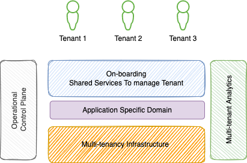
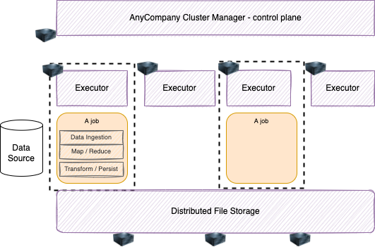
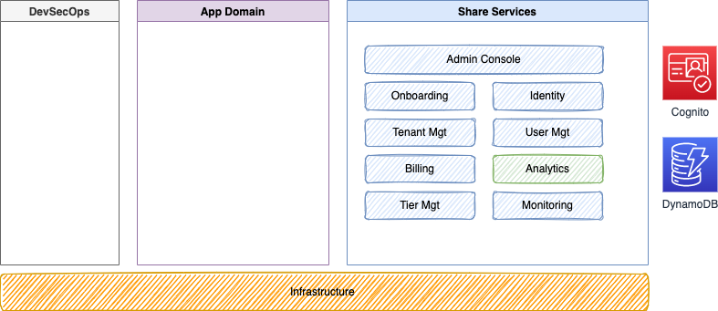
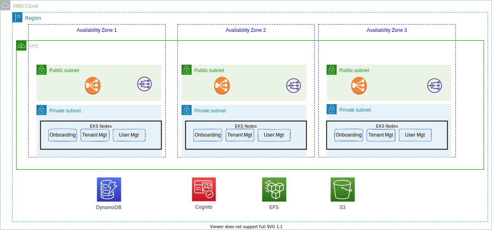
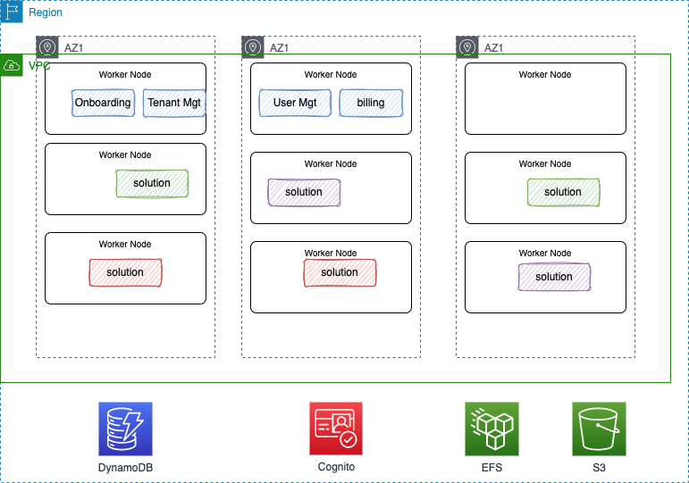
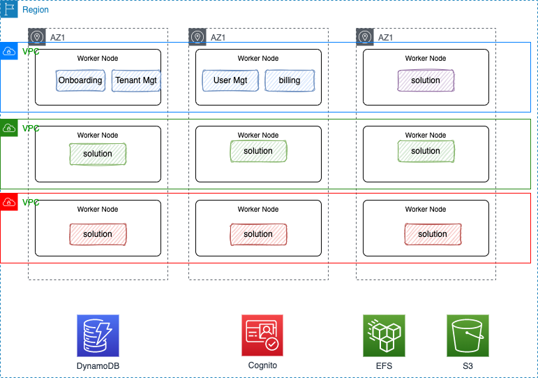
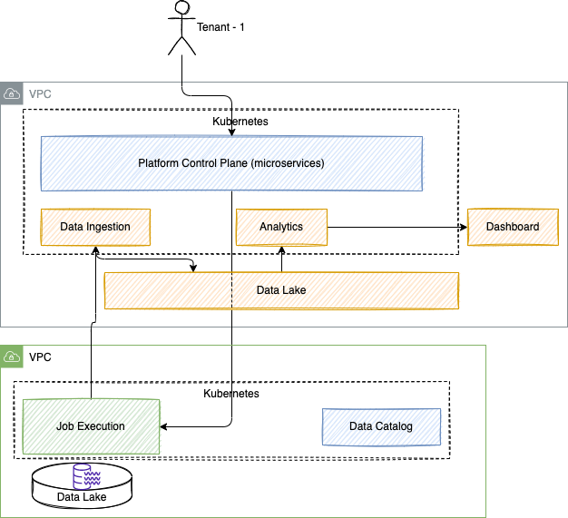
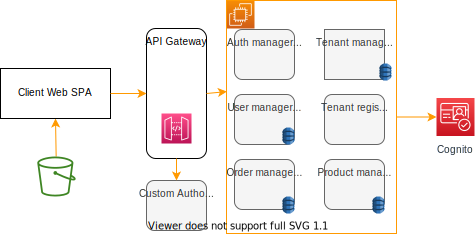
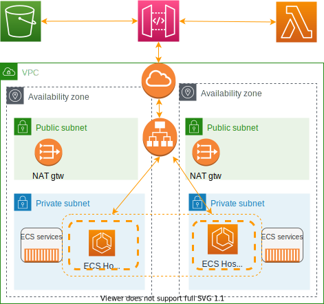
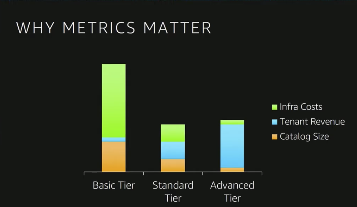

# Software as a Service

A licensing and delivery model whereby software is centrally managed and hosted by a provider and available to customers on a subsciption fee, or pay-per-user basis, or pay per usage basis.

## Concepts

Everything done in SaaS is about multi-tenancy, data isolation and sharing resources like compute, networking and storage as part of the infrastructure to optimize cost of running the business. 

{ width=500 }

**Figure 1**

As illustrated in the figure above an *onboarding / shared service component* is needed to manage the multi-tenant platform. Any software vendor is bringing their own solution and it is highlighted as application specific domain. As an example, if we take a big data platform provider such application domain may look like in the following architecture diagram, which supports a map/reduce job execution environment with data ingestion, transformation and persistence:

**Figure 2**

A control plane manages cluster of worker nodes. Each worker node runs an executor that executes jobs. Jobs are the custom piece of code in Python, Scala, Java which performs the data ingestion, data transformation & enrichment, MAP/Reduce logic and persists the results to distributed storage.

Footprint scales dynamically based on aggregate load of all tenants. All tenants are managed via a single operational control plane or lens.

The Analytic component is very important to help marketing team to understand how the customers are using the platform, and how to optimize the usage of the platform.

For the application domain, new features are deployed to all tenants, more quickly via DevOps practices. 

### Multi tenancy support approaches

There are multiple patterns for multi-tenancy, some linked to business requirements and sometime to technical reasons: 

**Figure 3**

* **Silo**: Each tenant gets unique set of infrastructure resources. As environments are partitioned, there is no cross-tenant impacts. Agility is compromised. Needed for strong regulatory and compliance. We can tune the configuration per tenant and get specific SLAs. It costs more and operations are more complex. The analytics services need to aggregate from those silos. Tenant may be mapped to AWS Account and a linked account to aggregate billing. Or based in VPC.
* **Pool**: Shared resources, centralized management, simplified deployment. Compliance is a challenge and cross-tenant impacts with a all or nothing availability. The advantages are cost optimization and operation. 
* **Bridge**: A mix of silo and pool. Can be applied to the different level of the solution architecture, for example, web and data tier can be pool, and app layer in silo.

It is important to decide what approach the SaaS architecture needs to support.

## Needs

Agility is the major requirements to go to SaaS, which means:

* On-boarding without friction: including environment provisioning.
* Frequent feature release: get to customer's hands as quick as possible. Release on daily frequency should be possible.
* Rapid market response, to pivot to a new direction.
* Instant customer feedback: with metrics on feature adoption.

The important metrics to consider:

* Usage, consumption, system/tenant health.
* Survey and customer satisfaction.
* Engagement data.

## Architecture Landscape

There are a set of shared services that we will find in any SaaS solution which supports the high level view introduced in figure 1. Those services are:

* **Admin Console**: SaaS provider administrative application. It may include a landing web app to get tenant registering. The administration services are supporting the SaaS business. 
* **On-Boarding**: Complex solution to provision all the environment.
* **Identity**: Identity is a very important element of SaaS. Connect users to tenant.
* **Tenant management**: As a multi-tenancy platform, `tenant` is a main business entity.
* **User management**: Each tenant has one to many users of the vendor software.
* **Metering and billing**: How to get tenant metrics and how to isolate billing.
* **Analytics**: Service responsible to gather usage metrics, and drive new use case of cost optimization, customer churn assessment...
* **Monitoring and infrastructure management:** For integrating into the cloud provider and manage compute, storage, networking resources.

The figure below illustrates the integration of those services within the landscape:

**Figure 4**

_Amazon Cognito is used as an OpenID identity provider_.

The app domain is the specific ISV solution. DevSecOps is to support devOps practices and security validation. 

The shared services can be developed using a serverless / container approach or using AMI images for EC2 instances. We will adopt a container approach so we can more quickly adapt those service runtime execution according to the demand, and deploy them on Kubernetes cluster.

The shared services deployment on EKS will look like in the following diagram within the VPC of the software vendor (not all services are presented):

**Figure 5**

Some of those services will use AWS managed services like DynamoDB to persist tenant and user data, Cognito for authentication to their platform, EFS for sharing file, S3...

The figure above demonstrates that the control-plane services are replicated into different availability zone, inside of the same EKS cluster.

Bridge or Pool runs in the SaaS vendor VPC, and Web and App tiers are shared and persist data in same DB (may be different schema or a dedicated tenantID column in tables). 

Now on the SaaS provider's customer side we may use kubernetes namespace to deliver tenant isolation. The SaaS control plane runs and the customers own use of the solution runs in the same k8s cluster. Dedicated worker nodes can be used. In the figure 6, the ISV solution is instantiated as pods in different namespaces (gree, purple, red colors) for each tenant. The control plane, shared services run in the same cluster. All the solution is managed inside of this unique k8s cluster. 

**Figure 6**

Silo Isolation model may be achieve with VPC per tenant. Therefore the supporting approach will be to deploy the solution in dedicated EKS cluster in the customers VPC.

**Figure 7**

Registering a tenant generates Terraform scripts to create the needed infrastructure and deploy the needed components to support one of the tenant isolation selected. The type of isolation can also being related to the tenant profile. Gold being on its own cluster for example. 

Coming back to the big-data processing platform example, we also need to consider **data and storage partitioning**, how to isolate data for each tenant. Long term persistence of object can be done in S3, now buckets can be defined in the VPC of the SaaS provider or in the customer's VPC. All the metadata about customer's interactions with the platform, the jaob execution can be ingected back to the ISV platform and then analytics can be used to do product and features usage assessment.

As mentioned before the solution could also being deployed on EC2s which may looks like:

{ width=600 }

Which maps to the following provisionned environment with classical HA deployment within a region / VPC, two AZs, private and public subnets and gateway & application load balancer. 

{ width=600 }

IAM roles and policies are used to support isolation. 
 

IAM policies should help isolating some resources in AWS services like S3 bucket or dynamoDB tables, while other like queues can be shared. 

## Operations

For SaaS, we need to focusing on monitoring the environments and applications health, and sometime at the tenant level (tenant experience). May be considering the following dashboard elements:

* Most active tenants.
* Tenant resources consumption.
* Feature / services usage.

* *consumption* is for resource usages, more an internal metric. % of resource used by a tenant. 
* *metering* is a billing construct: # of users, product features usage,... 

Those numbers are very important to get how the revenue are coming from and the cost too. The figure below illustrates a classical e-commerce market place use case where basic tier customers are using a lot of resources and do not generate a lot of revenue, as they are trying product features and no more, while advanced tier better target their usage and own sell operation and therefore are generating bigger revenue. 

What to measure when focusing on consumption? request count, execution time (latency of a function), CPU impact, Memory impact?

## Deeper dive

The content on this note comes from:

* [Saas at AWS](https://aws.amazon.com/solutions/saas/#)
* [Tod Golding form AWS SaaS factory: Deconstructing SaaS: A Deep Dive into Building Multi-tenant Solu](https://www.youtube.com/watch?v=kmVUbngCyOw) has the diagrams above plus a deep discussion on how to secure and support tenants to access pooled resources like content in DynamoDB. (Need further study).
* [Serverless SaaS documentation](https://docs.aws.amazon.com/wellarchitected/latest/saas-lens/serverless-saas.html)
* [DevCon 2022: Building a customizable, multi-tenant serverless orchestration framework for bulk-data ingestion](https://broadcast.amazon.com/videos/611469?ref=home&src=featured-playlist).
* [SaaS youtube playlist](https://www.youtube.com/playlist?list=PLKnVwO5e7SXQ3K4pFnF66AlZ-ljLAIxHB).
* [SaaS head start, using ready-made solutions to accelerate adoption](https://www.youtube.com/watch?v=DggGqg4L9Y4).
* [Open source project - SaaS Boost](https://aws.amazon.com/partners/saas-boost/) with the corresponding [AWS SaaS boost git repo](https://github.com/awslabs/aws-saas-boost).
* [AWS SaaS factory reference architecture git repo](https://github.com/aws-samples/aws-saas-factory-eks-reference-architecture)
* [Aug 2021 blog: Building a Multi-Tenant SaaS Solution Using AWS Serverless Services](https://aws.amazon.com/blogs/apn/building-a-multi-tenant-saas-solution-using-aws-serverless-services/)