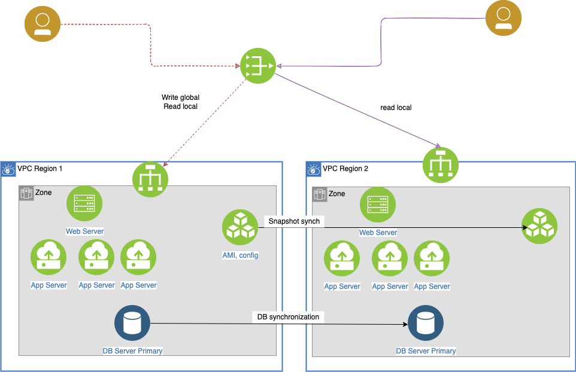

# Solution design fun with AWS services

This section presents examples of solution designw using AWS services, with links to external demonstrations when available.

## Migration

### Migrate an old not maintained app

* When application use custom OS configurations use Application Migration Service.
* Replatform existing database server to Amazon RDS. AWS Database Migration Service gives the ability to convert DB to a supported RDS engine such as MySQL. AWS Schema Conversion Tool supports the schema conversion to Amazon RDS.


## Networking

### Hybrid integration with 2 AWS regions


## Security

### Use Identity Center user to perform AWS CLI

* Create an identity center in one region, and add users
* Create IAM service role, for CodeDeploy, for each target compute environment: for lambda uses `AWSCodeDeployRoleForLambda`. (See [this note for detail](https://docs.aws.amazon.com/codedeploy/latest/userguide/getting-started-create-service-role.html)).


### Blocking an IP address

There are multiple solutions to support blocking an IP@ or a range of IP@ depending of the deployment.

???- "Simplest using NACL"
    Define network inbound rule to deny a specific IP@ on all traffic types.

### Using identity federation

* Users are identified with corporate directory, or 3nd party identity provider.
* Users need to work on AWS resources, or with applications that access AWS resources
* Cognito is a first solution for mobile and web apps, as it supports 3nd party IdP compatible with OpenID Connect (OIDC). The AWS SDK is used to create an identities for the users so they can be authenticated. It support anonymous sign-ins.
* When existing on-premises uses SAML 2.0, we can create a trust between the AWS as service provider and the org as IdP. Use SAML to provide the users with federated single-sign on (SSO) to the AWS Management Console or federated access to call AWS API operations.
* Alternatively we can build a custom identity broker app, calling assumeRole or GetFederationToken to AWS STS to get temporary credentials (access key ID, a secret access key, and a session token). Apps can then use the temporary credentials to make calls to AWS directly.
* In a SAML federation scenario, the IdP is responsible for the authentication and coarse grained authorization of all AWS users. AWS is then able to leverage and consume these identity assertions according to a preestablished cryptographic trust.


For study or demonstration purposes, the identity store could be OpenLDAP the identity provider, [Shibboleth](https://shibboleth.atlassian.net/wiki/spaces/IDP4/overview). See [this workshop: A Self-Directed Journey to AWS Identity Federation Mastery - Open Source variant](https://identity-federation.awssecworkshops.com/opensource/). Once both are running on a server (like EC2), we can configure Shibboleth to offer authentication services for AWS using the `relying party` configuration.

* In a SAML federation, the Identity Provider can pass various attributes about the user, the authentication method, or other points of context to the service provider (in this case AWS) in the form of SAML attributes. In order for SAML federation for AWS to function properly, [several attributes](https://docs.aws.amazon.com/IAM/latest/UserGuide/id_roles_providers_create_saml_assertions.html) are required.
* The IdP is entirely responsible for authorizing which roles within AWS a given user can assume. The groups in LDAP are the source of truth. 
* The first attribute is the `Roles` attribute, which specifies combinations of AWS IAM Roles and authorizing AWS IAM Identity Providers that the user is authorized to assume. The mapping can be done from a `memberOf` attribute from LDAP which includes groups the user belong to. This information is mapped to a IAM Role ARN. The group name in LDAP needs to follow a naming convention, like: `AWS-Account Number-Role Name`.
* Apply **separation of duties**: users will have different roles in different accounts.
* The second AWS specific attribute is `RoleSessionName`. This attribute is recorded as part of the identity within CloudTrail to ensure that we can properly account for the federated user's actions. It is mapped from the LDAP `uid` of the user.
* Once IdP configuration is done, we need to configure AWS to trust the authentication and authorization information the IdP provides. We need the SAML metadata which details all of the encryption and signing certificates that IdP will use.

    

* Add IAM Roles in each AWS Account to match the groups define in LDAP, using SAML as trusted entity

    

* Add any security policy the role needs to be able to perform on AWS service.
* User authenticates using the IdP login page, once done, the user is redirected to AWS role chooser page (as a user may have multiple AWS IAM roles). Also for CLI, and `aws configure` will use the keys and token from the STS response which was authenticated by the SAML assertion returned by the IdP.
* Resource policy can auhorize federated users too. For example S3 resource policy may look like: Deny all s3 actions to the bucket, but only when the aws:userid is not the following list:

```json
    "Statement": [
      {
        "Sid": "AllowSpecificUsersAndInstances",
        "Effect": "Deny",
        "Principal": "*",
        "Action": "s3:*",
        "Resource": [
          "arn:aws:s3:::<YOUR_BUCKET_HERE>",
          "arn:aws:s3:::<YOUR_BUCKET_HERE>/*"
        ],
        "Condition": {
           "StringNotLike": {
              "aws:userid": [
                "<ROOT_ACCOUNT>",
                "<EC2RoleId:RoleSessionName>",
                "<FederationRoleId:RoleSessionName>"
              ]
    ...
```

## Stateless with persistence app

### How to change an EC2 instance type, while the host runs a webapp, without impacting client apps?

The simplest example is one EC2 with a Java based webapp deployed on it. Upgrading the EC2 instance type, brings the webapp down.


???- "The basic solution"
    Use Elastic IP address (public or private) so clients keep the IP @. (EC2> Elastic IP addresses> Allocate Elastic IP address). 

    Recall that we need to be able to SSH to the EC2 instance, to install language runtime, copy the tar of the app to the linux EC2 /home/users or somewhere else. Do not forget to use the .pem file downloaded when creating the EC2. `scp -i ec2host.pem ...`

???- "Cleaner solution"
    We should add a DNS domain and subdomain with Amazon Route 53 records, two ALBs, one per AZ, with Health Checks to Route 53, restricted security groups and public and private subnets, auto scaling group, and may be, use one reserved EC2 instance per AZ to reduce long term cost.

    

    For the backend/database solution use a HA service like Aurora or DynamoDB.

## Stateful app

Keep data (shopping cart) into session. We can use the stickiness on ELB and session affinity. Or use a user cookie, with the app verifying the cookie content. 

When we need to keep more data than what the cookie can save, then we keep the sessionID in the cookie and deploy an ElasticCache to store data with the key of sessionID.

Final transactional data can be persisted in RDS, and with RDS replication we can route specific traffic ("/products") which is read/only to the RDS Read replicas. Which can also being supported by having the product in the ElasticCache.


## Sharing images

There are multiple solutions for this problem depending of the requirements:

1. S3 with CloudFront for static content 
1. With EC2 and EFS:

    


## Disaster Recovery Solution

We try to address disaster and recovery for different needs, knowing that not all applications need active/active deployment.

### Backup multi-regions

The simplest resilience solution is to use backup and restore mechanism. Data and configuration can be moved to S3 in the second region. For even longer time we can use Glacier. Use database service to ensure HA at the zone level, and replicate data within AZ.


RPO will be average time between snapshots - and RTO at the day level.

### Warm region

For applications, where we want to limit out of services time, the approach is to replicate AMI images so app servers, in DR region, can be restarted quickly. And Database are replicated and warm on the second region. Web servers are also warm but not receiving traffic.


If something go down in region 1, the internet facing router (53) will route to local balancers in second region.

RTO is now in minutes, and RPO average time between DB snapshots. 

### Active - Active between multi regions

#### Write global - read local pattern

Users close to one region will read from this region and all write operations go to a global service / region.



Database replications and snapshot replications are done to keep data eventually consistent between regions. Those synchronisations are in sub second.

#### Write to origin - read local pattern

To increase in complexity, R/W can go the local region. So when a user writes new records, he/she is associated to a region, so the application is sharding the data. When the user moved to another region, write operation will still go to the first region, while read could happened on the region close to him.

This applies to applications with write to read ratio around 50%.

#### Write / read local (anti) pattern

This pattern uses two master DB, one in each region so user can write and read locally. Dual writes, in each region, at the same time may generate the same key but record will have different data. 
You have inconsistency, and it is difficult to figure out, and rollback.
So use this pattern only if you cannot do the two previous patterns.

### AWS Services supporting HA and DR multi-regions

* [S3](../infra/storage.md#s3-simple-storage-service)
* [EBS](../infra/storage.md#amazon-elastic-block-storage-ebs)
* [DynamoDB](../data/index.md#dynamodb)

## SaaS deployment for an ISV

See also [SaaS considerations](./saas.md).

The ISV provides a data platform to manage data with performance and feature set compare to data warehouse but at the scale and low cost of data lake. 
On top of the data their platform helps to develop ML model, visualize data and build integrate view of distributed, structured and unstructured data.


They developed a multi-tenancy SaaS platform to manage their customer deployments. Customers will create instance of this managed service in their own VPC and integrate with their own data source and data pipeline, to organize this data processing into data ingestion, data engineering, serving layer and analytics. Part of their platform is also to provide easy integration into AWS data services like Kinesis, S3, RDS, Redshift…
This ISV is gathering data from the customer usage of their platform, get real time metrics, and manage all this in the AWS cloud using existing managed services as S3, Glacier for long persistence, streaming, redshift,…

## A question of caching

We have different level of information caching with different throughput. 


* Routes and DNS are cached in Route 53
* CloudFront can cache static data, with 100k requests/s
* ALB can have some caching of API response
* or API Gateway can do caching too, with 10k r/s
* Computer layer is slower but can scale horizontally, using ASG, Lambda or container on Fargate
* Database layer can scale with read replicas, or local read accelerator like DAX for Dynamodb.
* ElasticCaches can be used with Redis or Memcached.
* EBS volumes or instance store can be used to cache data in the EC2 machine.
* When decoupling components using queueing, caching can be done too.
* CloudFront Edge can be used to cache content from S3, which has baseline performance of 5500 GET per prefix/s. 
* Encryption with KMS will impact those number as KMS has 10k API calls per region

## Amazon CodeDeploy Demonstration

* [Deploy an application from GitHub](https://docs.aws.amazon.com/codedeploy/latest/userguide/tutorials-github.html). See [this repo AWS-CodeDeployGitHubDemo](https://github.com/jbcodeforce/AWS-CodeDeployGitHubDemo). The git repository has a `appspec` file which define scripts to run in different stages of the deployment. The app uses HTTPD and a basic HTML page.

    

* Create a role with EC2 and codedeploy as trusted principals


    ```json
    "Statement": [
        {
            "Sid": "",
            "Effect": "Allow",
            "Principal": {
                "Service": [
                    "codedeploy.amazonaws.com",
                    "ec2.amazonaws.com"
                ]
            },
            "Action": "sts:AssumeRole"
        }
    ]
    ```

    With the inline policy like

    ```json
    "Statement": [
		{
			"Action": [
				"s3:Get*",
				"s3:List*"
			],
			"Effect": "Allow",
			"Resource": [
			    "arn:aws:s3:::jb-data-set/*",
			     "arn:aws:s3:::aws-codedeploy-us-west-2/*"
			     ]
		}
	]
    ```

* Add an instance profile and add the role to the instance profile

    ```sh
    aws iam create-instance-profile --instance-profile-name CodeDeployDemo-EC2-Instance-Profile
    aws iam add-role-to-instance-profile --instance-profile-name CodeDeployDemo-EC2-Instance-Profile --role-name CodeDeployDemo-EC2-Instance-Profile
    ```

* Create an EC2 instance with CodeDeploy Agent: use the instance profile created above and the following user data:

    ```
    sudo yum update
    sudo yum install -y ruby wget
    wget https://aws-codedeploy-us-west-2.s3.us-west-2.amazonaws.com/latest/install
    chmod +x ./install
    sudo ./install auto
    sudo service codedeploy-agent status
    ```

* Add an application in CodeDeploy:

    ```sh
    aws deploy create-application --application-name CodeDeployGitHubDemo-App
    aws deploy create-deployment-group --application-name CodeDeployGitHubDemo-App --ec2-tag-filters Key=Name,Type=name,Value=CodeDeployDemo --deployment-group-name CodeDeployGitHubDemo-DepGrp --service-role-arn CodeDeployDemo-EC2-Instance-Profile
    ```

* Create a deployment

    ```sh
    aws deploy create-deployment \
            --application-name CodeDeployGitHubDemo-App \
            --deployment-config-name CodeDeployDefault.OneAtATime \
            --deployment-group-name CodeDeployGitHubDemo-DepGrp \
            --description "My GitHub deployment demo" \
            --github-location repository=jbcodeforce/,commitId=a40chars-string-from-commit-id
    ```