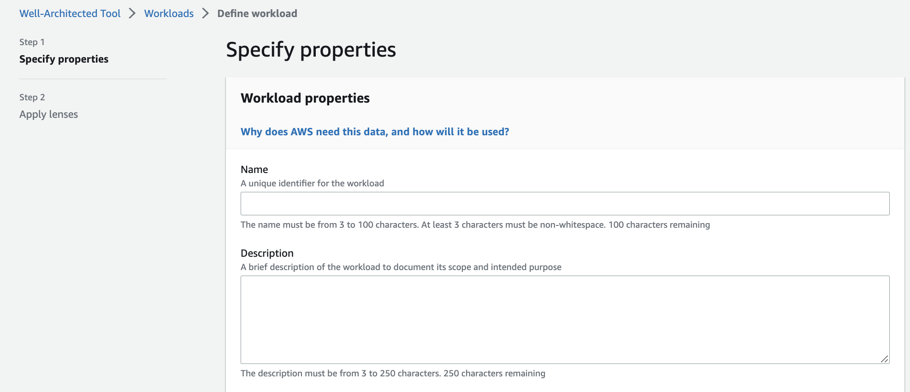
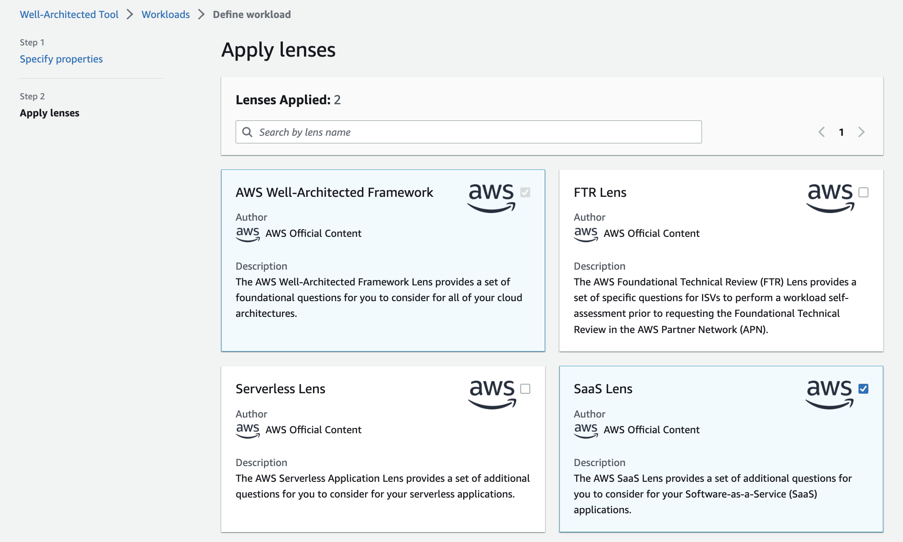

# AWS Well Architectured

???+ "Updates"
    Created Oct 2023 - update 10/10/2023 - Reliability

The [AWS Well-Architected Framework](https://docs.aws.amazon.com/wellarchitected/latest/framework/welcome.html) helps you understand the pros and cons of decisions you make while building systems on AWS. 

By using the Framework, customers will learn architectural best practices for designing and operating reliable, secure, efficient, and cost-effective systems in the cloud.

It was started as a white paper from Werner Vogels.

Those are the questions to ask for designing a cloud native solution by understanding the potential impact . All hardware are becoming software.

**Workload** represents interrelated applications, infrastructure, policies, governance and operations. 

## Traditional environment challenges

* Had to guess infrastructure needs.
* Could not afford to test at scale.
* Had a fear of change.
* Could not justify experiments.
* Face architecture that was frozen in time.

## Six pilards

When architecting technology solutions, never neglect the six pillars of:

* [Operational Excellence](#operational-excellence)
* [Security](#security)
* [Reliability](#reliability)
* [Performance Efficiency](#performance-efficiency)
* [Cost Optimization](#cost-optimization)
* [Sustainability](#sustainability)

Each pillar has questions, context and best practices.

## Design Principles

* **Stop guessing your capacity needs**: use as much or as little capacity as you need, and scale up and down automatically.
* **Test systems at production scale**, then decommission the development resources.
* **Automate to make architectural experimentation easier**, using infrastructure as code.
* **Allow for evolutionary architectures**: the capability to automate and test on demand lowers the risk of impact from design changes. This allows systems to evolve over time so that businesses can take advantage of innovations as a standard practice.
* **Drive architectures using data**: In the cloud, you can collect data on how your architectural choices affect the behavior of your workload. This lets you make fact-based decisions on how to improve your workload.
* **Improve through game days** to simulate events in production. This will help you understand where improvements can be made and can help develop organizational experience in dealing with events.

### Jumpstart an assessment

In AWS console, search for `well architected`.

With Lenses to define a set of question to ask.

## Operational Excellence

Support development and run workloads effectively, gain insight into their operations, and to continuously improve supporting processes and procedures. 

Four area of focus:

* **Organization**: define clear responsabilities, roles, and success interdependencies.
* **Prepare**: design architecture for operations like telemetry (logs, metrics...), improve flow to deliver to production, mitigate deployment risks and react quickly to issue, understand operational readiness.
* **Operate**: understand workload health, operation health (like # features deploy per time unit), achievement of business outcome. Runbooks and playbooks should define escalation process and consistent response to events, and define ownership for each action. Assess applications at risk.
* **Evolve**: learn from experience, get feedback loops to identify areas of improvement, make improvements, share with teams.

### OE- Design principles

* Perform operations as code. Apply same methodology for infrastructure as we do for application code. Use configuration management application.
* Use separate environments for development, testing and production activities.
* Make frequent, small, reversible changes.
* Refine operations procedures frequently. Set up regular game days to review and validate that all procedures are effectives.
* Anticipate failure: Perform “pre-mortem” exercises to identify potential sources of failure so that they can be removed or mitigated. 
* Learn from all operational failures.

Use established runbooks for well-understood events, and use playbooks to aid in investigation and resolution of issues. 

[AWS CloudWatch](../monitoring/monitoring.md#cloudwatch) is used to aggregate and present business, workload, and operations level views of operations activities.

### OE- Assessment

| Questions to assess| Note |
| --- | --- |
| How do you determine what your priorities are? | |
| How do you structure your organization to support your business outcomes? |  |
| How does your organizational culture support your business outcomes? | |
| How do you design your workload so that you can understand its state? |  |
| How do you reduce defects, ease remediation, and improve flow into production? | |
| How do you mitigate deployment risks? | |
| How do you know that you are ready to support a workload? | |
| How do you understand the health of your workload? | |
| How do you understand the health of your operations? | |
| How do you manage workload and operations events? | |
| How do you evolve operations? | |

### OE- Deeper dive

* [100 and 200 labs](https://www.wellarchitectedlabs.com/operational-excellence/)

## Security

Encompass the ability to protect data, systems and assets by controlling access and get visibility on who does what.

It encompasses 5 items:

* Identity and access management
* Detection
* Infrastructure protection
* Data protection: involves identifying and classifying the data, and using controls and patterns to keep data confidential while preserving its integrity and availability at rest and in transit.
* Incident response: defines the processes to be in place to respond to and mitigate the potential impact of security incidents.

### Security Design principles

* Apply security at all layers.
* Use fine-grained access controls.
* Automate security best practices.
* Protect data in transit and at rest.
* Define strong sign-in mechanisms.
* Centralized identity provider.
* Grant least privilege.
* Reduce permissions continuously.

### Security- Assessment

| Questions to assess| Answer |
| --- | --- |
| How do you manage identities for people and machines? |  |
| How do you manage permissions for people and machines? |  |
| How do you detect and investigate security events? |  |
| How do you protect your network resources? |   |
| How do you protect your compute resources? |  |
| How do you classify your data? |  |
| How do you protect your data at rest? |  |
| How do you protect your data in transit? |   |
| How do you anticipate, respond to, and recover from incidents? |  |

### Security- Tools

Organize workload using AWS accounts, and use AWS Organizations and Amazon Control Tower to manage accounts and define common guard rails to apply security best practices.

IAM helps control access for users and machines to workloads and AWS services.

CloudTrail logs, AWS API calls, and CloudWatch provides monitoring of metrics with alerting.

Ensure that you have a way to quickly grant access for your security team, and automate the isolation of instances as well as the capturing of data and state for forensics.

Amazon Cognito is an identity provider and supports integration to multiple login providers.

AWS Config records resource configuration changes and evaluate them against rules we configure.

### Security- deeper dive

* [300 labs](https://www.wellarchitectedlabs.com/security/300_labs/)

## Reliability

**The ability of a workload to perform its intended function correctly and *consistently* when it is expected to.** Reliability requires that the workload be aware of failures as they occur and take action to avoid impact on availability. Workloads must be able to both withstand failures and automatically repair issues.

**[Resiliency](./resiliency.md)** is the ability of a workload to recover from infrastructure or service disruptions, dynamically acquire computing resources to meet demand, and mitigate disruptions, such as misconfigurations or transient network issues. It addresses **DR** (restore service) and **Availability** (prevent loss of service).

**Shared responsibility model for resiliency**: AWS for resiliency of the cloud: infrastructure. Customer is responsible for resiliency in the cloud: adopting instance deployment across multiple locations, support self-healing, design for resiliency. Be sure to have continuous testing of infrastructure failure, have good observability and failure management, manage service quotas and other constraints.

### Reliability- Design principles

* Use highly available network connectivity for the workload with public endpoints: These endpoints and the routing to them must be highly available. Use Elastic Load Balancing which provides load balancing across Availability Zones, performs Layer 4 (TCP) or Layer 7 (http/https) routing, integrates with AWS WAF, and integrates with AWS Auto Scaling to help create a self-healing infrastructure and absorb increases in traffic while releasing resources when traffic decreases.
* Implement loosely coupled dependencies.
* Deploy the workload to multiple locations: Distribute workload data and resources across multiple Availability Zone.
* Automatically recover from failure.
* Design to mitigate failures: fails fast and limit queues, asynchronous communication, throttling requests, make all requests idempotent.
* Test recovery procedures: use automation to simulate different failures or to recreate previous failure scenarios.
* Scale horizontally to increase aggregate workload availability. Understand physical limits and resource constraints: use service quotas and limits.
* Stop guessing capacity: monitor demand and workload utilization, and automate the addition or removal of resources to maintain the optimal level to satisfy demand without over- or under-provisioning.
* Manage change in automation.
* Use fault isolation: adopt multiple availability zones, use multiple regions where needed, and apply bulkhead architecture

!!!- "bulkhead architecture"
    Elements of the architecture are isolated into pools, so one failure is isolated by a subset of requests. See [building fault tolerant with bulkhead pattern](https://aws.amazon.com/blogs/containers/building-a-fault-tolerant-architecture-with-a-bulkhead-pattern-on-aws-app-mesh/).

### Reliability- Assessment

Before architecting any system, define foundational requirements that influence reliability:

| Reliability Questions | Notes |
| --- | --- |
| How do you manage service quotas and constraints? | |
| How do you plan your network topology? | |
| How do you design your workload service architecture? | |
| How do you design interactions in a distributed system to prevent failures? | Search to improve mean time between failures (MTBF) |  
| How do you design interactions in a distributed system to mitigate or withstand failures? | Look to improve mean time to recovery (MTTR) |
| How do you monitor workload resources? | Monitor Logs and metrics |
| How do you design your workload to adapt to changes in demand? |  Add or remove resources automatically to adapt to the demand |
| How do you implement change? |  Controlled changes to deploy new feature, patched or replaced in a predictable manner |
| How do you back up data? | Helps to address [RTO and RPO](https://jbcodeforce.github.io/architecture/DR/#concepts) |
| How do you use fault isolation to protect your workload? | Components outside of the boundary should not be affected by the failure. |
| How do you design your workload to withstand component failures? | |
| How do you test reliability? | testing is the only way to ensure that it will operate as designed. Use practice Failure Mode Engineering Analysis (FMEA) |
| How do you plan for disaster recovery (DR)? | Regularly back up your data and test your backup files to ensure that you can recover from both logical and physical errors |

Use AZ, regions and bulkhead (elements of an application are isolated into pools so that if one fails, the others will continue to function).

Use chaos engineering, playbooks and test function and performance.

### Reliability- deeper dive

See also files in [labs/reliability](https://github.com/jbcodeforce/yarfba/tree/main/labs/reliability) folder.

* [Disaster recovery labs from AWS](https://www.wellarchitectedlabs.com/reliability/disaster_recovery/)
* [Reliability workshop.](https://catalog.workshops.aws/well-architected-reliability/en-US/4-failure-management)

## Performance efficiency

Use computing resources efficiently to meet system requirements, and to maintain that efficiency as demand changes and technologies evolve. The focus is on:

* Selection of the resource types and features, for compute, network, storage and databases. Use benchmarking and load testing. 
* Review updated features and new services.
* Monitoring existing deployment. Use performance alarms while monitoring, using CloudWatch. 
* Trade-offs to tune for efficiency. Trade-off where space is used to reduce processing time. Caching is also a level we can use for trade offs.

### Performance- Design principles

* Democratize advanced technologies: delegate to your cloud vendor.
* Go global in minutes.
* Use serverless architectures.
* Experiment more often.
* Consider mechanical sympathy: always use the technology approach that aligns best with your workload goal

In AWS, compute is available in three forms: instances, containers, and functions. Storage is available in three forms: object, block, and file. Databases include relational, key-value, document, in-memory, graph, time series, and ledger databases.

### Performance- Assessment

| Performance Questions | Comments |
| --- | --- |
| How do you select the best performing architecture? | Use a data-driven approach to select the patterns and implementation for your architecture and achieve a cost effective solution. |
| How do you select your compute solution? | Varies based on application design, usage patterns, and configuration settings |
| How do you select your storage solution? | The optimal storage solution for a system varies based on the kind of access method (block, file, or object), patterns of access (random or sequential), required throughput, frequency of access (online, offline, archival), frequency of update (WORM, dynamic), and availability and durability constraints |
| How do you select your database solution? | Consider requirements for availability, consistency, partition tolerance, latency, durability, scalability, and query capability | 
| How do you configure your networking solution? | varies based on latency, throughput requirements, jitter, and bandwidth |
| How do you evolve your workload to take advantage of new releases? | |
| How do you monitor your resources to ensure they are performing? | |
| How do you use tradeoffs to improve performance? |  improve performance by trading consistency, durability, and space for time and latency. |

Amazon **CloudWatch** is a monitoring and observability service that provides you with data and actionable insights to monitor your workload, respond to system-wide performance changes, optimize resource utilization, and get a unified view of operational health

AWS [cloudformation](https://aws.amazon.com/cloudformation/) to define infrastructure as code.

## Cost optimization

Run systems to deliver business value at the lowest price point possible.

### Cost- Design principles

* Implement Cloud Financial Management practices / team
* Be aware of expenditure and usage awareness. On-demand, spot instances...
* Adopt a consumption model use approapriate instances and resources for our system.
* Measure overall efficiency: Measure the business output of the workload and the costs associated with delivering it.
* Stop spending money on undifferentiated heavy lifting. Match supply to demand.
* Optimize over time.

### Cost- Assessment

| Questions to assess| Comments |
| --- | --- |
| How do you govern usage? | |
| How do you monitor usage and cost? | |
| How do you decommission resources? | |
| How do you evaluate cost when you select services? | Trade off between low level service like EC2, S3, EBS versus higher level like DynamoDB |
| How do you meet cost targets when you select resource type, size and number? | |
| How do you plan for data transfer charges? | |

 As your requirements change, be aggressive in decommissioning resources, entire services, and systems that you no longer require. Stay up to date on enw services and features.

### Cost- Tools

* Cost Explorer
* Cloudwatch

## Sustainability

Focuses on environmental impacts, especially energy consumption and efficiency.

* Scale infrastructure to continually match user load and ensure that only the minimum resources required to support users are deployed. 
* Identify redundancy, underutilization, and potential decommission targets.
* Adapt EC2 instance type to the processing needs, and decomission when no more needed.
* Implement patterns for performing load smoothing and maintaining consistent high utilization of deployed resources to minimize the resources consumed. 
* Monitor workload activity to identify application components that consume the most resources.
* Understand how data is used within your workload, consumed by your users, transferred, and stored.
* Lifecycle data to more efficient, less performant storage when requirements decrease, and delete data that’s no longer required.
* Adopt shared storage and single sources of truth to avoid data duplication and reduce the total storage requirements of your workload
* Back up data only when difficult to recreate
* Minimize the amount of hardware needed to provision and deploy
* Use automation and infrastructure as code to bring pre-production environments up when needed and take them down when not used.
* Distribute workload among multiple AZs help to improve utilization so consume less.

When selecting a region, use one near Amazon renewable energy projects. Some regions has over 95% renewable energy.

## Well-architected review

Provides customers and partners with consistent to reviewing their workloads against current AWS best practices, and gives advice on how to architect workload for cloud. The workload is the focus of the review.

The benefits:

* Build and deploy faster
* Lower or mitigate risks
* Make informed decisions
* Learn AWS best practices

[Tool](https://aws.amazon.com/well-architected-tool) is available in AWS console.

## More readings

* [Well-architected website](https://aws.amazon.com/architecture/well-architected)
* [System design exercices using AWS services](https://jbcodeforce.github.io/architecture/system-design/)
* [Disaster Recovery AWS](https://aws.amazon.com/disaster-recovery/)
* [WAS Well-Architected training](https://explore.skillbuilder.aws/learn/course/2165/play/8823/the-aws-well-architected-framework)