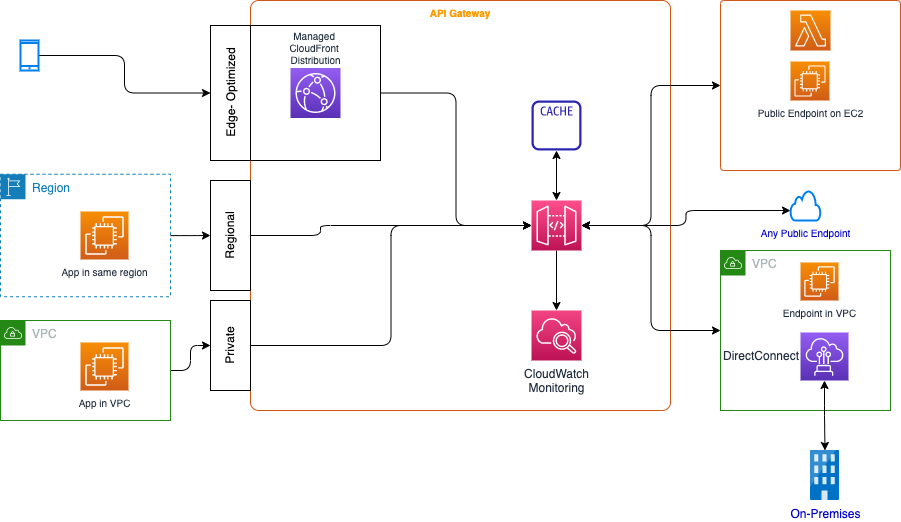

# [Amazon API Gateway](https://docs.aws.amazon.com/apigateway/latest/developerguide/welcome.html)

!!! Info
    Created 11/2023 - Updated 01/29/2024
    
## Introduction

Fully managed service to define, deploy, and monitor APIs within a AWS region. It supports HTTP, REST, or WebSocket APIs. As illustrated in the diagram below, it also covers other API endpoints for different backends, even on-premises backends.

{ width=800 }

**Figure 1: API Gateway to serve multiple end points**

It supports hundred of thousands of concurrent API calls. It can even cache backend response (at the stage level) to reduce calls to backend to improve request latency. Only GET methods are cached.

APIs are deployed to "Stages" (e.g. dev, prod...). Stage can be rolled back as there is an history of each deployment.

API Gateway is not for authentication, and it uses standard capabilities (Mutual TLS, JWT) or different services for authorization: Cognito user pools, resources policies, WAF, lambda authorizer...

CloudWatch is used to trace access and execution loggings. CloudTrail helps logging and monitoring of API usage and API changes.

API Gateway supports data validation of the required request parameters in the URI, the HTTP headers, and even the payload to adhere to JSON schema.

One of the common integration is with Lambda. There are two types of integration, the proxy one passes the client request to the lambda function with header, query parameters, etc, while for the non-proxy the developer has to define the integration logic (data transformation) to match the Lambda parameters.

For data transformation, mapping templates ([Velocity Template Language](https://velocity.apache.org/)) can be added to the integration request to transform the incoming request to the format required by the backend of the application or to transform the backend response payload to the format required by the method response.

See [the tutorial: "Build an API Gateway REST API with Lambda non-proxy integration"](https://docs.aws.amazon.com/apigateway/latest/developerguide/getting-started-lambda-non-proxy-integration.html) to go over all those capabilities.

We can define a [custom domain name](https://docs.aws.amazon.com/apigateway/latest/developerguide/how-to-custom-domains.html) to get our own URL endpoint and use base path (`/myservice`) mapping to go to the different URLs/APIs served by the domain. We can use API Gateway Version 2 to create and manage Regional custom domain names for REST APIs. The domain name needs to be registered to an internet domain registrar like Route 53.

## Designing considerations

Amazon API Gateway will automatically scale to handle the amount of traffic the API receives. It has a max timeout set to 29 seconds, and a max payload to 10MB per request. To protect against traffic spikes define throttling and caching settings.

With API Gateway, we can set throttle and quota limits on our REST API consumers. This can be useful for things such as preventing one consumer from using all of the backend system’s capacity or to ensure that the downstream systems can manage the number of requests sent through. The Throttle can be set per client and method, and has a quota per AWS account.

API Gateway throttles requests (Clients may receive HTTP 429 Too Many Requests) to the API using the token bucket algorithm, where token counts requests. Specifically, API Gateway examines the rate and a burst of request submissions against all APIs in AWS account, **per Region**.

To identify client we need to use API keys and set the throttle rules per key.

It does not limit or throttle invocations to the backend operations.

### REST API

REST APIs and HTTP APIs are both RESTful API products. REST APIs support more features than HTTP APIs.

API Gateway REST APIs use a synchronous request-response model. Always assess the type of endpoints:

* **Edge-optimized** API Gateway will automatically configure a fully managed CloudFront distribution to provide lower latency access to the API. It also reduces TLS connection overhead, and it is designed for globally distributed clients
* **Regional**, where client apps run in the same region as the API gateway, and most likely as the backends (Also for HTTP api).
* **VPC or Private** to expose API from applications running within VPC.

We can turn on API caching in API Gateway to cache the endpoint's responses, with TTL for 300s (max 3600s). Caches are defined per stage, and it is possible to override cache settings per method. The cache can be between 0.5GB to 237GB.

Client can invalidate cache by using a HTTP header Cache-Control: max-age=0. It needs proper IAM permission.

We can get client code generated from the REST api definition.

### HTTP API

HTTP APIs are optimized for building APIs that proxy to Lambda functions or HTTP backends, making them ideal for serverless workloads. But they do not currently support API management functionality

### Open API standard

It is possible to upload an OpenAPI definition of an existing API in a API Gateway.

### WebSocket API

With a WebSocket API, the client and server can send messages to each other at any time. The API Gateway manages the persistence and state needed to connect it to the client. When a client sends a message over its WebSocket connection, this results in a route request to the WebSocket API. The request will be matched to the route with the corresponding route key in API Gateway. 

The client apps connect to your WebSocket API by sending a WebSocket upgrade request. If the request succeeds, the $connect route is invoked while the connection is being established. Until the invocation of the integration you associated with the $connect route is completed, the upgrade request is pending and the actual connection will not be established. If the $connect request fails, the connection will not be made.

A backend endpoint is also referred to as an integration endpoint and can be a Lambda function, an HTTP endpoint, or an AWS service action.

API Gateway uses selection expressions as a way to evaluate the request and response context and produce a key.

After the connection is established, your client's JSON messages can be routed to invoke a specific backend service based on message content. When a client sends a message over its WebSocket connection, this results in a route request to the WebSocket API. The request will be matched to the route with the corresponding route key in API Gateway. 

### API access

When it comes to granting access to our APIs, we need to think about two types of permissions:

1. Who can **invoke** the API: To call a deployed API, or refresh the API caching, the caller needs the execute-api permission.  Create IAM policies that permit a specified API caller to invoke the desired API method.
1. Who can **manage** the API: To create, deploy, and manage an API in API Gateway, the API developer needs the apigateway permission.

See [API Gateway identity-based policy examples.](https://docs.aws.amazon.com/apigateway/latest/developerguide/security_iam_id-based-policy-examples.html)

### Parameter tampering

We can configure API Gateway to do basic validation to verify:

* The required request parameters in the URI, query string, and headers of an incoming request are included and non-blank.
* The applicable request payload adheres to the configured JSON schema request model of the method.

We can also do a data mapping based on the JSON schema.

### An API frontend to S3

It is possible to define an API to upload doc to S3, but there is a risk that the file is bigger than 10GB, so the better solution is to use a Lambda function to serve the API, to get a S3 signed URL, and the client will use this URL to upload the file to S3. See [this blog](https://aws.amazon.com/blogs/compute/patterns-for-building-an-api-to-upload-files-to-amazon-s3/) and [this git repo, using SAM](https://github.com/aws-samples/amazon-s3-presigned-urls-aws-sam).

## Scaling and [quotas](https://docs.aws.amazon.com/apigateway/latest/developerguide/limits.html)

* Quota is account and region based.
* Support 10k rps, with burst absorption via a bucket of 5000 requests
* Limit in the URL size
* Limit on the number of domains

## Pricing

* Pay when APIs are in use at a set cost per million requests. Data Transfer out of AWS cost occurs.
* HTTP APIs are designed with minimal features so that they can be offered at a lower price. 
* WebSocket APIs maintain persistent connections with clients for full-duplex communication. WebSocket APIs for API Gateway charge for the messages you send and receive. Also charged for the total number of connection minutes. the `$connect` route is to initiate the connection, `$disconnect` route.. and `$default` route when route selection cannot be assessed. 
* Caching is billed  by the hour.
* API can be sell as SaaS on Marketplace.

## Monitoring

* Two level of execution logs, Error and Info. [Turn CloudWatch logs for troubleshooting the API gtw.](https://repost.aws/knowledge-center/api-gateway-cloudwatch-logs)
* For REST APIs consider looking at the `CacheHitCount` and `CacheMissCount` metrics. Other metrics are Calls count, Latency, 4XX, 5XX, Integration latency
* For HTTP metrics are calls count, Latency, 4XX, 5XX, Integration latency, data processed
* For WebSocket, connect count, message count, integration error, client error, execution error, integration latency.

## [Lamba Authorizer](https://docs.aws.amazon.com/apigateway/latest/developerguide/apigateway-use-lambda-authorizer.html)

It is an API Gateway feature that uses a Lambda function to control access to our API. Used for a bearer token authentication strategy such as OAuth or SAML, or that uses request parameters to determine the caller's identity.

The Lambda takes the caller's identity as input and returns an IAM policy as output.

There are two types of Lambda authorizers:

* A token-based Lambda authorizer 
* A request parameter-based 

The lambda can:

* Calling out to an OAuth provider to get an OAuth access token.
* Calling out to a SAML provider to get a SAML assertion.
* Generating an IAM policy based on the request parameter values.
* Retrieving credentials from a database

[Here is a boilerplate for decode JWT](https://github.com/awslabs/aws-support-tools/tree/master/Cognito/decode-verify-jwt)

## Hands-on

### Tutorials

* [Basic API to front end a Lambda function](https://docs.aws.amazon.com/apigateway/latest/developerguide/getting-started.html).
* [API Gateway tutorials](https://docs.aws.amazon.com/apigateway/latest/developerguide/api-gateway-tutorials.html)
* [Autonomous car manager with Lambda, API Gateway](https://github.com/jbcodeforce/autonomous-car-mgr)
* [A lot of serverlessland examples use APIGTW](https://serverlessland.com/search?search=api+gateway).
* [Serverless examples in this repo.](https://github.com/jbcodeforce/yarfba/tree/main/labs/serverless)
* [Load an OpenAPI definition in API Gateway.](https://docs.aws.amazon.com/apigateway/latest/developerguide/api-gateway-create-api-from-example.html)

### An end-to-end Quarkus based solution

See the CarRideManager microservice which exposes a Quarkus app running on ECS Fargate with Open API deployed on Amazon API gateway.

## Deeper dive

* [FAQs](https://aws.amazon.com/api-gateway/faqs/)
* [Using AWS Lambda with Amazon API Gateway](https://docs.aws.amazon.com/lambda/latest/dg/services-apigateway.html).