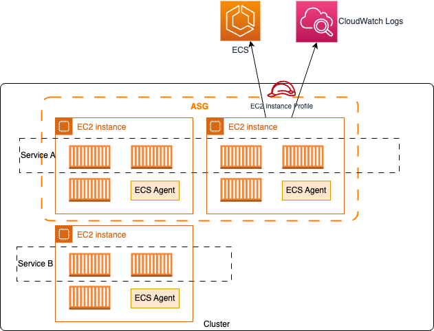
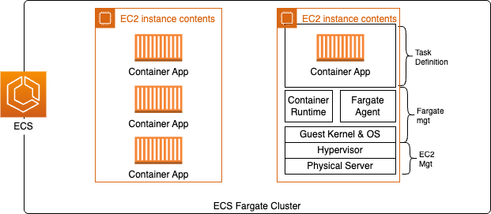
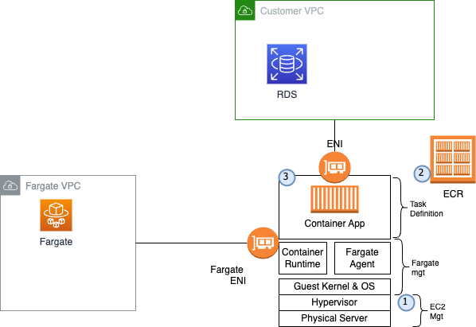
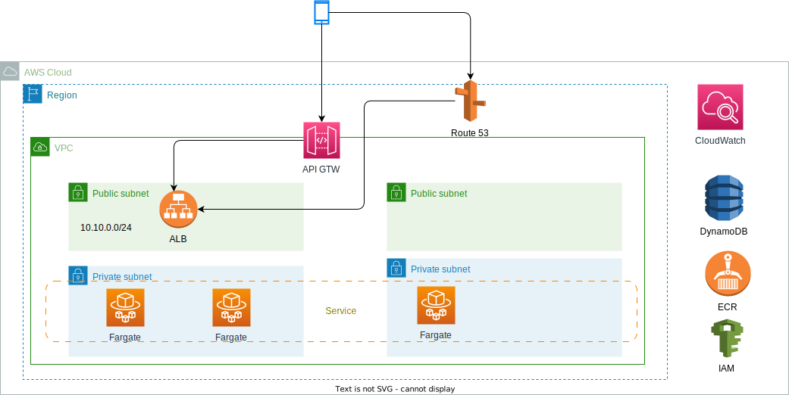
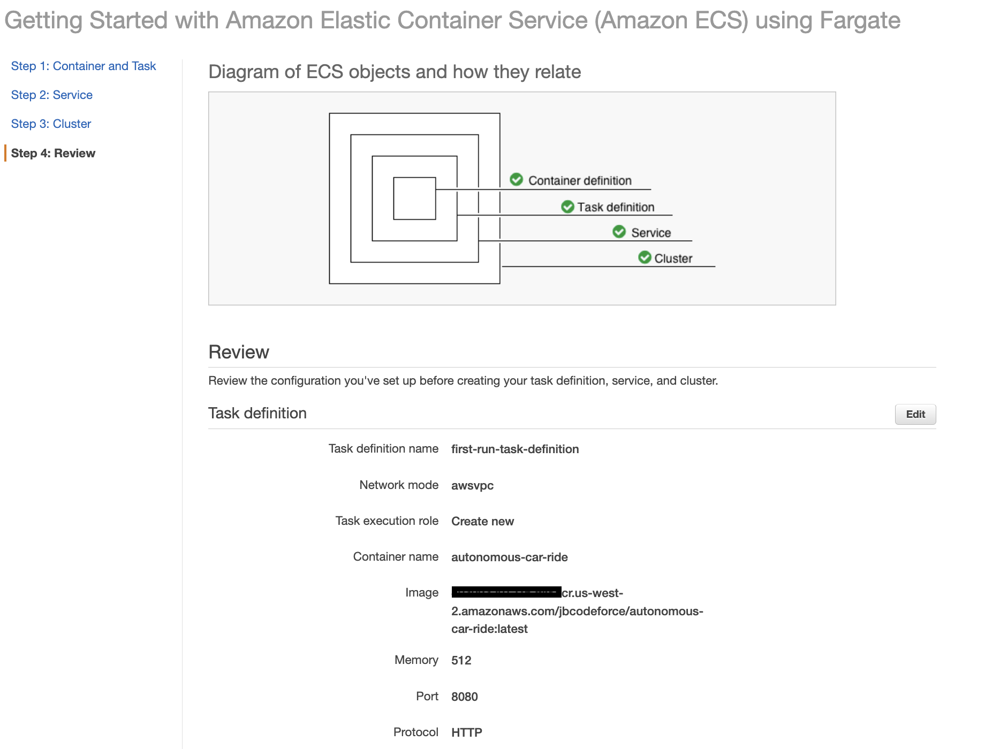
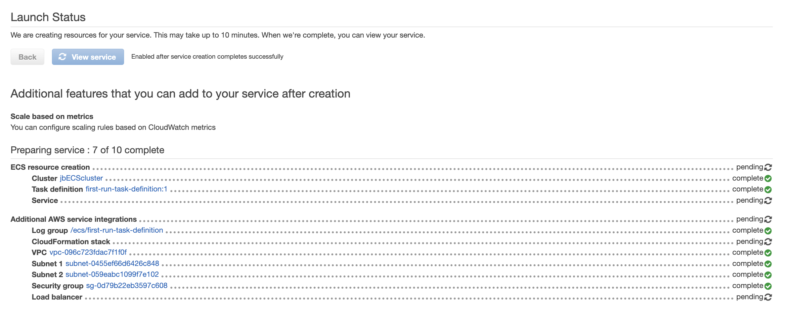

# Amazon Elastic Container Service (Amazon ECS)

[Amazon ECS](https://aws.amazon.com/ecs/) is an end-to-end container orchestration service that helps to spin up new containers and manages them across a **cluster** of EC2 (or Fargate) instances, without managing a control plane. Created in 2014 with Linux containers.

It maintains application availability and allows us to scale our containers up or down to meet the application's capacity requirements.

Integrated with familiar features like Elastic Load Balancing, EBS volumes, VPC, and IAM. Simple APIs let us integrate and use our own schedulers or connect Amazon ECS into our existing software delivery process.

It is possible to run container into two modes: EC2 or Fargate. For EC2, we can create the instances upfront or use an auto scaling group and start instances within it. We need to install the Amazon ECS container agent on each EC2 instances, the docker engine, and manage the EC2 ourselves...

{ width=600 }

**Figure 1: ECS with EC2 instances**

Since 2018, with [Fargate](https://docs.aws.amazon.com/AmazonECS/latest/developerguide/AWS_Fargate.html), as a serverless approach, we only need to specify the container configuration, services to expose the app and configuration:

{ width=500 }

**Figure 2: ECS cluster with Fargate**

Fargate has various deployment options using on-demand, compute saving plans and spot instances. It uses the concept of control and data planes. The control plane runs on its own VPC owned by AWS, while the data plane is able to access customers' VPCs via ENI.

{ width=600 }

**Figure 3: ECS cluster with Fargate**

The deployment steps are 1/ provision resources from a pool of EC2s, 2/ download the image from a registry like ECR, 3/ activate the workload with or withour load balancer. The task is now running.

It is possible to combine Fargate and EC2 auto scaling group inside the same ECS cluster.

ECS with EC2 launch type is charged based on EC2 instances and EBS volumes used. ECS with Fargate is charged based on vCPU and memory resources that the containerized application requests.

The container is executed by defining **Task Definition** which describes cpu, memory, networking, volume mount, and IAM needs. Tasks are instances of Task Definition.

```json
{
    "taskDefinitionArn": "arn:aws:ecs:....",
    "containerDefinitions": [
        {
            "name": "simple-app",
            "image": "....dkr.ecr.us-west-2.amazonaws.com/demo-customer-api:latest",
            "cpu": 10,
            "memory": 300,
            "portMappings": [
                {
                    "containerPort": 8080,
                    "hostPort": 8080,
                    "protocol": "tcp"
                }
            ],
            "essential": true,
        }],
        "requiresCompatibilities": [ "FARGATE"],
        "cpu": 128,
        "memory": 512
}
```

Task definition also includes placement strategies, like: random, binpack, spread, and placement constraints.

**Service** groups identical tasks and exposes them for other applications via load balancer. Here is a task definition example, which includes CPU and memory capacities, with the docker image reference:

{ width=900 }

Running the task:

{ width=900 }

Task IAM role needs to be defined for the task to access specific AWS services such as S3, RDS, ... and it is referenced in the Task Definition, and EC2 Instance Profile roles is also defined so EC2 can call ECS control plane.

Here is a classical network deployment. ALB can do **dynamic port mapping** to support routing to multiple instances of the application running within the same EC2:



ECS Tasks can be launched with different networking support:

* None: no network connection (? strange)
* **Bridge**: uses the docker virtual network
* **Host**: bypass docker and use host network interface
* **awsvpc**: each task get its own ENI and a private IP address. It is a simplified networking, and let access to security groups, VPC flow logs. This is the default for Fargate.

[See a demo for NGInx deployment on ECS.](../playground/ecs.md)

## Value propositions

* Run more than 2.5 billion tasks per week.
* 70% of all containers from customer, run on ECS.
* The main reasons for ECS: faster time to market, lower cost, massive scale, reliable, and secure and compliant.
* Fargate is a serverless offering, no EC2 provisioning and lower level management.
* Fargate supports autoscaling without EC2 capacity management.
* Fargate pricing is based on on-demand based on vCPU and memory usage.
* Support OCI image standard and docker images.
* Support [Firelens](https://aws.amazon.com/blogs/containers/under-the-hood-firelens-for-amazon-ecs-tasks/) as a side car in each task to integrate with other open source logging products like Prometheus.

## Fargate basic deployment steps

1. Be sure to have a VPC, a security group for container with SSH from your development laptop, and allow inbound and outbound HTTP and HTTPS access from anywhere. Be sure to set port for the container (8080?)
1. Define an execution IAM role taking examples from the [ECS first run wizard permission documentation.](https://docs.aws.amazon.com/AmazonECS/latest/developerguide/security_iam_id-based-policy-examples.html#first-run-permissions). Define a role for the task to access other services like secrets, MQ...
1. Build the docker image and push it to a ECR repository
1. Create a `task definition`: Specify the container images, environment variables and any resources configurations... Add a Application Load Balancer. The task definition is a text file, in JSON format, that describes one or more containers.
1. Then define the cluster: it is a regional grouping of container instances. Cluster may have one to many EC2 instances. Try to use Fargate as runtime engine for a serverless deployment model.

    { width=800 }

    With all the resources created automatically:

    { width=800 }
    
    It automatically creates a VPC with two public subnets.

    Task definitions can be defined outside of a cluster, but services are associating task to cluster, subnets, and security groups.

## Service Auto Scaling

ECS service auto scaling helps to automatically increase/decrease the number of ECS task. It uses AWS Application Auto Scaling which specifies the service usage in term of CPU, memory and request count per target.

There are 3 ways to define scaling rules:

* **Target Tracking**, based on value for a specific CloudWatch metric.
* **Step Scaling**, based on CloudWatch Alarm.
* **Scheduled Scaling**, based on a specified date/time.

This is different than EC2 auto scaling which works at the EC2 instances, as application auto scaler works at the task level.

## [ECS Service Connect](https://docs.aws.amazon.com/AmazonECS/latest/developerguide/service-connect.html)

[ECS Service Connect](https://aws.amazon.com/blogs/aws/new-amazon-ecs-service-connect-enabling-easy-communication-between-microservices/) is a Network capability to simplify service discovery, connectivity and traffic observability for ECS. It delivers service mesh capability without developer knowing it. It is intended for interconnecting multiple applications on Amazon ECS.

ECS Service Connect is fully supported in AWS CloudFormation, AWS CDK, AWS Copilot, and AWS Proton for infrastructure provisioning, code deployments, and monitoring of our services.

[Tutorial: using service connect in Fargate with AWS CLI](https://docs.aws.amazon.com/AmazonECS/latest/developerguide/create-service-connect.html).


## [AWS Copilot](https://aws.github.io/copilot-cli/)

AWS Copilot provides an [open-source CLI](https://aws.github.io/copilot-cli/docs/overview/) for developers to build, release, and operate production ready containerized applications on Amazon ECS. See [this git repo to deploy nginx](https://github.com/aws-samples/aws-copilot-sample-service) with Copilot.

Here is a quick summary of common command:

```sh
brew install copilot-cli
copilot init

```

## Others 

* IAM Roles are defined for each container. Others roles can be added to access ECS, ECR, S3, CloudWatch, ...
* `EC2 Instance Profile` is the IAM Role used by the ECS Agent on the EC2 instance to execute ECS-specific actions such as pulling Docker images from ECR and storing the container logs into CloudWatch Logs.
* ECS Task Role is the IAM Role used by the ECS task itself. Used when our container wants to call other AWS services like S3, SQS, etc.
* EventBridge can define a rule to run a ECS task.
* See also [ECS anywhere](https://press.aboutamazon.com/news-releases/news-release-details/aws-announces-general-availability-amazon-ecs-anywhere)

## Deeper dive

* [Under the hood: AWS Fargate data plane](https://aws.amazon.com/blogs/containers/under-the-hood-fargate-data-plane/)
* [Tutorials](https://docs.aws.amazon.com/AmazonECS/latest/developerguide/ecs-tutorials.html)
* [Some personal ECS playground](../playground/ecs.md) with AWS console, CLI or CDK, and the [messaging studies with CDK]() to deploy Fargate apps.
* [CI/CD ECS Fargate workshop](https://catalog.us-east-1.prod.workshops.aws/workshops/954a35ee-c878-4c22-93ce-b30b25918d89/en-US) with github, Code deploy and blue/green deployment.
* [Container from the Couch](https://www.youtube.com/containersfromthecouch).