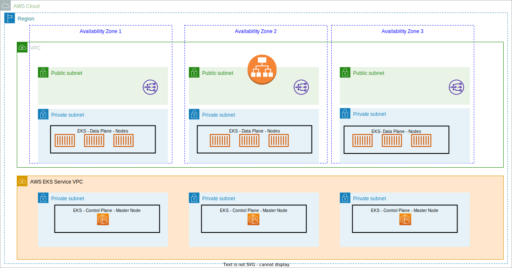
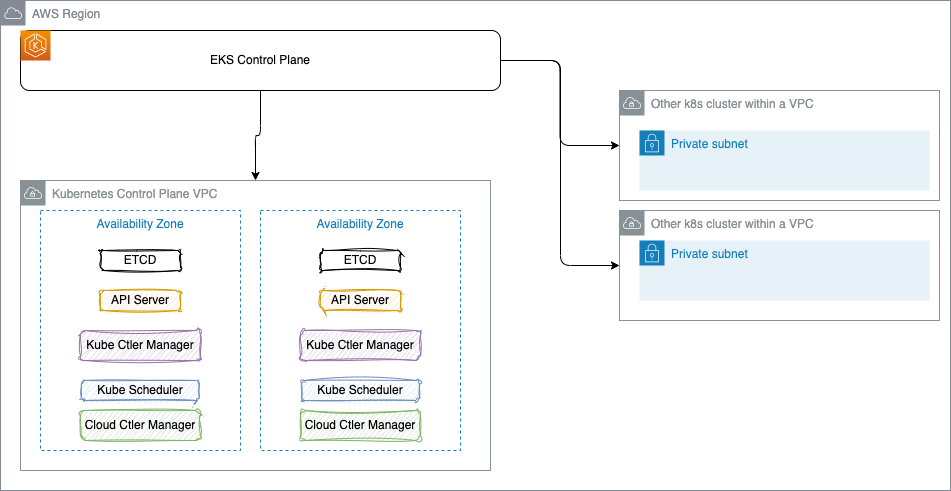
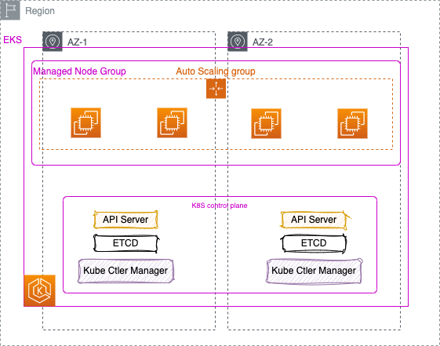
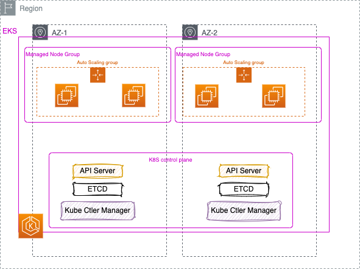

# [Elastic Kubernetes Service](https://docs.aws.amazon.com/eks/latest/userguide/what-is-eks.html)

!!!- "Info"
    Updated 9/12/2023

[Amazon EKS](https://aws.amazon.com/eks/) is a fully managed service to run Kubernetes. It is highly available, AWS manages the control plane, and user defines the worker nodes and then the workloads deployed:



* There are 3 public subnets and 3 private subnets to be created across 3 availability zones and we provision the EKS node group in the private subnets and it communicates with the EKS control plane through the private cluster mode by using the private endpoint.
* Because the Pods inside the private EKS cluster might have to access the internet resources so we shall setup the NAT gateway in the public subnets.
* Application Load Balancer is used as the ingress to route the traffic for the deployed application in private subnets, and only ALB can access EKS cluster by referencing the ALB security group from EKS data plane security group.
It is integrated with VPC for isolation, IAM for authentication, ELB for load distribution, and ECR for container image registry.
* Worker nodes can be EC2 instances in a `Managed Node Group` (EKS managed) or Fargate worker nodes as part of `Fargate profile`.

## Major characteristics

* Scale K8s control plane across multiple AZs.

    

* No need to install, operate and maintain k8s cluster.
* Automatically scales control plane instances based on load, detects and replaces unhealthy control plane instance.
* It supports EC2 as worker nodes or Fargate to deploy serverless containers or [nodes in AWS Outposts](../infra/index.md#aws-outposts).
* Fully compatible with other CNSF kubernetes.
* Can be deployed on-premises with [Amazon EKS Distro (EKS-D)](https://distro.eks.amazonaws.com/) distribution.

The EKS node types are:
 
* **Managed node groups**: to automate the provisioning and lifecycle management of EC2 (could be On-demand or spot instances). Nodes run using the latest Amazon EKS optimized AMIs. This is the recommended way to allocate capacity. EC2 are managed by AWS and assigned to a ASG managed by EKS. Nodes are tagged for auto-discovery by k8s cluster autoscaler. Can configure `Launch template` to be used with custom AMI or with custom user data. 

    The following figure illustrates a classical multi-AZ, one ASG/MMG deployment for stateless applications.

    

    While for stateful apps, we need to consider one MMG/ASG per AZ.

    

* **Self-managed nodes**: nodes are managed by the user and attached to EKS cluster by using an ASG. User uses his own AMI-based EC2 instances that are part of the auto-scaling group and will serve as worker nodes for the cluster. Spot instances can be used to reduce cost.
* **AWS Fargate** which represents a cost optimized deployment for EKS worker nodes. Each time a pod is created it is assigned to an existing EC2 instance and runs within a microVM. It works with ALB.

Data volumes (EBS, EFS, FSx) are defined with StorageClass and they need to have Container Storage Interface compliant driver.

See [Pricing calculator](https://aws.amazon.com/eks/pricing/): pay for cluster control plane, EC2 instances, Fargate or AWS outposts.

## Cluster management

* EKS runs a single tenant Kubernetes control plane for each cluster. 3 `etcd` instances in 3 AZs within one region.
* A set of add-ons are defined by default: CoreDNS, kube-proxy, VPC CNI. Others can be added like metrics server, cluster autoscaler, EFS CSI driver, EBS CSI driver, [fluentbit](https://fluentbit.io/) (logging and metrics processor and forwarder).
* EKS uses IAM to provide authentication to the Kubernetes cluster, and k8s RBAC for authorization.
* EKS  hosts a public OIDC discovery endpoint per cluster containing the signing keys for the `ProjectedServiceAccountToken` JSON web tokens so external systems, like IAM, can validate and accept the Kubernetes-issued OIDC tokens. OIDC federation access allows user or app to assume IAM roles via the Secure Token Service (STS), enabling authentication with an OIDC provider, receiving a JSON Web Token (JWT), which in turn can be used to assume an IAM role.

### IAM role for service account

IAM role for service account helps to define role for pods and not the EC2 running the pods. This is a fine grained access control.

To use IAM roles for service accounts in the cluster, we must create an IAM OIDC Identity Provider. 

### [Fargate profile](https://docs.aws.amazon.com/eks/latest/userguide/fargate-profile.html)

A fargate profile specifies which pods use Fargate. EKS uses special controller to schedule pods to Fargate.
Pods must match a Fargate profile at the time that they're scheduled to run on Fargate. They run only on private subnets.
Each pod is isolated within a microVM ([Firecrakers](https://firecracker-microvm.github.io/)).

## ECS comparisons

* An EC2 instance with the ECS agent installed and configured is called a container instance. In Amazon EKS, it is called a worker node.
* An ECS container is called a task. In Amazon EKS, it is called a pod.
* While Amazon ECS runs on AWS native technology, Amazon EKS runs Kubernetes.
* ECS scale at thousand of tasks, EKS is still limited in number of nodes and total pods.

## What to do the first time

1. [Install kubernetes tools](https://www.eksworkshop.com/020_prerequisites/k8stools/) like `kubectl` and AWS CLI:

    ```sh
    sudo curl --silent --location -o /usr/local/bin/kubectl https://s3.us-west-2.amazonaws.com/amazon-eks/1.23.7/2022-06-29/bin/linux/amd64/kubectl

    sudo chmod +x /usr/local/bin/kubectl

    curl "https://awscli.amazonaws.com/awscli-exe-linux-x86_64.zip" -o "awscliv2.zip"
    unzip awscliv2.zip
    sudo ./aws/install
    ```

1. Install jq, gettext...

    ```sh
    sudo yum -y install jq gettext bash-completion moreutils
    # Verify the path
    for command in kubectl jq envsubst aws
    do
        which $command &>/dev/null && echo "$command in path" || echo "$command NOT FOUND"
    done

    # Enable kubectl bash_completion
    kubectl completion bash >>  ~/.bash_completion
    . /etc/profile.d/bash_completion.sh
    . ~/.bash_completion
    ```

1. Download `eksctl` ([eksctl.io](https://github.com/weaveworks/eksctl)). (It also installs `kubectl`)

    ```sh
    brew tap weaveworks/tap
    brew install weaveworks/tap/eksctl
    # Verify it
    eksctl version
    ```

1. Create IAM Role and attach the required Amazon EKS IAM managed policy to it. Kubernetes clusters managed by Amazon EKS make calls to other AWS services on our behalf to manage the resources that we use with the service.

    ```sh
    # under the  labs/eks folder
    aws iam create-role \
        --role-name myAmazonEKSClusterRole \
        --assume-role-policy-document file://"eks-cluster-role-trust-policy.json"
    # Attach the required Amazon EKS managed IAM policy to the role.
    aws iam attach-role-policy \
        --policy-arn arn:aws:iam::aws:policy/AmazonEKSClusterPolicy \
        --role-name myAmazonEKSClusterRole
    ```

## Working with cluster

To create an EKS cluster with EC2 or Fargate, within its own VPC, in private subnets, with security groups, we can use different approaches:

* AWS Console.
* Using `eksctl` command line and a yaml config file defining the cluster.
* CDK to create the infrastructure and then EKS cluster itself. See examples in [the product doc](https://docs.aws.amazon.com/cdk/api/v2/docs/aws-cdk-lib.aws_eks-readme.html#quick-start), see also a CDK example in `labs/cdk/eks-single` folder or the `labs/eks/eks-cdk` folder for a python based deployment.
* Using CloudFormation for the VPC infrastructure with a predefined stack.

### eksctl approach

Based on the [EKS workshop](https://www.eksworkshop.com/)), using Cloud9, quick summary of steps:

1. [Create workspace in Cloud9](https://www.eksworkshop.com/020_prerequisites/workspace/) and install dependencies (See previous [section](#what-to-do-the-first-time)).
1. Create IAM role named `eks-admin` with AdministratorAccess, and modify the Cloud9, EC2 instance IAM role using: `Actions > Security > Modify IAM Role.`
1. Update Cloud9 workspace to disable Cloud9 to manage IAM credentials dynamically (This is not compatible with the EKS IAM authentication). `Gear > AWS Settings >` . 
1. Save region and account as env variable and configure aws CLI:

    ```sh
    echo "export ACCOUNT_ID=${ACCOUNT_ID}" | tee -a ~/.bash_profile
    echo "export AWS_REGION=${AWS_REGION}" | tee -a ~/.bash_profile
    aws configure set default.region ${AWS_REGION}
    aws configure get default.region

    # validate that the Cloud9 IDE is using the correct IAM role
    aws sts get-caller-identity --query Arn | grep eks-admin -q && echo "IAM role valid" || echo "IAM role NOT valid"
    ```

1. Use `eksctl create cluster` which creates CloudFormation to deploy a EKS cluster with managed nodes:

    ```sh
    eksctl create cluster -f eks-cluster.yaml
    ```

    See the schema [definition here](https://eksctl.io/usage/schema/).

    Find the cluster credentials added to `~/.kube/config`


1. Update kubeconfig to interact with the cluster

    ```sh
    aws eks update-kubeconfig --name MyEKS --region ${AWS_REGION}
    ```

1. Verify kubectl works with the cluster

    ```sh
    kubectl get nodes
    ```

1. Export worker role name

    ```sh
    STACK_NAME=$(eksctl get nodegroup --cluster myeks -o json | jq -r '.[].StackName')
    ROLE_NAME=$(aws cloudformation describe-stack-resources --stack-name $STACK_NAME | jq -r '.StackResources[] | select(.ResourceType=="AWS::IAM::Role") | .PhysicalResourceId')
    echo "export ROLE_NAME=${ROLE_NAME}" | tee -a ~/.bash_profile
    ```

1. Create an eks-admin service account and cluster role binding

    ```sh
    kubectl apply -f eks-admin-service-account.yaml
    ```

1. Deploy Prometheus (be sure to have helm cli)

    ```sh
    kubectl create namespace prometheus
    helm repo add prometheus-community https://prometheus-community.github.io/helm-charts
    helm upgrade -i prometheus prometheus-community/prometheus \
        --namespace prometheus \
        --set alertmanager.persistentVolume.storageClass="gp2",server.persistentVolume.storageClass="gp2"
    kubectl get pods -n prometheus
    ```

    To access Prometheus web app: `kubectl --namespace=prometheus port-forward deploy/prometheus-server 8080:9090` 

1. For administration, deploy Kubernetes dashboard:

    ```sh
    kubectl apply -f https://raw.githubusercontent.com/kubernetes/dashboard/v2.7.0/aio/deploy/recommended.yaml
    # Connect to the dashboard by first getting the admin user secret
    kubectl -n kube-system describe secret $(kubectl -n kube-system get secret | grep eks-admin | awk '{print $1}')
    # the following could also be used
    aws eks get-token --cluster-name myeks | jq -r '.status.token'
    # Then local proxy
    kubectl proxy --port=8080 --disable-filter=true
    # append the api to the exported URL:  api/v1/namespaces/kubernetes-dashboard/services/https:kubernetes-dashboard:/proxy/?#!/login
    ```

1. For monitoring, it is interesting to deploy **AWS Distro for OpenTelemetry** to collect metric logs to AWS CloudWatch, and `Container Insight` feature of CW to see application performance. Deploy the AWS Distro for OpenTelemetry collector as a DaemonSet by entering the following command.

    ```sh
    curl https://raw.githubusercontent.com/aws-observability/aws-otel-collector/main/deployment-template/eks/otel-container-insights-infra.yaml |
    kubectl apply -f - 
    # Verify the running pods
    kubectl get pods -l name=aws-otel-eks-ci -n aws-otel-eks
    ```

    *After a few mins, the CloudWatch Logs Group should have 3 logs groups created by the OTEL DaemonSet.*


1. Verify nodes and pods

    ```sh
    kubectl get nodes -o wide
    # across namespaces
    kubectl get pods --all-namespaces -o wide
    ```

1. Deploy an application using deployment, services and a service account. It is important to use the concept of iam role to service account mapping to control what AWS services the pod is able to access instead of using iam role and policies set at the EC2 level, as all pods within the EC2 will have the same policies. Applying the least permission.

1. Expose the application to the internet.

    To do so we need to deploy the AWS Load Balancer controller inside the EKS cluster. Using Helm we can do:

    ```sh
    helm repo add eks https://aws.github.io/eks-charts
    # Install the TargetGroupBinding CRDs
    kubectl apply -k "github.com/aws/eks-charts/stable/aws-load-balancer-controller//crds?ref=master"
    # install controller
    helm install aws-load-balancer-controller eks/aws-load-balancer-controller -n kube-system --set clusterName=web-host-on-eks --set serviceAccount.create=false --set serviceAccount.name=aws-load-balancer-controller
    ```

### Delete cluster

* List all services

```sh
kubectl get svc --all-namespaces
```

* Delete any services that have an associated EXTERNAL-IP value. These services are fronted by an ELB load balancer, and we must delete them in Kubernetes to allow the load balancer and associated resources to be properly released.

```sh
kubectl delete svc <service-name>
```

* Delete the cluster

```sh
eksctl delete cluster --name <cluster name>
```

### EKS with Fargate node using CDK

AWS Fargate is a technology that provides on-demand, right-sized compute capacity for containers. We control which pods start on Fargate and how they run with Fargate Profiles.

* [See instructions EKS fargate getting started](https://docs.aws.amazon.com/eks/latest/userguide/fargate-getting-started.html).
* Fargate profiles are associated to namespaces.
* Only private subnets are supported for pods that are running on Fargate.
* Pods that match a selector are scheduled on Fargate.
* Kubernetes affinity/anti-affinity rules do not apply and aren't necessary with Amazon EKS Fargate pod.

Here is an example of CDK declaration for a Fargate Cluster. See the local CDK file in `labs/eks/cdk-fargate`:

```python
# EKS cluster that only uses Fargate capacity
 aws_eks.FargateCluster(self,"MyEKS",
            version=aws_eks.KubernetesVersion.V1_24)
```

To add FargateProfile to an existing cluster:

```python
cluster = aws_eks.Cluster(self, 'demo-cluster',
                                  masters_role=self.eks_admin_role,
                                  vpc=self.vpc,
                                  default_capacity=0,
                                  vpc_subnets=[aws_ec2.SubnetSelection(subnet_type=aws_ec2.SubnetType.PRIVATE_WITH_EGRESS)],
                                  version=aws_eks.KubernetesVersion.V1_24,
                                  output_cluster_name=True
                                  )
cluster.add_fargate_profile("MyProfile",
    selectors=[eks.Selector(namespace="default")]
)
```

See [Python cdk eks documentation.](https://docs.aws.amazon.com/cdk/api/v2/python/aws_cdk.aws_eks/README.html)

If we do not specify a VPC while defining the cluster, one will be created on our behalf, which we can then access via `cluster.vpc`.

The fargate cluster declaration for example will create a CloudFormation template with:

* VPC, two public subnets, route table for each public subnet, with default route to internet gateway
* An internet gateway attached to the VPC
* Elastic Interface per public subnet
* NAT gateway for each public subnet
* Two private subnets, with route table and route with outbound to NAT gateway
* An IAM role to allow access to EKS principal with cluster access
* An IAM role to be able to create EKS cluster
* An IAM role for the EKS master admin user
* An IAM role for fargate pod execution
* Security group for the control plane
* A custom kubernetes resources for Authentication

## [EKS Blueprint](https://aws.amazon.com/blogs/containers/bootstrapping-clusters-with-eks-blueprints/)

The EKS Blueprints is an open-source development framework that abstracts the complexities of cloud infrastructure from developers.

### Concepts

* A blueprint combines clusters, add-ons, and teams into a cohesive object that can be deployed as a whole.
* Team is a logical grouping of IAM identities that have access to a Kubernetes namespace(s), or cluster administrative access depending upon the team type.
* Once a blueprint is configured, it can be easily deployed across any number of AWS accounts and regions.
* Blueprints also leverage GitOps tooling to facilitate cluster bootstrapping and workload onboarding.


### EKS with CDK Hands-on

This is a summary of the steps to get a running demonstration of creating EKS and Day 2 add-on.

#### Single Cluster

* Using CDK typescript here are the commands:

```sh
mkdir my-eks-blueprints
cd my-eks-blueprints
cdk init app --language typescript
npm i typescript@~4.8.4
npm i @aws-quickstart/eks-blueprints
```

* If not done before, bootstrap CDK (the following command is to bootstrap CDK in 3 regions)

    ```sh
    cdk bootstrap --trust=$ACCOUNT_ID \
      --cloudformation-execution-policies arn:aws:iam::aws:policy/AdministratorAccess \
        aws://$ACCOUNT_ID/$AWS_REGION aws://$ACCOUNT_ID/us-east-2 aws://$ACCOUNT_ID/us-east-1
    ```

[See the code in labs/cdk/eks-single](https://github.com/jbcodeforce/aws-studies/tree/main/labs/cdk/eks-single)

* Create a Cluster using the eks-blueprints package, which is published as a npm module.

```js
import * as cdk from 'aws-cdk-lib';
import { Construct } from 'constructs';
import * as blueprints from '@aws-quickstart/eks-blueprints';

export default class ClusterConstruct extends Construct {
  constructor(scope: Construct, id: string, props?: cdk.StackProps) {
    super(scope, id);

    const account = props?.env?.account!;
    const region = props?.env?.region!;

    const blueprint = blueprints.EksBlueprint.builder()
    .account(account)
    .region(region)
    .addOns()
    .teams()
    .build(scope, id+'-stack');
  }
}
```

And in the app instantiate the cluster construct:

```js
#!/usr/bin/env node
import 'source-map-support/register';
import * as cdk from 'aws-cdk-lib';
import ClusterConstruct from '../lib/my-eks-blueprints-stack';

const app = new cdk.App();
const account = process.env.CDK_DEFAULT_ACCOUNT!;
const region = process.env.CDK_DEFAULT_REGION;
const env = { account, region }

new ClusterConstruct(app, 'cluster', { env });
```

* Deploy the cluster: `cdk deploy cluster-stack`, then config kubectl

```sh
export KUBE_CONFIG=$(aws cloudformation describe-stacks --stack-name cluster-stack | jq -r '.Stacks[0].Outputs[] | select(.OutputKey|match("ConfigCommand"))| .OutputValue')
$KUBE_CONFIG
kubectl get svc
```

* [EKS Blueprints Patterns](https://github.com/aws-samples/cdk-eks-blueprints-patterns)

#### Onboard teams

We want two teams: platform and application teams.

```sh
mkdir teams && cd teams && mkdir platform-team && mkdir application-team
aws iam create-user --user-name platform
aws iam create-user --user-name application

```

Under `platform-team` create a `init.ts`, Add a IAM Principal to add users to the platform using their IAM credentials

```js
import { ArnPrincipal } from "aws-cdk-lib/aws-iam";
import { PlatformTeam } from '@aws-quickstart/eks-blueprints';

export class TeamPlatform extends PlatformTeam {
    constructor(accountID: string) {
        super({
            name: "platform",
            users: [new ArnPrincipal(`arn:aws:iam::${accountID}:user/platform`)]
        })
    }
}
```

And do the same for application team.
Then modify the cluster definition to add team instances: The `cdk deploy cluster-stack` will create a new namespace for the team application.

```js
import { TeamPlatform, TeamApplication } from '../teams'; 
...
.teams(new TeamPlatform(account), new TeamApplication('burnham',account))
```

A command like `kubectl describe role -n team-burnham` gives information on the role and actions that member can do.

Using Kubernetes constructs such as namespaces, quotas, and network policies, we can prevent applications deployed in different namespaces from communicating with each other.

* To see the application user access limitation, login to the console in incognito mode, use the account ID, application as user and be sure to have setup a password in IAM for the `application` user. Once logged assume the role of cluster-stack-teamburnhamAccessRole3.... Then go to the EKS console. We should see an error message that the Team Burnham user is NOT allowed to list deployments in all the namespaces. But selecting the `team-burnham` namespace we should see pods and other elements.

* The user platform with the role `cluster-stack-templatformAccessRole5...` can access the cluster as admin and see all namespaces.

#### Adding add-ons

[See the list of supported add-ons](https://aws-quickstart.github.io/cdk-eks-blueprints/addons/). To add them use the addOn() function in the blueprint:

```
  const blueprint = blueprints.EksBlueprint.builder()
    .account(account)
    .region(region)
    .addOns(new blueprints.ClusterAutoScalerAddOn)
    .teams(new TeamPlatform(account), new TeamApplication('burnham',account))
    .build(scope, id+'-stack');
  }
```

## Autoscaling the cluster

* **Horizontal Pod Autoscaler (HPA)** scales the pods in a deployment or replica set. It is implemented as a K8s API resource and a controller. The controller manager queries the resource utilization against the metrics specified in each HorizontalPodAutoscaler definition. It obtains the metrics from either the resource metrics API (for per-pod resource metrics), or the custom metrics API (for all other metrics).

    ```sh
    # Example of setting HPA on a pod/deployment
    kubectl autoscale deployment php-apache `#The target average CPU utilization` \
    --cpu-percent=50 \
    --min=1 `#The lower limit for the number of pods that can be set by the autoscaler` \
    --max=10 
    kubectl get hpa
    ```


* **Cluster Autoscaler (CAS)** is a [component](https://github.com/kubernetes/autoscaler/tree/master/cluster-autoscaler/cloudprovider/aws) that automatically adjusts the size of a Kubernetes Cluster so that all pods have a place to run and there are no unneeded nodes. Cluster Autoscaler typically runs as a Deployment in our cluster.  It delegates to the Auto Scaling Group for EC2s to manage node groups. So be sure to configure the ASG with min, max and desired EC2 instance counts. With Fargate we do not need the cluster autoscaler.
When creating a managed node group, we can choose either the On-Demand or Spot capacity type. The allocation strategy to provision Spot capacity is set to capacity-optimized to ensure that the Spot nodes are provisioned in the optimal Spot capacity pools.

* [Karpenter](https://karpenter.sh/) observes the aggregate resource requests of unscheduled pods and makes decisions to launch and terminate nodes to minimize scheduling latencies and infrastructure cost. It is installed to the EKS cluster using Helm, and configured with CRD. Karpenter scales up nodes in a group-less approach. Karpenter selects which nodes to scale , based on the number of pending pods and the Provisioner configuration. It selects how the best instances for the workload should look like, and then provisions those instances. Karpenter uses cordon and drain best practices to terminate nodes. The configuration of when a node is terminated can be controlled with `ttlSecondsAfterEmpty`.

See [support note: How do I install Karpenter in my Amazon EKS cluster](https://aws.amazon.com/premiumsupport/knowledge-center/eks-install-karpenter/).


## Deeper Dive

* [Product documentation - Elastic Kubernetes Service](https://docs.aws.amazon.com/eks/latest/userguide/what-is-eks.html)
* [EKS workshops](https://www.eksworkshop.com/).
* [Web Application Hosts on EKS Workshop](https://catalog.us-east-1.prod.workshops.aws/workshops/a1101fcc-c7cf-4dd5-98c4-f599a65056d5/en-US) uses terraform to create the VPC, and EKS cluster + deploy a web app as an example.
* [EKS Blueprints for CDK Workshop](https://catalog.workshops.aws/eks-blueprints-for-cdk/en-US).
* [Getting started with Amazon EKS – eksctl](https://docs.aws.amazon.com/eks/latest/userguide/getting-started-eksctl.html).
* [EKS Best Practices Guides in github](https://aws.github.io/aws-eks-best-practices/).
* [EKS Blueprint bootstrap](https://aws.amazon.com/blogs/containers/bootstrapping-clusters-with-eks-blueprints/).
* [Amazon EKS Blueprints for Terraform](https://aws-ia.github.io/terraform-aws-eks-blueprints/getting-started/).
* [EKS SaaS workshop](https://catalog.us-east-1.prod.workshops.aws/workshops/e04c0885-830a-479b-844b-4c7af79697f8/en-US).
* [kOps open source project for running k8s cluster on any cloud provider.](https://kops.sigs.k8s.io/getting_started/aws/)
* [Cluster Autoscaler CAS FAQs](https://github.com/kubernetes/autoscaler/blob/master/cluster-autoscaler/FAQ.md#what-is-cluster-autoscaler).
* [EKS improves control plane scaling and update speed by up to 4x.](https://aws.amazon.com/blogs/containers/amazon-eks-control-plane-auto-scaling-enhancements-improve-speed-by-4x/)
* [Eliminate Kubernetes node scaling lag with pod priority and over-provisioning](https://aws.amazon.com/blogs/containers/eliminate-kubernetes-node-scaling-lag-with-pod-priority-and-over-provisioning/).
* [How H2O.ai optimized and secured their AI/ML infrastructure with Karpenter and Bottlerocket.](https://aws.amazon.com/blogs/containers/how-h2o-ai-optimized-and-secured-their-ai-ml-infrastructure-with-karpenter-and-bottlerocket/)