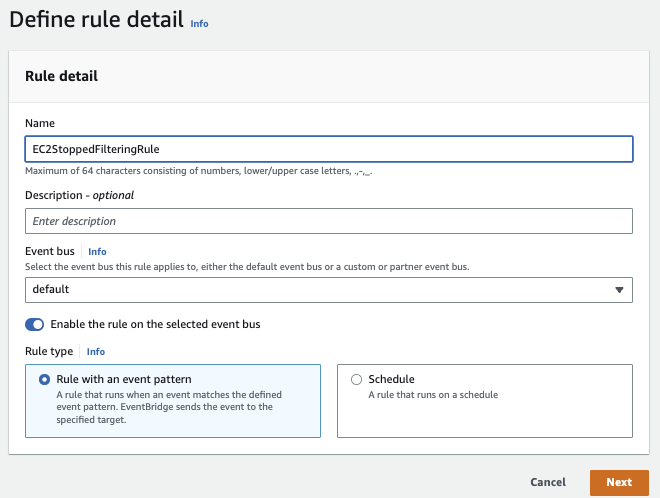

# EventBridge

## Introduction

[Amazon EventBridge](https://aws.amazon.com/eventbridge/) is a serverless event bus service (Formerly CloudWatch Event), which is a router to send messages to Lambda functions, SQS, SNS, or some SaaS providers, using event routing rules. This is not a queueing, topic, or streaming product.

EventBridge is a service for building scalable event-driven applications, enabling highly agile software development via fully managed and secure integrations, cutting costs and reducing time to production.

The following figure illustrates the typical source of events and how EventBridge can process them and send JSON documents to different sinks. Filtering logic may be applied.

{ width=1000 }

EventBridge supports 28+ AWS service as targets. We can also integrate to Partners SaaS services like Datadog, Zendeck, git, Spotify.... and get events from those services. 

EventBridge lets us filter the events before they are sent to the targets, making sure that each target receives only the events they are interested in. A routing rule can customize the JSON sent to the target, by passing only certain parts of the message or by overwriting message attributes with constant values.

By default, there is an EventBridge event bus already created in our account, but we can add our own, via CLI, CloudFormation, CDK,...

We can ingest, filter, transform and deliver events without writing custom code. 

See [AWS CLI events](https://awscli.amazonaws.com/v2/documentation/api/latest/reference/events/index.html) to create an event bus:

```sh
aws events create-event-bus --name myebus
```

With Schema Discovery enabled, we can automatically get a schema definition from the event sent to the bus, saved in a schema registry. Schema Discovery also detects changes to event schema and automatically generates new schema version. From the schema in the registry, we can get code binding for Java, TypeScript, and Python, to jumpstart any consumer apps. 

SAM can be used with the following CLI options to select an existing schema: `Infrastructure event management > ... > EventBridge App from scratch (100+ Event Schemas) >... Schema registry > EventSchema...` 

The same can be done with AWS CLI:

```sh
aws schemas put-code-binding --registry-name discovered-schemas --schema-name com.aws.orders@OrderNotification --language Python36
```

When code bindings are published, we can download them using get-code-binding-source command. 

```sh
aws schemas get-code-binding-source --registry-name discovered-schemas --schema-name com.aws.orders@OrderNotificatio
```

With the **archive and replay** feature, EventBridge can record any events processed by any type of event bus. Replay stores these recorded events in archives. We can choose to record all events, or filter events to be archived by using the same event pattern matching logic used in rules.

## Value Propositions

* No infrastructure to manage.
* Fully managed event backbone to pass events from sources to sinks using routing logic.
* A lot of native, easy, integration with AWS Services.
* Combined with DynamoDB streams, API Gateway, SQS, SNS and Lambda, it is relatively easy to develop quick applications with no server and complex environment to configure. 
* No need to write custom integration code, as could be done in classical ESB, but still support filtering and transformations.
* Enabled archive to support replayability.
* End point to end-point integration, with pipe to do advanced filtering and enrichments. 
* Schedul event creation. 

## Concepts

* **Event** represents a change that happened in the past. Event, in EventBridge has the following structure with metadata and payload in the `detail` element:

```json
{
  "version": "0",
  "id": "6a7e8feb-b491-4cf7-a9f1-bf3703467718",
  "detail-type": "EC2 Instance State-change Notification",
  "source": "aws.ec2",
  "account": "111111111111",
  "time": "2017-12-22T18:43:48Z",
  "region": "us-west-1",
  "resources": [
    "arn:aws:ec2:us-west-1:123456789012:instance/ i-1234567890abcdef0"
  ],
  "detail": {
    "instance-id": " i-1234567890abcdef0",
    "state": "terminated"
  }
}
```

* **Event buses** - An event bus receives events.  In term of design, it should include all the events related to the same business entity. It can be seen as a queue or a topic, or a channel. 
* **Routing rule** matches incoming events and routes them to targets for processing. Routing rule is a json doc which declares elements of the event that need to be matched. When we create a rule, we associate it with a specific event bus, and the rule is matched only to events received by that event bus. Source is a meta-data attribute that is set by the producer application to uniquely identify itself, and can be used to filter and route to different consumer. It is useful to avoid looping on events coming in the event bus from different sources.

```json
{
  "source": [ "aws.ec2" ],
  "detail": {
    "state": [ "terminated" ]
  }
}
```

* For a [pattern](https://docs.aws.amazon.com/eventbridge/latest/userguide/eb-events.html) to match an event,  the event must contain all the field names listed in the pattern. Other fields of the event not mentioned in the pattern are ignored.
* Rule matching operates in constant time. The rule engine is here: [event-rules](https://github.com/aws/event-ruler)
* There are limits on the number of rules per bus (2000). 
* We can only use Scheduled rules on the `default` event bus.

* **EventBridge Pipes**: is used for point to point connection between producer and consumer with filtering, enrichment and transformation capabilities. It may keep message order from source to one destination. The sources can be DynamoDB stream, Kinesis stream, MQ broker, MSK stream, Kafka topic, SQS queue.
* **Global endpoints** is used to facilitate failing over a secondary region, in case of primary disruption. It is linked to CloudWatch Alarm and Route 51 health checks.

* We can enable event replication to send from primary event bus to a secondary region. Events are processed in the secondary Region asynchronously.

* RTO includes time period for triggering CloudWatch alarms and updating statuses for Route 53 health checks.  For RPO, the time includes events that are not replicated to the secondary Region and are stuck in the primary Region until the service or Region recovers. (RTO and RPO can be max of 420s)

## Some examples

[ServerlessLand](https://serverlessland.com/event-driven-architecture/intro) has a lot of CloudFormation examples to deploy different EDA patterns.


??? info "The [AWS Building EDA workshop](https://catalog.us-east-1.prod.workshops.aws/workshops/63320e83-6abc-493d-83d8-f822584fb3cb/en-US)"
    The solution looks like in the following figure:

    

    It is also refactorized in [labs/eda](https://github.com/jbcodeforce/aws-studies/tree/main/labs/eda), (see readme).

    1. The event bridge to API gateway communication, illustrates that events can be pushed to HTTP endpoint, using Basic authentication. The demo also includes a lambda function to act as an authorizer by looking at the header token inside the HTTP request.
    1. Orders event bus has a routing rule to send to Step function when the detail of the event includes a `location` attribute with a prefix starting by "eu". The Step function sends back an event to the same source, `com.aws.orders` with a new order_id. 
    1. Order events can also be propagated to a SNS to do a fan-out pattern.

??? info "Basic example to process EC2 event"
    * Example of creating routing rules to assess when an EC2 is stopped:

    

    * We can use a sandbox feature to test the event type we want to work on (use the event template and then the `detail` element for the payload):

    

    * then define the rule using event pattern as json document, and test the rule:

    

    * specify the target to the routing rule, for example a SNS topic.

    

    * EventBridge can infer the data schema from the event, and use a SchemaRegistry. The SchemaRegitry will help generate code for our applications. 

    

    From this schema definition, in OpenAPI 2.0 format, we can get code sample to get the definition of the events and the marshalizer. 

??? info "AWS Step task to publish event"
    Declaring a task in a Step function to publish an `OrderProcessed` event back to the `Orders` event bus, using Cloud Formation template syntax:

    ```json
        "PublishOrderProcessedEvent": {
            "Type": "Task",
            "Resource": "arn:aws:states:::events:putEvents",
            "Parameters": {
            "Entries": [
                {
                "Detail": {
                    "OrderId": "new_id",
                    "OrderDetails.$": "$.detail"
                },
                "DetailType": "Order Processed",
                "EventBusName": "Orders",
                "Source": "com.aws.orders"
                }
            ]
        },
    ```

??? info "Sending an event via CLI"
    ```sh
    aws events put-events --entries file://OrderNotification_v1.json
    ```

## Solution patterns

* EventBridge can be used to Fan-out to different sinks or delivery targets but with limited way, see next bullet.
* With high transaction per second throughput we need to consider the number of delivery targets. For 1 target and 1 rule, it is common to be over 500k tps. When the number of delivery targets grows, it adds latency
* So when need to fan-out more, we can add SNS as delivery target after EventBridge. EB is used for filtering events. 
* We can define a central event hub to aggregate all the events from AWS Organizations into a single AWS account or region. Apps in different accounts can be authorized to send events to this central hub via resource-based policy.

### Solution Development Approach with EventBridge

* Assess who own the rules, and try to limit the number of rules, and focus on trying to get one rule to one delivery target.
* Define the schema of the event with JSONSchema, including the definition of the AWSEvent envelop.
* Upload the schema to the schema registry
* Create EventBridge bus per business entity (DDD aggregate). For example an `OrderEventBus` will support multiple event types: OrderCreated, OrderUpdated... 
* Generate the Java, Nodejs or Python bindings
* EventBridge is defined at the region level. So producer and consumer apps need to get region information in environment variables.

* The AWS CLI support is [aws events](https://awscli.amazonaws.com/v2/documentation/api/latest/reference/events/index.html#cli-aws-events). 
* [Cloud Formation EventBridge template](https://docs.aws.amazon.com/AWSCloudFormation/latest/UserGuide/aws-resource-events-eventbus.html)
* [EventBridge CDK Construct library in Python](https://docs.aws.amazon.com/cdk/api/v2/python/aws_cdk.aws_events/README.html)


* Classical steps to develop a Lambda function from an Event definition in the schema registry:

  * Create a sam project
  * By getting the code binding from the event model
  * In the Lambda function use `boto3` to access backend and return response back to EventBridge event bus.
  * Implement business logic in the Lambda handler function.

### Some practices

* A simple way to validate the rules execution, we created for an event bus, is to use Amazon CloudWatch as a catch all target. 

```yaml
CarRideEventsLogGroup:
    Type: AWS::Logs::LogGroup
    Properties:
      RetentionInDays: 1
      LogGroupName: "/aws/events/acr/carrides"
CarRideEventsToLogRule:
  Type: AWS::Events::Rule
  Properties:
    Description: Catch all rule for development purposes- go to cloudwatch
    EventBusName: !Ref EventBusName
    EventPattern:
      source:
        - acr.com.car-ride-simulator
    Name: CarRideEventsDevRule
    State: ENABLED
    Targets:
      - Id: Ide60ca354-ebb9-47d2-ad81-6a52867eb9e6
        Arn: !Sub "arn:aws:logs:${AWS::Region}:${AWS::AccountId}:log-group:${CarRideEventsLogGroup}"
```

* Create a rule for the event bus that will act as a "catch-all" for every event passed to the bus, irrespective of source.

### Rule examples

* A **or** statement in a rule:

```json
{
  "detail": {
    "location": ["eu-west", "eu-east"]
  }
}
```

* A prefix based statement:


## Security

* We can [authorize other account](https://docs.aws.amazon.com/eventbridge/latest/userguide/eb-event-bus-perms.html) to PutEvents, PutRule or PutTargets API calls to an existing Event Bus via **resource-based policy**. It can be done for cross-region too.

* [See Example policy: Send events to a custom bus in a different account.](https://docs.aws.amazon.com/eventbridge/latest/userguide/eb-event-bus-perms.html#eb-event-bus-example-policy-cross-account-custom-bus-source)

## Deeper dive

* [Product documentation Tutorials](https://docs.aws.amazon.com/eventbridge/latest/userguide/eb-tutorial.html)
* [Amazon EventBridge CDK Construct Library Event ](https://docs.aws.amazon.com/cdk/api/v2/docs/aws-cdk-lib.aws_events-readme.html)
* [Webinars and videos](https://aws.amazon.com/eventbridge/resources/#Webinars_and_videos)
* [FAQs](https://aws.amazon.com/eventbridge/faqs/)
* [Integration with SaaS Partners](https://docs.aws.amazon.com/eventbridge/latest/userguide/eb-saas.html#eb-supported-integrations)
* [Working with events and the Amazon EventBridge schema registry](https://aws.amazon.com/blogs/compute/working-with-events-and-amazon-eventbridge-schema-registry/)


## FAQs

???- "Benefits of event-driven architectures in context of EventBridge"
      EventBridge offers decoupling protocol to share messages between producers and consumers. It offers schema registry to get some data contract between consumers and producer. It helps to adopt an evolutionary architecture by adding consumer over time and routing rules to those consumers. 
    
???- "Example of filtering and routing rules"

???- "What are the differences between default and custom buses"
      Default is created for each account and used by internal AWS services to propagate events. It is also used by the Scheduler. Custom buses are mandatory to develop real-life solution. An eventbus is mapped to a business entity and support all the events for this entity.

???- "Integrations with Lambda and other destinations"
      * EventBus to Lambda
      * Lambda to EventBus: use SDK to put message to EventBridge.

???- "Explain archive and replay capabilities and best practices"

???- "How to implement API Destination and explain benefits"
???- "How to assist customer in defining an event-driven architecture approach"
???- "How to articulate benefits of EventBridge and assist customer in selecting a messaging platform"
???- "Understanding of limits, throughput, and latencies"