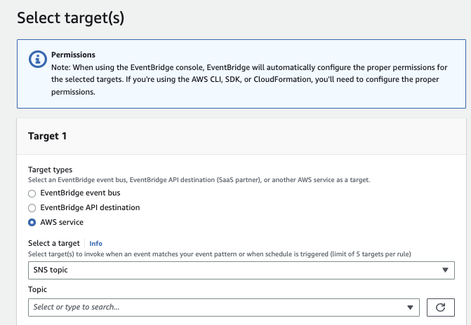

# EventBridge

!!! Info
    Created 11/2023 - Updated 02/13/2024

## Introduction

[Amazon EventBridge](https://aws.amazon.com/eventbridge/) is a serverless event bus service (Formerly CloudWatch Event), which is a router to send messages to Lambda functions, SQS, SNS, or some SaaS providers, using event routing rules. This is not a queueing, topic, or streaming product.

EventBridge is a service for building scalable event-driven applications, enabling highly agile software development via fully managed and secure integrations, cutting costs and reducing time to production.

The following figure illustrates the typical source of events and how EventBridge can process them and sends JSON documents to different sinks. Filtering logic may be applied.

{ width=1000 }

In each AWS account there is an EventBridge default event bus already created, but we can add our own, via CLI, CloudFormation, CDK,... An event bus is a pipeline that receives events. To receive events from SaaS partners, we need to create a partner event source connected to a partner event bus.

EventBridge supports 28+ AWS service as targets. We can also integrate to Partners SaaS services like Datadog, Zendeck, git, Spotify, another EventBridge event bus... 

Target can be an API destination which is made up of an HTTP endpoint, HTTP method (such as GET, POST, PUT), and a connection, which defines the type of authorization and credentials used to call the endpoint. 

EventBridge event bus as target can be use for cross region replication, for events aggregation in a same region. This could be mono or cross AWS accounts. Routing events between event buses in different accounts allows to support workloads grow in size and complexity (the receiver account must grant permission on the target event bus to allow the sending account to send events).

## Value Propositions

* No infrastructure to manage.
* Fully managed event backbone to pass events from sources to sinks using routing logic.
* A lot of native, easy, integration with AWS Services.
* Combined with DynamoDB streams, API Gateway, SQS, SNS and Lambda, it is relatively easy to develop quick applications with no server and complex environment to configure. 
* No need to write custom integration code, as could be done in classical ESB, but still support filtering and transformations.
* Enabled archive to support replayability.
* End point to end-point integration, with pipe to do advanced filtering and enrichments. 
* Support scheduled event creation.
* EventBridge supports three methods for authorization: basic auth, OAuth, and API key

[Read features presentation.](https://aws.amazon.com/eventbridge/features/)

## Concepts

* **Event** represents a change that happened in the past. Event, in EventBridge has the following [structure with metadata](https://docs.aws.amazon.com/eventbridge/latest/userguide/eb-service-event.html) and payload in the `detail` element. The combination of the "source" and "detail-type" fields serves to identify the fields and values found in the "detail" field.

  ```json
  {
    "version": "0",
    "id": "6a7e8feb-b491-4cf7-a9f1-bf3703467718",
    "detail-type": "EC2 Instance State-change Notification",
    "source": "aws.ec2",
    "account": "111111111111",
    "time": "2017-12-22T18:43:48Z",
    "region": "us-west-1",
    "resources": [
      "arn:aws:ec2:us-west-1:123456789012:instance/ i-1234567890abcdef0"
    ],
    "detail": {
      "instance-id": " i-1234567890abcdef0",
      "state": "terminated"
    }
  }
  ```

* **Event buses** - An event bus receives events.  In term of design, it should include all the events related to the same business entity. It can be seen as a queue or a topic, or a channel.
* **[Event Pattern](https://docs.aws.amazon.com/eventbridge/latest/userguide/eb-events.html)** are JSON objects with the same structure of the event that it is matching. The field names must also appear in the event with the same nesting structure. Any additional fields in the event that aren't included in the event pattern are ignored. Event patterns are defined in the context of event rule.

    ```json
    {
      "source": [ "aws.ec2" ],
      "detail": {
        "state": [ "terminated" ]
      }
    }
    ```

* **Routing rule** matches incoming events and routes them to targets for processing. When we create a rule, we associate it with a specific event bus, and the rule is matched only to events received by that event bus. `Source` field is a meta-data attribute that is set by the producer application to uniquely identify itself, and can be used to filter and route to different consumer. It is useful to avoid looping on events coming in the event bus from different sources.

    * Rule matching operates in constant time. The rule engine is in [this event-rules repository.](https://github.com/aws/event-ruler)
    * There are limits on the number of rules per bus (2000).
    * We can only use Scheduled rules on the `default` event bus.
    * EventBridge rules help to filter the events before they are sent to the targets, making sure that each target receives only the events they are interested in. A **routing rule** can customize the JSON sent to the target, by passing only certain parts of the message or by overwriting message attributes with constant values.
    * For each target of a rule, we can define a retry policy that defines how many times and how long EventBridge will try to send the event again. SQS DLQ can be used for undelivered events.

* **Target** is a resource, EventBridge sends events when the rule pattern matches. We can create multiple targets for one rule.
* **EventBridge Pipes**: is used for point to point connection between producer and consumer with filtering, enrichment and transformation capabilities. It may keep message order from source to one destination. The sources can be DynamoDB stream, Kinesis stream, MQ broker, MSK stream, Kafka topic, SQS queue.
* **Global endpoints** is used to facilitate failing over a secondary region, in case of primary disruption. It is linked to CloudWatch Alarm and Route 51 health checks.

* With **Schema Discovery** enabled, we can automatically get a schema definition from the event sent to the bus, saved in a schema registry. Schema Discovery also detects changes to event schema and automatically generates new schema version. From the schema in the registry, we can get code binding for Java, TypeScript, and Python, to jump start any consumer apps.
* With the **archive and replay** feature, EventBridge can record any events processed by any type of event bus. Replay stores these recorded events in archives. We can choose to record all events, or filter events to be archived by using the same event pattern matching logic used in rules.

### Pattern examples

* A **or** statement in a rule:

    ```json
    {
      "detail": {
        "location": ["eu-west", "eu-east"]
      }
    }
    ```

    Or between attribute

    ```json
    {
      "detail": {
        "$or": [
          {"location": ["eu-west"]},
          {"nb_passengers": [ {"numeric": [ ">", 10 ]}]}
        ]
      }
    }
    ```

* A prefix based statement:


### Security

EventBridge uses [AWS Identity and Access Management](https://docs.aws.amazon.com/eventbridge/latest/userguide/eb-iam.html), to manage both identity-based and resource-based policies. To make API calls against the resources we own, EventBridge needs the appropriate permissions.
We can attach *resource-based policies* to the target resource with permission for the EventBridge service to call the required API. 

To invoke an API Gateway endpoint using an EventBridge rule, you could add an allow statement on the "execute-api:Invoke" API action.

```json
```

*Identity-based policies* are attached to an IAM user, group, or role that is assumed by the EventBridge service when the rule is invoked. [See fine-grained access control documentation.](https://docs.aws.amazon.com/eventbridge/latest/userguide/eb-use-conditions.html). Amazon EventBridge has two AWS managed policies you can attach to users or groups: 
**AmazonEventBridgeFullAccess** or **AmazonEventBridgeReadOnlyAccess**.


We can [authorize other account](https://docs.aws.amazon.com/eventbridge/latest/userguide/eb-event-bus-perms.html) to PutEvents, PutRule or PutTargets API calls to an existing Event Bus via **resource-based policy**. It can be done for cross-region too.

[See Example policy: Send events to a custom bus in a different account.](https://docs.aws.amazon.com/eventbridge/latest/userguide/eb-event-bus-perms.html#eb-event-bus-example-policy-cross-account-custom-bus-source)

It provides encryption at rest and in transit by default.

### CLI - SAM

Develop can use [AWS CLI events](https://awscli.amazonaws.com/v2/documentation/api/latest/reference/events/index.html) to create an event bus:

```sh
aws events create-event-bus --name account_events
```

SAM can be used with the following CLI options to select an existing schema: `Infrastructure event management > ... > EventBridge App from scratch (100+ Event Schemas) >... Schema registry > EventSchema...` 

The same can be done with AWS CLI:

```sh
aws schemas put-code-binding --registry-name discovered-schemas --schema-name com.aws.orders@OrderNotification --language Python36
```

When code bindings are published, we can download them using get-code-binding-source command. 

```sh
aws schemas get-code-binding-source --registry-name discovered-schemas --schema-name com.aws.orders@OrderNotificatio
```

## Deployment patterns

A a managed service, it is running under AWS VPC, scale horizontally and is highly available. Custom buses are defined per region. We can enable event replication to send from primary event bus to a secondary region. Events are processed in the secondary Region asynchronously.

EventBridge provides **at-least-once** event delivery to targets, and is designed to retry sending events that are not delivered. Therefore we need to implement idempotency. The default retry policy is 24 hours up to 185 times. It uses exponential back-off and jitter. If a retry policy is unsuccessful in delivering the event, the event is dropped. To avoid losing events after they failed to be delivered to a target, configure a DLQ.

AWS services send event to EventBridge using **best effort** delivery (in some rare cases an event might not be delivered) or with **durable delivery** (at least once).

It is possible for application within a VPC to produce events to event bus, using Interface VPC endpoints, and to be an API destination (ECS task) also using Interface VPC endpoints.


[See EventBridge product documentation](https://docs.aws.amazon.com/eventbridge/latest/userguide/eb-related-service-vpc.html) and [access an AWS service using an interface VPC endpoint](https://docs.aws.amazon.com/vpc/latest/privatelink/create-interface-endpoint.html#create-interface-endpoint.html).

EventBridge with API Destination as target can also use private HTTP endpoint within a VPC. (See [this blog](https://aws.amazon.com/blogs/compute/sending-amazon-eventbridge-events-to-private-endpoints-in-a-vpc/?ref=serverlessland)) and the [git repository aws-sample eventbridge-events-to-vpc](https://github.com/aws-samples/eventbridge-events-to-vpc.git).

When using different regions for a disaster recovery architecture, RTO includes time period for triggering CloudWatch alarms and updating statuses for Route 53 health checks.  For RPO, the time includes events that are not replicated to the secondary Region and are stuck in the primary Region until the service or Region recovers. (RTO and RPO can be max of 420s).

## Solution patterns

Below is a standard end to end solution using common patterns:


* EventBridge can be used to Fan-out to different sinks or delivery targets but with limited way, see next bullet.
* With high transaction per second throughput, developers need to consider the number of delivery targets. For 1 target and 1 rule, it is common to be over 500k tps. Growing the number of delivery targets adds latency.
* So when we need to fan-out more, we can add SNS as delivery target after EventBridge. EB is then used for filtering events.
* We can define a central event hub to aggregate all the events from AWS Organizations into a single AWS account or region. Apps in different accounts can be authorized to send events to this central hub via resource-based policy.
* As events in archive aren't necessarily replayed in the same order that they were added to the archive, it is important to add a timestamp on the event message.
* Add a sequence_id or idempotency_id in the produced event for idempotency supports by consumers.

### Solution development approach with EventBridge

* Assess who own the rules, and try to limit the number of rules, and focus on trying to get one rule to one delivery target.
* Define the schema of the event with JSONSchema, including the definition of the AWSEvent envelop.
* Upload the schema to the schema registry
* Create EventBridge bus per business entity (DDD aggregate). For example an `OrderEventBus` will support multiple event types: OrderCreated, OrderUpdated... 
* Create routing rule with the event patterns that match certain event attribute and route to a target.
* Generate the Java, Nodejs or Python bindings
* EventBridge is defined at the region level. So producer and consumer apps need to get region information in environment variables.

* The AWS CLI support EventBridge via [aws events](https://awscli.amazonaws.com/v2/documentation/api/latest/reference/events/index.html#cli-aws-events). 
* [Cloud Formation EventBridge template](https://docs.aws.amazon.com/AWSCloudFormation/latest/UserGuide/aws-resource-events-eventbus.html)
* [EventBridge CDK Construct library in Python](https://docs.aws.amazon.com/cdk/api/v2/python/aws_cdk.aws_events/README.html)


* Classical steps to develop a Lambda function from an Event definition in the schema registry:

  * Create a sam project
  * By getting the code binding from the event model
  * In the Lambda function, use `boto3` to access the backend and return response back to EventBridge event bus.
  * Implement business logic in the Lambda handler function.

### How tos and best practices

[ServerlessLand](https://serverlessland.com/search?search=eventbridge) has a lot of CloudFormation examples to deploy different EDA patterns.


???- question "How to do a quick validation a routing rule works"
    A simple way to validate the rules execution, is to use Amazon CloudWatch as a catch all target. See the SAM below:

    ```yaml
    CarRideEventsLogGroup:
        Type: AWS::Logs::LogGroup
        Properties:
          RetentionInDays: 1
          LogGroupName: "/aws/events/acr/carrides"
    CarRideEventsToLogRule:
      Type: AWS::Events::Rule
      Properties:
        Description: Catch all rule for development purposes- go to cloudwatch
        EventBusName: !Ref EventBusName
        EventPattern:
          source:
            - acr.com.car-ride-simulator
        Name: CarRideEventsDevRule
        State: ENABLED
        Targets:
          - Id: Ide60ca354-ebb9-47d2-ad81-6a52867eb9e6
            Arn: !Sub "arn:aws:logs:${AWS::Region}:${AWS::AccountId}:log-group:${CarRideEventsLogGroup}"
    ```

* Create a rule for the event bus that will act as a "catch-all" for every event passed to the bus, irrespective of source.


??? info "The [AWS Building EDA workshop solution](https://catalog.us-east-1.prod.workshops.aws/workshops/63320e83-6abc-493d-83d8-f822584fb3cb/en-US)"
    The solution looks like in the following figure:

    

    It is also refactorized in [labs/eda](https://github.com/jbcodeforce/yarfba/tree/main/labs/eda), (see readme).

    1. The event bridge to API gateway communication, illustrates that events can be pushed to HTTP endpoint, using Basic authentication. The demo also includes a lambda function to act as an authorizer by looking at the header token inside the HTTP request.
    1. Orders event bus has a routing rule to send to Step function when the detail of the event includes a `location` attribute with a prefix starting by "eu". The Step function sends back an event to the same source, `com.aws.orders` with a new order_id. 
    1. Order events can also be propagated to a SNS to do a fan-out pattern.

??? info "Basic example to process EC2 event"
    * Example of creating routing rules to assess when an EC2 is stopped:

    

    * We can use a sandbox feature to test the event type we want to work on (use the event template and then the `detail` element for the payload):

    

    * then define the rule using event pattern as json document, and test the rule:

    

    * specify the target to the routing rule, for example a SNS topic.

    

    * EventBridge can infer the data schema from the event, and use a SchemaRegistry. The SchemaRegitry will help generate code for our applications. 

    

    From this schema definition, in OpenAPI 2.0 format, we can get code sample to get the definition of the events and the marshalizer. 

???- question "How to replay events from archive"

??? info "AWS Step task to publish event"
    Declaring a task in a Step function to publish an `OrderProcessed` event back to the `Orders` event bus, using Cloud Formation template syntax:

    ```json
        "PublishOrderProcessedEvent": {
            "Type": "Task",
            "Resource": "arn:aws:states:::events:putEvents",
            "Parameters": {
            "Entries": [
                {
                "Detail": {
                    "OrderId": "new_id",
                    "OrderDetails.$": "$.detail"
                },
                "DetailType": "Order Processed",
                "EventBusName": "Orders",
                "Source": "com.aws.orders"
                }
            ]
        },
    ```

??? question "How to send an event via CLI"
    ```sh
    aws events put-events --entries file://OrderNotification_v1.json
    ```

??? info "Define EventBridge, pattern, rule and target with CDK"
  [See CDK doc](https://docs.aws.amazon.com/cdk/api/v2/python/aws_cdk.aws_events/README.html).

## FAQs

* [Product FAQs](https://aws.amazon.com/eventbridge/faqs/)

???- question "Benefits of event-driven architectures in context of EventBridge"
      EventBridge offers decoupling protocol to share messages between producers and consumers. It offers schema registry to get some data contract between consumers and producer. It helps to adopt an evolutionary architecture by adding consumer over time and routing rules to those consumers. 
    
???- question "Example of filtering and routing rules"

???- question "What is input transformer?"
    [Input transformers](https://docs.aws.amazon.com/eventbridge/latest/userguide/eb-transform-target-input.html) are templating mechanisms to transform input JSON document to another format. The transformation defines variables that use the JSON path to reference values in the original matched event. To access the customer workload use `$.detail`.

???- question "What are the differences between default and custom event buses"
      Default is created for each account and used by internal AWS services to propagate events. It is also used by the Scheduler. Custom buses are mandatory to develop real-life solution. An event bus is mapped to a business entity and support the different event types for this entity.

???- question "Integrations with Lambda and other destinations"
      * EventBus to Lambda
      * Lambda to EventBus: use SDK to put message to EventBridge.

???- question "Explain archive and replay capabilities and best practices"

???- question "How to implement API Destination and explain benefits"
    [API Destination](https://docs.aws.amazon.com/eventbridge/latest/userguide/eb-api-destinations.html) supports integration to any HTTP endpoint. See [this video](https://youtu.be/2ayxa3AdiK0), and the [Python CDK](https://docs.aws.amazon.com/cdk/api/v2/python/aws_cdk.aws_events/ApiDestination.html) to define API destination (authentication can be saved in AWS secrets). 

???- question "How to assist customer in defining an event-driven architecture approach"
???- question "How to articulate benefits of EventBridge and assist customer in selecting a messaging platform"
???- question "Understanding of limits, throughput, and latencies"
    100 event buses per region. Each event bus can have up to 300 rules as the default limit (up to 2000 rules). Each rule can be configured for up to five targets. The event payload (with all metadata) must be less than 256 KB. There is a transactions-per-second quotas for the PutEvents API per AWS Region. Batch events in a single request, if needed. If there is throttling or delays in rule processing, it might come from exceeded the invocation quota limit. EventBridge will re-attempt invocations for up to 24 hours. [See quotas documentation.](https://docs.aws.amazon.com/eventbridge/latest/userguide/eb-quota.html)


## Deeper dive

* [Product documentation Tutorials](https://docs.aws.amazon.com/eventbridge/latest/userguide/eb-tutorial.html)
* [Building event-driven architectures on AWS](https://catalog.us-east-1.prod.workshops.aws/workshops/63320e83-6abc-493d-83d8-f822584fb3cb/en-US/)
* [Event Driven Architecture with Amazon API Gateway, Amazon EventBridge and AWS Lambda](https://labs.skillbuilder.aws/sa/lab/arn%3Aaws%3Alearningcontent%3Aus-east-1%3A470679935125%3Ablueprintversion%2FSPL-TF-200-SVGWEB-1%3A1.0.8-f6cff7f6/en-US)
* [Amazon EventBridge CDK Construct Library Event ](https://docs.aws.amazon.com/cdk/api/v2/docs/aws-cdk-lib.aws_events-readme.html)
* [Webinars and videos](https://aws.amazon.com/eventbridge/resources/#Webinars_and_videos)
* [Integration with SaaS Partners](https://docs.aws.amazon.com/eventbridge/latest/userguide/eb-saas.html#eb-supported-integrations)
* [Working with events and the Amazon EventBridge schema registry](https://aws.amazon.com/blogs/compute/working-with-events-and-amazon-eventbridge-schema-registry/)
* [Amazon EventBridge Scheduler User Guide](https://docs.aws.amazon.com/scheduler/latest/UserGuide/index.html)