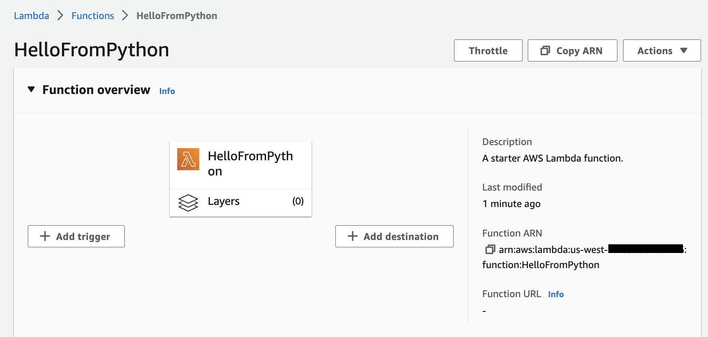
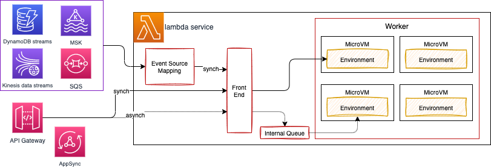
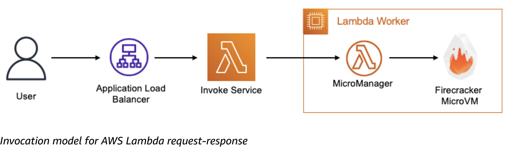
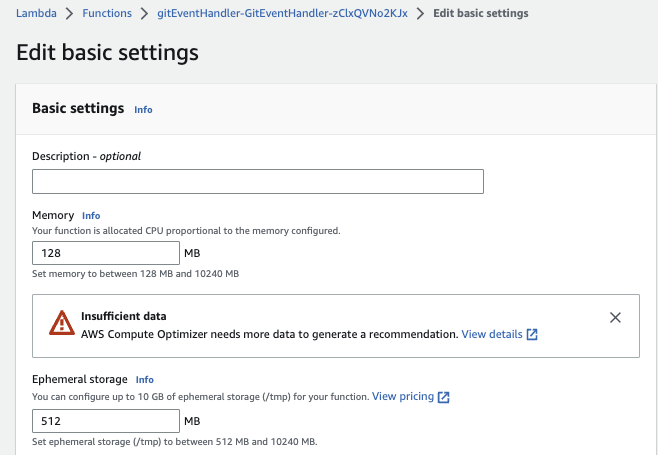
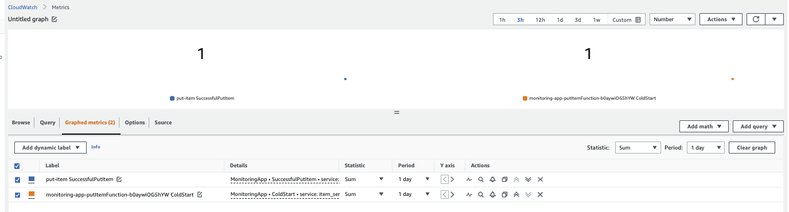
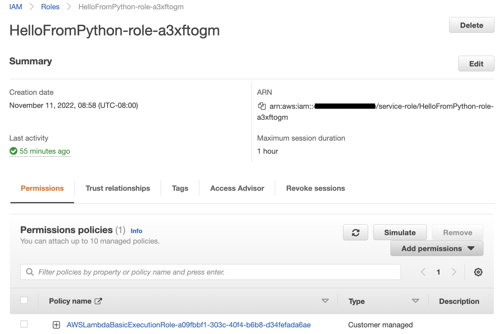
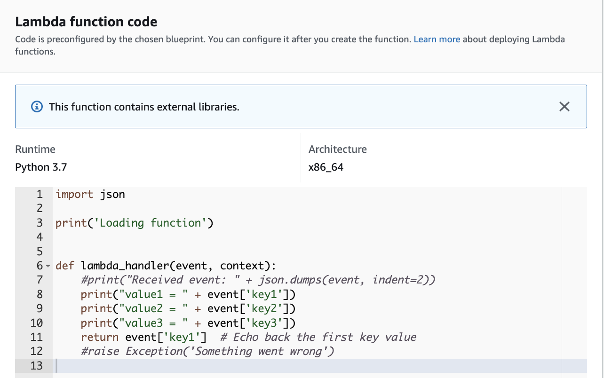
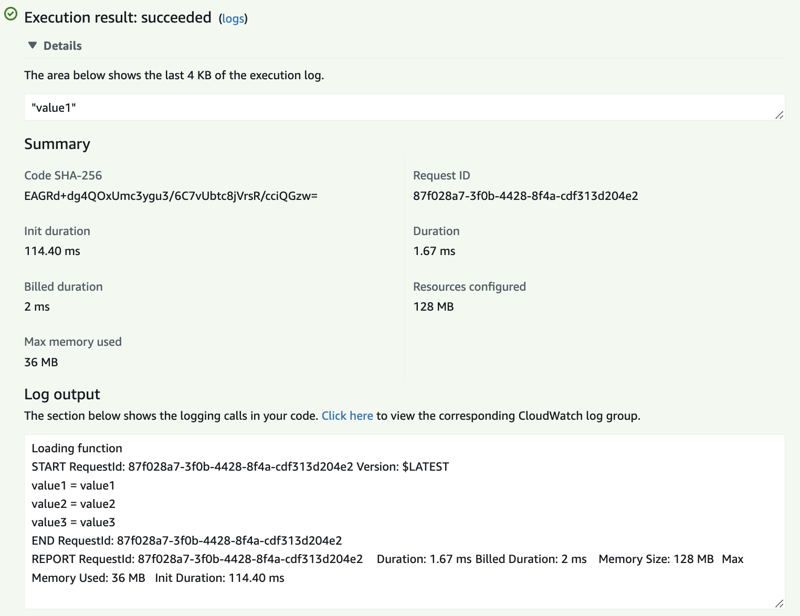
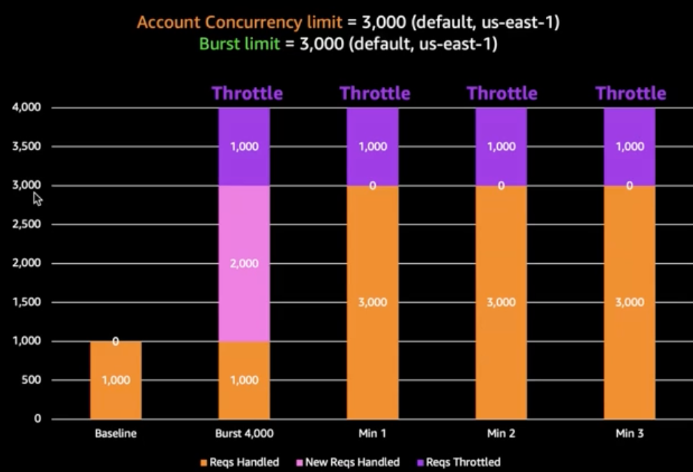

# [AWS Lambda](https://docs.aws.amazon.com/lambda/latest/dg/welcome.html)

This document is a quick summary of the AWS Lambda technology, links to interesting content, labs, and sharing some best practices.

!!! Info
    Created 11/2023 - Updated 01/29/2024

## Introduction

With AWS Lambda, we can run code without provisioning or managing servers or containers.

Upload the source code, and Lambda takes care of everything required to run and scale the code with high availability.

* [Getting started tutorial with free tier](https://aws.amazon.com/getting-started/hands-on/run-serverless-code/)

A  Lambda function has three primary components – trigger, code, and configuration.

{ width=800 }

* **Triggers** describe when a Lambda function should run. A trigger integrates the Lambda function with other AWS services, enabling to run the Lambda function in response to certain API calls that occur in the AWS account.
* An **execution environment** manages the processes and resources that are required to run the function. 
* Configuration includes compute resources, execution timeout, IAM roles (lambda_basic_execution)...
* The execution environment follows the [life cycle](https://docs.aws.amazon.com/lambda/latest/dg/lambda-runtime-environment.html) as defined below (time goes from left to right):

    { width=800 }

    * In **Init phase** Lambda creates or unfreezes an execution environment with the configured resources, downloads the code for the function and all the needed layers, initializes any extensions, initializes the runtime, and then runs the function’s initialization code. After init, the environment is 'Warm'. The extension and runtime inits is part of the `cold start` (<1s).
    * **Invoke phase** Lambda invokes the function handler. After the function runs to completion, Lambda prepares to handle another function invocation.
    * **Shutdown phase:** Lambda shuts down the runtime, alerts the extensions to let them stop cleanly, and then removes the environment.

* The Lambda service is split into the control plane and the data plane. The control plane provides the management APIs (for example, `CreateFunction`, `UpdateFunctionCode`). The data plane is where Lambda's API resides to invoke the Lambda functions. It is HA over multi AZs in same region.
* Lambda Workers are bare metal Amazon EC2 Nitro instances which are launched and managed by Lambda in a separate isolated AWS account which is not visible to customers. Each workers has one to many [Firecraker microVMs](https://aws.amazon.com/blogs/aws/firecracker-lightweight-virtualization-for-serverless-computing/). There is no container engine. Container image is just for packaging the lambda code as zip does.

    {width=1000}

    * Synchronous calls is used for immediate function response, with potential errors returned to the caller. It may return throttles when we hit the concurrency limit.
    * Asynchronous calls return acknowledgement. Event payloads are always queued for processing before invocation. Internal SQS queue persists messages for up to 6 hours. Queued events are retrieved in batches by Lambda’s poller fleet. The poller fleet is a group of Amazon EC2 instances whose purpose is to process queued event invocations which have not yet been processed. When an event fails all processing attempts, it is discarded by Lambda. The dead letter queue (DLQ) feature allows sending unprocessed events from asynchronous invocations to an Amazon SQS queue or an Amazon SNS topic defined by the customer. Asynchronous processing should be more scalable.
    * Event source mapping is used to pull messages from different streaming sources and then synchronously calls the Lambda function. It reads using batching and send all the events as argument to the function. If the function returns an error for any of the messages in a batch, Lambda retries the whole batch of messages until processing succeeds or the messages expire. It supports error handling. 
    * If the service is not available. Callers may queue the payload on client-side to retry. If the invoke service receives the payload, the service attempts to identify an available execution environment for the request and passes the payload to that execution environment to complete the invocation. It may lead to create this execution environment.

    { width=800 }


* Code: Java, Node.js, C#, Go, or Python. There is one runtime that matches the programming language.
* Pay only for what we use: # of requests and CPU time, and the amount of memory allocated.
* Lambda functions always operate from an AWS-owned VPC. By default, the function has the full ability to make network requests to any public internet addresses — this includes access to any of the public AWS APIs.
* Only enable the functions to run inside the context of a private subnet in a VPC, when we need to interact with a private resource located in a private subnet. In this case we need to enable internet outbound connection, like NAT, network policies, IGW.
* When connecting a Lambda function to a VPC, Lambda creates an elastic network interface, ENI, for each combination of subnet and security group attached to the function.
* AWS Lambda automatically monitors Lambda functions and reports metrics through Amazon CloudWatch. To help monitoring the code as it executes, Lambda automatically tracks the number of requests, the latency per request, and the number of requests resulting in an error and publishes the associated metrics.  Developer can leverage these metrics to set custom alarms.
* To reuse code in more than one function, consider creating a Layer and deploying it. A layer is a ZIP archive that contains libraries, a custom runtime, or other dependencies.
* Lambda supports versioning and we can maintain one or more versions of the lambda function. We can reduce the risk of deploying a new version by configuring the alias to send most of the traffic to the existing version, and only a small percentage of traffic to the new version. Below  is an example of creating one Alias to version 1 and a routing config with Weight at 30% to version 2. Alias enables promoting new lambda function version to production and if we need to rollback a function, we can simply update the alias to point to the desired version. Event source needs to use Alias ARN for invoking the lambda function.

    ```sh
    aws lambda create-alias --name routing-alias --function-name my-function --function-version 1  --routing-config AdditionalVersionWeights={"2"=0.03}
    ```
    
* Each lambda function has a unique ARN.
* Deployment package is a zip or container image.
* Lambda scales automatically in response to incoming requests. Concurrency is subject to quotas at the AWS Account/Region level. It is possible to use **Reserved concurrency**, which splits the pool of available concurrency into subsets. A function with reserved concurrency only uses concurrency from its dedicated pool. This is helpful to avoid one lambda function to take all the concurrency quota and impact other functions in the same region.
* For functions that take a long time to initialize, or that require extremely low latency for all invocations, **provisioned concurrency** enables to pre-initialize instances of the function and keep them running at all times.
* We can allocate up to 10 GB of memory to a Lambda function. Lambda allocates CPU and other resources linearly in proportion to the amount of memory configured.

## Criteria to use lambda

### Technical constraints

* Per region deployment.
* Must run under 15 min.
* Memory from 128MB to 10GB.
* Maximum 1000 concurrent calls.
* Code in compressed zip should be under 50MB and 250MB uncompressed.
* Disk capacity for /tmp is limited to 10GB.

### Design constraints

* When migrating existing application [review the different design patterns to consider](./index.md/#designing-for-serverless).
* Think about co-existence with existing application and how API Gateway can be integrated to direct traffic to new components (Lambda functions) without disrupting existing systems. With [API Gateway](./apigtw.md) developer can export the SDK for the business APIs to make integration easier for other clients, and can use throttling and usage plans to control how different clients can use the API.
* Do cost comparison analysis. For example API Gateway is pay by the requests, while ALB is priced by hours based on the load balance capacity units used per hour. Lambda is also per request based.
* Not everything fits into the function design. Assess if it makes sense to map REST operations in the same handler.
* Assess for Fargate usage when the application is in container, may run for a long period. Larger packaging may not be possible to run on Lambda. Applications that use non HTTP end point, integrate to messaging middleware with Java based APIs.

## Security

For AWS Lambda, AWS manages the underlying infrastructure and foundation services, the operating system, and the application platform. Developer need to ensure code, libraries, configuration, IAM are well set. Some security considerations:

* Data privacy with encryption at rest with customer managed Key, encryption in transit, access control.
* Function runtime environment variables are secured by encryption using a Lambda-managed KMS key (named `aws/lambda`). The `CreateFunction` API or `UpdateFunctionConfiguration` may use KMS Keys.
* AWS X-Ray also encrypts data by default.
* TLS1.2 for all public APIs.
* Run on EC2 with Nitro System for better security isolation.
* Code releases go through security review and penetration testing.
* It provides a code signing feature to ensure only trusted code is run in the Lambda function.

* Lambda also supports function URLs, a built-in HTTPS endpoint for invoking functions. No need for API Gateway and ALB.
* Each Lambda exec environment includes a writeable /tmp folder: files written within it, remain for the lifetime of the execution environment.
* Also to enable the Lambda function to access resources inside the private VPC, we must provide additional VPC-specific configuration information that includes VPC subnet IDs and security group IDs and the `AWSLambdaVPCAccessExecutionRole` policy. AWS Lambda uses this information to set up elastic network interfaces (ENIs) that enable the function to connect securely to other resources in the VPC. 

    

    As Lambda function always runs inside a VPC owned by the Lambda service, the function accesses resources in our VPC using a Hyperplane ENI. Hyperplane ENIs provide NAT capabilities from the Lambda VPC to our account VPC using VPC-to-VPC NAT (V2N).

    If it runs out of IP@ then we will have EC2 error types like `EC2ThrottledException` and the function will not scale. So be sure to have multiple AZ/ subnets and enough IP@.

* For the function to access the internet, route outbound traffic to a NAT gateway in one public subnet in the VPC.
* To establish a private connection between the VPC and Lambda, create an interface VPC endpoint (using AWS PrivateLink). Traffic between the VPC and Lambda does not leave the AWS network.

    ```sh
    aws ec2 create-vpc-endpoint --vpc-id vpc-ec43eb89 --vpc-endpoint-type Interface --service-name \
    com.amazonaws.us-west-2.lambda --subnet-id subnet-abababab --security-group-id sg-1a2b3c4d      
    ```

Endpoint policy can be attached to the interface endpoint to add more control on which resource inside the VPC can access the lambda function (Principal = user, Allow lambda:InvokeFunction on resource with the function arn).

### Policies and roles

With Lambda functions, there are two sides that define the necessary scope of permissions – permission to invoke the function (using **resource policies**), and permission of the Lambda function itself to act upon other services (IAM **execution role**).

The **execution role** must include a trust policy that allows Lambda to “AssumeRole” so that it can take that action for another service.

Lambda resource policies are :

* Associated with a "push" event source such as Amazon API Gateway.
* Created when we add a trigger to a Lambda function.
* Allows the event source to take the `lambda:InvokeFunction` action.

We can use Parameter Store, from System Manager, to reference Secrets Manager secrets,  creating a consistent and secure process for calling and using secrets and reference data in the code and configuration script. 

## Scaling and [quotas](https://docs.aws.amazon.com/lambda/latest/dg/gettingstarted-limits.html)

Lambda invokes the code in a secure and isolated execution environment, which needs to be initialized and then executes the function code for the unique request it handles. Second request will not have the initialization step. When requests arrive, Lambda reuses available execution environments, and creates new ones if necessary.

The number of execution environments determines the concurrency. Limited to 1000 by default.

When the number of requests decreases, Lambda stops unused execution environments to free up scaling capacity for other functions.

Use the Lambda CloudWatch metric named `ConcurrentExecutions` to view concurrent invocations for all or individual functions. To estimate concurrent requests use:  **Request per second * Avg duration in seconds = concurrent requests**

Lambda scales to very high limits, but not all account's concurrency quota is available immediately, so requests could be throttled for a few minutes in case of burst. 

There are two scaling quotas to consider with concurrency. Account concurrency quota (1000 per region) and burst concurrency quota (from 500 to 3000 per min per region). Further requests are throttled, and lambda returns HTTP 429 (too many requests).

Use `concurrency limit` to guarantee concurrency availability for a function, or to avoid overwhelming a downstream resource that the function is interacting with.

If the test results uncover situations where functions from different applications or different environments are competing with each other for concurrency, we probably need to rethink the account segregation strategy and consider moving to a multi-account strategy.

Memory is the only setting that can impact performance. Both CPU and I/O scale linearly with memory configuration. So in case of low performance start by adding memory to the lambda.




* [AWS Lambda Power Tuning tool to find the right memory configuration](https://github.com/alexcasalboni/aws-lambda-power-tuning).
* [Understanding AWS Lambda scaling and throughput - an AWS blog](https://aws.amazon.com/blogs/compute/understanding-aws-lambda-scaling-and-throughput/).

### Edge Function

When we need to customize the CDN content, we can use Edge Function to run closer to the end users.

CloudFront provides two types: CloudFront functions or Lambda@Edge.

Edge can be used for:

* Website security and privacy.
* Dynamic web application at the Edge.
* Search engine optimization (SEO).
* Intelligently route across origins and data centers.
* Bot mitigation at the Edge.
* Real-time image transformation.
* User authentication and authorization.

## Monitoring

Distributed tracing helps pinpoint where failures occur and what causes poor performance. Tracing is about understanding the path of data as it propagates through the components of the application.

All Lambda functions logs are automatically integrated with CloudWatch. Amazon CloudWatch Lambda Insights is a monitoring and troubleshooting solution for serverless applications running on Lambda. Lambda Insights collects, aggregates, and summarizes system-level metrics. It also summarizes diagnostic information such as cold starts and Lambda worker shutdowns to help isolate issues with the Lambda functions and resolve them quickly.

**X-Ray** provides an end-to-end view of requests as they travel through our application and the underlying components. We can use AWS X-Ray to visualize the components of the application, identify performance bottlenecks, and troubleshoot requests that resulted in an error.

See this article: [Operating Lambda with logging and custom metrics.](https://aws.amazon.com/blogs/compute/operating-lambda-logging-and-custom-metrics/)

### Custom metrics

Custom metrics can be used for tracking statistics in the application domain, instead of measuring performance related to the Lambda function. Use AWS SDK with the CloudWatch library and the `putMetricData` API.

???- "Javascript Code Example"
    ```js
    const AWSXRay = require('aws-xray-sdk-core')
    const AWS = AWSXRay.captureAWS(require('aws-sdk'))
    const cloudwatch = new AWS.CloudWatch()

    exports.putMetric = async (name, unit = MetricUnit.Count, value = 0, options) => {
        try {
            log.debug(`Creating custom metric ${name}`)
            const metric = buildMetricData(name, unit, value, options)
            await cloudwatch.putMetricData(metric).promise()
        } catch (err) {
            log.error({ operation: options.operation !== undefined ? options.operation : 'undefined_operation', method: 'putMetric', details: err })
            throw err
        }
    }

    const buildMetricData = (name, unit, value, options) => {
        let namespace = 'MonitoringApp',
            service = process.env.SERVICE_NAME !== undefined ? process.env.SERVICE_NAME : 'service_undefined'

        if (options) {
            if (options.namespace !== undefined) namespace = options.namespace
            if (options.service !== undefined) service = options.service
            delete options.namespace
            delete options.service
        }

        const metric = {
            MetricData: [
                {
                    MetricName: name,
                    Dimensions: buildDimensions(service, options),
                    Timestamp: new Date(),
                    Unit: unit,
                    Value: value
                },
            ],
            Namespace: namespace
        };
        return metric
    }
    ```

Metrics are in namespace in CloudWatch. 



But those synchronous calls consumes resources and adds latency to the lambda's response. To overcome this overhead, we can adopt an asynchronous strategy to create these metrics. This strategy consists of printing the metrics in a structured or semi-structured format as logs to Amazon CloudWatch Logs and have a mechanism in background processing these entries based on a filter pattern that matches the same entry that was printed.

### Using the Embedded Metric Format:

???- "EMF logging code example"
    ```js
    const { createMetricsLogger, Unit } = require("aws-embedded-metrics")
    exports.logMetricEMF = async (name, unit = Unit.Count, value = 0, dimensions) => {
        try {
            const metrics = createMetricsLogger()
            metrics.putDimensions(buildEMFDimensions(dimensions))
            metrics.putMetric(name, value, unit)
            metrics.setNamespace(process.env.AWS_EMF_NAMESPACE !== undefined ? process.env.AWS_EMF_NAMESPACE : 'aws-embedded-metrics')
            log.debug(`Logging custom metric ${name} via Embbeded Metric Format (EMF)`)
            log.debug(metrics)
            await metrics.flush()
        } catch (err) {
            log.error({ operation: dimensions.operation !== undefined ? options.dimensions : 'undefined_operation', method: 'logMetricEMF', details: err })
            throw err
        }
    }

    const buildEMFDimensions = (dimensions) => {
    let service = process.env.SERVICE_NAME !== undefined ? process.env.SERVICE_NAME : 'service_undefined'

        if (dimensions) {
            if (dimensions.service !== undefined) service = dimensions.service
            delete dimensions.namespace
            delete dimensions.service
        }

        return dimensions
    }
    ```

### Find cold starts

Example of cloudwatch insight query:

```sql
filter @type = "REPORT"
    | parse @message /Init Duration: (?<init>\S+)/ 
    | stats count() as total, count(init) as coldStarts, 
        median(init) as avgInitDuration,
        max(init) as maxInitDuration,
        avg(@maxMemoryUsed)/1000/1000 as memoryused
by bin(5min)
```

## Hands-on

### Getting Started

???- info "Basic getting started"
    In a serverless deployment, we provide all the components necessary to deploy our function: 

    * Code, bundled with any necessary dependencies
    * CloudFormation template, which is the blueprint for building the serverless environment. AWS SAM helps building this CF template.

    * Can start from a blueprint

        { width=800 }

    * To get the function to upload logs to cloudWatch, select an existing role, or create a new one
        
        { width=800 }

        Here the example of role created

        { width=800 }

    * Add the code as an implementation of an handler function:

        { width=800 }

    * Create a test event (a request) and run the test and get the resources and logs output.

        { width=800 }

    * Verify configuration and monitoring.


### Python function with dependencies

It is common to have a function that needs libraries not in the standard Python 3.x environment. The approach is to use a zip file as source of the function with all the dependencies inside it. The process to build such zip can be summarized as:

* `lambda` is the folder with code and future dependencies. It has a `requirements.txt` file to define dependencies.
* do a `pip install --target ./package -r requirements.txt`
* zip the content of the package directory in a zip in the lambda folder

    ```sh
    cd package
    zip -r ../lambda-layer.zip .
    ```

* The zip can be used as a **layer**, so reusable between different lambda functions. For that upload the zip to a `S3` bucket and create a layer in the Lambda console, referencing the zip in S3 bucket.
* A layer can be added to any lambda function, then the libraries included in the layer can be imported in the code. Example is the XRay tracing capability in Python.
* We can also add the lambda-function code in the zip and modify the existing function, something like:

    ```sh
    zip lambda-layer.zip lambda-handler.py
    aws lambda update-function-code --function-name  ApigwLambdaCdkStack-SageMakerMapperLambda2EFF1AC9-bERmXFWzvWSC --zip-file fileb://lambda-layer.zip
    ```

See also [the from-git-to-slack-serverless repository](https://github.com/jbcodeforce/from-git-to-slack-serverless) for a Lambda example in Python using SAM for deployment.

### Java based function

[We can run java code in Lambda](https://docs.aws.amazon.com/lambda/latest/dg/lambda-java.html) and implement different [handlers](https://docs.aws.amazon.com/lambda/latest/dg/java-handler.html).

```java
import com.amazonaws.services.lambda.runtime.Context;
import com.amazonaws.services.lambda.runtime.RequestHandler;

public class HandlerWeatherData implements RequestHandler<WeatherData,WeatherData>{
    
    @Override
    public WeatherData handleRequest(WeatherData event, Context context) {
```

Code can be uploaded as jar or zip to a S3 bucket, and CloudFormation template or CDK can define the lambda function.

In the Java code template in [folder](https://github.com/jbcodeforce/yarfba/tree/main/labs/lambdas/java-sample) the Lambda processes a JavaBean and we can build a docker image, push to ECR and use CDK to deploy the function. 

```dockerfile
FROM public.ecr.aws/lambda/java:11
COPY target/classes ${LAMBDA_TASK_ROOT}
COPY target/dependency/* ${LAMBDA_TASK_ROOT}/lib/
CMD [ "jbcodeforce.HandlerWeatherData::handleRequest" ]
```

[See also the docker image lambda java.](https://hub.docker.com/r/amazon/aws-lambda-java)


To be sure the dependencies are used, use the build plugin in maven:

```xml
    <groupId>org.apache.maven.plugins</groupId>
    <artifactId>maven-dependency-plugin</artifactId>
    <version>3.1.2</version>
       ....
```

See the [readme for instructions](https://github.com/jbcodeforce/yarfba/tree/main/labs/lambdas/java-sample/README.md).

[Product documentation: Deploy Java Lambda functions with container images.](https://docs.aws.amazon.com/lambda/latest/dg/java-image.html).

Here is a Lambda Function CDK declaration using ECR image

```python
repository= aws_ecr.Repository.from_repository_name(self,"java-lambda-ecr-repo","jbcodeforce/java-lambda")

aws_lambda.DockerImageFunction(self,"JavaLambda",
            code=aws_lambda.DockerImageCode.from_ecr(repository),
            role=sm_role,
            tracing=aws_lambda.Tracing.ACTIVE,
             architecture=aws_lambda.Architecture.ARM_64)
```

[Java on AWS Lambda workshop ](https://catalog.workshops.aws/java-on-aws-lambda/en-US) to discover best practices for Java and Lambda using GraalVM or SnapStart

### CI/CD

[Workshop: Building CI/CD pipelines for Lambda canary deployments using AWS CDK](https://catalog.us-east-1.prod.workshops.aws/workshops/5195ab7c-5ded-4ee2-a1c5-775300717f42/en-US)

### Other personal implementations

* [Lamdba prepared by SAM + tutorial form AWS Lambda powertool](https://github.com/jbcodeforce/yarfba/tree/main/labs/lambdas/lambda-dynamo) with API gateway.
* [S3 to Lambda to S3 for data transformation](https://github.com/jbcodeforce/yarfba/tree/main/labs/lambdas/s3-lambda)
* [Big data SaaS: lambda to call SageMaker](https://github.com/jbcodeforce/big-data-tenant-analytics/tree/main/setup/apigw-lambda-cdk/lambda)

## FAQs

* [The Amazon official FAQs.](https://aws.amazon.com/lambda/faqs/)

## Best practices

Extracted from [the Top best practices and tips for building Serverless applications video](https://broadcast.amazon.com/videos/349995)

???- "Be sure to measure concurrency correcly"
    Concurrency = TPS * Duration. Ex 100 Tx/s for and average duration of 500ms = so concurrency id 50, but is it taks 2s per tx, then c=200. So Optimize for duration <1 and monitor ConcurrentExecutions metric.

???- "Lambda bursting and scaling"
    Burst limit may differ per region. Each new lambda invocation reuse available execution contexts, and it creates new contexts until the account concurrency limit is reached. So initial burst is subject to the account concurrency limit which may be 1000, but it then scales by +500 contexts per minute until burst limit (3000), once the burst limit is reached, all other requests are throttled.
    { width=600 }

???- "Reuse the execution environment properly"
    Initialize outside of the handler, lazy load it when needed, and cache static assets in /tmp. In Java the class constructor is only called at cold-start.

???- "Control and limit dependencies"
    Include only what is needed. In java use the shade maven plugin to create a uber jar which removes duplicates. Use exclusion of jars from aws-sdk. Attach SDK in a layer.

???- "Tell the SDK what to do"
    Most of the time SDK will know in which region it is, but it costs time, so prefer to use env variables and get in the code. Try to reuse connection, and turn on this. It can reduce CPU utilization up to 50%.

???- "VPC - Lambda"
    Lambda must target private subnets and never public one. Target two subnets for HA. Do not remove created ENIs in EC2 console. Controls the VPCs, subnets and security groups the Lambda functions can target.

???- "Lambda chaining"
    Avoid chaining directly lambda functions synchronously. Use Lambda destination or Step Functions.

???- "Inject secrets safely"
    Inject them in environment variables, where values come in the function yaml definition.


## More reading

* [Serverless application lens:](https://docs.aws.amazon.com/wellarchitected/latest/serverless-applications-lens/welcome.html) focus on how to design, deploy, and architect serverless application workloads in the AWS Cloud.
* [Security overview of AWS Lambda - whitepaper](https://docs.aws.amazon.com/pdfs/whitepapers/latest/security-overview-aws-lambda/security-overview-aws-lambda.pdf)
* [Using an Amazon S3 trigger to invoke a Lambda function](https://docs.aws.amazon.com/lambda/latest/dg/with-s3-example.html).
* [Tutorial: Resize Images on the Fly with Amazon S3, AWS Lambda, and Amazon API Gateway](https://aws.amazon.com/blogs/compute/resize-images-on-the-fly-with-amazon-s3-aws-lambda-and-amazon-api-gateway/).

* [Best Practices for Developing on AWS Lambda](https://aws.amazon.com/blogs/architecture/best-practices-for-developing-on-aws-lambda/).
* [Power tuning tool for Lambda.](https://serverlessrepo.aws.amazon.com/applications/arn:aws:serverlessrepo:us-east-1:451282441545:applications~aws-lambda-power-tuning)
* [Serverless Patterns Collection (Serverlessland)](https://serverlessland.com/patterns?framework=SAM).
* [Youtube videos - Build on serverless 2019](https://www.youtube.com/playlist?list=PLJV9303TMVKzFk1CNV_bStVZd3ZhW8dNz).
* [Lambda- configuring reserved concurrency](https://docs.aws.amazon.com/lambda/latest/dg/configuration-concurrency.html)
* [Increasing real-time stream processing performance with Amazon Kinesis Data Streams enhanced fan-out and AWS Lambda](https://aws.amazon.com/blogs/compute/increasing-real-time-stream-processing-performance-with-amazon-kinesis-data-streams-enhanced-fan-out-and-aws-lambda/)
* [Powertool for AWS Lambda - Python](https://github.com/awslabs/aws-lambda-powertools-python) a developer toolkit to implement Serverless best practices and increase developer velocity.
* [Powertool for AWS Lambda - Java](https://github.com/awslabs/aws-lambda-powertools-java).