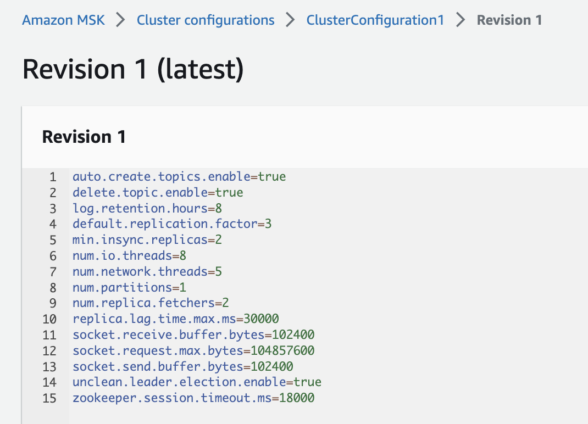
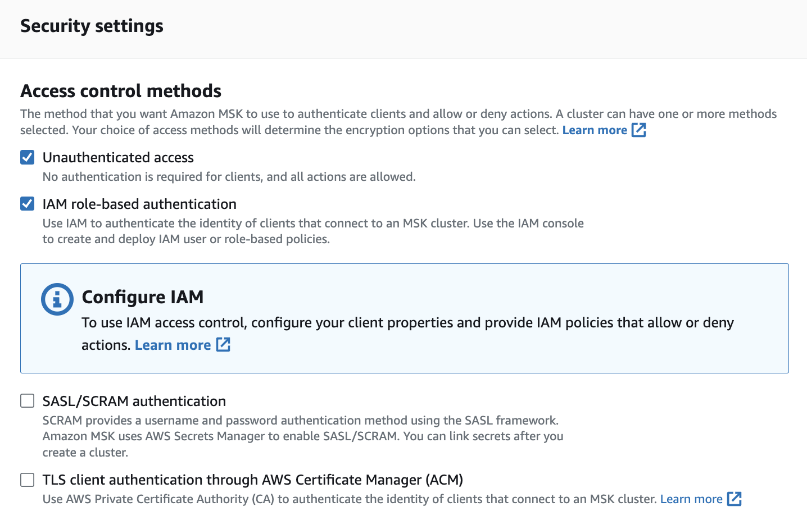

# [AWS Managed Streaming for Apache Kafka](https://aws.amazon.com/msk/)

## Value Propositions

* Fully managed Kafka cluster and Kafka Connect cluster.
* Highly available with deployment over multi AZs by default. Deployed in Private subnets.
* Pay-as-you go pricing.
* [AWS MSK SDK API](https://docs.aws.amazon.com/msk/1.0/apireference/what-is-msk.html) to create and manage cluster resources.
* Use the same Kafka tools as open source Apache Kafka, like Cruise control, Mirror maker 2, Kafka connect...
* User interface to manage topics, consumer groups is not provided, and any open source can be used. 
* Integrated with IAM, to use IAM role to control who can access and create topics on the cluster, send data... Client can assume the defined role.
* Integrated with VPC security group to control external machines access.
* Provisioning with IaC in CloudFormation or CDK. 
* Integrate with Amazon Glue Schema Registry for schema evolution
* Direct integration with Apache Flink for real-time processing using Zeppelin Notebook or custom code via s3 bucket.
* The data storage is backed by Amazon Elastic Block Storage (Amazon EBS) volumes and remote storage.
* Support [tiered storage](https://docs.aws.amazon.com/msk/latest/developerguide/msk-tiered-storage-retention-rules.html) to move data out of retention period window to longer storage  class.
* Longer persistence can be added by using S3 Sink Kafka Connector to S3 bucket and then AWS Glacier.

### Typical use cases:
    
* Data ingestion for data lakes, data warehouses
* Event streaming with time windowing analytics: click streams
* Event sourcing in an EDA to support event backbone and event store capabilities.
* Messaging support for asynchronous communication between microservices, to increase decoupling.
* Metrics and log aggregations 
* Deliver messages to Spark Streaming jobs

### Moving to a managed service for Kafka

We may want to assess the following items:

* Are you managing your Kafka infrastructure today? on which platform (VM, Kubernetes, bare metal)?
* Number of cluster and how may nodes per cluster?
* What are the Sources of the event? 
* What are the target Sinks?
* How are you consuming events from Kafka today?
* How do you persist the records? and what is the current second level of storage?
* How do you currently upgrade your Kafka clusters? 
* How elastic are your current Kafka clusters? Do you scale up or down according to message traffic?
* Do you use Kafka Connect? How do you operate those connectors today?
* Does your Kafka cluster rely on ZooKeeper?
* How do you think about resiliency for your Kafka clusters? Are they able to tolerate a zonal failure today?

## Getting Started

* MSK cluster may be created from the AWS console, the CLI, Cloud Formation or CDK.
* We can connect clients from up to five different VPCs with MSK Serverless clusters.
* Client connection can IAM user to authenticate to MSK, using a special Java class for that (in the `aws-msk-iam-auth-1.1.7-all.jar`), or use the SASL, or Plain connection types.
* Specify EC2 machine instance type from `kafka.t3.small` to `kafka.m5.24xlarge`.
* Routing rules in the security group needs to support all tcp traffic on Zookeeper port 2181, and the different kafka bootstrap ports depending on the authentication procotol used: (9098 for IAM, 9092 for PLAIN, 9094 SASL)

### Manual creation using AWS Console

The AWS Console MSK creation wizard is quite simple to follow. Some considerations to address:

* Can create serverless or provisioned cluster.
* Recommended version is kafka 2.8.1. BUT for getting [tiered storage](https://docs.aws.amazon.com/msk/latest/developerguide/msk-tiered-storage.html), there is only one version 2.8.2.tiered
* VPC needs DNS hostnames and DNS resolution enabled and at least 2 subnets for 2 AZs.
* To use [provisioned storage throughput](https://docs.aws.amazon.com/msk/latest/developerguide/msk-provision-throughput.html) up to 1000 MiB/s, choose kafka.m5.4xlarge or a larger broker type.
* Think about what are the default configuration for the Kafka brokers, retention, topic creation... and define a MSK configuration which can be used by different clusters. 

    { width=500 }

* A security group is assigned to the cluster ENI's. Public access can be set up after cluster creation. For public access, the security groups that we select must have inbound TCP rules configured to allow public access. The ports that we can use to configure the rules depend on the access-control methods that we set for the cluster.
* The access control methods will define how client authenticate to Kafka. 

    { width=500 }

* Serverless clusters require IAM authentication. And Consumer, Topic, and Consumer Group metrics are always enabled.
* For IAM authentication, always create an IAM role, with the policy to access the cluster and create, read, write to topic.
* To get visibility of the connection to kafka, add a LogGroup on CloudWath and link the group during the cluster creation.
* Retrieve the bootstrap server URL

### EC2 Client

Be sure to create a EC2 in the same VPC as MSK, add ssh port 22 in security group and outbound rule to reach internet. Then install java on the EC2:

```sh
sudo yum -y install java-11
# Kafka binary for the tools
wget https://archive.apache.org/dist/kafka/3.4.1/kafka_2.12-3.4.1.tgz
tar -xzf kafka_2.12-3.4.1.tgz 
# download the Amazon MSK IAM JAR file under kafka_2.12-<>/libs
wget https://github.com/aws/aws-msk-iam-auth/releases/download/v1.1.7/aws-msk-iam-auth-1.1.7-all.jar
```

* Add a `client.properties` under kafka_2.12-<>/bin folder with the following declaration when using IAM:

```sh
security.protocol=SASL_SSL
sasl.mechanism=AWS_MSK_IAM
sasl.jaas.config=software.amazon.msk.auth.iam.IAMLoginModule required;
sasl.client.callback.handler.class=software.amazon.msk.auth.iam.IAMClientCallbackHandler
```

For plaintext:

```sh
security.protocol=PLAINTEXT

```


* Get Cluster Bootstrap address. (Be sure to have the AWS key and token in EC2 instance. [See the client library note](https://github.com/aws/aws-msk-iam-auth))

```sh
aws kafka get-bootstrap-brokers --region us-west-2 --cluster-arn arn:aws:kafka....
```

* Be sure there is a inbound rules in Security group used by MSK to authorize traffic on the port number of the bootstrap broker URL, from source within the CIDR expected range.

* Create a topic.

```sh
export BS=boot-.....b.c3.kafka-serverless.us-west-2.amazonaws.com:9098
# replication-factor set to 2 when there are only 2 AZs and 1 broker per AZ.
./kafka-topics.sh --bootstrap-server $BS --command-config client.properties --create --topic carrides --partitions 1  --replication-factor 2
```

???- Error "Not responding"
    Most likely the port number of the bootstart server is not open in security group. So add an inbould rule on the port 9092 (or other) from the CIDR of the VPC(10.0.0.0/16). 

* Validate topic created

```sh
./kafka-topics.sh --bootstrap-server $BS --command-config client.properties --describe --topic carrides
# Results:
Topic: carrides	TopicId:04xSQmeTNpZR2FG4RA	PartitionCount: 1	ReplicationFactor: 3	Configs: min.insync.replicas=2,segment.bytes=134217728,retention.ms=604800000,message.format.version=2.8-IV2,unclean.leader.election.enable=false,retention.bytes=268435456000
	Topic: carrides	Partition: 0	Leader: 285	Replicas: 285,138,89	Isr: 285,138,89
```

* Produce message

```sh
./kafka-console-producer.sh --broker-list $BS --producer.config client.properties --topic carrides
```

* Consume message

```sh
./kafka-console-consumer.sh --bootstrap-server $BS --consumer.config client.properties --from-beginning --topic carrides --from-beginning
```

### CDK MSK

The higher CDK abstraction level  is in alpha version, but a direct CloudFormation mapping is available. MSK Connect is not supported. See an example of serverless cluster in [labs/cdk/msk folder](https://github.com/jbcodeforce/aws-studies/tree/main/labs/cdk/msk) deployed in a public subnet with iam-role and policy.

Typical MSK cluster creation in [cdk API](https://docs.aws.amazon.com/cdk/api/v2/python/aws_cdk.aws_msk_alpha/Cluster.html). The cluster deployed in a private subnet of a custom VPC, needs outbound rule and inbound rule on the exposed port number (9094?) (See [this code]()):

```python
 cluster = msk.Cluster(self, "AcrCluster",
            cluster_name="AcrCluster",
            kafka_version=msk.KafkaVersion.V3_4_0,
            vpc=self.vpc,
            instance_type=ec2.InstanceType("kafka.t3.small"),
            security_groups=[mskSecurityGroup],
            vpc_subnets=ec2.SubnetSelection( subnet_type=ec2.SubnetType.PRIVATE_WITH_EGRESS),
            ebs_storage_info= msk.EbsStorageInfo(volume_size=10),                         
            client_authentication=msk.ClientAuthentication.sasl(
                iam=True
            )

        )
```

## MSK and IAM

To grant someone permission to describe an MSK cluster with the Amazon MSK DescribeCluster API operation, we include the `kafka:DescribeCluster` action in the policy. 

See [service-specific resources, actions, and condition context keys for use in IAM permission policies](https://docs.aws.amazon.com/service-authorization/latest/reference/list_amazonmanagedstreamingforapachekafka.html).

For resource-based policy, we can define which IAM principals have cross-account permissions to use the MSK cluster. 

## Limits

* When the throughput exceeds the write (200MiB/s) and read (400MiB/s) thresholds, client will be throttled. 
* 30 brokers per clusters, and 90 brokers per account.
* 20 TCP connections per broker per second.
* 2400 partitions

## FAQs

???- question "How to migrate existing topic content to MSK new topic?"
	Use mirror maker 2, and a [workshop](https://catalog.workshops.aws/msk-labs/en-US/migration/mirrormaker2/overview) explains how to do so.

???- question "How to move from Confluent schema registry to AWS Glue"
	[See this note](https://docs.aws.amazon.com/glue/latest/dg/schema-registry-integrations-migration.html), also serializer are Java based, no other language supported yet.

## Deeper dive

* [Amazon MSK Library for AWS Identity and Access Management](https://github.com/aws/aws-msk-iam-auth)
* [MSK Workshop](https://catalog.workshops.aws/msk-labs/en-US) with cluster creation, storage, monitoring, cruise control, MM2, lambda integration and migration.
* [AWS kafka CLI](https://awscli.amazonaws.com/v2/documentation/api/latest/reference/kafka/index.html)
* [Creating a serverless Apache Kafka publisher using AWS Lambda](https://aws.amazon.com/blogs/compute/creating-a-serverless-apache-kafka-publisher-using-aws-lambda/), uses older CDK but the approach is interesting.
---

## [MSK Connect](https://docs.aws.amazon.com/msk/latest/developerguide/msk-connect.html)

An AWS deployment for Kafka Connect connectors to a MSK cluster or a self managed Kafka cluster. 

### IAM roles for connector

We need an IAM role with each connector. This service execution role 

Depending on the kind of connector, we might also need to attach to the service execution role a permissions policy that allows it to access AWS resources. This has to be done via Custom Role with the following trusted entity

```json
{
    "Version": "2012-10-17",
    "Statement": [
        {
            "Action": [
                "sts:AssumeRole"
            ],
            "Effect": "Allow",
            "Principal": {
                "Service": [
                    "kafkaconnect.amazonaws.com"
                ]
            }
        }
    ]
}
```

and select the policy to access the target resource. For reading from Kinesis Data Stream select `AmazonKinesisReadOnlyAccess` managed policy.