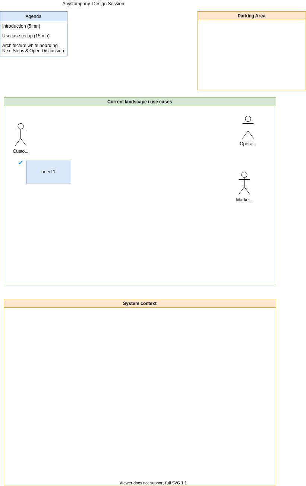

# Templates to drive some architecture and design discussions

## Whiteboard best practices

* Complement the discussion with diagrams, flows, are more engaging with participants.
* Discovery and collaborate on a one of a kind solution that the participants own.
* Take care of time management (segmentation of the agenda and what needs to be addressed) and space management (name section of the whiteboard, use 25% (agenda), 50% (main), 25% (takeaways) sections). BE PREPARED.
* Example of sections: topics, takeaways, next steps (action for me and then action for customer)
* Brings your own supplies: markers, eraser..
* Use Uppercase, limit color
* Apply the technique of `Touch, Turn, Talk`
* Be sure to ask a participant if she/he is confortable to draw and go to the whiteboard.
* Do not assume you can keep the content of the whiteboard with a photo. Ask permission.
* For diagramming:

    * Focus on core elements
    * Label elements by function, not service name
    * Ask before erasing (or using alternative methods like strikethrough or an X)
    * Plan iconography in advance

## Discover architecture requirements

This is a simple agenda, parking lots zone, use cases and system context map in one drawio template:

Be sure to address:

* Do you understand the business?
* Do you know how they make money?
* Do you understand the problem?
* Who will be using this/who is the customer?
* What are the expectations from the customer?
* What does success look like?
* Does the customer have an established timeline or deadline?

Use [Well-Architected Pillars](../sa/well-architectured.md) to approach a problem:

* **Cost:**

    * What’s the budget?
    * How do the company make money?

* **[Reliability](../sa/well-architectured.md#reliability):** 

    * What happens if this app fails?
    * Is there an SLA, internal or external?

* **Operations:**

    * What does the team look like that is building this?
    * Who will support it once it’s built?
    * Do they need help?
    * Is there a partner they work with?

* **Performance:**

    * Are there performance requirements?
    * How fast does it need to be?
    * Do they already have a similar app?
    * Have they had any problems with it?

* **Security:**

    * Are there security or compliance requirements?
    * Any PII data?
    * Do you have any upcoming audits? 
    * How do those tend to do? 
    * Do they need help? 