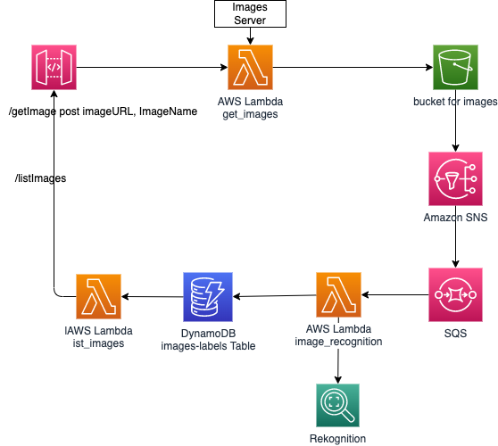

# A Code Whisperer demonstration

Here is what the CDK builds:



* [x] Lamdba function to get image from a given URL, with API Gateway with REST API, and IAM role
* [ ] SQS queue
* [ ] SNS Topic
* [x] S3 bucket target for file upload
* [ ] S3 bucket event to SNS
* [ ] Lambda function to call Rekognition
* [x] DynamoDB to keep labels on the images

## CodeWhisperer Demo Script

1. Update the [api/runtime/get_image.py] by adding the following comment (or return at the end of the line), and use right or left arrow to get the proposed code:

    ```python
    # Write a function to download a file from HTTP GET
    ```

    Code will add the needed import and the code like:

    ```python
    def download_file(url, file_name):
        r = requests.get(url, stream=True)
        with open(file_name, 'wb') as f:
            for chunk in r.iter_content(chunk_size=1024): 
                if chunk: # filter out keep-alive new chunks
                    f.write(chunk)
    ```

    Continue with the following:
    
    ```python
    # write a function to upload a file to S3
    ```

    Complete the lambda function with the create functions following CW recommendations. 

1. Continue with the file [recognition/runtime/image_recognition.py], by using the following comments one by one (or use return key at the end of each comment line to trigger CW):

    ```python
    # define a function to receive message from sqs

    # detect labels in an image

    # save items to dynamoDB

    # define a send message to sns 
    ```

    Should get:

    ```python
    def receive_message_from_sqs(sqs_queue_name):
        sqs = boto3.resource('sqs')
        queue = sqs.get_queue_by_name(QueueName='test-queue')
        messages = queue.receive_messages(
            MessageAttributeNames=['All'],
            MaxNumberOfMessages=1
        )
        return messages
    
    ```

1. CDK code generation

## Deployment Set up

To manually create a virtualenv on MacOS and Linux:

```
python3 -m venv .venv
```

After the init process completes and the virtualenv is created, you can use the following
step to activate your virtualenv.

```
source .venv/bin/activate
```

Once the virtualenv is activated, you can install the required dependencies.

```sh
pip install -r requirements.txt
```

At this point you can now synthesize the CloudFormation template for this code.

```sh
cdk synth
```

To add additional dependencies, for example other CDK libraries, just add
them to your `setup.py` file and rerun the `pip install -r requirements.txt`
command.

```sh
cdk deploy
```