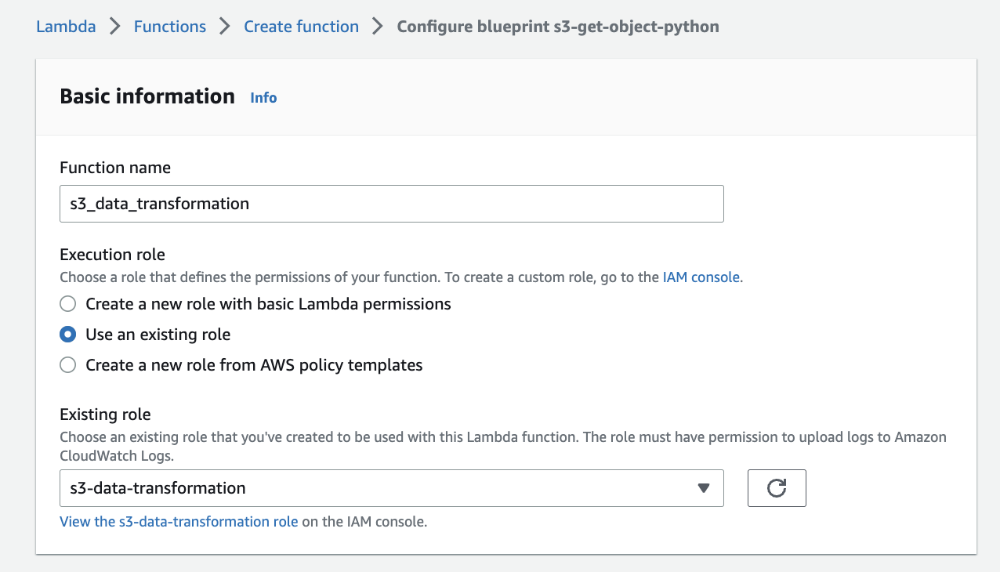
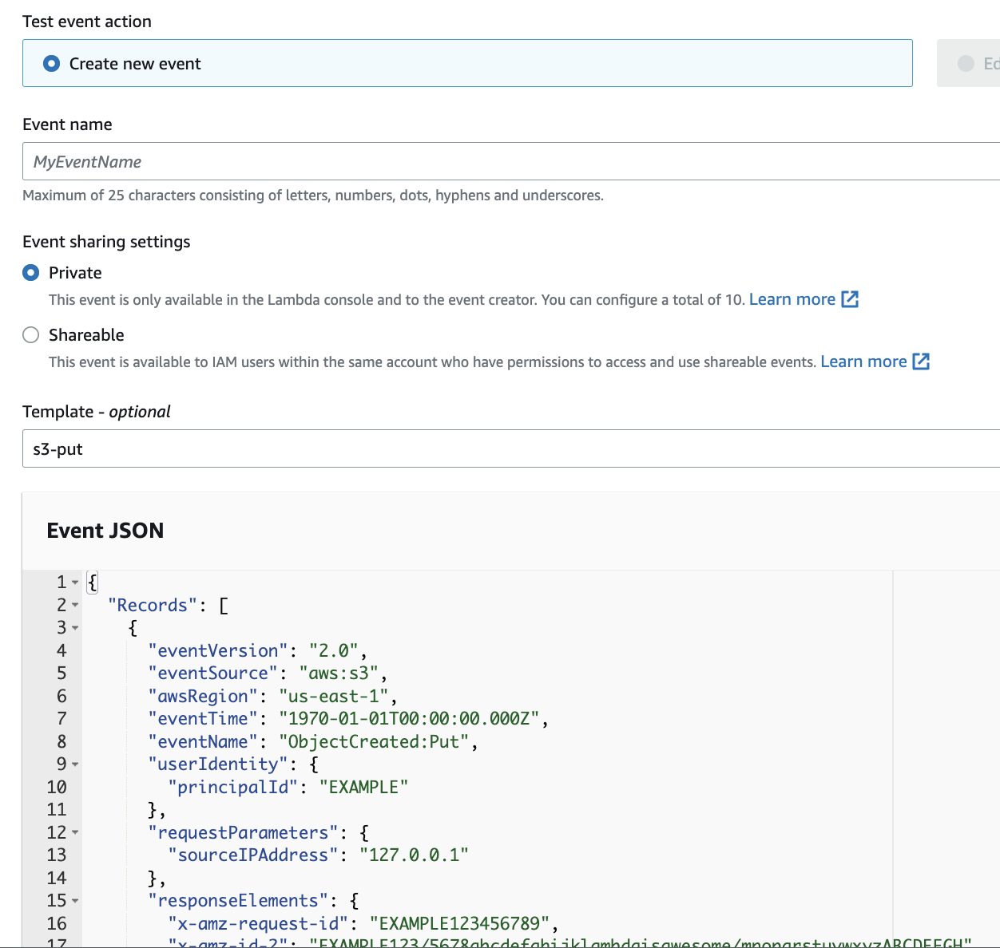
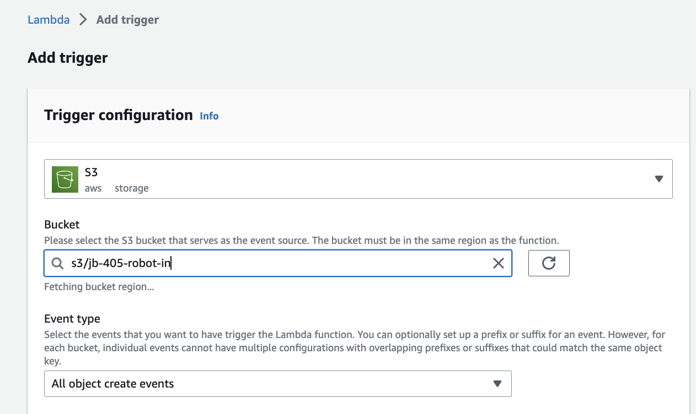
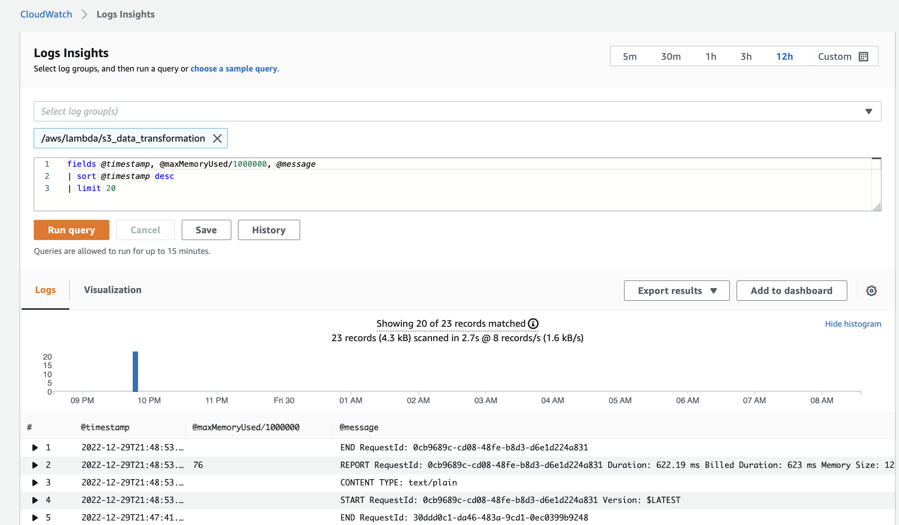
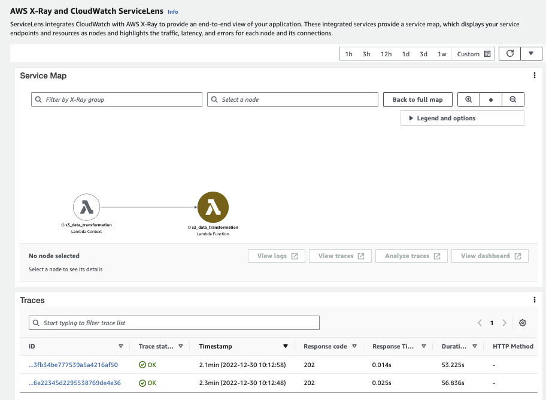
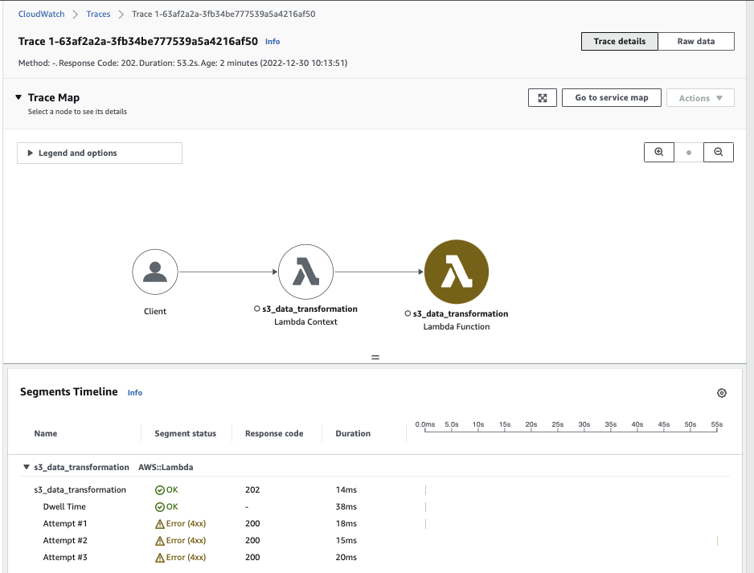

# A simple lab to do S3 to lambda processing

For example a client send a txt file to S3 and then S3 invokes a lambda that transforms the file to a json. This is based on Chandra Lingam's (Udemy) work.

* Create two buckets: one for source and one for results: `jb-405-robot-in` and `jb-405-robot-out` in the same region as the lambda function.
* Create permission policy for R/W on S3 bucket, named: `s3-rw-permission`:

    ```json
    {
    "Version": "2012-10-17",
    "Statement": [
        {
            "Effect": "Allow",
            "Action": [
                "s3:GetObject"
            ],
            "Resource": [
                "arn:aws:s3:::jb-405-robot-in/*"
            ]
        },
        {
            "Effect": "Allow",
            "Action": [
                "s3:PutObject"
            ],
            "Resource": [
                "arn:aws:s3:::jb-405-robot-out/*"
            ]
        }
    ]
    }
    ```

* Create IAM role to grant lambda to access cloudwatch and XRay:

    * Select New Service -> Lambda
    * Add policies: `AWSXRayDaemonWriteAccess`, `AWSLambdaBasicExecutionRole` and the previously created `s3-rw-permission`

    

* Add Lambda function using blueprint named `s3-get-object-python`, then enter name and select the created role:

    

* In the handler function the event argument carries the data, the context argument is to access the Lambda runtime  information about the invocation, function, and execution environment ([see doc](https://docs.aws.amazon.com/lambda/latest/dg/python-context.html)).
* The classical code to access s3 bucket information is provided by the code template. Here is an extract:

```python
    bucket = event['Records'][0]['s3']['bucket']['name']
    key = urllib.parse.unquote_plus(event['Records'][0]['s3']['object']['key'], encoding='utf-8')
    try:
        response = s3.get_object(Bucket=bucket, Key=key)
```

* Change the code with the [s3_data_transformation_with_tracing.py].
* In the Configuration we can change the python version, memory used, timeout specifies how long the function should run...
* Add DESTINATION_BUCKET as environment variable and 
* Modify the configuration to enable tracing with XRay

    ```sh
    aws lambda update-function-configuration --region us-west-2 --function-name s3_data_transformation --tracing-config Mode=Active
    ```

* To test the function we can use predefined construct
    
    

* Upload the robocopylog.txt file to a folder named `robologs` in the `jb-405-robot-in` folder

    ```sh
    aws s3 cp robocopylog.txt s3://jb-405-robot-in/robologs/robocopylog.txt
    aws s3 cp robocopylog_invalid_source.txt s3://jb-405-robot-in/robologs/robocopylog_invalid_source.txt
    ```

* Modify the test data to use this filename as key and bucket name as jb-405-robot-in:

    ```json
     "s3": {
        "s3SchemaVersion": "1.0",
        "configurationId": "testConfigRule",
        "bucket": {
          "name": "jb-405-robot-in",
          "ownerIdentity": {
            "principalId": "EXAMPLE"
          },
          "arn": "arn:aws:s3:::jb-405-robot-in"
        },
        "object": {
          "key": "robotcopylog/robocopylog.txt",
          "size": 1024,
          "eTag": "0123456789abcdef0123456789abcdef",
          "sequencer": "0A1B2C3D4E5F678901"
        }
      }
    ```

* Add a trigger on the Lambda function, select S3, the bucket name for input, and then the type of event (may be use all)

    


* As the test should succeed we can see the requestID for the test, and we can go to the `monitor` tab to see CloudWatch metrics, logs,...
* Going to CloudWatch we can use the Log Insight query mechanism to search for the logs, and get specific attributes from the logs. The following query will give us a specific extract from the CW logs.

    

    ```
    fields @timestamp, @maxMemoryUsed/1000000, @message
    sort @timestamp desc
    limit 20
    ```

* In the Lambda > Monitor > Traces tab, we can see the X-Ray traces, which we can also study in CloudWatch. 

    

    And in CloudWatch

    

* To reduce coupling we can add versioning and an alias to the lambda function, so the S3 will go to the alias. [See product doc](https://docs.aws.amazon.com/lambda/latest/dg/configuration-aliases.html). It can support weighted routing to do blue/green deployment. Each alias has a unique ARN. An alias can point only to a function version.