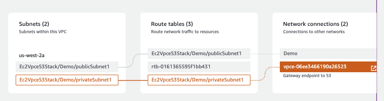
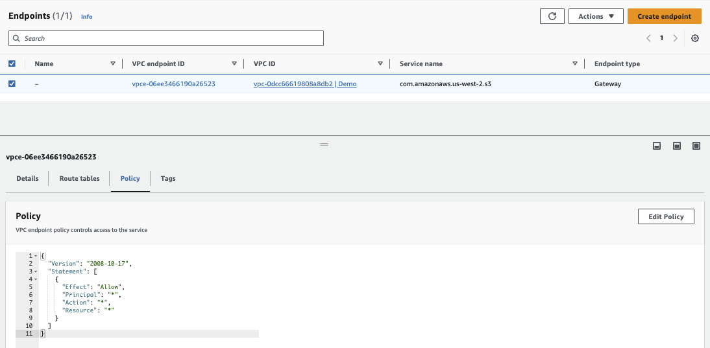
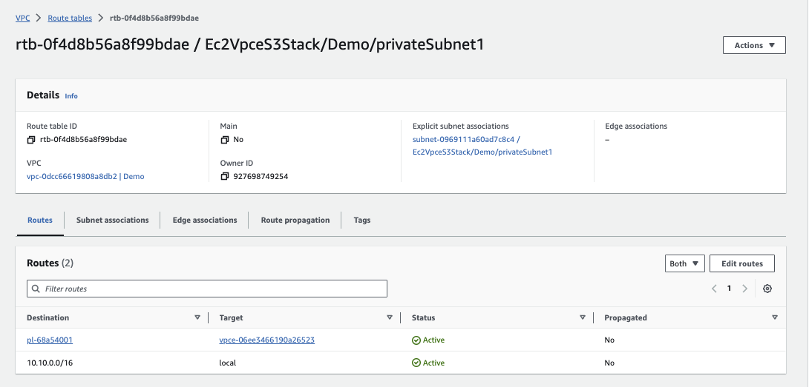

# Example of EC2 to VPC endpoint gateway to S3

This lab uses CDK to create a CloudFormation stack with the following elements:


## Pre-requisites

* Create a ec2 key pair

```sh
aws ec2 create-key-pair \
    --key-name my-ec2-key-pair \
    --key-type rsa \
    --key-format pem \
    --query "KeyMaterial" \
    --output text > my-ec2-key-pair.pem
chmod 0400 my-ec2-key-pair.pem

# Verify the key
aws ec2 describe-key-pairs --key-names my-ec2-key-pair
# put the key in ~/.aws/keys
```

## Demo steps

* Deploy the stack with `cdk deploy, get the IP address of the Bastion host
* Once the stack is deployed, remote connect to bastion EC2

```sh
ssh -i ~/.aws/keys/my-ec2-key-pair.pem ec2-user@34.222.20.238
```

* In the shell, verify we can reach the web server, get private ip address of the EC2 of the web server

```sh
curl  10.10.1.104
# a response like:
<h3>Hello World from ip-10-10-1-104.us-west-2.compute.internal in AZ=  </h3>
```

* Get the name of the bucket created in s3

* SSH to the web server: 1/ create a key.pem file from the public key of the bastion. The stack uses the same key for both.

```
vi key.pem
chmod 0400 key.pem
ssh -i key.pem ec2-user@10.10.1.104
```

* Once in the web server shell, create a file.txt and put it to the s3 bucket

```sh
vi file.txt
aws s3 cp file.txt s3://ec2vpces3stack-demobucketd2.......x/file.txt
```

## Stack Deployment

To manually create a virtualenv on MacOS and Linux:

```
$ python3 -m venv .venv
```

After the init process completes and the virtualenv is created, you can use the following
step to activate your virtualenv.

```
$ source .venv/bin/activate
```

Once the virtualenv is activated, you can install the required dependencies.

```
$ pip install -r requirements.txt
```

At this point you can now synthesize the CloudFormation template for this code.

```
$ cdk synth
```

Here is the networking elements created by the stack:



The VPC Gateway Endpoint:



Route table of the private subnet




