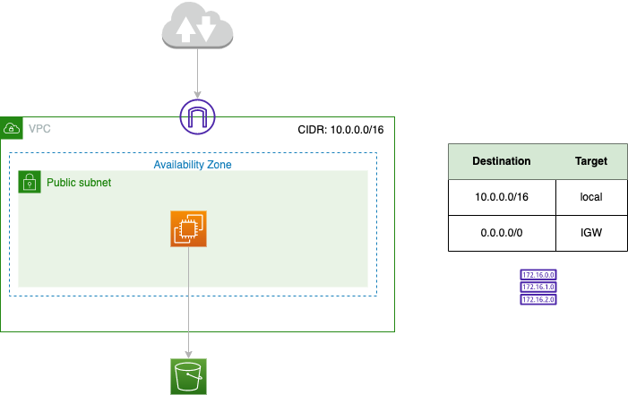
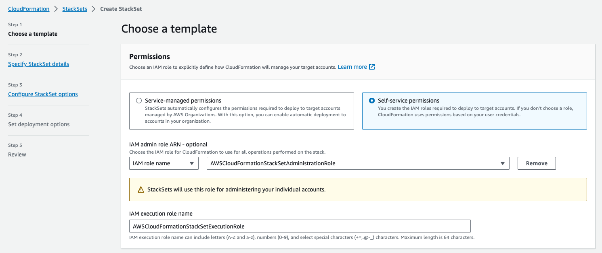
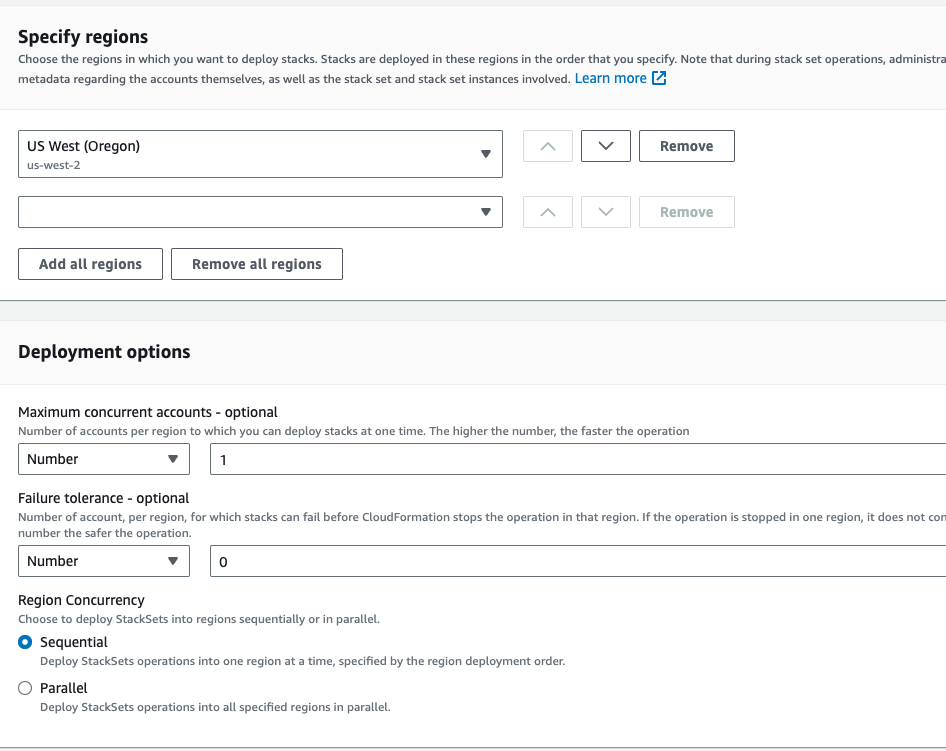

# Some reliability labs

## Simple VPC with one EC2 with S3

The Cloud Formation template is `vpc-s3-ec2.yaml` and implements the following figure:



From there we can define a StackSet to deploy the stack in multiple regions. AWS CloudFormation StackSets requires specific permissions to be able to deploy stacks in multiple AWS accounts across multiple AWS Regions.

* administrator role that is used to perform StackSets operations in the admin account: `AWSCloudFormationStackSetAdministrationRole`
* execution role to deploy the actual stacks in target accounts,  `AWSCloudFormationStackSetExecutionRole` and defined in each account.

When accounts are managed using AWS Organizations, we can enable trusted access and CloudFormation will take care of provisioning all the necessary roles across the accounts.

```sh
aws cloudformation create-stack --stack-name StackSetAdministratorRole --template-body file://AWSCloudFormationStackSetAdministrationRole.yaml

aws cloudformation create-stack --stack-name StackSetExecutionRole --template-body file://AWSCloudFormationStackSetExecutionRole.yaml --parameters AdministratorAccountId:{AWS_ACCOUNTID}

```

Create a StackSet using the two newly created roles and the same `vpc-s3-ec2.yaml` stack template.



Then select the regions to target for deployment:



StackSet reports for each stacks deployed in different region.
