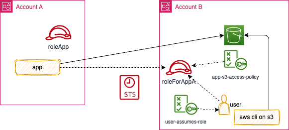

# A simple demo for cross account access

Account A has an application that wants to automatically access S3 bucket in Account B using temporary session token.

## Setting

Be sure to be logged as an admin user on Account B. The createProduction.py will do the following:

* Use one AWS account as Account B, create a S3 bucket
* Define a policy to be able to access the bucket, with a tag matching the application name
* Define a IAM role in Account B that trust Account A and use the policy
* In Cloud9 of Account A, use the client-app.py application to access the S3 buckets of Account B

## client-app scope

* Get a temporary security token for the role defined in Account B
* Call S3 list bucket on Account B using the temporal token

* Verify access in CloudTrail.
* What cloud watch metrics can be reported

