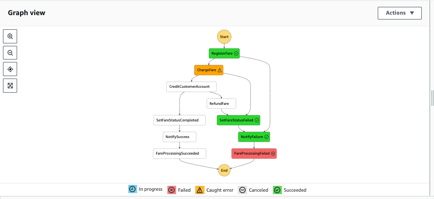
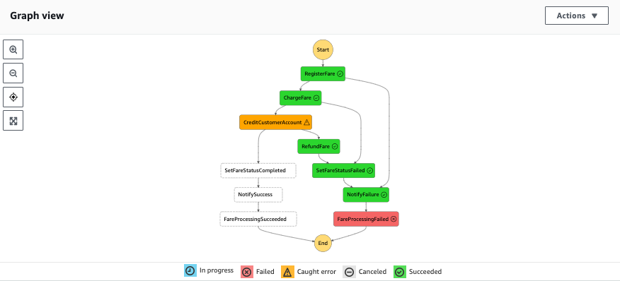

# Orchestration and coordination

The goal is to demonstrate how to support long-lived transaction across distributed components using Step function to ensure data consistency across microservices. As we do not have support for Distributed Transaction Coordinators (DTC) or two-phase commit protocols responsible for coordinating transactions across multiple cloud resources, we can use AWS Step Function to implement the Saga pattern.


## Code Explanation

The AWS SAM template is creating 3 Lambda functions, one dynamoDB table to keep the Fare information, one SNS topic to propagate fare charge message, two SQS queues, subscriber to the topic, for successful and failed notifications,  one Step function:

* `PaymentChargeFunction` generates a charge unique id and a transaction token for the given customer, fare and fare amount transaction. 
* `PaymentRefundFunction` emulates a refund transaction. 
* `AccountCreditFunction` emulates generating an error for special customer.

All of those functions support some behavior to support controlled error generation to demonstrate the Saga in action.

The step function does:

- write the Fare to DynamoDB
- Call charge fare function
- Call credit customer's account function
- Update the fare table in DynamoDB
- Notify to SNS

Here is a diagram of the final flow:


The state machine flow is defined in json and uses some variables to get the arn of the functions to call or the Dynamodb table. Those variables are injected via the `DefinitionSubstitutions` CloudFormation declaration:

```yaml
 DefinitionSubstitutions:
    PaymentChargeFunctionArn: !GetAtt PaymentChargeFunction.Arn
    PaymentRefundFunctionArn: !GetAtt PaymentRefundFunction.Arn
    AccountCreditFunctionArn: !GetAtt AccountCreditFunction.Arn
    FareProcessingTable: !Ref FaresTable
    FareProcessingTopicArn: !Ref WildRydesFareProcessingTopic
```

### Error Handling and Compensation

To be able to rollback transaction in the compensation flow, we need to have API / lambda function to expose compensation access point and implement the logic to compensate each service: this is the role of the `PaymentRefundFunction` lambda function.

By default, when a state reports an error, AWS Step Function will fail the execution entirely. But Task, Map and Parallel states can have catcher to implement conditional logic to handle the error. The Catch field enables all or specific errors to be caught by specifying error names in the errors field. Error names can be custom errors raised by Lambda functions or errors defined by a particular AWS service. 

Example of DynamoDB catcher on any type of error:

```json
    "Catch": [
        {
          "ErrorEquals": [
            "States.ALL"
          ],
          "ResultPath": "$.registerError",
          "Next": "NotifyFailure"
        }
      ],
```

In the event an error is caught, a fallback state is defined as part of a Catcher which determines the next state to transition to (`"Next": "NotifyFailure"`), together with a ResultPath that enables the error to be appended to the original input to in turn allow down stream systems and processes to take appropriate action.

Exception branches need to finish on a failure state for the step workflow. 

```json
    "FareProcessingSucceeded": {
      "Type": "Succeed"
    },
        "FareProcessingFailed": {
      "Type": "Fail"
    }
```

In case of failure the same SNS topic is used, but the metadata is changed:

```json
 "NotifyFailure": {
      "Type": "Task",
      "Resource": "arn:aws:states:::sns:publish",
      "Parameters": {
        "Subject": "Transaction Failed",
        "Message.$": "$",
        "TopicArn": "${FareProcessingTopicArn}",
        "MessageAttributes": {
          "IsSuccessful": {
            "DataType": "String",
            "StringValue": "false"
          }
        }
      },
```

For Lambda invocation we may need different catcher for invocation error (invocation request is rejected before our Function receives it) or function error (Runtime errors or Lambda function exception thrown).

The Lambda raise different exceptions like:

```python
if event['customerId'].endswith('fail_charge'):
    raise PaymentChargeException('Forced charge transaction failure', event)
if event['customerId'].endswith('fail_auth'):
    raise PaymentAuthException('Forced auth transaction failure', event)
```

So the catch is defined as:

```json
"Catch": [
        {
          "ErrorEquals": [
            "PaymentAuthException",
            "PaymentChargeException"
          ],
          "ResultPath": "$.chargeError",
          "Next": "SetFareStatusFailed"
        }
      ],
```

Same apply to the credit customer account service, but when we are in the exception path we need to compensate the amount credited, to keep the system consistent:

```json
 "Catch": [
        {
          "ErrorEquals": [
            "AccountCreditException"
          ],
          "Next": "RefundFare",
          "ResultPath": "$.creditError"
        }
      ],
```

And the refund function:

```json
 "RefundFare": {
      "Type": "Task",
      "Resource": "arn:aws:states:::lambda:invoke",
      "OutputPath": "$.Payload",
      "Parameters": {
        "Payload.$": "$",
        "FunctionName": "${PaymentRefundFunctionArn}"
      },
```

### Retries

Add retries from Dynamodb [potential error](https://docs.aws.amazon.com/amazondynamodb/latest/developerguide/Programming.Errors.html#Programming.Errors.Components):

```json
"Retry": [
        {
          "ErrorEquals": [
            "ProvisionedThroughputExceededException",
            "RequestLimitExceeded",
            "ServiceUnavailable",
            "ThrottlingException"
          ],
          "IntervalSeconds": 1,
          "BackoffRate": 2,
          "MaxAttempts": 2
        }
      ],
```

And retries for Lambda function

```json
   "Retry": [
        {
          "ErrorEquals": [
            "Lambda.ServiceException",
            "Lambda.AWSLambdaException",
            "Lambda.SdkClientException"
          ],
          "IntervalSeconds": 2,
          "MaxAttempts": 6,
          "BackoffRate": 2
        }
      ],
```

## Deploy

```sh
sam build
export AWS_REGION=$(aws --profile default configure get region)
sam deploy \
    --stack-name wild-rydes-async-msg-4 \
    --capabilities CAPABILITY_IAM \
    --region $AWS_REGION \
    --guided 
```

## Test

### Happy path

* Use the Step function to execute it with happy path use 

```json
{
  "customerId": "3",
  "fareId": "wr_563",
  "fareAmount": "$20.00",
  "cc": "2424 2424 2424 2424",
  "expiryDate": "12/22",
  "cvv": "111"
}
```

Validate in the success SQS queue by polling the message

```json
{
    "customerId": "3",
    "fareId": "wr_563",
    "fareAmount": "$20.00",
    "chargeToken": "tok_Oswed3fV7owVVRsBRK8FGRODW",
    "chargeId": "ch_nRvqg7gU2ipnVhhFTlxpFIJmV",
    "dynamodbResult": {
        "SdkHttpMetadata": {
            "AllHttpHeaders": {
                "Server": [
                    "Server"
                ],
                "Connection": [
                    "keep-alive"
                ],
                "x-amzn-RequestId": [
                    "9HMLR....UAAJG"
                ],
                "x-amz-crc32": [
                    "2745614147"
                ],
                "Content-Length": [
                    "2"
                ],
                "Date": [
                    "Wed, 14 Jun 2023 00:50:47 GMT"
                ],
                "Content-Type": [
                    "application/x-amz-json-1.0"
                ]
            },
            "HttpHeaders": {
                "Connection": "keep-alive",
                "Content-Length": "2",
                "Content-Type": "application/x-amz-json-1.0",
                "Date": "Wed, 14 Jun 2023 00:50:47 GMT",
                "Server": "Server",
                "x-amz-crc32": "2745614147",
                "x-amzn-RequestId": "9HMLR....UAAJG"
            },
            "HttpStatusCode": 200
        },
        "SdkResponseMetadata": {
            "RequestId": "9HMLR...UAAJG"
        }
    }
}
```

### Failure 

* handling pre-authentication failures for the ChargeFare state:

```json
{
  "customerId": "3_fail_auth",
  "fareId": "wr_563",
  "fareAmount": "$20.00",
  "cc": "2424 2424 2424 2424",
  "expiryDate": "12/22",
  "cvv": "111"
}

```



* Handling credit customer account error:

```json
{
  "customerId": "3_fail_credit",
  "fareId": "wr_563",
  "fareAmount": "$20.00",
  "cc": "2424 2424 2424 2424",
  "expiryDate": "12/22",
  "cvv": "111"
}
```



## Clean up

* Delete the stack

```sh
aws cloudformation delete-stack  --stack-name wild-rydes-async-msg-4
```

* Delete the logs

```sh
aws logs describe-log-groups --query 'logGroups[*].logGroupName' --output table | awk '{print $2}' | \
    grep ^/aws/lambda/wild-rydes-async-msg-4 | while read x; \
    do  echo "deleting $x" ; aws logs delete-log-group --log-group-name $x; \
done
```
