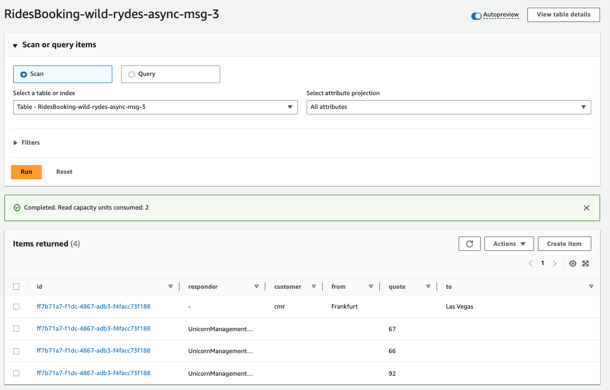

## Scatter-gather

[Scatter-gather pattern](https://jbcodeforce.github.io/eda-studies/patterns/#scatter-gather) applies when we need to send a message to multiple channels (scatter), and then aggregates (gather) the results from multiple sources, so a client application can query the response using query API. The pattern consists of two main phases: the scatter phase and the gather phase.

The application comprises of API Gateway endpoints and lambda functions which provide the ability to send requests for quote and to query the responses. Service providers have subscribed to a SNS topic which is used to publish the request for quote (RFQ). On receiving the RFQ message, service providers send their response for quotes in a queue. The queue triggers a lambda function which loads the responses in a DynamoDB table. The response for quotes service queries all the responses based on request id.


## Code explanation

The `RequestForQuoteService` is a lambda which writes quotes to DynamoDB and publishing an event to SNS. The data is not the same in table versus message, which is good approach as event should be different. The API is a POST on `/submit-instant-ride-rfq` resource. 

The `QueryForQuotesService` is a lambda, called by the client app (mobile) GET on URL path of `/query-instant-ride-rfq/{id}`, return a quote for the item requested as it is in DynamoDB table, or just the request if no quote is present yet.

The CloudFormation template declare 10 lambda function `UnicornManagementResourceXX` that listen to SNS topic `RequestForQuotesTopic` and build a random quote, then send the response to the `RequestForQuotesResponseQueue` SQS queue, with a message like which includes reference to their own name:

```json
{
        'responder': SERVICE_NAME,
        'rfq-id': message['rfq-id'],
        'quote': random.randint(0,100)
    }
```

Finally the `QuotesResponseService` gets the message from the Queue and update the dynamoDB. What is interesting is that n records will be created for each ID depending of the number of UnicornManagementResourceXX service responded. And the QueryForQuotesService will return one of those quote, not sure which one. 



Here is the declaration of the function:

```yaml
  QuotesResponseService:
    Type: AWS::Serverless::Function
    Properties:
      CodeUri: quotes-response-service/
      Environment:
        Variables:
          TABLE_NAME: !Ref RidesBookingTable
      Policies:
        - AWSLambdaExecute
        - DynamoDBCrudPolicy: 
            TableName:
              !Ref RidesBookingTable
      Events:
        SQSQueue:
          Type: SQS
          Properties:
            Queue: !GetAtt RequestForQuotesResponseQueue.Arn
            BatchSize: 1
```

## Deploy

```sh
sam build
export AWS_REGION=$(aws --profile default configure get region)
sam deploy \
    --stack-name wild-rydes-async-msg-3 \
    --capabilities CAPABILITY_IAM \
    --region $AWS_REGION \
    --guided 
```

Confirm the first 5 proposed arguments by hitting ENTER. When you get asked SubmitRideCompletionFunction may not have authorization defined, Is this okay? [y/N]:, enter y and hit ENTER for remaining options.

The SAM template has defined 10 microservices to consume for the RFQs and generate quotes. Some of those service will fails on purpose.

## Test

```sh
export ENDPOINT=$(aws cloudformation describe-stacks \
    --stack-name wild-rydes-async-msg-3 \
    --query 'Stacks[].Outputs[?OutputKey==`RideBookingApiSubmitInstantRideRfqEndpoint`].OutputValue' \
    --output text)


curl -XPOST -i -H "Content-Type\:application/json" -d @event.json $ENDPOINT
```

The output will have a rfq-id parameter. Save the value for the next queryto retrieve the quoted request:

```sh
export ENDPOINT=$(aws cloudformation describe-stacks --stack-name wild-rydes-async-msg-3 \
    --query 'Stacks[].Outputs[?OutputKey==`RideBookingApiQueryInstantRideRfqEndpoint`].OutputValue' \
    --output text | cut -d'{' -f 1)
curl -i -H "Accept\:application/json" ${ENDPOINT}<<rfq-id>>
```

The function will need to be called in regular intervals if the service providers send responses at different times.

```json
{"quotes": [
  {"responder": "UnicornManagementResource1", "quote": "16"}, 
  {"responder": "UnicornManagementResource10", "quote": "77"}, 
  {"responder": "UnicornManagementResource2", "quote": "68"}, 
  {"responder": "UnicornManagementResource5", "quote": "86"}, 
  {"responder": "UnicornManagementResource6", "quote": "93"}, 
  {"responder": "UnicornManagementResource9", "quote": "80"}], 
  "rfq-id": "78c371f6-87c4-4e6e-8c7d-33403c7b7049", 
  "from": "Frankfurt", "to": "Las Vegas", "customer": "cmr"}
```

## Clean up

* Delete the Stack

```sh
aws cloudformation delete-stack --stack-name wild-rydes-async-msg-3
```

* Delete the logs

```sh
aws logs describe-log-groups --query 'logGroups[*].logGroupName' --output table | awk '{print $2}' | \
    grep ^/aws/lambda/wild-rydes-async-msg-3 | while read x; \
    do  echo "deleting $x" ; aws logs delete-log-group --log-group-name $x; \
done
```